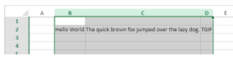

<!-- REF #_method_.VP COLUMN AUTOFIT.Syntax -->

**VP COLUMN AUTOFIT** ( *rangeObj* : Object )<!-- END REF -->

<!-- REF #_method_.VP COLUMN AUTOFIT.Params -->

| Parâmetro | Tipo   |    | Descrição        |                  |
| --------- | ------ | -- | ---------------- | ---------------- |
| rangeObj  | Object | -> | Objeto intervalo | <!-- END REF --> |

#### Descrição

O comando `VP COLUMN AUTOFIT` <!-- REF #_method_.VP COLUMN AUTOFIT.Summary -->dimensiona automaticamente a(s) coluna(s) em *rangeObj* de acordo com seu conteúdo<!-- END REF -->.

Em *rangeObj*, passe um objeto de intervalo contendo um intervalo de colunas cujo tamanho será tratado automaticamente.

#### Exemplo

As colunas a seguir são todas do mesmo tamanho e não exibem parte do texto:


Selecionar as colunas e executar este código:

```4d
 VP COLUMN AUTOFIT(VP Get selection("ViewProarea"))
```

... redimensiona as colunas para se adaptarem ao tamanho do conteúdo:



#### Veja também

[VP ROW AUTOFIT](vp-row-autofit.md)
