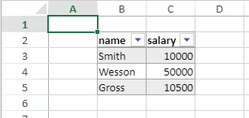

<details><summary>História</summary>

| Release | Mudanças   |
| ------- | ---------- |
| 18 R6   | Adicionado |

</details>

<!-- REF #_method_.VP RESIZE TABLE.Syntax -->

**VP RESIZE TABLE** ( *rangeObj* : Object; *tableName* : Text )<!-- END REF -->

<!-- REF #_method_.VP RESIZE TABLE.Params -->

| Parâmetro | Tipo   |    | Descrição               |                  |
| --------- | ------ | -- | ----------------------- | ---------------- |
| rangeObj  | Object | -> | Nova gama para a tabela |                  |
| tableName | Text   | -> | Nombre da tabela        | <!-- END REF --> |

#### Descrição

The `VP RESIZE TABLE` command <!-- REF #_method_.VP RESIZE TABLE.Summary -->changes the *tableName* size with regards to the *rangeObj*<!-- END REF -->.

As regras abaixo são válidas:

- Cabeçalhos devem permanecer na mesma linha e o intervalo de tabelas resultante deve sobrepor o intervalo de tabela original.
- If the row count of the resized table is inferior to the initial row count, values inside cropped rows or columns are kept if they were not bound to a [data context](vp-set-data-context.md), otherwise they are deleted.
- Se a tabela se expandir nas células que contêm dados:
  - se as linhas forem adicionadas, os dados serão excluídos,
  - se colunas forem adicionadas, dados serão mantidos e exibidos em novas colunas.

Se *tableName* não existir, não acontece nada.

#### Exemplo

Você cria uma tabela com um contexto de dados:

```4d
var $context : Object
$context:=New object()

$context.col:=New collection
$context.col.push(New object("name"; "Smith"; "salary"; 10000))
$context.col.push(New object("name"; "Wesson"; "salary"; 50000))
$context.col.push(New object("name"; "Gross"; "salary"; 10500)) VP SET DATA CONTEXT("ViewProArea"; $context) VP CREATE TABLE(VP Cells("ViewProArea"; 1; 1; 3; 3); "PeopleTable"; "col")
```



Se quiser adicionar uma coluna antes e depois da tabela, bem como duas linhas vazias. Você pode escrever:

```4d
VP RESIZE TABLE(VP Cells("ViewProArea"; 0; 1; 4; 6); "PeopleTable")
```


#### Veja também

[VP CREATE TABLE](vp-create-table.md)<br/>
[VP Get table range](vp-get-table-range.md)
