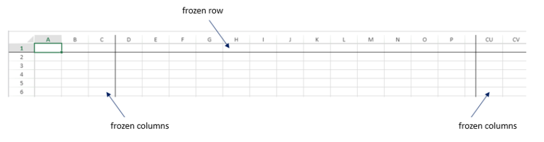

<!-- REF #_method_.VP SET FROZEN PANES.Syntax -->

**VP SET FROZEN PANES** ( *vpAreaName* : Text ; *paneObj* : Object { ; *sheet* : Integer } ) <!-- END REF -->

<!-- REF #_method_.VP SET FROZEN PANES.Params -->

| Parâmetro  | Tipo    |    | Descrição                                                             |
| ---------- | ------- | -- | --------------------------------------------------------------------- |
| vpAreaName | Text    | -> | Nome de objeto formulário área 4D View Pro                            |
| paneObj    | Object  | -> | Objeto que contém as informações sobre as colunas e linhas congeladas |
| sheet      | Integer | -> | Índice da folha (folha atual se omitida)           |

<!-- END REF -->

#### Descrição

The `VP SET FROZEN PANES` command <!-- REF #_method_.VP SET FROZEN PANES.Summary -->sets the frozen status of the columns and rows in the *paneObj* so they are always displayed in the *vpAreaName*<!-- END REF -->. Frozen columns and rows are fixed in place and do not move when the rest of the document is scrolled. Uma linha sólida é exibida para indicar que as colunas e linhas estão congeladas. The location of the line depends on where the frozen column or row is on the sheet:

- **Columns on the left or right**: For columns on the left of the sheet, the line is displayed on the right side of the last frozen column. For columns on the right side of the sheet, the line is displayed on the left side of the first frozen column.
- **Linhas na parte superior ou inferior**: para linhas na parte superior da planilha, a linha é exibida abaixo da última linha congelada. For rows at the bottom of the sheet, the line is displayed above the first frozen row.

Em *vpAreaName*, passe o nome da área 4D View Pro. Se passar um nome que não existe, é devolvido um erro.

You can pass an object defining the columns and rows to freeze in the *paneObj* parameter. Setting the value of any of the column or row properties equal to zero resets (unfreezes) the property. Se uma propriedade for definida para menos de zero, o comando não fará nada. Pode passar:

| Propriedade         | Tipo    | Descrição                                                |
| ------------------- | ------- | -------------------------------------------------------- |
| columnCount         | Integer | O número de colunas congeladas à esquerda da folha       |
| trailingColumnCount | Integer | O número de colunas congeladas à direita da folha        |
| rowCount            | Integer | O número de linhas congeladas na parte superior da folha |
| trailingRowCount    | Integer | O número de linhas congeladas na parte inferior da folha |

No parâmetro opcional *sheet*, pode designar uma folha específica onde o intervalo será definido (a contagem começa em 0). Se omitido, a planilha atual será utilizada por padrão. Você pode selecionar explicitamente a planilha atual com a seguinte constante:

- `vk current sheet`

#### Exemplo

You want to freeze the first three columns on the left, two columns on the right, and the first row:

```4d
C_OBJECT($panes)
 
$panes:=New object
$panes.columnCount:=3
$panes.trailingColumnCount:=2
$panes.rowCount:=1
 
VP SET FROZEN PANES("ViewProArea";$panes)
```



#### Veja também

[VP Get frozen panes](vp-get-frozen-panes.md)
