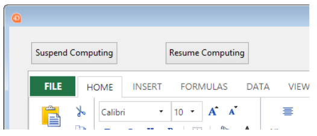

<!-- REF #_method_.VP SUSPEND COMPUTING.Syntax -->

**VP SUSPEND COMPUTING** ( *vpAreaName* : Text ) <!-- END REF -->

<!-- REF #_method_.VP SUSPEND COMPUTING.Params -->

| Parâmetro  | Tipo |    | Descrição                                  |                  |
| ---------- | ---- | -- | ------------------------------------------ | ---------------- |
| vpAreaName | Text | -> | Nome de objeto formulário área 4D View Pro | <!-- END REF --> |

#### Descrição

The `VP SUSPEND COMPUTING` command <!-- REF #_method_.VP SUSPEND COMPUTING.Summary -->stops the calculation of all formulas in *vpAreaName*<!-- END REF -->. This command is useful when you want to suspend calculations in this 4D View Pro area so you can manually make modifications to formulas without encountering errors before you've finished making the changes.

O comando pausa o serviço de cálculo no 4D View Pro. Formulas that have already been calculated remain unchanged, however any formulas added after `VP SUSPEND COMPUTING` command  is executed are not calculated.

Em *vpAreaName*, passe o nome da área 4D View Pro. Se passar um nome que não existe, é devolvido um erro.

> O serviço de cálculo de 4D View Pro mantém um contador de ações de sugastar/retomar. Portanto, cada execução do comando `VP SUSPEND COMPUTING` deve ser equilibrada por uma execução correspondente do comando `VP RESUME COMPUTING`. Any formula impacted by modifications made while calculations are suspended will be recalculated when the command is executed.

#### Exemplo

You've added two buttons to the form so that the user can suspend/resume calculations:



O código do botão Suspend Computing:

```4d
 //pause calculations while users enter information
 If(FORM Event.code=On Clicked)
 
    VP SUSPEND COMPUTING("ViewProArea")
 
 End if
```

```4d
If(FORM Event.code=On Clicked)
 
    VP RESUME COMPUTING("ViewProArea")
 
End if
```

#### Veja também

[VP RECOMPUTE FORMULAS](vp-recompute-formulas.md)<br/>
[VP RESUME COMPUTING](vp-resume-computing.md)
