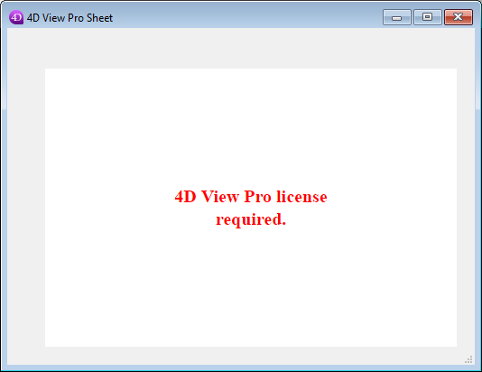
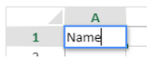
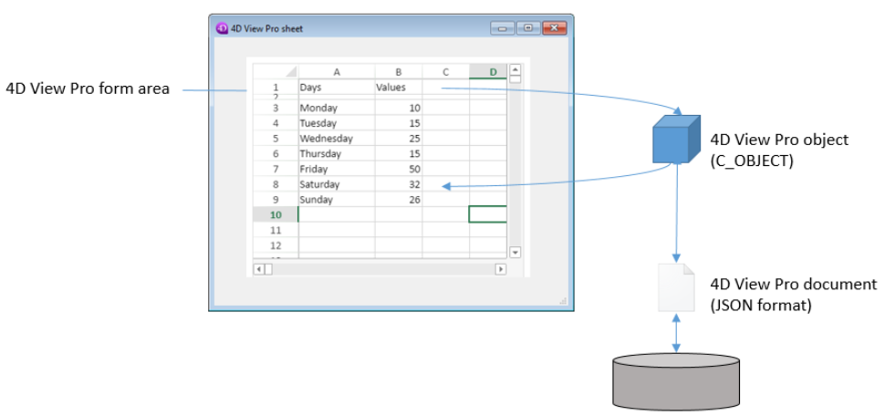

4D View Pro is a [4D component](Concepts/components.md) that includes a [4D form area](FormObjects/viewProArea_overview.md) and specific [commands](commands.md). Permite que você incorpore funcionalidades avançadas de planilha em seus projetos.


A spreadsheet is an application containing a grid of cells into which you can enter information, execute calculations, or display pictures. 4D View Pro es alimentado por la [solución de hoja de cálculo SpreadJS](https://developer.mescius.com/spreadjs) integrada en 4D.

Embedding 4D View Pro areas in your forms allows you to import and export spreadsheets documents using the 4D View Pro commands.

## Instalação e ativação

4D View Pro features are directly included in 4D, making it easy to deploy and manage. Não é necessária qualquer instalação adicional.

No entanto, 4D View Pro requer uma licença. You need to activate this license in your application in order to use its features. When using this component without a license, the contents of an object that requires a 4D View Pro feature are not displayed at runtime, an error message is displayed instead:



## Inserção de uma área 4D View Pro

Los documentos de 4D View Pro se muestran y editan manualmente en un [objeto de formulario 4D](FormObjects/viewProArea_overview.md) llamado 4D View Pro. Para selecionar este objeto, clique na última ferramenta da barra de objetos:


También puede seleccionar un área 4D View Pro preconfigurada en la [librería de objetos](FormEditor/objectLibrary.md).

> Las áreas 4D View Pro también pueden ser [creadas y utilizadas fuera de la pantalla](commands/vp-run-offscreen-area.md).

Puede [configurar el área](configuring.md) utilizando los comandos de la Lista de Propiedades y 4D View Pro.

## Noções básicas de seleção, introdução e navegação

As folhas de cálculo são compostas por linhas e colunas. A cada linha está associado um número. A letter (or group of letters once the number of columns surpasses the number of letters in the alphabet) is associated with each column. A intersecção de uma linha e de uma coluna constitui uma célula. As células podem ser seleccionadas e o seu conteúdo editado.

### Seleção de células, colunas e linhas

- To select a cell, simply click on it or use the direction arrows on the keyboard. O seu conteúdo (ou fórmula) é apresentado na célula.

- To select several continuous cells, drag the mouse from one end of the selection to the other. You can also click on the two ends of the selection while holding down the Shift key.

- To select all cells in the spreadsheet, click on the cell at the top left of the area:
  

- Para selecionar uma coluna, clique na letra correspondente (ou conjunto de letras).

- Para selecionar uma linha, clique no número correspondente.

- Para seleccionar un grupo de celdas que no sean continuas, mantenga presionada la tecla **Ctrl** (Windows) o la tecla **Comando** (Mac) y haga clic en cada celda que desee seleccionar.

- Para anular a seleção de células, basta clicar em qualquer parte da folha de cálculo.

### Introdução de dados

Clicar duas vezes em uma célula permite passar para o modo entrada na célula relevante. If the cell is not empty, the insertion cursor is placed after the content of the cell.



Data can be entered directly once a cell is already selected, even if the insertion cursor is not visible. The input then replaces the content of the cell.

La tecla **Tab** valida la entrada de la celda y selecciona la celda a su derecha. Combinando las teclas **Mayús + Tab** se valida la entrada de la celda y se selecciona la celda a su izquierda.

La tecla **Retorno de carro** valida la entrada de la celda y selecciona la celda de abajo. Combinando las teclas **Mayús + Retorno de carro** se valida la entrada de la celda y se selecciona la celda superior.

The direction keys (arrows) allow you to move a cell in the direction indicated by the arrow.

### Utilizar o menu de contexto

4D View Pro areas benefit from an automatic context menu that offers standard editing features such as copy and paste, but also basic spreadsheet features:


> The Copy/Cut and Paste features of the context menu only work within the spreadsheet area, they do not have access to the system pasteboard. Sin embargo, los atajos del sistema como **Ctrl+c/Ctrl+v** funcionan y pueden utilizarse para intercambiar datos entre el área y otras aplicaciones.

Depending on the clicked area, the following options are also available:

- haga clic en el encabezado de una columna o línea: **Insertar**, **Borrar**, **Ocultar**, o **Mostrar** el contenido
- clique numa célula ou num intervalo de células:
  - **Filtrar**: permite ocultar la línea mediante filtros (ver "Filtrar las líneas" en la [documentación de SpreadJS](https://developer.mescius.com/spreadjs/docs/)).
  - **Ordenar**: ordena el contenido de la columna.
  - **Insertar comentario**: permite al usuario introducir un comentario para un área. When a comment has been entered for an area, the top left cell of the area displays a small red triangle:\
    

## Uso dos comandos 4D View Pro

4D View Pro commands can be used in the 4D Code Editor, just like 4D language commands.

Since 4D View Pro is a built-in 4D component, you can access its list of commands from the Explorer, in the **Component Methods** section:


Para obtener una lista detallada, consulte [Comandos](commands.md).

### Processamento de uma zona 4D View Pro

Uma área 4D View Pro lida com vários objetos e elementos.



Most of 4D View Pro commands require a _vpAreaName_ parameter, which is the [**4D View Pro form area name**](FormObjects/viewProArea_overview.md) (4D form object). Este nombre es la propiedad del [nombre del objeto](FormObjects/properties_Object.md#object-name).

Por exemplo, se quiser definir o número total de colunas de uma área chamada "myVpArea", escreva:

```4d
VP SET COLUMN COUNT("myVpArea";5)
```

> Cuando se carga un objeto 4D View Pro en un área de formulario, 4D genera el evento formulario [On VP Ready](../Events/onVpReady.md) una vez que se carga toda el área. You must execute any 4D View Pro code handling the area in this event, otherwise an error is returned.

### Utilização de objectos de intervalo

Algunos comandos 4D View Pro requieren un parámetro _rangeObj_. No 4D View Pro, um intervalo é um objeto que referir-se a uma área em uma planilha. Esta área pode ser composta por uma ou várias células. Using 4D View Pro commands, you can create ranges and pass them to other commands to read from or write to specific locations in your document.

Por exemplo, para criar um objeto intervalo para as seguintes células:


Puede utilizar el método [VP Cell](commands/vp-cells.md):

```4d
var $myRange : Object
$myRange:=VP Cells("ViewProArea";2;4;2;3) // C5 a D7
```

You can then pass `$myRange` to another 4D View Pro method to modify these cells (for example add a border to the set of cells with [VP SET BORDER](commands/vp-set-border.md)).

Os objectos intervalo 4D View Pro são compostos por várias propriedades:

- área - O nome da área 4D View Pro
- intervalos - Uma coleção de objeto(s) intervalo. Available properties within each range object depend on the range object type. Por ejemplo, un objeto rango de tipo columna sólo incluirá las propiedades _.column_ y _.sheet_.

| Propriedade |                                                                                       | Tipo       | Descrição                                                                                                       | Disponível para                                              |
| ----------- | ------------------------------------------------------------------------------------- | ---------- | --------------------------------------------------------------------------------------------------------------- | ------------------------------------------------------------ |
| area        |                                                                                       | text       | Nome de objeto formulário área 4D View Pro                                                                      | sempre disponível                                            |
| ranges      |                                                                                       | collection | Coleção de intervalo(s)                                                                      | sempre disponível                                            |
|             | \[ ].name        | text       | Nome do intervalo                                                                                               | name                                                         |
|             | \[ ].sheet       | number     | Índice da folha (índice da folha atual por padrão) (contagem começa em 0) | célula, células, linha, linhas, coluna, colunas, todas, nome |
|             | \[ ].row         | number     | Índice da linha (a contagem começa em 0)                                                     | célula, células, linha, linhas                               |
|             | \[ ].rowCount    | number     | Contagem de linhas                                                                                              | células, linhas                                              |
|             | \[ ].column      | number     | Índice da coluna (a contagem começa em 0)                                                    | célula, células, coluna, colunas                             |
|             | \[ ].columnCount | number     | Contagem das colunas                                                                                            | cells, columns                                               |

## Importação e exportação de documentos

4D View Pro suporta a importação e exportação de vários formatos de documentos:

- .4vp
- .xlsx
- .txt e .csv
- .sjs
- .pdf (apenas para exportação)

For more details, check out the description of [VP IMPORT DOCUMENT](commands/vp-import-document.md) and [VP EXPORT DOCUMENT](commands/vp-export-document.md).
