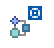

As tags 4D, como `4DEVAL`, `4DTEXT`, `4DHTML`... as well as the [`/4DACTION URL`](httpRequests.md#/4daction) allow you to trigger the execution of any project method of a 4D project published on the Web. Por ejemplo, la petición *http://www.server.com/4DACTION/login* provoca la ejecución del método proyecto ***login***, si existe.

Este mecanismo representa, portanto, um risco de segurança para a aplicação, em especial se um utilizador da Internet acionar intencionalmente (ou não) um método não destinado a ser executado através da Web. Este risco pode ser evitado das seguintes formas:

- Filter the methods called via the URLS using the [`On Web Authentication`](authentication.md#on-web-authentication) database method. Desvantagens: Se a base de dados incluir um grande número de métodos, este sistema pode ser difícil de gerir.

- Utilice la opción **Disponible a través de etiquetas 4D y URLs (4DACTION...)** que se encuentra en la caja de diálogo de propiedades del método:

Esta opción se utiliza para designar individualmente cada método del proyecto que puede ser llamado utilizando la URL especial `4DACTION`, o las etiquetas `4DTEXT`, `4DHTML`, `4DEVAL`, `4DSCRIPT`, `4DIF`, `4DELSEIF` o `4DLOOP`. Se não estiver assinalado, o método de projeto em causa não pode ser executado diretamente através de um pedido HTTP. Por outro lado, pode ser executado através de outros tipos de chamadas (fórmulas, outros métodos, etc.).

Esta opção não está selecionada por defeito. Los métodos que se pueden ejecutar a través de `4DACTION` o de etiquetas específicas deben indicarse específicamente.

No Explorador, os métodos de projeto com esta propriedade recebem um ícone específico:

