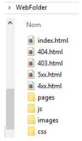

4D Web Server permite que você personalize as páginas de erro HTTP enviadas aos clientes, com base no código de status da resposta do servidor. As páginas de erro referem-se a:

- os códigos de estado que começam por 4 (erros do cliente), por exemplo, 404

- os códigos de estado que começam por 5 (erros do servidor), por exemplo, 501.

Para una descripción completa de los códigos de estado de error HTTP, puede consultar la [lista de códigos de estado HTTP](https://en.wikipedia.org/wiki/List_of_HTTP_status_codes) (Wikipedia).

## Substituir páginas predefinidas

To replace default 4D Web Server error pages with your own pages you just need to:

- coloque páginas HTML personalizadas no primeiro nível da pasta da Web do aplicativo,

- nomeie as páginas personalizadas "\{statusCode\}.html" (por exemplo, "404.html").

You can define one error page per status code and/or a generic error page for a range of errors, named "{number}xx.html". Por exemplo, você pode criar "4xx.html" para erros genéricos do cliente. The 4D Web Server will first look for a \{statusCode\}.html page then, if it does not exist, a generic page.

Por exemplo, quando uma resposta HTTP devolve um código de estado 404:

1. O 4D Web Server tenta enviar uma página "404.html" localizada na pasta web do aplicativo.

2. Se não for encontrado, o 4D Web Server tenta enviar uma página "4xx.html" localizada na pasta web do aplicativo.

3. Se não for encontrado, 4D Web Server usa sua página de erro padrão.

## Exemplo

Se definir as seguintes páginas personalizadas na sua pasta Web:

- as páginas "403.html" ou "404.html" serão exibidas quando as respostas HTTP 403 ou 404 forem retornadas, respectivamente,

- a página "4xx.html" será servida para qualquer outro status de erro 4xx (400, 401, etc.),

- a página "5xx.html" será apresentada para qualquer estado de erro 5xx.
