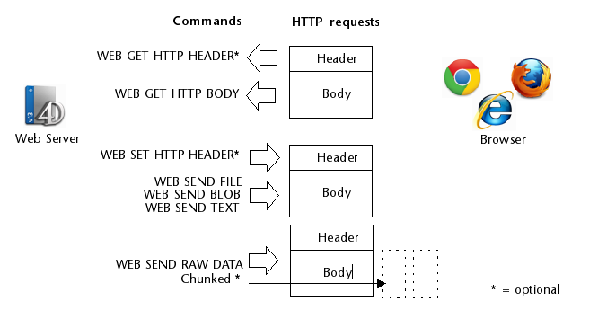

The 4D web server provides several built-in features to handle HTTP requests:

- el método base `On Web Connection`, un enrutador para su aplicación web,
- la URL `/4DACTION` para llamar al código del lado del servidor
- `WEB GET VARIABLES` para obtener valores de los objetos HTML enviados al servidor
- otros comandos como `WEB GET HTTP BODY`, `WEB GET HTTP HEADER`, o `WEB GET BODY PART` permiten personalizar el tratamiento de las solicitudes, incluidas las cookies.
- el método proyecto *COMPILER_WEB*, para declarar sus variables.

:::info

You can also implement your own HTTP request handlers for a customized control over incoming requests and outgoing responses. When a custom HTTP request handler is triggered, no database method is called. Veja a seção [**HTTP Request Handler**](http-request-handler.md).

:::

## On Web Connection

El método base `On Web Connection` puede utilizarse como punto de entrada al servidor web de 4D.

### Chamadas dos métodos banco

The `On Web Connection` database method is automatically called when the server receives any URL that is not a valid path to an existing page on the server (and is not a URL with a pattern triggering a [custom HTTP Request Handler](http-request-handler.md)).

The <code>On Web Connection</code> database method is automatically called when the server receives any URL that is not a path to an existing page on the server.

Por ejemplo, la URL "*a/b/c*" llamará al método base, pero "*a/b/c.html*" no llamará al método base si la página "c.html" existe en la subcarpeta "a/b" del [WebFolder](webServerConfig.md#root-folder).

> The request should have previously been accepted by the [`On Web Authentication`](authentication.md#on-web-authentication) database method (if it exists) and the web server must be launched.

### Sintaxe

**On Web Connection**( *$url* : Text; *$header* : Text; *$BrowserIP* : Text; *$ServerIP* : Text; *$user* : Text; *$password* : Text )

| Parâmetros | Tipo |                             | Descrição                                                                |
| ---------- | ---- | :-------------------------: | ------------------------------------------------------------------------ |
| $url       | Text | <- | URL                                                                      |
| $header    | Text | <- | Cabeçalhos HTTP + corpo HTTP (até um limite de 32 kb) |
| $BrowserIP | Text | <- | Endereço IP do cliente Web (browser)                  |
| $ServerIP  | Text | <- | Endereço IP do servidor                                                  |
| $user      | Text | <- | Nome de usuario                                                          |
| $password  | Text | <- | Senha                                                                    |

You must declare these parameters:

```4d
// Método banco de dados On Web Connection 
#DECLARE ($url : Text; $header : Text; \
  $BrowserIP : Text; $ServerIP : Text; \
  $user : Text; $password : Text)

```

> Calling a 4D command that displays an interface element (`DIALOG`, `ALERT`, etc.) não é permitido e encerra o processamento do método.

### $url - URL extra data

The first parameter ($url) is the URL entered by users in the address area of their web browser, without the host address.

Vamos utilizar uma ligação intranet como exemplo. Suponha que o endereço IP do seu Web Server 4D é 123.4.567.89. The following table shows the values of $url depending on the URL entered in the web browser:

| URL introduzido no navegador Web                                                                                                                  | Value of parameter $url                                                               |
| ------------------------------------------------------------------------------------------------------------------------------------------------- | ------------------------------------------------------------------------------------- |
| 123.4.567.89                                                                                      | /                                                                                     |
| http://123.45.67.89                                                               | /                                                                                     |
| 123.4.567.89/Customers                                                                            | /Customers                                                                            |
| http://123.45.67.89/Customers/Add                                                 | /Customers/Add                                                                        |
| 123.4.567.89/Do_This/If_OK/Do_That | /Do_This/If_OK/Do_That |

Note que você está livre para usar este parâmetro a sua conveniência. 4D simplesmente ignora o valor passado além da parte do host da URL. Por ejemplo, puede establecer una convención en la que el valor "*/Customers/Add*" significa "ir directamente a añadir un nuevo registro en la tabla `[Customers]`.” Fornecendo aos usuários web uma lista de valores possíveis e/ou favoritos padrão, você pode fornecer atalhos para diferentes partes de sua aplicação. Desta forma, os usuários da web podem acessar rapidamente os recursos do seu site sem percorrer todo o caminho de navegação toda vez que fizerem uma nova conexão.

### $header - Header and Body of the HTTP request

The second parameter ($header) is the header and the body of the HTTP request sent by the web browser. Tenga en cuenta que esta información se pasa a su método base `On Web Connection` "tal cual". Seu conteúdo vária conforme o navegador da Web que tenta a conexão.

Se o seu aplicativo usar essas informações, caberá a você analisar o cabeçalho e o corpo. Puede utilizar los comandos `WEB GET HTTP HEADER` y `WEB GET HTTP BODY`.

> For performance reasons, the size of data passing through the $header parameter must not exceed 32 KB. Para além deste tamanho, são truncados pelo servidor HTTP 4D.

### $BrowserIP - Web client IP address

The $BrowserIP parameter receives the IP address of the browser’s machine. Essas informações permitem distinguir entre conexões de intranet e de Internet.

> 4D devolve endereços IPv4 em formato híbrido IPv6/IPv4 escritos com um prefixo de 96 bits, por exemplo ::ffff:192.168.2.34 para o endereço IPv4 192.168.2.34. Para más información, consulte la sección [Soporte IPv6](webServerConfig.md#about-ipv6-support).

### $ServerIP - Server IP address

The $ServerIP parameter receives the IP address requested by the 4D Web Server. 4D permite multi-home que você pode usar máquinas com mais de um endereço IP. Para más información, consulte la [página Configuración](webServerConfig.html#ip-address-to-listen).

### $user e $password - Nome de usuário e senha

The $user and $password parameters receive the user name and password entered by the user in the standard identification dialog box displayed by the browser, if applicable (see the [authentication page](authentication.md)).

> If the user name sent by the browser exists in 4D, the $password parameter (the user’s password) is not returned for security reasons.

## /4DACTION

\*\*\*/4DACTION/***MethodName***<br/> \*\*/4DACTION/\*\*\*\*\**MethodName/Param*

| Parâmetros | Tipo |     | Descrição                                           |
| ---------- | ---- | :-: | --------------------------------------------------- |
| MethodName | Text |  -> | Nome do método de projeto 4D a ser executado        |
| Param      | Text |  -> | Parâmetro texto a ser passado para o método projeto |

**Uso:** URL o acción del formulario.

Esta URL permite llamar al método proyecto 4D *MethodName* con un parámetro texto opcional *Param*. The method will receive this parameter.

- El método proyecto 4D debe haber sido [permitido para peticiones web](allowProject.md): el valor del atributo "Disponible a través de etiquetas y URLs 4D (4DACTION...)" debe haber sido marcado en las propiedades del método. Se o atributo não for verificado, o pedido Web é rejeitado.
- Cuando 4D recibes una petición `/4DACTION/MethodName/Param`, se llama el método base `On Web Authentication` (si existe).

`4DACTION/` puede asociarse a una URL en una página web estática:

```html
<A HREF="/4DACTION/MyMethod/hello">Do Something</A>
```

El método proyecto `MyMethod` debe devolver generalmente una "respuesta" (envío de una página HTML utilizando `WEB SEND FILE` o `WEB SEND TEXT`, etc.). Certifique-se de tornar o processamento o mais curto possível para não bloquear o navegador.

> Un método llamado por `/4DACTION` no debe llamar a elementos de la interfaz (`DIALOG`, `ALERT`, etc.).

#### Exemplo

Este ejemplo describe la asociación de la URL `/4DACTION` con un objeto imagen HTML para mostrar dinámicamente una imagen en la página. Inserir as seguintes instruções numa página HTML estática:

```html

```

El método `getPhoto` es el siguiente:

```4d
#DECLARE ($url : Text) // This parameter must always be declared
var $path : Text
var $PictVar : Picture
var $BlobVar : Blob

 //find the picture in the Images folder within the Resources folder
$path:=Get 4D folder(Current resources folder)+"Images"+Folder separator+$url+".psd"

READ PICTURE FILE($path;$PictVar) //put the picture in the picture variable
PICTURE TO BLOB($PictVar;$BLOB;".png") //convert the picture to ".png" format
WEB SEND BLOB($BLOB;"image/png")
```

### 4DACCIÓN para publicar formulários

O servidor Web 4D também permite que você use formulários "postados", páginas HTML estáticas que enviam dados para o servidor da Web e para recuperar facilmente todos os valores. O tipo POST deve ser associado a eles e a ação do formulário deve começar imperativamente com /4DACTION/MethodName.

Um formulário pode ser enviado por dois métodos (ambos podem ser usados com 4D):

- POST, normalmente utilizado para enviar dados para o servidor Web,
- GET, normalmente utilizado para pedir dados ao servidor Web.

> Cuando el servidor web recibe un formulario publicado, llama al método base `On Web Authentication` (si existe).

En el método llamado, debe llamar al comando `WEB GET VARIABLES` para [recuperar los nombres y valores](#getting-values-from-the-requests) de todos los campos incluidos en una página HTML enviada al servidor.

Exemplo para definir a ação de um formulário:

```html
<FORM ACTION="/4DACTION/MethodName" METHOD=POST>
```

#### Exemplo

Em uma aplicação Web, gostaríamos que os navegadores conseguissem pesquisar entre os registros usando uma página HTML estática. Esta página chama-se "search.htm". A aplicação contém outras páginas estáticas que permitem, por exemplo, exibir o resultado da pesquisa (“results.htm”). Se ha asociado el tipo POST a la página, así como la acción `/4DACTION/SEARCH`.

Aqui está o código HTML que corresponde a esta página:

```html
<form action="/4daction/processForm" method=POST>
<input type=text name=vName value=""><br/>
<input type=checkbox name=vExact value="Word">Whole word<br/>
<input type=submit name=OK value="Search">
</FORM>
```

Durante la entrada de datos, escriba "ABCD" en el área de entrada de datos, marque la opción "Whole word" y valídela haciendo clic en el botón **Search**. No pedido enviado ao servidor Web:

```
vName="ABCD"
vExact="Word" OK="Search"
```

4D llama al método base `<On Web Authentication>` (si existe), luego se llama al método proyecto `processForm`, que es el siguiente:

```4d
 #DECLARE ($url : Text) //mandatory for compiled mode
 var $vName : Integer
 var vName;vLIST : Text
 ARRAY TEXT($arrNames;0)
 ARRAY TEXT($arrVals;0)
 WEB GET VARIABLES($arrNames;$arrVals) //we retrieve all the variables of the form
 $vName:=Find in array($arrNames;"vName")
 vName:=$arrVals{$vName}
 If(Find in array($arrNames;"vExact")=-1) //If the option has not been checked
    vName:=vName+"@"
 End if
 QUERY([Jockeys];[Jockeys]Name=vName)
 FIRST RECORD([Jockeys])
 While(Not(End selection([Jockeys])))
    vLIST:=vLIST+[Jockeys]Name+" "+[Jockeys]Tel+"<br/>"
    NEXT RECORD([Jockeys])
 End while
 WEB SEND FILE("results.htm") //Send the list to the results.htm form
  //which contains a reference to the variable vLIST,
  //for example <!--4DHTML vLIST-->
  //...
End if
```

## Obter valores de pedidos HTTP

O servidor Web 4D permite que você recupere dados enviados através de solicitações POST ou GET, usando formulários Web ou URLs.

Quando o servidor web recebe uma solicitação com dados no cabeçalho ou no URL, 4D pode recuperar os valores de qualquer objeto HTML que ele contém. This principle can be implemented in the case of a Web form, sent for example using [`WEB SEND FILE`](../commands-legacy/web-send-file.md) or [`WEB SEND BLOB`](../commands-legacy/web-send-blob.md), where the user enters or modifies values, then clicks on the validation button.

In this case, 4D can retrieve the values of the HTML objects found in the request using the [`WEB GET VARIABLES`](../commands-legacy/web-get-variables.md) command. El comando `WEB GET VARIABLES` recupera los valores como texto.

Considere o seguinte código fonte da página HTML:

```html
<html>
<head>
  <title>Welcome</title>
  <script language="JavaScript"><!--
function GetBrowserInformation(formObj){
formObj.vtNav_appName.value = navigator.appName
formObj.vtNav_appVersion.value = navigator.appVersion
formObj.vtNav_appCodeName.value = navigator.appCodeName
formObj.vtNav_userAgent.value = navigator.userAgent
return true
}
function LogOn(formObj){
if(formObj.vtUserName.value!=""){
return true
} else {
alert("Enter your name, then try again.")
return false
}
}
//--></script>
</head>
<body>
<form action="/4DACTION/WWW_STD_FORM_POST" method="post"
 name="frmWelcome"
 onsubmit="return GetBrowserInformation(frmWelcome)">
  <h1>Welcome to Spiders United</h1>
  <p><b>Please enter your name:</b>
  <input name="vtUserName" value="" size="30" type="text"></p>
  <p>
<input name="vsbLogOn" value="Log On" onclick="return LogOn(frmWelcome)" type="submit">
<input name="vsbRegister" value="Register" type="submit">
<input name="vsbInformation" value="Information" type="submit"></p>
<p>
<input name="vtNav_appName" value="" type="hidden">
<input name="vtNav_appVersion" value="" type="hidden">
<input name="vtNav_appCodeName" value="" type="hidden">
<input name="vtNav_userAgent" value="" type="hidden"></p>
</form>
</body>
</html>
```

Quando 4D envia a página para um navegador Web, ela se parece com isso:


As principais características desta página são:

- Incluye tres botones **Submit**: `vsbLogOn`, `vsbRegister` y `vsbInformation`.
- Cuando se hace clic en **Log On**, el envío del formulario se procesa primero por la función de JavaScript `LogOn`. Se nenhum nome for inserido, o formulário nem é enviado para 4D, e um alerta JavaScript é exibido.
- El formulario tiene un método POST 4D así como un script Submit (*GetBrowserInformation*) que copia las propiedades del navegador a los cuatro objetos ocultos cuyos nombres empiezan por *vtNav_App*.
 También incluye el objeto `vtUserName`.

Examinemos el método 4D `WWW_STD_FORM_POST` que se llama cuando el usuario hace clic en uno de los botones del formulario HTML.

```4d
  // Retrieval of value of variables
 ARRAY TEXT($arrNames;0)
 ARRAY TEXT($arrValues;0)
 WEB GET VARIABLES($arrNames;$arrValues)
 var $user : Integer

 Case of

  // The Log On button was clicked
    :(Find in array($arrNames;"vsbLogOn")#-1)
       $user :=Find in array($arrNames;"vtUserName")
       QUERY([WWW Users];[WWW Users]UserName=$arrValues{$user})
       $0:=(Records in selection([WWW Users])>0)
       If($0)
          WWW POST EVENT("Log On";WWW Log information)
  // The WWW POST EVENT method saves the information in a database table
       Else

          $0:=WWW Register
  // The WWW Register method lets a new Web user register
       End if

  // The Register button was clicked
    :(Find in array($arrNames;"vsbRegister")#-1)
       $0:=WWW Register

  // The Information button was clicked
    :(Find in array($arrNames;"vsbInformation")#-1)
       WEB SEND FILE("userinfos.html")
 End case
```

As funcionalidades deste método são:

- The values of the variables *vtNav_appName*, *vtNav_appVersion*, *vtNav_appCodeName*, and *vtNav_userAgent* (bound to the HTML objects having the same names) are retrieved using the `WEB GET VARIABLES` command from HTML objects created by the *GetBrowserInformation* JavaScript script.
- De las variables vinculadas *vsbLogOn*, *vsbRegister* y *vsbInformation* a los tres botones de envío, sólo la correspondiente al botón que se ha presionado será recuperada por el comando `WEB GET VARIABLES`. Quando o envio é realizado por um desses botões, o navegador retorna o valor do botão clicado para 4D. Isto diz-lhe qual o botão em que se clicou.

Tenha em atenção que, com HTML, todos os objetos são objetos texto. Si se utiliza un objeto SELECT, es el valor del elemento resaltado en el objeto el que se devuelve en el comando `WEB GET VARIABLES`, y no la posición del elemento en el array como en 4D. `WEB GET VARIABLES` siempre devuelve valores de tipo Texto.

## Outros comandos do servidor Web

O servidor web 4D fornece vários comandos web de baixo nível, permitindo que você desenvolva processamento personalizado de solicitações:

- o comando [`WEB GET HTTP BODY`](../commands-legacy/web-get-http-body.md) retorna o corpo como texto bruto, permitindo qualquer análise necessária
- o comando [`WEB GET HTTP HEADER`](../commands-legacy/web-get-http-header.md) retorna os cabeçalhos da solicitação. Es útil para manejar cookies personalizadas, por ejemplo (junto con el comando `WEB SET HTTP HEADER`).
- the [`WEB GET BODY PART`](../commands-legacy/web-get-body-part.md) and [`WEB Get body part count`](../commands-legacy/web-get-body-part-count.md) commands to parse the body part of a multi-part request and retrieve text values, but also files posted, using BLOBs.

Esses comandos estão resumidos no gráfico a seguir:



O servidor 4D oferece suporte a arquivos enviados na codificação de transferência chunked de qualquer cliente web. A codificação de transferência em pedaços é um mecanismo de transferência de dados especificado no HTTP/1.1. Ele permite que os dados sejam transferidos em uma série de "chunks" (partes) sem saber o tamanho final dos dados. The 4D Web Server also supports chunked transfer encoding from the server to Web clients (using [`WEB SEND RAW DATA`](../commands-legacy/web-send-raw-data.md)).

## Método projeto COMPILER_WEB

O método COMPILER\_WEB, se existir, é chamado sistematicamente quando o servidor HTTP recebe uma solicitação dinâmica e chama ao motor 4D. O método COMPILER\_WEB, se existir, é chamado sistematicamente quando o servidor HTTP recebe uma solicitação dinâmica e chama ao motor 4D. Este método destina-se a conter diretivas de inicialização de tipagem e/ou variáveis utilizadas durante trocas web. É utilizado pelo compilador quando a aplicação é compilada. O método COMPILER\_WEB é comum a todos os formulários Web. Por defeito, o método COMPILER_WEB não existe. É necessário criá-lo explicitamente.

> O método projeto COMPILER_WEB também é chamado, se existir, para cada solicitação SOAP aceite.
