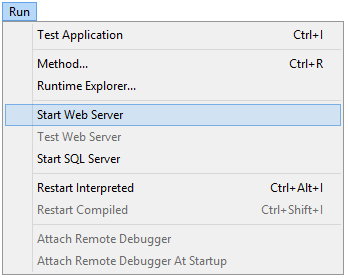

4D fornece várias ferramentas integradas para iniciar, parar ou monitorar o servidor web integrado.

## Iniciando o servidor Web 4D

> Para poder iniciar o servidor web de 4D ou 4D Server, você deve ter uma licença "4D Web Application". Para más información, consulte el [sitio web de 4D](https://www.4d.com).

Um projeto 4D pode iniciar e monitorar um servidor web para a aplicação (host) principal, bem como para cada componente hospedado.

O servidor web principal de 4D pode ser iniciado de diferentes maneiras:

- Utilizar um botão/comando de menu.
    - 4D: menu **Executar\>Iniciar o servidor Web**  
    - 4D Server: botão **Iniciar servidor HTTP** da página Servidor HTTP 

- Inicia automaticamente cada vez que a aplicação 4D é aberta. To do this, display the **Web\/Configuration** page of the Settings and select the **Launch Web Server at Startup** check box: 

- Programaticamente, chamando o comando [`webServer.start()`](API/WebServerClass.md#start) ou `WEB START SERVER`.

The web server of any component can be launched by calling the [`webServer.start()`](API/WebServerClass.md#start) function on the component's web server object.

> Você não precisa reiniciar a aplicação 4D para iniciar ou parar o servidor web.

## Parando o servidor Web 4D

O servidor web principal de 4D pode ser parado de diferentes maneiras:

- Utilizando el menú 4D **Ejecución\>Detener el servidor Web**, o vía el botón **Detener el servidor HTTP** de la página Servidor HTTP de 4D Server (ambos elementos muestran **Iniciar...** cuando el servidor no está ya iniciado).

- Programmaticamente, chamando o comando [`webServer.stop()`](API/WebServerClass.md#stop) ou `WEB STOP SERVER`.

El servidor web de cualquier componente puede detenerse llamando a la función `webServer.stop()` en el objeto servidor web del componente.

## Testar o Web server

El comando **Test Web Server** puede utilizarse para asegurarse de que el servidor web integrado funciona correctamente (sólo en 4D). Este comando es accesible en el menú **Ejecutar** cuando se lanza el servidor web:

Quando seleciona este comando, a página de início do site web publicado pela aplicação 4D se mostra em uma janela de seu navegador web por padrão:

Este comando permite verificar o funcionamento do servidor web, a visualização da página de inicio, etc. La página se llama utilizando la URL *localhost*, que es el atajo estándar que designa la dirección IP de la máquina en la que se ejecuta el navegador web. El comando tiene en cuenta el número de [puerto de publicación TCP](#http-port) especificado en los parámetros.

## Limpar a cache

A qualquer momento, você pode limpar o cache das páginas e imagens que ele contém (se, por exemplo, você tiver modificado uma página estática e quiser recarregá-la no cache).

Para o fazer, pode:

- 4D: haga clic en el botón **Borrar la caché** de la página [Web/Opciones (I)](../settings/web.md) de la caja de diálogo Parámetros.
- 4D Server: haga clic en el botón **Borrar la caché** de la página HTTP de la ventana Administración de 4D Server.

A cache é então imediatamente limpa.

> También puede utilizar la URL [/4DCACHECLEAR](#cacheclear).

## Explorador de execução

La página **Watch** (sección **Web**) del Explorador de ejecución muestra la información del servidor web, en particular:

- **Uso de la caché web**: indica el número de páginas presentes en la caché web así como su porcentaje de uso. Esta informação só estará disponível se o servidor web estiver ativo e se o tamanho do cache for maior que 0.

- **Tiempo de actividad del servidor web**: indica la duración del uso (en formato horas:minutos:segundos) del servidor web. Esta informação só está disponível se o servidor Web estiver ativo.

- **Conteo de visitas web**: indica el número total de peticiones HTTP recibidas desde el arranque del servidor web, así como un número instantáneo de peticiones por segundo (medida tomada entre dos actualizaciones del Explorador de ejecución). Esta informação só está disponível se o servidor Web estiver ativo.

## URLs de administração

URLs de administração web permitem que você controle o site publicado no seu servidor. 4D Web Server acepta cuatro URLs específicas: */4DSTATS*, */4DHTMLSTATS*, /*4DCACHECLEAR* y */4DWEBTEST*.

> */4DSTATS*, */4DHTMLSTATS* y */4DCACHECLEAR* sólo están disponibles para el diseñador y el administrador de la base de datos. Se o sistema de senha 4D não foi ativado, estas URLs estarão disponíveis para todos os usuários. /4DWEBTEST está sempre disponível.

### /4DSTATS

La URL **/4DSTATS** devuelve varios elementos de información en una tabla HTML (visualizable en un navegador):

| Elemento                | Descrição                                                            |
| ----------------------- | -------------------------------------------------------------------- |
| Tamanho actual da cache | Tamanho atual da cache do servidor Web (em bytes) |
| Tamanho máximo da cache | Tamanho máximo da cache (em bytes)                |
| Cached Object Max Size  | Tamanho máximo de cada objeto na cache (em bytes) |
| Cache Use               | Porcentagem do cache usado                                           |
| Cached Objects          | Número de objetos encontrados en la caché, **incluyendo imágenes**   |

Estas informações permitem que você verifique o funcionamento do seu servidor e eventualmente adapte os parâmetros correspondentes.

> El comando `WEB GET STATISTICS` permite obtener también información sobre cómo se está utilizando la caché de las páginas estáticas.

### /4DHTMLSTATS

La URL */4DHTMLSTATS* devuelve, también como una HTML, la misma información que la URL */4DSTATS*. La diferencia es que el campo **Cached Objects** sólo cuenta las páginas HTML (sin contar los archivos de imágenes). Además, esta URL devuelve el campo **Objetos filtrados**.

| Elemento                | Descrição                                                               |
| ----------------------- | ----------------------------------------------------------------------- |
| Tamanho actual da cache | Tamanho atual da cache do servidor Web (em bytes)    |
| Tamanho máximo da cache | Tamanho máximo da cache (em bytes)                   |
| Cached Object Max Size  | Tamanho máximo de cada objeto na cache (em bytes)    |
| Cache Use               | Porcentagem do cache usado                                              |
| Cached Objects          | Número de objetos encontrados en la caché, **sin imágenes**             |
| Objectos filtrados      | Número de objetos no cache não contados por URL, em particular, imagens |

### /4DCACHECLEAR

La URL */4DCACHECLEAR* elimina inmediatamente las páginas estáticas y las imágenes de la caché. Isso permite que você "forçe" a atualização das páginas que foram modificadas.

### /4DWEBTEST

La URL */4DWEBTEST* permite verificar el estado del servidor web. Quando esse URL é chamado, 4D retorna um arquivo texto com os campos HTTP seguintes preenchidos:

| Campo HTTP | Descrição                                           | Exemplo                                                                                                                                                                                                                                                                                                                                            |
| ---------- | --------------------------------------------------- | -------------------------------------------------------------------------------------------------------------------------------------------------------------------------------------------------------------------------------------------------------------------------------------------------------------------------------------------------- |
| Date       | data atual no formato RFC 822                       | Mon, 7 Dec 2020 13:12:50 GMT                                                                                                                                                                                                                                                                                       |
| Server     | 4D/número da versão                                 | 4D/18.5.0 (Build 18R5.257368)                                                                                                                                                                                                                                                   |
| User-Agent | nome e versão @ endereço IP do cliente | Mozilla/5.0 (Windows NT 10.0; Win64; x64) AppleWebKit/537.36 (KHTML, like Gecko) Chrome/86.0.4240.183 Safari/537.36 @ 127.0.0.1 |

## Logs

4D permite gerar dois logs de pedidos web:

- un historial de depuración, útil en la fase de desarrollo del servidor web (*HTTPDebugLog.txt*),
- un historial estandarizado de peticiones web, más bien utilizado con fines estadísticos (*logweb.txt*).

Ambos archivos de historial se crean automáticamente en la carpeta **Logs** del proyecto de aplicación.

### HTTPDebugLog.txt

O [arquivo de depuração http](webServerConfig.md#debug-log) pode ser ativado usando o objeto [`web server`](webServerObject.md) ou o comando `WEB SET OPTION`.

Este arquivo registra cada petição HTTP e cada resposta em modo raw (não processado). Petições inteiras, incluindo cabeçalhos, são registradas; opcionalmente, partes do corpo podem ser registradas também.

Os campos abaixo são registrados tanto para Request quanto para Response:

| Campo nome     | Descrição                                                                      |
| -------------- | ------------------------------------------------------------------------------ |
| SocketID       | ID da socked usada para comunicação                                            |
| PeerIP         | Endereço IPv4 do host (cliente)                             |
| PeerPort       | Porta usada por host (cliente)                              |
| TimeStamp      | Timestamp em milisegundos (desde início sistema)            |
| ConnectionID   | Connection UUID (UUID de VTCPSocket usada para comunicação) |
| SequenceNumber | Número de operação único e sequencial da sessão de histórico                   |

### logweb.txt

The [web log recording file](webServerConfig.md#log-recording) can be enabled using the [`web server` object](webServerObject.md), the `WEB SET OPTION` command, or the **Web/Log (type)** page of the settings. É necessário selecionar o formato do registo.

#### CLF/DLF

Each line of the file represents a request, such as: *host rfc931 user \[DD/MMM/YYYY:HH:MM:SS] "request" state length* Each field is separated by a space and each line ends by the CR/LF sequence (character 13, character 10).

O formato DLF (Formato Combinado de Log) é semelhante ao formato CLF (Formato Comum de Log) e usa exatamente a mesma estrutura. Simplesmente adiciona dois campos HTTP adicionais no final de cada solicitação: Referer e User-agent. Eis a descrição dos formatos CLF/DLF (não personalizáveis):

| Campo nome                                                           | Descrição                                                                                                                                                                                                                                                                                                                                                                  |
| -------------------------------------------------------------------- | -------------------------------------------------------------------------------------------------------------------------------------------------------------------------------------------------------------------------------------------------------------------------------------------------------------------------------------------------------------------------- |
| host                                                                 | Endereço IP do cliente (por exemplo: 192.100.100.10)                                                                                                                                                                                                                                    |
| rfc931                                                               | informação não gerada por 4D, é sempre - (um sinal de menos                                                                                                                                                                                                                                                                                             |
| user                                                                 | nome de usuário conforme é autenticado, ou então é - (um sinal de menos). Se o nome de usuário contiver espaços, eles serão substituídos por _ (um sublinhado).                                                                                                                 |
| DD/MMM/YYYY:HH:MM:SS | DD: dia, MMM: uma abreviação de 3 letras para o nome do mês (Jan, Feb,...), YYYY: ano, HH: hora, MM: minutos, SS: segundos. A data e a hora são locais para o servidor. |
| request                                                              | petição enviada pelo cliente (por exemplo, GET /index.htm HTTP/1.0                                                                                                                                                                                                                                                      |
| state                                                                | resposta dada pelo servidor                                                                                                                                                                                                                                                                                                                                                |
| length                                                               | tamanho dos dados retornados (HTTP header exceto) ou 0                                                                                                                                                                                                                                                                                                  |
| Referer                                                              | DLF apenas- Contém a URL da página apontando para o documento solicitado.                                                                                                                                                                                                                                                                                  |
| User-agent                                                           | Somente DLF - Contém o nome e a versão do navegador ou o software do cliente na origem do pedido                                                                                                                                                                                                                                                                           |

#### ELF/WLF

O formato ELF (Extended Log Format) é muito difundido no mundo dos navegadores HTTP. Ele pode ser usado para criar registros sofisticados que atendam a necessidades específicas. Por esse motivo, o formato ELF pode ser personalizado: é possível escolher os campos a serem registrados, bem como sua ordem de inserção no arquivo.

O WLF (formato de log WebStar) foi desenvolvido especificamente para o servidor 4D WebSTAR.

##### Configuração dos campos

Quando você escolher o formato ELF ou WLF, a área "Seleção de Token de Log Web" exibe os campos disponíveis para o formato escolhido. Você precisará selecionar cada campo a ser incluído no registro. Para o efeito, assinalar os campos pretendidos.

> Não é possível selecionar o mesmo campo duas vezes.

A tabela a seguir lista os campos disponíveis para cada formato (em ordem alfabética) e descreve seu conteúdo:

| Campo                                                  | ELF | WLF | Valor                                                                                                                                                                                                                                    |
| ------------------------------------------------------ | --- | --- | ---------------------------------------------------------------------------------------------------------------------------------------------------------------------------------------------------------------------------------------- |
| BYTES_RECEIVED                    |     | X   | Número de bytes recebidos pelo servidor                                                                                                                                                                                                  |
| BYTES_SENT                        | X   | X   | Número de bytes enviados pelo servidor ao cliente                                                                                                                                                                                        |
| C_DNS                             | X   | X   | Endereço IP do DNS (ELF: campo idêntico ao campo C_IP)                                                                                                                           |
| C_IP                              | X   | X   | Endereço IP do cliente (por exemplo, 192.100.100.10)                                                                                                                  |
| CONNECTION_ID                     |     | X   | Número de identificação da ligação                                                                                                                                                                                                       |
| CS(COOKIE)                          | X   | X   | Informações sobre as cookies contidas na petição HTTP                                                                                                                                                                                    |
| CS(HOST)                            | X   | X   | Campo Host do pedido HTTP                                                                                                                                                                                                                |
| CS(REFERER)                         | X   | X   | URL da página que aponta para o documento solicitado                                                                                                                                                                                     |
| CS(USER_AGENT) | X   | X   | Informações sobre o software e o sistema operacional do cliente                                                                                                                                                                          |
| CS_SIP                            | X   | X   | Endereço IP do servidor                                                                                                                                                                                                                  |
| CS_URI                            | X   | X   | URI onde o pedido é efectuado                                                                                                                                                                                                            |
| CS_URI_QUERY | X   | X   | Parâmetros da consulta                                                                                                                                                                                                                   |
| CS_URI_STEM  | X   | X   | Parte da solicitação sem parâmetros de consulta                                                                                                                                                                                          |
| DATE                                                   | X   | X   | DDD: dia, MMM: abreviação de 3 letras por mês (jan, fev, etc.), YYYY: ano                                                                             |
| METHOD                                                 | X   | X   | Método HTTP utilizado para o pedido enviado ao servidor                                                                                                                                                                                  |
| PATH_ARGS                         |     | X   | Parâmetros CGI: cadeia de caracteres localizada após o carácter "$"                                                                                                                                                      |
| STATUS                                                 | X   | X   | Resposta fornecida pelo servidor                                                                                                                                                                                                         |
| TIME                                                   | X   | X   | HH: hora, MM: minutos, SS: segundos                                                                                                                                                      |
| TRANSFER_TIME                     | X   | X   | Tempo solicitado pelo servidor para gerar a resposta                                                                                                                                                                                     |
| USER                                                   | X   | X   | Nome do usuário se estiver autenticado; caso contrário, - (sinal de menos). Se o nome do usuário contiver espaços, eles serão substituídos por _ (sublinhado) |
| URL                                                    |     | X   | URL solicitado pelo cliente                                                                                                                                                                                                              |

> As datas e horas são indicadas em GMT.

#### Frequência do backup

Dado que un archivo *logweb.txt* puede llegar a ser considerablemente grande, es posible establecer un mecanismo de archivo automático. O acionamento de um backup pode ser baseado em um determinado período de tempo (expresso em horas, dias, semana ou meses) ou baseado no tamanho do arquivo; quando o prazo definido (ou tamanho do arquivo) for atingido, 4D automaticamente fecha e arquiva o arquivo de registro atual e cria um novo.

Cuando se activa la copia de seguridad del archivo de registro web, el archivo de registro se archiva en una carpeta llamada "Archivos Logweb", que se crea en el mismo nivel que el archivo *logweb.txt*.

O arquivo arquivado é renomeado com base no seguinte exemplo: “DYYYY_MM_DDD_Thh_mm_ss.txt.” Por exemplo, para um dossiê arquivado em 4 de Setembro de 2020 às 3h50. e 7 segundos: “D2020_09_04_T15_50_07.txt.” e 7 segundos: “D2020_09_04_T15_50_07.txt.”

#### Parâmetros de backup

Los parámetros de copia de seguridad automáticadel logweb.txt se definen en la página **Web/Log (copia de seguridad)** de los parámetros:

First you must choose the frequency (days, weeks, etc.) or the file size limit criterion by clicking on the corresponding radio button. Você deve então especificar o momento exato do backup, se necessário.

- **Sin copia de seguridad**: la función de copia de seguridad programada está desactivada.

- **Cada X hora(s)**: esta opción se utiliza para programar las copias de seguridad con una base horaria. Pode digitar um valor entre 1 e 24.
    - **a partir de**: permite definir la hora de activación de la primera copia de seguridad.

- **Cada X día(s) a las X**: esta opción se utiliza para programar las copias de seguridad con una base diaria. Introduza 1 se pretender efetuar uma cópia de segurança diária. Quando essa opção estiver marcada, você deve indicar a hora em que o backup deve ser iniciado.

- **Cada X semana(s), día a las X**: esta opción se utiliza para programar las copias de seguridad con una base semanal. Digite 1 se quiser realizar o backup 1 vez por semana. Digite 1 se quiser realizar o backup 1 vez por semana. Digite 1 se quiser realizar o backup 1 vez por semana. Você pode selecionar vários dias da semana, se desejar.

- **Cada X mes(es), el día X a las X**: esta opción se utiliza para programar las copias de seguridad con una base mensual. Digite 1 se quiser realizar uma cópia de segurança mensal. Quando essa opção estiver marcada, você deve indicar o dia do mês e a hora em que o backup deve ser iniciado.

- **Todos los X MB**: esta opción se utiliza para programar las copias de seguridad en función del tamaño del archivo de registro actual. Um backup é automaticamente acionado quando o arquivo atinge o tamanho definido. Você pode definir um limite de tamanho de 1, 10, 100 ou 1000 MB.
