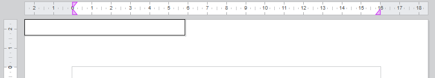
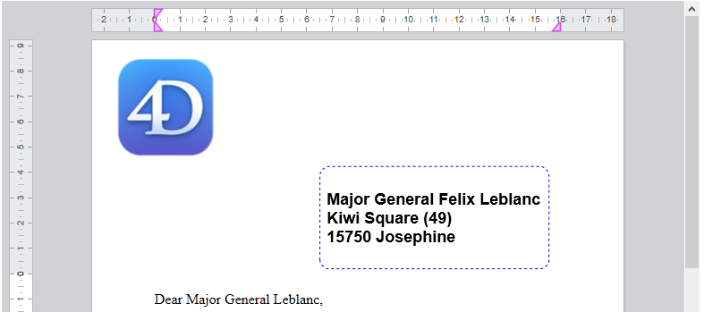

<!--REF #_command_.WP New text box.Syntax-->**WP New text box** ( *wpDoc* ; *pageNum* ) -> Resultado<!-- END REF-->
<!--REF #_command_.WP New text box.Params-->
| Parâmetro | Tipo |  | Descrição |
| --- | --- | --- | --- |
| wpDoc | Object | &#8594;  | Documento 4D Write Pro |
| pageNum | Number | &#8594;  | Número de página onde ancorar a caixa de texto |
| Resultado | Object | &#8592; | Objeto caixa de texto |

<!-- END REF-->

*Esse comando não é seguro para thread e não pode ser usado em código adequado.*


#### Descrição 

<!--REF #_command_.WP New text box.Summary-->O comando **WP New text box** cria e retorna um novo objeto caixa de texto na página *pageNum* de *wpDoc*.<!-- END REF-->

**Nota:** Para saber mais sobre caixas de texto, veja o parágrafo *Gerenciar caixas de texto*.

No parâmetro *wpDoc*, passe um documento 4D Write Pro. 

Em *pageNum*, passe o número de página para o qual a caixa de texto deve ser ancorada. Se pageNum < 0 o número de página **1** é usado (não se gera um erro). 

O comando cria um novo elemento caixa de texto com os atributos padrão abaixo:

* width = 8 cm,
* height = auto,
* solid black border 1 pt,
* padding = 4 pt,
* margin = 0 pt,
* background color = white,
* id = "textBoxN" onde N é um número,
* ancorado na frente do corpo no canto esquerdo superior do retângulo de página (imagem, uma caixa de texto pode ser ancorada em modo embebido, ou a uma seção, a todas as seções ou uma subseção em modo página e ao fundo ou camada superior)

Ver a seção *Atributos 4D Write Pro* para descrição detalhada desses atributos. . 

A nova caixa de texto é renderizada só na página *pageNum,* então não pode ser renderizada se:

* não houver página com o número de página passado
* o modo de exibição atual está embebido ou esboço

Entretanto, a caixa de texto ainda existe e é propriedade do documento mesmo se não renderizada. 

#### Exemplo 1 

Se quiser criar uma caixa de texto padrão:

```4d
 $textBox:=WP New text box(WParea;1)
```

Resultado:



#### Exemplo 2 

Se quiser adicionar uma caixa de texto em um modelo de carta, para exibir o endereço do destinatário (que está armazenado no contexto):

```4d
  // #1 create the text box
 $textBox:=WP New text box(WParea;1)
 
  // #2 define some text box attributes
 WP SET ATTRIBUTES($textBox;wk id;"AddressArea")
 WP SET ATTRIBUTES($textBox;wk anchor origin;wk paper box)
 WP SET ATTRIBUTES($textBox;wk anchor horizontal align;wk left;wk vertical align;wk top)
 WP SET ATTRIBUTES($textBox;wk anchor horizontal offset;$form.offsetX.values[$form.offsetX.index])
 WP SET ATTRIBUTES($textBox;wk anchor vertical offset;$form.offsetY.values[$form.offsetY.index])
 WP SET ATTRIBUTES($textBox;wk width;$form.width.values[$form.width.index])
 WP SET ATTRIBUTES($textBox;wk height;$form.height.values[$form.height.index])
 WP SET ATTRIBUTES($textBox;wk padding;$form.padding.values[$form.padding.index]) // margens interiores
 WP SET ATTRIBUTES($textBox;wk border style;wk dashed;wk border color;"Blue";wk border width;"1pt";wk border radius;"10pt")
 WP SET ATTRIBUTES($textBox;wk vertical align;wk center)
 
  // #3: define as fórmulas dentro da caixa de texto
 WP INSERT FORMULA($textBox;Formula(This.data.fullName);wk append)
 WP INSERT BREAK($textBox;wk paragraph break;wk append)
 WP INSERT FORMULA($textBox;Formula(This.data.fullAddress);wk append)
 
  // #4: Dá estilo ao conteúdo da caixa de texto
 WP SET ATTRIBUTES($textBox;wk font;"Arial";wk font bold;wk true;wk font size;"18pt")
```

Result:



#### Ver também 

[WP DELETE TEXT BOX](wp-delete-text-box.md)  