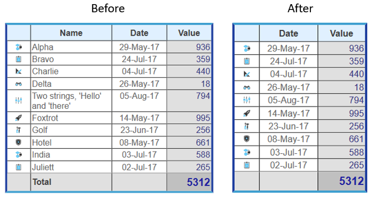

<!--REF #_command_.WP TABLE DELETE COLUMNS.Syntax-->**WP TABLE DELETE COLUMNS** ( *objTarget* ) | ( *refTabela* ; *numCol* {; *numColunas*} )<!-- END REF-->
<!--REF #_command_.WP TABLE DELETE COLUMNS.Params-->
| Parâmetro | Tipo |  | Descrição |
| --- | --- | --- | --- |
| objTarget | Object | &#8594;  | Range ou elemento ou documento 4D Write Pro |
| refTabela | Object | &#8594;  | Referência da tabela |
| numCol | Integer | &#8594;  | Número de coluna |
| numColunas | Integer | &#8594;  | número de colunas a eliminar (normal =1) |

<!-- END REF-->

#### Descrição 

<!--REF #_command_.WP TABLE DELETE COLUMNS.Summary-->O comando **WP TABLE DELETE COLUMNS** elimina uma ou várias colunas de uma tabela 4D Write.<!-- END REF-->

Este comando admite duas sintaxes:

* Se passar objTarget como primeiro parâmetro, o comando eliminará todas as colunas nas tabelas que se intersectam com o target. objTarget pode conter:  
   * uma range, ou  
   * um elemento (fila / parágrafo / corpo / cabeçalho / rodapé / imagem inline / seção / subseção), ou  
   * um documento 4D Write Pro.  
         
   Se objTarget intersectar com várias tabelas, as colunas intersectadas em todas as tabelas são eliminadas. Se objTarget não intersectar uma tabela, o comando não faz nada (não é gerado um erro).  
   Com esta sintaxe, se ignora o parâmetro *numColumns* (se for passado).
* Se passar os parâmetros *refTabela* e *numCol*, o comando eliminará as colunas na tabela designada, começando pelo índice de coluna especificado.  
Com esta sintaxe, o parámetro opcional *numColuns* define o número de colunas a eliminar de *refTabela*. De forma predeterminada, se omitir este parâmetro, se elimina uma coluna.

Eliminar todas as colunas de uma tabela eliminará toda a tabela.  
  
#### Exemplo 

Se quiser eliminar uma coluna da tabela *Invoice (faturas)*. Este código:

```4d
 var $table : Object
 
 $table:=WP Get element by ID(WParea;"Invoice") //acessa a tabela "Invoice"
 
 WP TABLE DELETE COLUMNS($table;2;1) //elimina a segunda coluna
```

Eliminará a coluna da localização correta:



#### Ver também 

[WP TABLE DELETE ROWS](wp-table-delete-rows.md)  