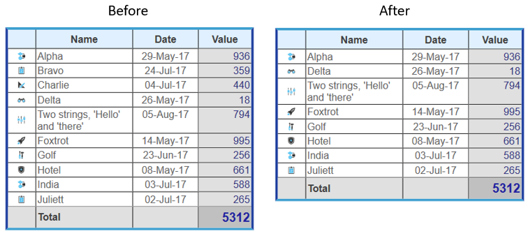

<!--REF #_command_.WP TABLE DELETE ROWS.Syntax-->**WP TABLE DELETE ROWS** ( *objTarget* ) | ( *refTabela* ; *numLinha* {; *nbLinhas*} )<!-- END REF-->
<!--REF #_command_.WP TABLE DELETE ROWS.Params-->
| Parâmetro | Tipo |  | Descrição |
| --- | --- | --- | --- |
| objTarget | Object | &#8594;  | Range ou elemento ou documento 4D Write Pro |
| refTabela | Object | &#8594;  | Referência de Tabela |
| numLinha | Integer | &#8594;  | número índice Linhas |
| nbLinhas | Integer | &#8594;  | Número linhas a apagar |

<!-- END REF-->

#### Descrição 

<!--REF #_command_.WP TABLE DELETE ROWS.Summary-->O comando **WP TABLE DELETE ROWS** elimina uma ou várias linhas de uma tabela 4D Write Pro.<!-- END REF-->

Este comando admite duas sintaxes:

* Se passar um objTarget como primeiro parâmetro, o comando eliminará todas as linhas nas tabelas que se intersecta com o target. objTarget pode conter:  
   * uma range ou  
   * um elemento (fila / parágrafo / corpo / cabeçalho / rodapé / imagem inline / seção / subseção), ou  
   * um documento 4D Write Pro.  
         
   Se objTarget se intersectar com várias tabelas, se eliminam as filas tocadas em todas as tabelas. Se objTarget não se intersectar com uma tabela, o comando não faz nada (não se gera nenhum erro).  
   Com esta sintaxe, se ignora o parâmetro *nbLineas* (se passar).
* Se passar os parâmetros *refTabela e* *numLinha*, o comando eliminará as linhas da tabela designada, começando no número de índice de linha especificada.  
 Com esta sintaxe, o parâmetro opcional *nbLineas* define o número de linhas a eliminar de *refTabela*. De forma predeterminada, se for omitido este parâmetro, se elimina uma linha.

Eliminar todas as linhas de uma taberla eliminará toda a tabela.

#### Exemplo 

Se quiser eliminar duas linhas da tabela *Invoice*. Este código:

```4d
 var $table : Object
 
 $table:=WP Get element by ID(WParea;"Invoice") //recupera a tabela "Invoice"
 
 WP TABLE DELETE ROWS($table;3;2) //elimina 2 linhas depois da 2da linha (3ra posição)
```

Eliminará as duas linhas da localização inicial:



#### Ver também 

[WP TABLE DELETE COLUMNS](wp-table-delete-columns.md)  