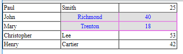

<!--REF #_command_.WP Table get cells.Syntax-->**WP Table get cells** ( *objTarget* ) | ( *refTab* ; *inCol* ; *iniFila* {; *numCol*{; *numFilas*}} )  -> Resultado<!-- END REF-->
<!--REF #_command_.WP Table get cells.Params-->
| Parâmetro | Tipo |  | Descrição |
| --- | --- | --- | --- |
| objTarget | Object | &#8594;  | Range (seleção de elementos) ou elemento ou documento 4D Write Pro |
| refTab | Object | &#8594;  | objeto referência de tabela |
| inCol | Integer | &#8594;  | posição da primeira célula da coluna |
| iniFila | Integer | &#8594;  | posição da primeira linha da coluna |
| numCol | Integer | &#8594;  | Número de colunas a obter |
| numFilas | Integer | &#8594;  | Número de filas a obter |
| Resultado | Object | &#8592; | Nova faixa contendo células |

<!-- END REF-->

#### Descrição 

<!--REF #_command_.WP Table get cells.Summary-->O comando **WP Table get cells** \[#descv\]devolve um novo objeto de faixa de células que contenha a seleção de células *refTabela* definida por *colIni*, *filaIni*, *numCol* e *numFilas*.<!-- END REF-->\[#descv\]

Passe:

* *objTarget* *:*  
   * uma range (seleção de elementos) ou  
   * um elemento (fila / parágrafo / corpo / cabeçalho / rodapé / imagem inline / seção / subseção), ou  
   * um documento 4D Write Pro

Se *objTarget* não se cruzar com uma tabela ou range de texto onde se pode recuperar uma seleção de células, o comando devolve Null.

**Ou**

* *colIni* e *filaIni* \- definem as coordenadas superiores esquerdas da primeira célula a obter.
* (opcional) *numCol* e *numFilas*\- especificam respectivamente o número de colunas e o número de filas a obter para a range de células.  
    
Se omitir *numFilas*, se devolve uma única fila. Se omitir *numCol* e *numFilas*, a range devolvida contém uma única célula.

Se *colIni* mais *numCol* ou *filaIni* mais *numFilas* excederem o número de colunas/filas em *refTabela*, ou se *colIni* ou *filaIni for* maior que o número de colunas/filas em *refTabela*, a range devolvida contém o máximo possível de colunas/filas.

#### Exemplo 1 

Se quiser modificar os atributos de uma faixa de células:

```4d
 var $wpTable;$wpRange;$wpRow1;$wpRow2;$wpRow3;$wpRow4;$wpRow5;$cells : Object
 $wpRange:=WP Create range(WParea;wk start text;wk end text)
 
 $wpTable:=WP Insert table($wpRange;wk append)
 $wpRow1:=WP Table append row($wpTable;"Paul";"Smith";25)
 $wpRow2:=WP Table append row($wpTable;"John";"Richmond";40)
 $wpRow3:=WP Table append row($wpTable;"Mary";"Trenton";18)
 $wpRow4:=WP Table append row($wpTable;"Christopher";"Lee";53)
 $wpRow5:=WP Table append row($wpTable;"Henry";"Cartier";42)
 
 $cells:=WP Table get cells($wpTable;2;2;2;2)
 WP SET ATTRIBUTES($cells;wk background color;0x00E0E0E0)
 WP SET ATTRIBUTES($cells;wk text color;"blue")
 WP SET ATTRIBUTES($cells;wk border color;0x00E000E0)
 WP SET ATTRIBUTES($cells;wk text align;wk center)
```

Resultado: 



#### Exemplo 2 

Para obter uma faixa de células iniciando da célula "5x7" ao final da fila:

```4d
 $cellRange:=WP Table get cells(tableRef;5;7;MAXLONG;1)
```

Para obter uma faixa de células iniciando da célula "5x7" até o final da coluna:

```4d
 $cellRange:=WP Table get cells(tableRef;5;7;1;MAXLONG)
```

Para obter uma faixa de células iniciando da célula "5x7" até o final da tabela:

```4d
 $cellRange:=WP Table get cells(tableRef;5;7;MAXLONG;MAXLONG)
```

#### Exemplo 3 

Se quiser recuperar as células que um usuário tiver sido selecionado:

```4d
 var $userSelection;$cells : Object
 
 $userSelection:=WP Selection range(myWPArea)
 
 $cells:=WP Table get cells($userSelection)
```

#### Ver também 

[WP Table get columns ](wp-table-get-columns.md)  
[WP Table get rows](wp-table-get-rows.md)  