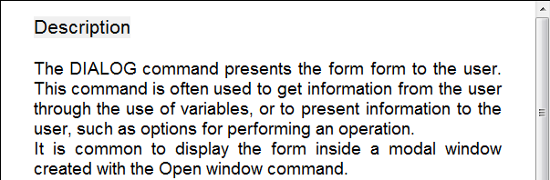

<!--REF #_command_.WP Text range.Syntax-->**WP Text range** ( *wpArea* ; *inicioFaixa* ; *fimFaixa* ) -> Resultado<!-- END REF-->
<!--REF #_command_.WP Text range.Params-->
| Parâmetro | Tipo |  | Descrição |
| --- | --- | --- | --- |
| wpArea | Object | &#8594;  | Objeto variável ou campo 4D Write Pro |
| inicioFaixa | Integer | &#8594;  | Início offset da faixa de texto |
| fimFaixa | Integer | &#8594;  | Final offset da faixa texto |
| Resultado | Object | &#8592; | Faixa de objeto |

<!-- END REF-->

#### Compatibilidade 

<!--REF #_command_.WP Text range.Summary-->**WP Text range** recebeu o nome **WP Get range** em versões anteriores de 4D Write Pro.<!-- END REF--> Foi renomeado para maior clareza.

#### Descrição 

O novo comando **WP Text range d**evolve um novo objeto de faixa de texto (objFaixa) que contem a seleção entre *faixaInicio* e *faixaFim* na área *wpArea* 4D Write Pro.

Um **4D Write Pro objeto de faixa de texto** pode ser usado para manejar atributos numa seleção de texto (com os comandos [WP GET ATTRIBUTES](../commands/wp-get-attributes.md) e [WP SET ATTRIBUTES](../commands/wp-set-attributes.md)). Para saber mais consulte o parágrafo *Comandos de seleção de faixa*.

Pode passar em *alvoObj*:

* uma range, ou
* um elemento (tabela/ linha / parágrafo / imagem inline/corpo/cabeçalho/rodapé/seção/subseção), ou
* um documento 4D Write Pro

Se nenhum objeto válido for passado no parâmetro *targetObj*, uma rangeObj vazia for retornada.

Em *faixaInicio* e *faixaFim*, passe os valores correspondentes a posição dos primeiros e últimos caracteres a selecionar no documento. Pode passar wk start text em *faixaInicio*   
para definir o começo do documento e wk end text em *faixaFim* para definir o final do documento. Lembre que um documento 4D Write Pro não só contém texto visível, como também as etiquetas de formato que são incluídas na faixa.

**Nota:** Se passar um elemento de referência tabela, linha, parágrafo, imagem inline, corpo, cabeçalho, seção ou subseção objeto de cabeçalho ou rodapé em *wpArea*, *faixaInicio* e *faixaFim* será relativo ao índice inicial e final do elemento da range. Por exemplo, se um cabeçalho for passado, , wk start text designa o caractere que inicia o cabeçalho e wk end text o caractere que termina o cabeçalho; se um elemento de referência da tabela for passado, o comando vai retoranr uma range de texto relativa às referências de tabela de *targetObj* se a seção for passada *startRange* e *endRange* são relativas ao corpo do documento (área pai da range criada de uma seção). Ver exemplo 2.

#### Exemplo 1 

Se quiser selecionar uma faixa de 12 caracteres começando desde o principio do campo 4D Write Pro. O campo se mostra em um objeto de formulário:


Se executar:

```4d
 $range2:=WP Get range([SAMPLE]WP;wk start text;12)
 WP SELECT(*;"WParea";$range2)
```

...o resultado é:



#### Exemplo 2 

Se quiser criar uma range (faixa de seleção) de uma seção:

```4d
 var $wpRange : Object
 $wpRange:=WP Text range(wpSection;1;11) //retorna uma range feita dos primeiros 10 caracteres da seção
  //se a seção iniciar em 100 no documento:
  //$wpRange.start = 100
  //$wpRange.end = 111
```

#### Ver também 

[WP Bookmark range](wp-bookmark-range.md)  
[WP Get body](wp-get-body.md)  
[WP Get header](wp-get-header.md)  
[WP Paragraph range](wp-paragraph-range.md)  
[WP Picture range](wp-picture-range.md)  
[WP SELECT](wp-select.md)  
[WP Selection range](wp-selection-range.md)  
[WP Table range](wp-table-range.md)  