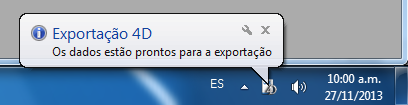

<!--REF #_command_.DISPLAY NOTIFICATION.Syntax-->**DISPLAY NOTIFICATION** ( *titulo* ; *texto* {; *duraçao*} )<!-- END REF-->
<!--REF #_command_.DISPLAY NOTIFICATION.Params-->
| Parâmetro | Tipo |  | Descrição |
| --- | --- | --- | --- |
| titulo | Text | &#8594;  | Título da notificação |
| texto | Text | &#8594;  | Texto da notificação |
| duraçao | Integer | &#8594;  | Duração da exibição em segundos |

<!-- END REF-->

#### Descrição 

<!--REF #_command_.DISPLAY NOTIFICATION.Summary-->O comando DISPLAY NOTIFICATION mostra uma mensagem na área de notificação ao usuário:

Este tipo de mensagem geralmente é utilizado pelo sistema operativo ou pelas aplicações para informar ao usuário sobre um evento externo (desconexão de rede, disponibilidade de uma atualização, etc.).<!-- END REF-->

* Sob Windows, a mensagem aparece na área de notificação da barra de tarefas:  

* Sob OS X (versão 10.8 mínimo), a mensagem aparece em uma pequena janela na esquina superior direita da tela.  
  
Note que conforme as especificações de Apple, a notificação só é mostrada quando a aplicação não está no primeiro plano. No entanto, a mensagem ainda aparece na lista do "notification center".

Em *titulo* e *texto*, passe o título e o texto da mensagem a mostrar (no exemplo anterior, o título é “Exportação 4D”). Pode introduzir até 255 caracteres. 

Sob Windows, é mostrada a janela da mensagem se não se detecta atividade na máquina, ou até que o usuário faça clique na caixa de fechar. O parâmetro opcional *duracao*, modifica a duração de visualização por padrão. Note que a visualização das notificações depende da configuração do sistema.

#### Exemplo 

```4d
 DISPLAY NOTIFICATION("4D Export";"The data is ready to export.")
```

#### Ver também 

[ALERT](alert.md)  

#### Propriedades

|  |  |
| --- | --- |
| Número do comando | 910 |
| Thread-seguro | &cross; |


