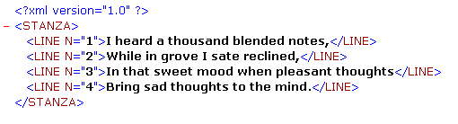

<!--REF #_command_.DOM GET XML ATTRIBUTE BY NAME.Syntax-->**DOM GET XML ATTRIBUTE BY NAME** ( *refElemento* ; *nomeAtrib* ; *valorAtrib* )<!-- END REF-->
<!--REF #_command_.DOM GET XML ATTRIBUTE BY NAME.Params-->
| Parâmetro | Tipo |  | Descrição |
| --- | --- | --- | --- |
| refElemento | Text | &#8594;  | Referência de elemento XML |
| nomeAtrib | Text | &#8594;  | Nome de atributo |
| valorAtrib | Variable | &#8592; | Valor atributo |

<!-- END REF-->

#### Descrição 

<!--REF #_command_.DOM GET XML ATTRIBUTE BY NAME.Summary-->O comando DOM GET XML ATTRIBUTE BY NAME permite conhecer o valor de um atributo especificado por seu nome.<!-- END REF-->

Passe em *refElemento* a referência de um elemento XML e em *nomeAtrib* o nome do atributo do que deseja conhecer seu valor. O valor se retorna no parâmetro *valorAtrib*. 4D tentará converter o valor obtido no tipo da variável passada como parâmetro. Se o tipo de variável não for definido, o valor é retornado em tipo texto como padrão.   
  
Se não existir nenhum atributo *nomeAtrib* no elemento XML, um erro é retornado. Se vários atributos do elemento XML tiverem o mesmo nome, apenas se retornar o valor do primeiro atributo.

#### Exemplo 

Este método se utiliza para recuperar um valor de atributo XML utilizando seu nome: 

```4d
 var minhaVarBlob : Blob
 var $ref_XML_Pai;$ref_XML_Filho : Text
 var $NumLinha : Integer
 
 $ref_XML_Pai:=DOM Parse XML variable(minhaVarBlob)
 $ref_XML_Filho:=DOM Get first child XML element($ref_XML_Pai)
 DOM GET XML ATTRIBUTE BY NAME($ref_XML_Filho;"N";$NumLinha)
```

Se este método for aplicado ao exemplo a seguir, $NumLinha contém o valor 1:



#### Variáveis e conjuntos do sistema 

Se o comando tiver sido executado corretamente, a variável sistema OK assume o valor 1\. Se ocorrer um erro, assume o valor 0.

#### Ver também 

[DOM GET XML ATTRIBUTE BY INDEX](dom-get-xml-attribute-by-index.md)  
[DOM REMOVE XML ATTRIBUTE](dom-remove-xml-attribute.md)  

#### Propriedades

|  |  |
| --- | --- |
| Número do comando | 728 |
| Thread-seguro | &check; |
| Modificar variáveis | OK, error |


