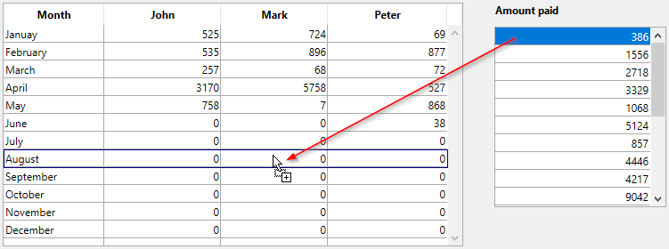

<!--REF #_command_.Drop position.Syntax-->**Drop position** {( colNum|posYimagem )} : Integer<!-- END REF-->
<!--REF #_command_.Drop position.Params-->
| Parâmetro | Tipo |  | Descrição |
| --- | --- | --- | --- |
| colNum&#124;posYimagem | Integer | &#8592; | Número de coluna de list box (-1 se soltar antes da última coluna) ou  posição da coordenada Y da imagem |
| Resultado | Integer | &#8592; | • Número (array/list box) ou • Posição (lista hierárquica) ou • Posição em string (texto/combo box) de item destino ou • -1 se soltar antes do último elemento do array ou item da lista • Posição da coordenada X da imagem |

<!-- END REF-->

#### Descrição 

<!--REF #_command_.Drop position.Summary-->O comando Drop position pode ser utilizado para descobrir a localização, em um objeto de destino “complexo”, onde um objeto foi (arrastado e) soltado.<!-- END REF-->

Geralmente, é utilizado Drop position quando administra um evento arrastar e soltar que se produz em um list box, uma lista hierárquica, um texto,um campo de imagem ou uma área 4D Write Pro.

* Se o objeto de destino for um array, o comando retorna um número de elemento.
* Se o objeto de destino for um list box, o comando retorna um número de linha. Neste caso, o comando também retorna o número de coluna onde se soltou no parâmetro opcional *colNum*.
* Se o objeto de destino for uma lista hierárquica, o comando retorna uma posição do elemento.
* Se o objeto de destino for uma variável ou um campo tipo texto, ou um combo box, o comando retorna uma posição de caractere ao interior da string.  
Em todos os casos, o comando pode retornar -1 se o objeto fonte tiver sido soltado além do último elemento ou do último elemento do objeto de destino.
* Se o objeto de destino for uma variável ou um campo de tipo imagem, a função retorna a localização horizontal do clique e, no parâmetro opcional *posYImagem*, a localização vertical do clique. Os valores retornados são expressos em píxels e com relação ao sistema de coordenadas locais.

Se chama Drop position quando processa um evento que não for do tipo arrastar e soltar em um array, um list box, um combo box, uma lista hierárquica, um texto ou uma imagem, ou área 4D Write Pro, o comando retorna -1.

**Importante:** para que um objeto de formulário aceite os dados soltados, a propriedade **Soltável** deve estar selecionada. Igualmente, seu método de objeto deve ser ativado pelo evento On Drag Over ou On Drop, para processar estes eventos.

#### Exemplo 

No exemplo abaixo, uma lista de somas deve ser organizada por mês e por pessoa. A operação é efetuada arrastando e soltando entre duas list boxes:



O método de objeto de list box da direita (origem) contém o código abaixo:

```4d
 If(Form event code=On Begin Drag Over) //evento deve ser selecionado para o list box
    var $tomove : Blob
    var $val : Text
    LISTBOX GET CELL POSITION(*;"LBPaid";$col;$row)
    $val:=PaidCol{$row}
    VARIABLE TO BLOB($val;$tomove)
    APPEND DATA TO PASTEBOARD("mydrag";$tomove) //utilize uma chave personalizada
 End if
```

O método de objeto de list box da esquerda (destino) contém o código abaixo:

```4d
 Case of
 
    :(Form event code=On Drag Over) //O evento deve ser selecionado para o list box
       var $toGet : Blob
       var $rownum : Integer
       $rownum:=Drop position($colnum)
       GET PASTEBOARD DATA("mydrag";$toGet) //obter dados
       If(Pasteboard data size("mydrag")>0)&($colnum#1)) //Se os dados estão na área de transferência
          $0:=0 //poderíamos aceitar o soltar
       Else
          $0:=-1 //Recusa o soltar
       End if
 
    :(FORM Event=On Drop) //o evento deve ser selecionado para o list box
       var $toGet : Blob
       var $rownum;$val : Integer
       $rownum:=Drop position($colnum)
       GET PASTEBOARD DATA("mydrag";$toGet)
       BLOB TO VARIABLE($toGet;$val) //obter o valor
       If(Pasteboard data size("mydrag")>0))
          If($colnum=1)
             BEEP
          Else
             Case of //Adição dos valores soltados
                :($colnum=2)
                   John{$rownum}:=John{$rownum}+$val
                :($colnum=3)
                   Mark{$rownum}:=Mark{$rownum}+$val
                :($colnum=4)
                   Peter{$rownum}:=Peter{$rownum}+$val
             End case
             DELETE FROM ARRAY(PaidCol;Find in array(PaidCol;$val)) //Atualizar listbox de origem
          End if
       End if
 End case
```

#### Ver também 

*Arrastar e Soltar*  

#### Propriedades

|  |  |
| --- | --- |
| Número do comando | 608 |
| Thread-seguro | &cross; |


