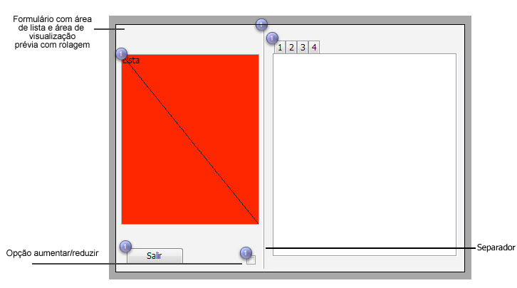

<!--REF #_command_.FORM SET SIZE.Syntax-->**FORM SET SIZE** ( {*objeto* ;} *horizontal*  ; *vertical* {; *} )<!-- END REF-->
<!--REF #_command_.FORM SET SIZE.Params-->
| Parâmetro | Tipo |  | Descrição |
| --- | --- | --- | --- |
| objeto | Text | &#8594;  | Nome do objeto que indica os limites do formulário |
| horizontal | Integer | &#8594;  | Se passada *: margem horizontal (píxels) Se omitida *: largo (píxels) |
| vertical | Integer | &#8594;  | Se passada *: margem vertical (píxels) Se omitida *: altura (píxels) |
| * | Operador | &#8594;  | • Se passado: agregar as margens definidas pelos parâmetros horizontal e vertical (tamanho automático ou baseado em um objeto, se passado um objeto) • Se omitido: utilizar horizontal e vertical como largura e altura do formulário |

<!-- END REF-->

#### Descrição 

<!--REF #_command_.FORM SET SIZE.Summary-->O comando FORM SET SIZE lhe permite modificar o tamanho do formulário atual por programação.<!-- END REF--> O novo tamanho é definido pelo processo atual; não está armazenado com o formulário.

  
Como no ambiente Desenho, pode utilizar este comando para definir o tamanho do formulário de três maneiras:

* Automaticamente, 4D determina o tamanho do formulário baseado na noção de que todos os objetos devem ser visíveis e eventualmente adicionando uma margem horizontal e vertical,
* Baseado na localização de um objeto do formulário, ao qual são adicionados eventualmente uma margem horizontal e uma margem vertical,
* Introduzindo tamanhos “fixos” (largura e altura).

Para maior informação sobre os possíveis redimensionamentos dos formulários, consulte o .

* **Tamanho automático**
Se quer que o tamanho do formulário seja defina de maneira automática, deve utilizar a seguinte sintaxe: 

```4d
 FORM SET SIZE(horizontal;vertical;*)
```

Neste caso, deve passar as margens (em píxels) que quer adicionar à direita e na parte inferior do formulário em *horizontal* e *vertical*. 

* **Tamanho baseado em um objeto**
Se deseja que o tamanho do formulário esteja baseado em um objeto, deve utilizar a seguinte sintaxe: 

```4d
 FORM SET SIZE(objeto;horizontal;vertical)
```

Neste caso, deve passar as margens (em píxels) que deseja adicionar à direita e na parte inferior do objeto em *horizontal* e *vertical*. Não pode passar o parâmetro *\**.

* **Tamanho fixo**
Se quer ter um tamanho de formulário fixo, deve utilizar a seguinte sintaxe: 

```4d
 FORM SET SIZE(horizontal;vertical)
```

Neste caso, deve passar a largura e a altura (em píxels) do formulário em *horizontal* e *vertical*.

O comando FORM SET SIZE modifica o tamanho do formulário, mas também considera as propriedades de redimensionamento. Por exemplo, se a largura mínima de um formulário é 500 píxeles e se o comando define uma largura de 400 píxeles, a nova largura do formulário será de 500 píxeles.   
Igualmente note que este comando não muda o tamanho da janela do formulário (pode redimensionar um formulário sem mudar o tamanho da janela e vice-versa). Para mudar o tamanho da janela do formulário, consulte o comando [RESIZE FORM WINDOW](resize-form-window.md "RESIZE FORM WINDOW").

#### Exemplo 

O exemplo a seguir mostra como colocar uma janela de tipo Explorador. O formulário a seguir é criado no ambiente Desenho:

  
O tamanho do formulário é “automático”.

A janela é visualizada utilizando o seguinte código:

```4d
 $ref:=Open form window([Tabla 1];"Form1";Standard form window;Horizontally centered;Vertically centered;*)
 DIALOG([Tabla 1];"Form1")
 CLOSE WINDOW
```

A parte da direita da janela pode ser mostrada ou ocultada clicando na opção aumentar/reduzir:


O método de objeto associado com este botão é o seguinte:

```4d
 Case of
    :(FORM Event=On Load)
       var b1;<>contraido : Boolean
       var margem : Integer
       margen:=15
       b1:=<>contraido
       If(<>contraido)
          FORM SET HORIZONTAL RESIZING(False)
          FORM SET SIZE("b1";margem;margem)
       Else
          FORM SET HORIZONTAL RESIZING(True)
          FORM SET SIZE("tab";margem;margem)
       End if
 
    :(FORM Event=On Clicked)
       <>contraido:=b1
       If(b1)
  //contraido
          OBJECT GET COORDINATES(*;"b1";$l;$t;$r;$b)
          GET WINDOW RECT($lf;$tf;$rf;$bf;Current form window)
          SET WINDOW RECT($lf;$tf;$lf+$r+margem;$tf+$b+margem;Current form window)
          FORM SET HORIZONTAL RESIZING(False)
          FORM SET SIZE("b1";margem;margem)
 
       Else
  //expandido
          OBJECT GET COORDINATES(*;"tab";$l;$t;$r;$b)
          GET WINDOW RECT($lf;$tf;$rf;$bf;Current form window)
          SET WINDOW RECT($lf;$tf;$lf+$r+margem;$tf+$b+margem;Current form window)
          FORM SET HORIZONTAL RESIZING(True)
          FORM SET SIZE("tab";margem;margem)
       End if
 
 End case
```

#### Ver também 

[FORM SET HORIZONTAL RESIZING](form-set-horizontal-resizing.md)  
[FORM SET VERTICAL RESIZING](form-set-vertical-resizing.md)  

#### Propriedades

|  |  |
| --- | --- |
| Número do comando | 891 |
| Thread-seguro | &cross; |


