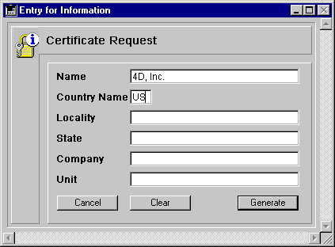

<!--REF #_command_.GENERATE CERTIFICATE REQUEST.Syntax-->**GENERATE CERTIFICATE REQUEST** ( *chavPriv* ; *peticaoCertificado* ; *codigoArray* ; *arrayNome* )<!-- END REF-->
<!--REF #_command_.GENERATE CERTIFICATE REQUEST.Params-->
| Parâmetro | Tipo |  | Descrição |
| --- | --- | --- | --- |
| chavPriv | Blob | &#8594;  | BLOB que contém a chave privada |
| peticaoCertificado | Blob | &#8592; | BLOB que recebe o pedido de certificação |
| codigoArray | Integer array | &#8594;  | informação da lista de código |
| arrayNome | Text array | &#8594;  | Lista de nomes |

<!-- END REF-->

#### Descrição 

<!--REF #_command_.GENERATE CERTIFICATE REQUEST.Summary-->O comando GENERATE CERTIFICATE REQUEST gera uma pedido de certificação ao formato PKCS o qual pode ser utilizado diretamente pelas autoridades de certificação tal como Verisign(R).<!-- END REF--> O certificado é uma parte importante no protocolo seguro SSL. O certificado é enviado a cada navegador que se conecta em modo SSL e contém a “carteira de identidade” do sitio web (com a informação introduzida no comando), além de sua chave pública permitindo aos navegadores decifrar a informação recebida. Além disso, o certificado contém diferente informação adicionada pela autoridade de certificação a qual garante sua integridade.

**Nota**: para maior informação sobre o protocolo SSL utilizado com o servidor web 4D, consulte a seção [WEB SERVICE SET PARAMETER](web-service-set-parameter.md).  
  
O pedido de certificação utiliza um par de chaves geradas por o comando [GENERATE ENCRYPTION KEYPAIR](generate-encryption-keypair.md) e contem diferente informação. A autoridade de certificação gerará seu certificado combinando esta solicitação com outros parâmetros.  
Passe em *chavPriv* um BLOB que contenha a chave privada gera com o comando [GENERATE ENCRYPTION KEYPAIR](generate-encryption-keypair.md).  
  
Passe em *peticaoCertificado* um BLOB vazio. Quando o comando tiver sido executado, contém o pedido de certificação ao formato PKCS. Pode armazenar este pedido em um arquivo de texto, por exemplo utilizando o comando [BLOB TO DOCUMENT](blob-to-document.md), para apresentá-lo à autoridade de certificação.  
  
**Advertência**: a chave privada se utiliza para gerar o pedido de certificação mas NÃO deve ser enviada a a autoridade de certificação.  
  
Os arrays *codigoArray* (inteiro longo) e *arrayNom*e (cadeia) devem ser preenchidas com os números de código e a informação exigida pela autoridade de certificação respectivamente.  
  
Os códigos e nomes exigidos podem mudar de acordo com a autoridade de certificação e o uso do certificado. Entretanto, dentro do uso normal do certificado (conexões do servidor web através da SSL), os arrays devem conter os seguintes elementos: 

| **Informação a fornecer**      | **codigoArray** | **arrayNome (Exemplos)** |
| ------------------------------ | --------------- | ------------------------ |
| Nome do domínio                | 13              | www.4dhispano.com        |
| Código do país (duas letras)   | 14              | ES                       |
| Cidade                         | 15              | Barcelona                |
| Estado                         | 16              | Cataluña                 |
| Nome da organização            | 17              | 4D Hispano               |
| Serviço/Pessoa responsável por | 18              | Administrador Web        |
| servidor                       |                 |                          |

A ordem na qual se introduzem os códigos e a informação não é importante, entretanto os dois arrays devem estar sincronizados: se o terceiro elemento de *codigoArray* contém o valor 15 (cidade), o terceiro elemento de *nomeArray* deve conter essa informação, em nosso exemplo Barcelona. 

#### Exemplo 

Um formulário “Pedido de certificado” contém os seis campos necessários para um pedido de certificação padrão. O botão **Gerar** cria um documento em disco que contém o pedido do certificado. O documento “Privatekey.txt” que contém a chave privada (gerada com o comando [GENERATE ENCRYPTION KEYPAIR](generate-encryption-keypair.md "GENERATE ENCRYPTION KEYPAIR")) deve estar no disco:  
  
  
  
Este es o método do botão **Gerar**

```4d
  // Método de objeto bGerar
 
 var $vbchavePriv;$vbpeticaoCertif : Blob
 var $tabelaNum : Integer
 ARRAY LONGINT($tLCodigos;6)
 ARRAY STRING(80;$tSInfos;6)
 
 $tableNum:=Table(Current form table)
 For($i;1;6)
    $tSInfos{$i}:=Field($tabelaNum;$i)->
    $tLCodigoss{$i}:=$i+12
 End for
 If(Find in array($tSInfos;"")#-1)
    ALERT("Todos os campos devem ser completados.")
 Else
    ALERT("Selecione sua chave privada.")
    $vhDocRef:=Open document("")
    If(OK=1)
       CLOSE DOCUMENT($vhDocRef)
       DOCUMENT TO BLOB(Document;$vbchavePriv)
       GENERATE CERTIFICATE REQUEST($vbchavePriv;$vbcertifRequest;$tLCodigos;$tSInfos)
       BLOB TO DOCUMENT("Request.txt";$vbcertifRequest)
    Else
       ALERT("Chave privada inválida.")
    End if
 End if
```

#### Ver também 

[GENERATE ENCRYPTION KEYPAIR](generate-encryption-keypair.md)  
[HTTP SET CERTIFICATES FOLDER](http-set-certificates-folder.md)  

#### Propriedades

|  |  |
| --- | --- |
| Número do comando | 691 |
| Thread-seguro | &check; |


