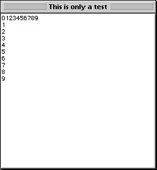

<!--REF #_command_.GOTO XY.Syntax-->**GOTO XY** ( *x* ; *y* )<!-- END REF-->
<!--REF #_command_.GOTO XY.Params-->
| Parâmetro | Tipo |  | Descrição |
| --- | --- | --- | --- |
| x | Integer | &#8594;  | posição x (horizontal) do cursor |
| y | Integer | &#8594;  | posição y (vertical) do cursor |

<!-- END REF-->

#### Descrição 

<!--REF #_command_.GOTO XY.Summary-->O comando GOTO XY se utiliza conjuntamente com o comando [MESSAGE](message.md "MESSAGE") quando mostra mensagens em uma janela aberta pelo comando [Open window](open-window.md "Open window").<!-- END REF-->  
  
GOTO XY determina a posição do cursor de inserção de caracteres (um cursor invisível) para definir a localização da seguinte mensagem na janela. 

A esquina superior esquerda representa as coordenadas 0,0\. O cursor é localizado automaticamente em 0,0 quando uma janela se abre e depois é executada [ERASE WINDOW](erase-window.md "ERASE WINDOW").

Depois de que GOTO XY defina a posição do cursor, pode utilizar [MESSAGE](message.md "MESSAGE") para mostrar os caracteres na janela. 

#### Exemplo 1 

Ver o exemplo do comando [MESSAGE](message.md "MESSAGE").

#### Exemplo 2 

Ver o exemplo do comando [Milliseconds](milliseconds.md "Milliseconds").

#### Exemplo 3 

O exemplo a seguir: 

```4d
 Open window(50;50;300;300;5;"Esta é só um teste")
 For($vlFila;0;9)
    GOTO XY($vlFila;0)
    MESSAGE(String($vlFila))
 End for
 For($vlLinea;0;9)
    GOTO XY(0;$vlLinea)
    MESSAGE(String($vlLinea))
 End for
 $vhHoraInicio:=Current time
 Repeat
 Until((Current time-$vhHoraInicio)>†00:00:30†)
```

Mostra a janela a seguir (em Macintosh) por 30 segundos:



#### Ver também 

[MESSAGE](message.md)  

#### Propriedades

|  |  |
| --- | --- |
| Número do comando | 161 |
| Thread-seguro | &cross; |


