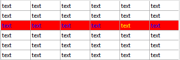

<!--REF #_command_.LISTBOX Get row color.Syntax-->**LISTBOX Get row color** ( {* ;} *objeto* ; *fila* {; *tipoCor*} )  : Text<!-- END REF-->
<!--REF #_command_.LISTBOX Get row color.Params-->
| Parâmetro | Tipo |  | Descrição |
| --- | --- | --- | --- |
| * | Operador | &#8594;  | Se especificado, objeto é um nome objeto (string) Se omitido, objeto é uma variável |
| objeto | any | &#8594;  | Nome de objeto (se * for especificado) ou  Variável (se * for omitido) |
| fila | Integer | &#8594;  | Número de Fila |
| tipoCor | Integer | &#8594;  | Cor de Fonte de list box (padrão) ou cor de fundo de list box |
| Resultado | Text | &#8592; | Valor da cor |

<!-- END REF-->

#### Descrição 

<!--REF #_command_.LISTBOX Get row color.Summary-->**Nota:** este comando só funciona com list boxes de tipo array.<!-- END REF-->

O comando **LISTBOX Get row color** devolve a cor de uma fila ou célula na list box designada pelos parâmetros *objeto e* *\** como uma string CSS.

**Nota:** se quiser obter a cor como um formato inteiro longo de 4 bytes, deve utilizar o comando [OBJECT SET RGB COLORS](object-set-rgb-colors.md). Para saber mais sobre os formatos de cor, consulte a descrição do comando [OBJECT SET RGB COLORS](object-set-rgb-colors.md). 

Passar o parâmetro opcional *\** indica que o parâmetro *objeto é* um nome de objeto (string). Se não passar este parâmetro, indica que o parâmetro *objeto* é uma variável. Neste caso, se passar uma referência de variável ao invés de uma string. Pode designar uma list box ou uma coluna de list box no parâmetro *objeto*:

* quando *objeto* designar um list box, o comando devolve a cor da fila.
* quando *objeto* designar uma coluna de list box, o comando devolve a cor da célula.

Em *fila*, passe o número da fila cuja cor quiser obter.

**Nota:** o comando não leva em consideração nenhum estado oculto/visível das filas de list box.

No parâmetro *tipoCor*, pode passar a constante lk background color ou lk font color (tema "*List box*") para averiguar a cor de fundo ou fonte da fila. Se omitir este parâmetro, se devolve a cor da fonte.  
  
**Advertência**: a cor atribuída a uma fila não é mostrada necessariamente em cada célula da fila (ver exemplo). Se os valores de cor em conflito sã estabelecidas utilizando as propriedades dos list boxes ou colunas de list box, se aplica uma ordem de prioridade. Para saber mais, consulte o manual de *Desenho*.

#### Exemplo 

Dado a list box abaixo:



```4d
 var $vtColor;$vtColor2;$vtColor3 : Text
 $vtColor:=LISTBOX Get row color(*;"Col5";3)
 $vtColor2:=LISTBOX Get row color(*;"List Box";3)
 $vtColor3:=LISTBOX Get row color(*;"List Box";3;lk background color)
  // $vtColor contains "#FFFF00" (yellow)
  // $vtColor2 contains "#0000FF" (blue)
  // $vtColor3 contains "#FF0000" (red)
```

#### Ver também 

[LISTBOX SET ROW COLOR](listbox-set-row-color.md)  

#### Propriedades

|  |  |
| --- | --- |
| Número do comando | 1658 |
| Thread-seguro | &cross; |


