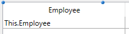

<!--REF #_command_.LISTBOX INSERT COLUMN FORMULA.Syntax-->**LISTBOX INSERT COLUMN FORMULA** ( {* ;} *objeto* ; *posiçaoCol* ; *nomeColuna* ; *formula* ; *tipoDados* ; *nomeCabe* ; *varTitulo* {; *nomeRodape* ; *varRodape*} )<!-- END REF-->
<!--REF #_command_.LISTBOX INSERT COLUMN FORMULA.Params-->
| Parâmetro | Tipo |  | Descrição |
| --- | --- | --- | --- |
| * | Operador | &#8594;  | Se especificado, objeto é um nome de objeto (string), se omitido, objeto é uma variável |
| objeto | any | &#8594;  | Nome objeto (se * for especificado) ou Variável (se * é omitido) |
| posiçaoCol | Integer | &#8594;  | Localização da coluna a inserir |
| nomeColuna | Text | &#8594;  | Nome do objeto de coluna |
| formula | Text | &#8594;  | Fórmula 4D associada com a coluna |
| tipoDados | Integer | &#8594;  | Tipo de resultado da fórmula |
| nomeCabe | Text | &#8594;  | Nome do objeto título da coluna |
| varTitulo | Integer, Pointer | &#8594;  | Variável título de coluna |
| nomeRodape | Text | &#8594;  | Nome do rodapé  da coluna |
| varRodape | Variable, Pointer | &#8594;  | Variável de rodapé da coluna |

<!-- END REF-->

#### Descrição 

<!--REF #_command_.LISTBOX INSERT COLUMN FORMULA.Summary-->O comando **LISTBOX INSERT COLUMN FORMULA** insere uma coluna no listbox designado pelos parâmetros *objeto* e *\**.<!-- END REF--> 

O comando **LISTBOX INSERT COLUMN FORMULA** é similar ao comando [LISTBOX INSERT COLUMN](listbox-insert-column.md) exceto que pode ser utilizada para introduzir uma fórmula como conteúdo de uma coluna.

Este tipo de conteúdo só pode ser utilizado quando a propriedade “Fonte de dados” do list box é **Seleção atual** ou **Seleção temporária ou Coleção ou Seleção de Entidade**(para maior informação a respeito, consulte a seção *Gestão de objetos List Box* *Licenses*).

**Nota**: este comando não faz nada se for aplicado à primeira coluna de um list box mostrado em modo hierárquico.

Se passa o parâmetro opcional *\**, indica que o parâmetro *objeto* é um nome de objeto (string). Se omitir este parâmetro, indica que o parâmetro *objeto* é uma variável. Nesse caso, não passa uma string, mas uma referência de variável. Para maior informação sobre nomes de objetos, consulte a seção *Propriedades dos objetos*. 

A nova coluna é inserida justo antes da coluna designada pelo parâmetro *posicionCol*. Se o parâmetro *posicionCol* é superior ao número total de colunas, a coluna será adicionada depois da última coluna.

Passe no parâmetro *nomCol* o nome do objeto da coluna inserida.

O parâmetro *fórmula* pode conter qualquer expressão válida:

* Uma instrução,
* Uma fórmula gerada utilizando o editor de fórmulas,
* Uma chamada a um comando 4D,
* Uma chamada a um método de projeto.

No momento da chamada do comando, a *formula* é analizada e depois é executada.

**Nota:** utilize o comando [Command name](command-name.md) para definir as fórmulas independentes da linguagem da aplicação (quando chamam a comandos 4D).

O parâmetro *tipoDados* pode ser utilizado para designar o tipo de dados resultantes da execução da *formula*. Deve passar neste parâmetro uma das seguintes constantes do tema *Tipos de campos e variáveis*:

| Constante  | Tipo          | Valor |
| ---------- | ------------- | ----- |
| Is Boolean | Inteiro longo | 6     |
| Is date    | Inteiro longo | 4     |
| Is picture | Inteiro longo | 3     |
| Is real    | Inteiro longo | 1     |
| Is text    | Inteiro longo | 2     |
| Is time    | Inteiro longo | 11    |

Se o resultado da *formula* não corresponde ao tipo de dados esperado, é gerado um erro.

Passe nos parâmetros *nomTitulo* e *varTitulo* o nome de objeto e a variável do título coluna inserida.

Nos parâmetros *nomRodape* e *varRodape*, você também pode passar o nome do objeto e variável do rodapé da coluna inserida. Se você omitir o parâmetro *varRodape*, 4D usa uma variável dinâmica.

**Nota:** os nomes de objeto devem ser únicos em um formulário. Deve ter certeza de que os nomes passados nos parâmetros *nomCol* e *nomRodape* não tenham sido utilizados. Do contrário, a coluna no é criada e um erro é gerado.

##### Inserção dinâmica 

A partir de 4D v14 R3, pode utilizar este comando para inserir colunas nos list box de forma dinâmica durante a execução do formulário. 4D será manipulado automaticamente a definição das variáveis necessárias (rodapé de página e cabeçalho).   
  
Para isso, LISTBOX INSERT COLUMN FORMULA aceita um ponteiro **Nil (->\[\])** como valor para os parâmetros *varCabecalho* e *v* *ariavelRodape*. Neste caso, quando se executa o comando, 4D cria as variáveis requeridas dinamicamente (para mais informação, consulte a seção ).   
  
Note que as variáveis de cabeçalho e de rodapé de página sempre são criadas com um tipo específico (inteiro longo e texto, respectivamente).

#### Exemplo 1 

Se queremos adicionar uma nova coluna à direita do listbox que conterá uma fórmula que calcula a idade de um empregado:  

```4d
 vIdade:="Data atual-[Empregados]DataNascimento)\365"
 $ultima:=LISTBOX Get number of columns(*;"ListBox1")+1
 LISTBOX INSERT COLUMN FORMULA(*;"ListBox1";$ultima;"ColFormula";Is real;vIdade;"Idade";varTitulo)
```

#### Exemplo 2 

Se quiser anexar uma coluna a uma list box de tipo coleção :

```4d
  //Criar a coleção
 var emps : Collection
 emps:=New collection(New object("Employee";"John Doe";"JobTitle";"CEO");New object("Employee";"Mary Smith";"JobTitle";"CTO");New object("Employee";"Jane Turner";"JobTitle";"CFO"))
```

O conteúdo da coluna será avaliado para cada elemento da coleção e a a source da expressão*This.Employee* é usada :



A execução :


Para adicionar uma coluna mostrando os títulos dos cargos ocupados :

```4d
 LISTBOX INSERT COLUMN FORMULA(*;"EmpLB";2;"2nd Column";"This.JobTitle";Est un texte;"JTHeader";header2)
 OBJET FIXER TITRE(header2;"Title")
```

A coluna é anexada à list box :


#### Ver também 

[LISTBOX INSERT COLUMN](listbox-insert-column.md)  

#### Propriedades

|  |  |
| --- | --- |
| Número do comando | 970 |
| Thread-seguro | &cross; |


