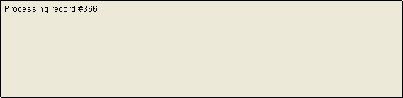
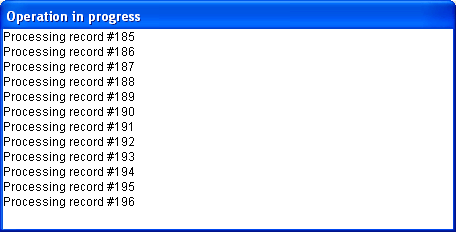

<!--REF #_command_.MESSAGE.Syntax-->**MESSAGE** ( *mensagem* )<!-- END REF-->
<!--REF #_command_.MESSAGE.Params-->
| Parâmetro | Tipo |  | Descrição |
| --- | --- | --- | --- |
| mensagem | Text | &#8594;  | Mensagem a exibir |

<!-- END REF-->

#### Descrição 

<!--REF #_command_.MESSAGE.Summary-->O comando **MESSAGE** geralmente se utiliza para informar ao usuário sobre alguma atividade.<!-- END REF--> Mostra *mensagem* na tela em uma janela de mensagem especial que se abre e fecha cada vez que chamar a **MESSAGE**, a menos que trabalhe com uma janela que abriu previamente utilizando [Open window](open-window.md) (ver detalhes abaixo). A mensagem é temporária e é apagada assim que um formulário for exibido ou o método parar de executar. Se outra **MESSAGE** for executada, a mensagem antiga é apagada.

Se abrir uma janela com [Open window](open-window.md), todas as chamadas a **MESSAGE** mostram as mensagens nessa janela. A janela se comporta como um terminal:

* As mensagens sucessivas não apagam as mensagens anteriores quando são mostradas na janela, são concatenadas em mensagens existentes.
* Se uma mensagem for mais larga que a janela, 4D insere automaticamente um retorno a linha.
* Se uma mensagem tiver mais linhas que a janela, 4D automaticamente desce a página.
* Para controlar quebras de linha, inclua retornos de carro — **Char(13)** — em sua mensagem.
* Para exibir o texto em um lugar específico da janela, chame [GOTO XY](goto-xy.md).
* Para apagar os conteúdos da janela, chame [ERASE WINDOW](erase-window.md).
* A janela é apenas uma janela de output e não se redesenha quando outras janelas forem colocadas sobre ela.
* Pode modificar a fonte e tamanho dos caracteres na janela através da página "Interface" nas Preferências de Banco de Dados.

**Nota:** **MESSAGE** é compatível com o comando [Open form window](open-form-window.md); entretanto, no contexto do segundo parâmetro *\** de [Open form window](open-form-window.md), que salva o tamanho e posição da janela, não é suportado 

#### Exemplo 1 

O exemplo a seguir processa uma seleção de registros e chama MESSAGE para informar ao usuário sobre o progresso da operação: 

```4d
 For($vlRegistro;1;Records in selection([todaTabela]))
    MESSAGE("Processo do registro #"+String($vlRegistro))
  // Fazer algo com o registro
    NEXT RECORD([todaTabela])
 End for
```

A janela a seguir aparece e desaparece cada vez que se chama MESSAGE:



#### Exemplo 2 

Com o objetivo de evitar a janela "piscante", pode mostrar as mensagens em uma janela aberta utilizando [Open window](open-window.md "Open window"), como em este exemplo: 

```4d
 Open window(50;50;500;250;5;"Operação em progresso")
 For($vlRegistro;1;Records in selection([todaTabela]))
    MESSAGE("Processando registro #"+String($vlRegistro))
  // Fazer algo com o registro
    NEXT RECORD([todaTabela])
 End for
 CLOSE WINDOW
```

O resultado é o seguinte (em Windows):


#### Exemplo 3 

Adicionar um retorno de carro melhora a presentação: 

```4d
 Open window(50;50;500;250;5;"Operação em progresso")
 For($vlRegistro;1;Records in selection([todaTabela]))
    MESSAGE("Processando registro #"+String($vlRegistro)+Char(Carriage return))
  // Fazer algo com o registro
    NEXT RECORD([todaTabela])
 End for
 CLOSE WINDOW
```

Este é o resultado (em Windows):



#### Exemplo 4 

Utilizando [GOTO XY](goto-xy.md "GOTO XY") e escrevendo algumas linhas adicionais: 

```4d
 Open window(50;50;500;250;5;"Operação em progresso")
 $vlNbRegistros:=Records in selection([todaTabela])
 $vhStartTime:=Current time
 For($vlRegistro;1;$vlNbRegistros)
    GOTO XY(5;2)
    MESSAGE("Processando registro #"+String($vlRegistro)+Char(Carriage return))
  // Fazer algo com o registro
    NEXT RECORD([todaTabela])
    GOTO XY(5;5)
    $vlResto:=(($vlNbRegistros/$vlRegistro)-1)*(Current time-$vhHoraInicio)
    MESSAGE("Tempo restante estimado: "+Time string($vlResto))
 End for
 CLOSE WINDOW
```

O resultado é o seguinte (em Windows):


#### Ver também 

[CLOSE WINDOW](close-window.md)  
[ERASE WINDOW](erase-window.md)  
[GOTO XY](goto-xy.md)  
[Open window](open-window.md)  

#### Propriedades

|  |  |
| --- | --- |
| Número do comando | 88 |
| Thread-seguro | &cross; |


