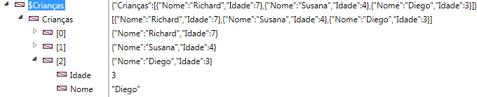

<!--REF #_command_.OB GET ARRAY.Syntax-->**OB GET ARRAY** ( *objeto* ; *propriedade* ; *array* )<!-- END REF-->
<!--REF #_command_.OB GET ARRAY.Params-->
| Parâmetro | Tipo |  | Descrição |
| --- | --- | --- | --- |
| objeto | Object, Campo Object | &#8594;  | Objeto estruturado |
| propriedade | Text | &#8594;  | Nome da propriedade a ler |
| array | Text array, Real array, Boolean array, Object array, Pointer array, Integer array | &#8592; | Array valor da propriedade |

<!-- END REF-->

#### Descrição 

<!--REF #_command_.OB GET ARRAY.Summary-->O comando **OB GET ARRAY** recupera em *array*, o array de valores armazenados na *propriedade* do objeto de linguagem designado pelo parâmetro *objeto*.<!-- END REF-->deve ter sido definido com o comando *C\_OBJECT* ou designar um campo objeto 4D.  
  
No parâmetro *propriedade*, passe a etiqueta da propriedade a ler. Tenha em conta que o parâmetro *propriedade* leva em conta as maiúsculas e minúsculas.

#### Exemplo 1 

Dado um objeto array definido no exemplo do comando [OB SET ARRAY](ob-set-array.md):

  
  
Queremos recuperar estes valores:

```4d
 ARRAY OBJECT($result;0)
 OB GET ARRAY($Children;"Children";$result)
```


#### Exemplo 2 

Queremos mudar um valor no primeiro elemento do array:  
  
```4d
  // Mudar o valor de "age":
 ARRAY OBJECT($refs)
 OB GET ARRAY($refEmployees;"__ENTITIES";$refs)
 OB SET($refs{1};"age";25)
```

#### Ver também 

*Conversões de Tipo entre coleções e arrays 4D*  
[OB SET ARRAY](ob-set-array.md)  

#### Propriedades

|  |  |
| --- | --- |
| Número do comando | 1229 |
| Thread-seguro | &check; |


