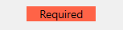

<!--REF #_command_.OBJECT SET CORNER RADIUS.Syntax-->**OBJECT SET CORNER RADIUS** ( {* ;} *objeto* ; *radio* )<!-- END REF-->
<!--REF #_command_.OBJECT SET CORNER RADIUS.Params-->
| Parâmetro | Tipo |  | Descrição |
| --- | --- | --- | --- |
| * | Operador | &#8594;  | Se especificar, objeto é um nome de objeto (cadeia) Se omitir, objeto é uma variável ou um campo |
| objeto | any | &#8594;  | Nome de objeto (se especificar *) ou Campo ou variável (se omitir *) |
| radio | Integer | &#8594;  | Novo rádio de esquinas arredondadas (em píxels) |

<!-- END REF-->

#### Descrição 

<!--REF #_command_.OBJECT SET CORNER RADIUS.Summary-->O comando **OBJECT SET CORNER RADIUS** modifica o rádio das esquinas dos objetos retângulo arredondado cujos nomes passou no parâmetro *objeto*.<!-- END REF--> O novo rádio só se define para o processo e não é guardado no formulário. 

* Pode utilizar este comando com os seguientes objetos de formulário:  
retângulos
* entradas (só projetos 4D)

Ao passar o parâmetro opcional *\** indica que o parâmetro *objeto* é um nome de objeto (cadeia). Se não passar este parâmetro, indica que o parâmetro *objeto* é um campo ou uma variável. Neste caso, se passar uma referência de campo ou variável em lugar de uma cadeia (campo ou variável objeto unicamente). 

**Nota:** na versão atual de 4D, este comando só se aplica aos retângulos arredondados (que são objetos estáticos). Como resultado, só a sintaxe baseada no nome do objeto (usando o parâmetro *\**) é compatível.

No parâmetro *radio*, passe um novo valor do rádio em píxels a aplicar nas esquinas do objeto. Por padrão, este valor é de 5 píxels. 

**Nota:** também pode modificar este valor a nível de formulário utilizando a lista de propriedades (ver   *Nova propriedade Arredondada de esquinas para retângulo arredondado*).

#### Exemplo 1 

Você têm os seguintes retângulos em seu formulário, chamados respectivamente "Rect1" e "Rect2":


Pode executar o seguinte código para mudar seu rádio:

```4d
 OBJECT SET CORNER RADIUS(*;"Rect@";20)
```


#### Exemplo 2 

You have the following text area in your form, named "required-label":



If you execute the following code:

```4d
 OBJECT SET CORNER RADIUS(*;"required-label";10)
```


Note that for text areas (as well as inputs), unlike for rectangles, the corner roundness is drawn outside the initial area of the object.

#### Ver também 

[OBJECT Get corner radius](object-get-corner-radius.md)  

#### Propriedades

|  |  |
| --- | --- |
| Número do comando | 1323 |
| Thread-seguro | &cross; |


