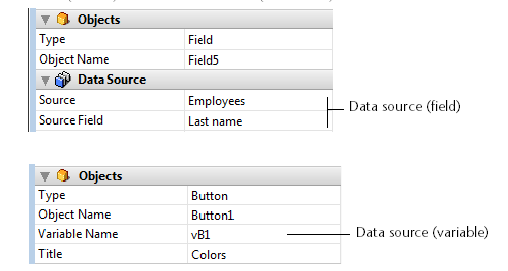

<!--REF #_command_.OBJECT SET DATA SOURCE.Syntax-->**OBJECT SET DATA SOURCE** ( {* ;} *objeto* ; *fonteDados* )<!-- END REF-->
<!--REF #_command_.OBJECT SET DATA SOURCE.Params-->
| Parâmetro | Tipo |  | Descrição |
| --- | --- | --- | --- |
| * | Operador | &#8594;  | Se especificado, objeto é um nome de objeto (cadeia) Se omitido, objeto é um campo ou uma variável |
| objeto | any | &#8594;  | Nome de objeto (se * for especificado) o<br/>Campo ou variável (se * for omitido) |
| fonteDados | Pointer | &#8594;  | Ponteiro a nova fonte de dados do objeto |

<!-- END REF-->

#### Descrição 

<!--REF #_command_.OBJECT SET DATA SOURCE.Summary-->O comando **OBJECT SET DATA SOURCE** modifica a fonte de dados dos objetos designados pelos parâmetros *objeto* e *\** .<!-- END REF-->  
  
Se passar o parâmetro opcional *\** indica que o parâmetro *objeto* é um nome de objeto (cadeia). Se não passar este parâmetro, indica que o parâmetro objeto é um campo ou uma variável. Neste caso, se passar uma referência de campo ou variável no lugar de uma cadeia (campo ou variável objeto unicamente).  
  
A fonte de dados é o campo ou a variável cujo valor é representado pelo objeto quando se executa o formulário. Em modo Desenho, a fonte de dados se define na lista de propriedades, geralmente através das linhas Fonte e Campo fonte (campos) ou Nome de variável (variáveis):



A exceção dos list box (ver mais adiante), todas as fontes de dados do formulário podem ser modificadas por este comando. É responsabilidade do desenvolvedor assegurar a consistência das mudanças realizadas.  
  
En el caso de los list box, se deben tener en cuenta los siguientes puntos:

* Los cambios de fuentes de datos deben tener en cuenta el tipo de list box: por ejemplo, no es posible utilizar un campo como fuente de datos de una columna de en un list box de tipo array.
* Para los list box de tipo selección, no es posible modificar o leer la fuente de datos del objeto list box en sí: ​​en este caso, se trata de una referencia interna y no de una fuente de datos.
* Este comando se utiliza en el contexto de los list box de tipo array. Para los list box de tipo selección, puede en vez utilizar el comando \[[LISTBOX SET COLUMN FORMULA](listbox-set-column-formula.md)

Si este comando se aplica a una fuente de datos que no se puede editar, no hace nada.

#### Exemplo 

Mudança da fonte de dados para uma área de entrada:

```4d
 var $ptrField : Pointer
 $ptrField:=Field(3;2)
 OBJECT SET DATA SOURCE(*;"Input";$ptrField)
```

#### Ver também 

[LISTBOX SET COLUMN FORMULA](listbox-set-column-formula.md)  
[OBJECT Get data source](object-get-data-source.md)  

#### Propriedades

|  |  |
| --- | --- |
| Número do comando | 1264 |
| Thread-seguro | &cross; |


