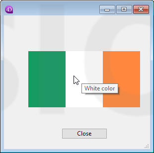

<!--REF #_command_.OBJECT SET HELP TIP.Syntax-->**OBJECT SET HELP TIP** ( {* ;} *objeto* ; *mensagemAjuda* )<!-- END REF-->
<!--REF #_command_.OBJECT SET HELP TIP.Params-->
| Parâmetro | Tipo |  | Descrição |
| --- | --- | --- | --- |
| * | Operador | &#8594;  | Se especificado, objeto é um nome de objeto (cadeia)Se omitido, objeto é uma variável |
| objeto | any | &#8594;  | Nome de objeto (se especificado *) ou Variável (se omitido *) |
| mensagemAjuda | Text | &#8594;  | Conteúdo da mensagem de Ajuda |

<!-- END REF-->

#### Descrição 

<!--REF #_command_.OBJECT SET HELP TIP.Summary-->O comando **OBJECT SET HELP TIP** permite definir ou modificar dinamicamente a mensagem de ajuda associado ao objeto ou aos objetos designados pelos parâmetros *objeto* e *\** para o processo atual.<!-- END REF-->  
  
Passa-se o parâmetro opcional *\**, indica que o parâmetro *objeto* é um nome de objeto (uma cadeia). Se não passa este parâmetro, isto indica que o parâmetro *objeto* é uma variável. Neste caso, se passa uma referencia de variável em lugar de uma cadeia.

Passe o conteúdo da mensagem no parâmetro *mensagemAjuda*. Pode passar:

* uma cadeia de caracteres, por exemplo "Utilize ele / como separador",
* uma cadeia vazia "" para eliminar o mensagem de ajuda,

Quando o formulário executa-se, as mensagens de ajuda aparecem como mensagens de ajuda quando o cursor passa sobre o campo de objeto. Os mensagens de ajuda também podem definir-se utilizando Tips delay e os seletores do comando [SET DATABASE PARAMETER](set-database-parameter.md). 

Quando aparece uma mensagem de ajuda, chamando ao comando **OBJECT SET HELP TIP** se fecha, abre uma nova mensagem no local do mouse e reinicia o contador Tips duration, permitindo o manejo dinâmico das sugestões. 

**Notas:** 

* O conteúdo da mensagem de ajuda também pode ser definida utilizando o editor de formulários (ver *Controles de entrada de dados e ajuda de entrada*) e o editor de estrutura (ver *Propriedades Campo*) em modo Desenho.
* Os conselhos de ajuda podem ser desativados globalmente para a aplicação utilizando o seletor Tips enabled do comando [SET DATABASE PARAMETER](set-database-parameter.md).
  
#### Exemplo 1 

Neste formulário, uma mensagem de ajuda se visualiza e muda dinamicamente quando o mouse passar sobre diferentes partes de um botão de imagem:



```4d
  //Método objeto "myFlag"
 
 var $x;$y;oldX;oldY : Real
 var $left;$right;$top;$bottom : Real
 var $b : Integer
 var $tip : Text
 var oldTip : Text
 var $doRefresh : Boolean
 
 Case of
    :(FORM Event=On Load)
       oldTip:=""
       SET DATABASE PARAMETER(Tips enabled;1) //Para ter certeza que os conselhos estão habilitados
       SET DATABASE PARAMETER(Tips delay;0) // Sugestão mostrada imediatamente ao deter o mouse
       SET DATABASE PARAMETER(Tips duration;60*10) // 10 segundos máximo de visualização
    :(FORM Event=On Mouse Move)
       MOUSE POSITION($x;$y;$b)
       OBJECT GET COORDINATES(*;"myFlag";$left;$top;$right;$bottom)
       $x:=$x-$left
       $y:=$y-$top
       Case of //cada parte da bander é de 76 píxels
          :($x<76)
             $tip:="Green color"
          :($x<152)
             $tip:="White color"
          Else
             $tip:="Orange color"
       End case
 
       $doRefresh:=($tip#oldtip) //true se a mensagem for diferente
       If(Not($doRefresh)) //os mesmos conteúdos
          $doRefresh:=((Abs($x-oldX)>30)|(Abs($y-oldY)>30)) //true se mover o  cursor
       End if
 
       If($doRefresh) //mostrar outra mensagem
          OBJECT SET HELP TIP(*;"myFlag";$tip)
          oldX:=$x
          oldY:=$y
          oldTip:=$tip
       End if
 
 End case
```

#### Exemplo 2 

Se tiver um list box, "Commands List", que contenha uma lista e quiser definir uma mensagem de ajuda que mostre a descrição de cada elemento de lista. A descrição se encontra na tabela \[Documentation\]. 

```4d
 var $mouseX;$mouseY;$mouseZ : Real
 var $col;$row : Integer
 
 Case of
 
    :(FORM Event=On Mouse Enter)
 
       SET DATABASE PARAMETER(Tips delay;1) // faz com que a mensagem apareça rapidamente
 
    :(FORM Event=On Mouse Move)
 
  //#1 : encontra a fila que se se moveu
 
       MOUSE POSITION($mouseX;$mouseY;$mouseZ)
       LISTBOX GET CELL POSITION(*;"Commands List";$mouseX;$mouseY;$col;$row)
 
  //#2 : configure a mensagem de ajuda correspondente
 
       If($row#0)
          GOTO SELECTED RECORD([Documentation];$row)
          OBJECT SET HELP TIP(*;"Commands List";[Documentation]Description) // A descrição completa se utilizará como "mensagem de ajuda" quando (se) o mouse deixar de se mover.
       End if
 
    :(FORM Event=On Mouse Leave)
 
       SET DATABASE PARAMETER(Tips delay;3) // faz com que a mensagem apareça normalmente
 
 End case
```

O resultado é...


#### Ver também 

[OBJECT Get help tip](object-get-help-tip.md)  
[SET DATABASE PARAMETER](set-database-parameter.md)  

#### Propriedades

|  |  |
| --- | --- |
| Número do comando | 1181 |
| Thread-seguro | &cross; |


