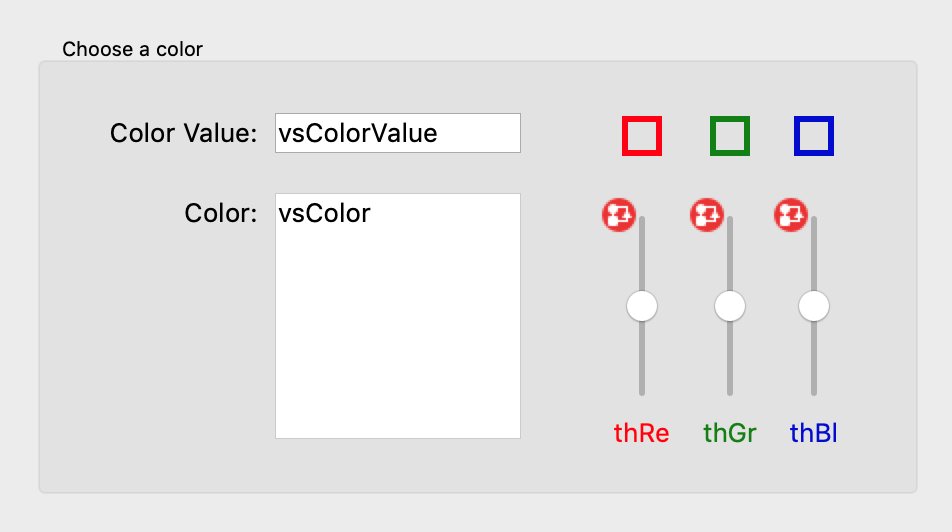
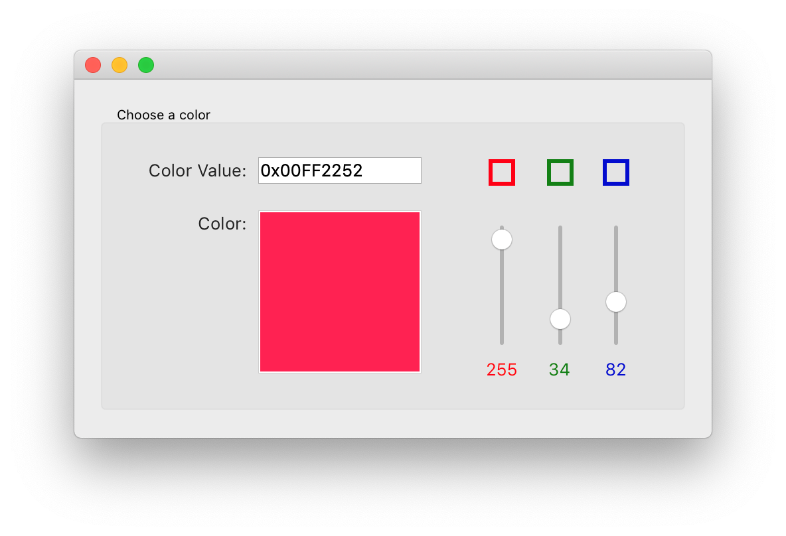
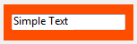

<!--REF #_command_.OBJECT SET RGB COLORS.Syntax-->**OBJECT SET RGB COLORS** ( {* ;} *objeto* ; *corPrimeiroPlano* {; *corFundo* {; *corFundoAlternativo*}} )<!-- END REF-->
<!--REF #_command_.OBJECT SET RGB COLORS.Params-->
| Parâmetro | Tipo |  | Descrição |
| --- | --- | --- | --- |
| * | Operador | &#8594;  | se especificado, objeto é um nome de objeto (string), se omitido, objeto é um campo ou uma variável |
| objeto | any | &#8594;  | Nome de objeto (se* é especificado) ou Campo ou Variável (se * é omitido) |
| corPrimeiroPlano | Text, Integer | &#8594;  | Valor de cor RGB para a cor de Primeiro Plano |
| corFundo | Text, Integer | &#8594;  | Valor RGB da cor de Fundo |
| corFundoAlternativo | Text, Integer | &#8594;  | Valor RGB da cor de fundo alternativa |

<!-- END REF-->

#### Descrição 

<!--REF #_command_.OBJECT SET RGB COLORS.Summary-->O comando OBJECT SET RGB COLORS modifica as cores de fundo e primeiro plano dos objetos especificados por objeto e o parâmetro opcional \*.<!-- END REF--> Quando o comando é aplicado a um objeto list box, um parâmetro adicional lhe permite modificar a cor alternativa das filas.

  
Se passa o parâmetro opcional \*, indica que o parâmetro objeto é um nome de objeto (string). Se não passa este parâmetro, indica que o parâmetro objeto é um campo ou uma variável. Neste caso, não passe uma referência de campo ou de variável ao invés de uma string. Para maior informação sobre nomes de objetos, consulte a seção *Propriedades dos objetos*  
  
O parâmetro opcional corFundoAlt lhe permite definir uma cor alternativa para o fundo das linhas pares. Este parâmetro só é utilizado quando o objeto é especificado como List box ou coluna de List box. Quando é utilizado este parâmetro, o parâmetro corFundo é utilizado para as linhas ímpares unicamente. A utilização de cores alternativos faz com que as listas sejam mais fáceis de ler.   
  
Se objeto especifica um objeto List box, as cores alternativas são utilizadas em todo o List box. Se objeto especifica uma coluna da List box, só a coluna utilizará as cores definidas.

**Definição de cores**

Os valores das cores RGB são indicados nos parâmetros *corPrimeirpoPlano*, *corFundo* e *corFundoAlt*. Os formatos abaixo são compatíveis:

| **Nombre del formato<br/>** | **Tipo**      | **Descripción**                                                                                                                                                                                                                                                                                                                                                                                                                                       | **Ejemplos**                                                                                     |
| ----------------------------------- | ------------- | ----------------------------------------------------------------------------------------------------------------------------------------------------------------------------------------------------------------------------------------------------------------------------------------------------------------------------------------------------------------------------------------------------------------------------------------------------- | ------------------------------------------------------------------------------------------------ |
| CSS color name                      | Texto         | Nome de cor CSS2 padrão. A lista de nomes disponíveis pode ser encontrada em vários lugares na web, por exemplo, em [htmlcolorcodes.com](https://htmlcolorcodes.com/color-names/).<br/> Utiliza "transparente" para definir a transparencia no fundo (só pode ser utilizada com os parâmetros *corFundo* e *corFundoAlt*). Utiliza "" (string vazia) em *corPrimeiroPlano* ou *corFundo* para deixá-lo sem mudanças                           | "red", "cyan", "lightblue"                                                                       |
| CSS color "#rrggbb" syntax          | Texto         | Código de cor hexadecimal CSS2 padrão: rr = componente vermelho da cor gg = componente verde da cor bb = componente azul da cor                                                                                                                                                                                                                                                                                                                       | "#ff0000", "#00FFFF", "#ADD8E6"                                                                  |
| CSS color "rgb(r,g,b)" syntax       | Texto         | Código de cor rgb CSS2 padrão: r = componente vermelho da cor (0...255) g = componente verde da cor (0...255) b = componente azul da cor (0...255)                                                                                                                                                                                                                                                                                                    | "rgb(255,255,0)", "rgb(255,0,0)"                                                                 |
| 4-byte RGB value                    | Inteiro longo | Entero largo de 4 bytes (formato 0x00rrggbb). Valores hexadecimales:<br/> rr = componente vermelho da cor gg = componente verde da cor bb = componente azul da cor                                                                                                                                                                                                                                                                            | 0x00000000, 0x00FF7F7F                                                                           |
| 4D "system" color constant          | Entero largo  | Cores utilizadas por 4D para desenhar objetos com cores automáticas. Constantes disponíveis (do tema *DEFINIR CORES RVA*):<br/> Background color Background color none (só pode ser utilizada com os parâmetros *corFundo* e *corFundoAlt*) Dark shadow color Disable highlight item color Foreground color Highlight menu background color Highlight menu text color Highlight text background color Highlight text color Light shadow color | **Nota:** *as cores automáticas dependem de sistema e do tipo de objeto ao qual são atribuídos.* |

#### Exemplo 1 

Este formulário contém duas variáveis editáveis, *vsCorValor* e *vsCor* assim como três barras termômetros: *thVermelho*, *thVerde*, e *thAzul*.



Estes são os métodos destes objetos:

```4d
  // Método de objeto da variável não editável vsCorValor
 Case of
    :(FORM Event=On Load)
       vsCorValor:="0x00000000"
 End case
 
  // Método de objeto da variável não editável vsCor
 Case of
    :(FORM Event=On Load)
       vsColor:=""
       OBJECT SET RGB COLORS(vsCor;0x00FFFFFF;0x0000)
 End case
 
  // Método de objeto do termômetro thVermelho
 CLIQUE no TERMÔMETRO DE COR
  // Método de objeto do termômetro thVerde
 CLIQUE EM TERMOMETRO DE COR
 
  // Método de objeto do termômetro thAzul
 CLIQUE EM TERMOMETRO DE COR
```

O método de projeto chamado pelos três termômetros é:

```4d
  // Método de projeto CLIQUE EM TERMOMETRO DE COR
 OBJECT SET RGB COLORS(vsCor;0x00FFFFFF;(thVermelho<<&NBSP;16)+(thVerde&NBSP;<<&NBSP;8)+thAzul)
 vsCorValor:=String((thVermelho<< 16)+(thVerde << 8)+thAzul;" & x")
 If(thVermelho=0)
    vsCorValor:=Substring(vsCorValor;1;2)+"0000"+Substring(vsCorValor;3)
 End if
```

Note a utilização dos *Bitwise operators* para o cálculo dos valores das cores a partir dos valores dos termômetros.

Em execução, o formulário se vê assim:



#### Exemplo 2 

Muda o fundo transparente com uma cor de fonte clara:



```4d
 OBJECT SET RGB COLORS(*;"myVar";Light shadow color;Background color none)
```


#### Ver também 

[OBJECT GET RGB COLORS](object-get-rgb-colors.md)  
[Select RGB Color](select-rgb-color.md)  

#### Propriedades

|  |  |
| --- | --- |
| Número do comando | 628 |
| Thread-seguro | &cross; |


