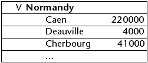

<!--REF #_command_.OBJECT SET SCROLL POSITION.Syntax-->**OBJECT SET SCROLL POSITION**   ( * ; *objeto* {; *posiçao* {; *hPosicao*}}{; *} )<!-- END REF-->
<!--REF #_command_.OBJECT SET SCROLL POSITION.Params-->
| Parâmetro | Tipo |  | Descrição |
| --- | --- | --- | --- |
| * | Operador | &#8594;  | Se especificado, objeto é um nome de objeto (string), se omitido, objeto é uma variável |
| objeto | any | &#8594;  | Nome de objeto (se* é especificado) ou Tabela ou Campo ou Variável (se * é omitido) |
| posiçao | Integer | &#8594;  | Número da fila a selecionar ou rolagem vertical em pixels (imagens) |
| hPosicao | Integer | &#8594;  | Número de coluna a exibir (list box) ou rolagem horizontal em pixels (imagens) |
| * | Operador | &#8594;  | Exibição da linha (e coluna se parâmetro hPosição é passada) na primeira posição após rolagem. |

<!-- END REF-->

#### Descrição 

<!--REF #_command_.OBJECT SET SCROLL POSITION.Summary-->O comando OBJECT SET SCROLL POSITION permite deslocar o conteúdo de vários tipos de objetos: linhas de um subformulário, de um formulário listado mostrado utilizando os comandos [MODIFY SELECTION](modify-selection.md), [DISPLAY SELECTION](display-selection.md) ou de uma lista hierárquica, linhas e colunas de um list box ou inclusive os píxels de uma imagem.<!-- END REF-->  
  
**Nota:** O deslocamento por programação de um objeto continua sendo possível inclusive se as barras de deslocamento estão ocultas no formulário.  
  
Se passa o parâmetro opcional *\**, indica que o parâmetro *objeto* é um nome de objeto de um subformulário, uma lista hierárquica, um list box ou campo/variável imagem (neste caso, passe uma cadeia em *objeto*). Se não passa este parâmetro, indica que o parâmetro *objeto* é uma tabela (tabela de formulário listado ou de subformulário) ou de uma variável (ListRef de lista hierárquica, list box ou imagem) ou um campo.

O parâmetro *posiçao* permite indicar o número da linha a mostrar ou no caso de uma imagem, a rolagem vertical a ser aplicada. 

 Se não passa o parâmetro *posiçao*, o comando provoca a rolagem vertical das línhas da lista de maneira que a primeira línha selecionada na lista seja visível. Se nenhuma linha está selecionada ou se ao menos uma selecionada já for visível, o comando não faz nada.

Se passa este parâmetro, o comando provoca a rolagem vertical das línhas da lista de maneira que a línha selecionada seja visível (selecionada ou não). Se a línha já for visível, o comando não faz nada, exceto se passa o segundo parâmetro *\** (ver a continuação). 

* Para os formulários listados e os subformulários, este número corresponde ao número de um registro na seleção atual, ou seja sua posição.
* No caso de listas hierárquicas, o comando considera o estado expandido/contraído dos elementos.
* Para os list box, este número corresponde ao número da línha entre todas as línhas do objeto (incluindo as línhas ocultas). Se o número passado em *posição* corresponde a uma linha oculta no listbox, o comando mostra a primeira línha visível seguinte.  
**Nota**: lembre que este comando é baseado sempre na representação padrão (não hierárquica) de um listbox, mesmo que se for mostrada em modo hierárquico. Portanto, o resultado pode variar dependendo de se a listbox é mostrada em modo comum ou hierárquico (ver exemplo).
* Para imagens mostradas no formulário, *posiçãoLinha* indica a rolagem vertical a aplicar a imagem. Passe 0 em *posiçãoLinha* para não rolar a imagem na dimensão vertical. O valor deve ser expresso em píxels relativos a origem da imagem em seu contexto local. Se o ponto de coordenada vertical já é visível no objeto, o comando não faz nada (exceto quando passa o segundo parâmetro *\** ver mais à frente). A imagem deve ser mostrado no formato "Imagem truncada (não centrada)".
O parâmetro *posiçãoH* pode ser utilizado no contexto de uma list box ou uma imagem. 
* Para os list boxes, pode passar um número de coluna em *posiçaoH*. A execução do comando provocará a rolagem horizontal da list box de maneira que esta coluna seja visível. Se a coluna já for visível, o comando não faz nada. Como para a rolagem vertical, se passa o segundo parâmetro opcional *\**, a coluna se torna visível para o comando (se o list box é deslocado) será localizado na primeira posição (ver a continuação).
* Para uma imagem mostrada em um formulario, *posiçaoH* indica o deslocamento horizontal a aplicar a imagem. O valor deve ser expresso em píxels em relação a origem da imagem em seu contexto local (exceto quando passa o segundo parâmetro *\** ver mais a frente)..

Se passa o segundo parâmetro opcional *\**: 

* A linha que ficou visível utilizando o comando (se a lista se deslocou) se localizará na primeira posição da lista. Se a linha se localiza ao final da lista, esta opção não tem efeito.
* No contexto de uma imagem, as coordenadas demandadas serão posicionadas na origem da variável imagem (0,0), inclusive se as coordenadas já são visíveis no objeto.

**Nota:** O comando [HIGHLIGHT RECORDS](highlight-records.md) tem um parâmetro opcional *\** que permite delegar a gestão de rolagem nos formulários ao comando OBJECT SET SCROLL POSITION . 

#### Exemplo 1 

Este exemplo ilustra a diferença de funcionamento do comando com um list box mostrado em modo padrão e hierárquico:

```4d
 OBJECT SET SCROLL POSITION(*;"mylistbox";4;2;*) // mostrar na primeira posição a quarta línha e a quarta línha e a segunda coluna
```

Se esta instrução se aplica a um list box mostrado em modo padrão:


... as línhas e as colunas da list box se deslocam:


Por outra parte, se a mesma instrução se aplica ao list box mostrado em modo hierárquico, as línhas se deslocam mas não as colunas porque a segunda coluna faz parte da hierarquia:



#### Exemplo 2 

Você quer se deslocar por uma imagem que é incluída em uma variável de formulário. Esta montagem mostra a parte visível da imagem, assim como o ponto a mostrar (166 pixels verticalmente e 200 pixels horizontalmente):


Para se deslocar pela parte visível e mostrar o ponto vermelho a origem da variável imagem, pode escrever: 

```4d
 OBJECT SET SCROLL POSITION(*;"myVar";166;200;*)
```

A continuação, se obtém o seguinte resultado: 


Tenha a certeza de não omitir o segundo parâmetro *\** neste caso, caso contrário a imagem não será deslocada porque o ponto definido já é mostrado.

#### Ver também 

[ LISTBOX SELECT ROW ](listbox-select-row.md)  
[HIGHLIGHT RECORDS](highlight-records.md)  
[OBJECT GET SCROLL POSITION](object-get-scroll-position.md)  

#### Propriedades

|  |  |
| --- | --- |
| Número do comando | 906 |
| Thread-seguro | &cross; |


