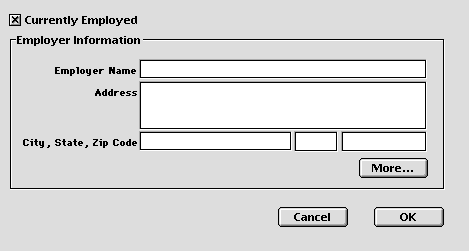

<!--REF #_command_.OBJECT SET VISIBLE.Syntax-->**OBJECT SET VISIBLE** ( {* ;} *objeto* ; *visivel* )<!-- END REF-->
<!--REF #_command_.OBJECT SET VISIBLE.Params-->
| Parâmetro | Tipo |  | Descrição |
| --- | --- | --- | --- |
| * | Operador | &#8594;  | se especificado, objeto é um nome de objeto (string), se omitido, objeto é um campo ou uma variável |
| objeto | any | &#8594;  | Nome de objeto (se* é especificado) ou Campo ou Variável (se * é omitido) |
| visivel | Boolean | &#8594;  | True para visível, False para invisível |

<!-- END REF-->

#### Descrição 

<!--REF #_command_.OBJECT SET VISIBLE.Summary-->O comando OBJECT SET VISIBLE mostra ou oculta os objetos especificados por *objeto*.<!-- END REF-->

Se passa o parâmetro opcional *\**, indica que o parâmetro *objeto* é um nome de objeto (string). Se não passa este parâmetro, indica que o parâmetro *objeto* é um campo ou uma variável. Neste caso, é passada uma referência de campo ou variável (campo ou variável objeto unicamente) ao invés de um string.Para mais informações sobre nomes de objetos, consulte a seção 

Se passa *visível* igual a [TRUE](true.md "TRUE"), os objetos são mostrados. Se passa *visível* igual a [FALSE](false.md "FALSE"), os objetos são ocultados. 

#### Exemplo 

Este é um formulário típico no ambiente Desenho:


Os objetos na área de grupo **Informação do empregador** cada um tem um nome de objeto que contêm a expressão “empregador” (incluindo a área de grupo). Quando a caixa de seleção **Empregado atualmente**  está selecionada, os objetos devem ser visíveis; quando a caixa não está selecionada, os objetos devem ser invisíveis.   
Este é o método de objeto da caixa de seleção:

```4d
 &NBSP;&NBSP; // Método de objeto de Caixa de seleção cbEmpregadoAtualmente
 Case of
    :(FORM Event=On Load)
       cbEmpregadoAtualmente:=1
 
    :(FORM Event=On Clicked)
  // Ocultar ou mostrar todos os objetos cujo nome contem "emp"
       OBJECT SET VISIBLE(*;"@emp@";cbEmpregadoAtualmente&NBSP;#&NBSP;0)
  // Mas sempre conservar a caixa de seleção visível
       OBJECT SET VISIBLE(cbEmpregadoAtualmente;True)
 End case
```

Portanto, em execução, o formulário se vê dessa maneira:



ou:


#### Ver também 

[OBJECT Get visible](object-get-visible.md)  
[OBJECT SET ENTERABLE](object-set-enterable.md)  

#### Propriedades

|  |  |
| --- | --- |
| Número do comando | 603 |
| Thread-seguro | &cross; |


