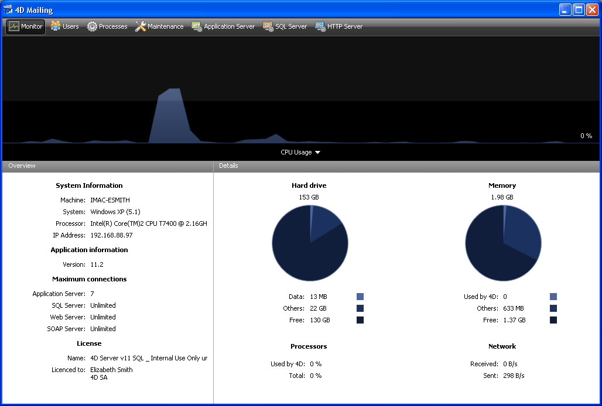

<!--REF #_command_.OPEN ADMINISTRATION WINDOW.Syntax-->**OPEN ADMINISTRATION WINDOW**<!-- END REF-->
<!--REF #_command_.OPEN ADMINISTRATION WINDOW.Params-->
| Este comando não requer parâmetros |  |
| --- | --- |

<!-- END REF-->

#### Descrição 

<!--REF #_command_.OPEN ADMINISTRATION WINDOW.Summary-->O comando OPEN ADMINISTRATION WINDOW exibe a janela de administração do servidor no equipo que executa.<!-- END REF--> A janela de administração 4D Server pode ser usada para visualizar os parâmetros atuais e realizar diversas operações de manutenção (veja a Guia de Referência 4D Server). Começando com a versão 11 do 4D Server, essa janela pode ser exibida a partir de uma máquina cliente: 



Este comando deve ser chamado no contexto de uma aplicação 4D conectado ou de um 4D Server. Ele não faz nada se:

* ele é chamado em uma aplicação 4D em modo local.
* ele é executado por um usuário diferente do Designer ou do administrador (neste caso, o erro -9991 é gerado, ver a seção *Erros do Motor de banco de dados (-10602 -> 4004)*).

#### Exemplo 

Aqui está o código para o botão de administração:

```4d
 If(Application type=4D local mode)
    OPEN SECURITY CENTER
  // ...
 End if
 If(Application type=4D remote mode)
    OPEN ADMINISTRATION WINDOW
  // ...
 End if
 If(Application type=4D Server)
  // ...
    OPEN SECURITY CENTER
 End if
```

#### Variáveis e conjuntos do sistema 

Se o comando foi executado corretamente, a variável de sistema OK é definida como 1\. Caso contrário, é definido como 0.

#### Ver também 

[OPEN SECURITY CENTER](open-security-center.md)  

#### Propriedades

|  |  |
| --- | --- |
| Número do comando | 1047 |
| Thread-seguro | &cross; |
| Modificar variáveis | OK, error |


