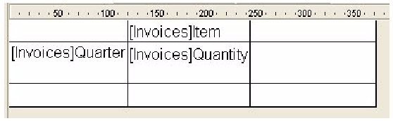

<!--REF #_command_.QR SET INFO COLUMN.Syntax-->**QR SET INFO COLUMN** ( *area* ; *numColuna* ; *titulo* ; *objeto* ; *ocultar* ; *tamanho* ; *valoresRepetidos* ; *formato* )<!-- END REF-->
<!--REF #_command_.QR SET INFO COLUMN.Params-->
| Parâmetro | Tipo |  | Descrição |
| --- | --- | --- | --- |
| area | Integer | &#8594;  | Referência da área |
| numColuna | Integer | &#8594;  | Nº da coluna |
| titulo | Text | &#8594;  | Título da coluna |
| objeto | Field, Variable | &#8594;  | Objeto atribuido a coluna |
| ocultar | Integer | &#8594;  | 0=exibir, 1=ocultar |
| tamanho | Integer | &#8594;  | Tamanho da coluna |
| valoresRepetidos | Integer | &#8594;  | 0=não repetido, 1= repetido |
| formato | Text | &#8594;  | Formatação dos dados |

<!-- END REF-->

#### Descrição 

<!--REF #_command_.QR SET INFO COLUMN.Summary-->##### List mode 

O comando QR SET INFO COLUMN permite definir os parâmetros de uma coluna existente.<!-- END REF-->  
  
*area* é a referência da área do relatório rápido.  
  
*numColuna* é o número da coluna a definir.  
  
*titulo* é o título que será mostrado no cabeçalho da coluna.  
  
*objeto* é o objeto da coluna (variável, campo ou fórmula).  
  
*oculta* especifica se a coluna é visível ou está oculta:  

* se *oculta* é igual a 1, a coluna está oculta;
* se *oculta* é igual a 0, a coluna é mostrada.
*tamanho* é o tamanho em píxels a atribuir para coluna. Se *tamanho* for igual a -1, o tamanho da coluna é automático.  
  
*valoresRepetidos* indica o estado da propriedade de repetição de dados. Por exemplo, se o valor de um campo ou variável não muda de um registro a outro, é possível repeti-lo ou não em cada linha da coluna.  
  
 • Se *valoresRepetidos* for igual a 0, os valores não são repetidos.  
• Se *valoresRepetidos* for igual a 1, os valores são repetidos.  
  
*formato* é o formato de saída. Os formatos de saída são os formatos 4D compatíveis com os dados mostrados na coluna.  
  
 A seguinte instrução define o título para a coluna #1, o conteúdo do Campo2, faz com que a coluna seja visível com uma largura de 150 píxels e define o formato de saída ###.##.  

```4d
 QR SET INFO COLUMN(area;1;"Titulo";"[Tabela 1]Campo2";0;150;0;"###,##")
```

##### Relatório de tabela cruzada 

O comando QR SET INFO COLUMN permite definir globalmente os mesmos parâmetros mas a referencia das áreas as quais aplica é diferente e varia dependendo do parâmetro que queira definir.  
  
Além disso, os parâmetros *titulo, oculto*, e *valoresRepetidos* não se utilizam quando este comando se utiliza em relatórios tabelas cruzadas. O valor a utilizar em *numColuna* varia dependendo se deseja definir o tamanho da coluna ou a fonte de dados e o formato de visualização.  
  
 \* Tamanho da coluna  
  
Este é um atributo “visual”, portanto as colunas são numeradas de esquerda a direita, como se mostra na seguinte imagem:  
  
  
  
O seguinte método define o tamanho automático para todas as colunas em relatório tabelas cruzadas e deixa os outros elementos intactos:  

```4d
 For($i;1;3)
    &NBSP;QR GET INFO COLUMN(qr_area;$i;$titulo;$obj;$oculta;$tamanho;$rep;$format)
    QR SET INFO COLUMN(qr_area;$i;$titulo;$obj;$oculta;0;$rep;$format)
    &NBSP;End for
```

  
Notará que como queira modificar unicamente o tamanho da coluna, deve utilizar o comando [QR GET INFO COLUMN](qr-get-info-column.md "QR GET INFO COLUMN") para recuperar as propriedades atuais da coluna e passá-la a QR SET INFO COLUMN com o objetivo de conservá-la intacta, exceto pelo tamanho da coluna.  
  
 \* Fonte de dados (objeto) e formato de visualização  
  
Neste caso a numeração das colunas é realizada da seguinte maneira:  
 

Notará que não é possível direcionar todas as células utilizando o comando QR SET INFO COLUMN, as células que não são numeradas acima são direcionadas utilizando [QR SET TOTALS DATA](qr-set-totals-data.md "QR SET TOTALS DATA").

O código a seguir atribui as fontes de dados às três células necessárias para a criação de um relatório tabela cruzada simples:

```4d
 QR SET REPORT TABLE(qr_area;Table(->[Faturas]))
 ALL RECORDS([Faturas])
 QR SET REPORT KIND(qr_area;2)
 QR SET INFO COLUMN(qr_area;1;"";->[Faturas]Elemento;1;-1;1;"")
 QR SET INFO COLUMN(qr_area;2;"";->[Faturas]Data;1;-1;1;"")
 QR SET INFO COLUMN(qr_area;3;"";->[Faturas]Quantidade;1;-1;1;"")
```

  
Se gera a seguinte área de relatório:  
  
  
  
Se passa um número de *area* inválido, se gera o erro -9850.  
Se o parâmetro *numColuna* for incorreto, se gera o erro -9852.

#### Ver também 

[QR GET INFO COLUMN](qr-get-info-column.md)  
[QR Get info row](qr-get-info-row.md)  
[QR SET INFO ROW](qr-set-info-row.md)  

#### Propriedades

|  |  |
| --- | --- |
| Número do comando | 765 |
| Thread-seguro | &cross; |
| Modificar variáveis | error |


