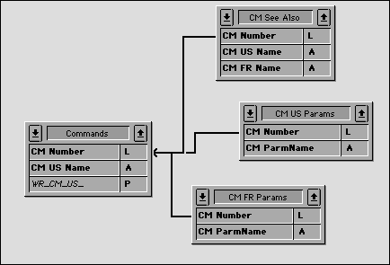

<!--REF #_command_.RECEIVE RECORD.Syntax-->**RECEIVE RECORD** {( *tabela* )}<!-- END REF-->
<!--REF #_command_.RECEIVE RECORD.Params-->
| Parâmetro | Tipo |  | Descrição |
| --- | --- | --- | --- |
| tabela | Table | &#8594;  | Tabela na qual receber o registro, ou tabela padrão, se omitido |

<!-- END REF-->

#### Descrição 

<!--REF #_command_.RECEIVE RECORD.Summary-->RECEIVE RECORD recebe um registro na *tabela* a partir da porta serial ou documento aberto pelo comando [SET CHANNEL](set-channel.md "SET CHANNEL").<!-- END REF--> O registro deve ter sido enviado com [SEND RECORD](send-record.md "SEND RECORD"). Quando você executa RECEIVE RECORD, um novo registro é criado automaticamente para a tabela. Se o registro for recebido corretamente, você deve então usar [SAVE RECORD](save-record.md "SAVE RECORD") para gravar o novo registro.

O registro completo é recebido. Isso significa que imagens e armazenados em BLOBs ou com o registro também são recebidos.

**Importante:** Quando os registros estão sendo enviados e recebidos através de [SEND RECORD](send-record.md "SEND RECORD") e RECEIVE RECORD, a estrutura da tabela de origem e a estrutura da tabela de destino devem ser compatíveis. Se não forem, 4D irá converter valores de acordo com as definições de tabela quando RECEIVE RECORD for executado.

**Notas:**

1. Se você receber um registro de um documento utilizando este comando, o documento deve ter sido aberto usando o comando [SET CHANNEL](set-channel.md "SET CHANNEL"). Você não pode usar RECEIVE RECORD com um documento aberto com [Open document](open-document.md "Open document"), [Append document](append-document.md "Append document") ou [Create document](create-document.md "Create document").
2. Durante a execução de RECEIVE RECORD, o usuário pode interromper a recepção pressionando Ctrl-Alt-Shift (Windows) ou Command + Option + Shift (Macintosh). Esta interrupção gera um erro -9994, que você pode pegar com um método de tratamento de erros instalado usando [ON ERR CALL](on-err-call.md "ON ERR CALL"). Normalmente, você só precisa manipular a interrupção de uma recepção ao comunicar-se através de uma porta serial.

#### Exemplo 

O uso combinado de [SEND VARIABLE](send-variable.md "SEND VARIABLE"), [SEND RECORD](send-record.md "SEND RECORD"), [RECEIVE VARIABLE](receive-variable.md "RECEIVE VARIABLE") e RECEIVE RECORD é ideal para arquivar dados ou de intercâmbio de dados entre bancos de dados idênticos de usuários únicos utilizado em diferentes lugares. Você pode trocar dados entre bancos de dados 4D usando o comando de importação/exportação, como [EXPORT TEXT](export-text.md "EXPORT TEXT") e [IMPORT TEXT](import-text.md "IMPORT TEXT"). No entanto, se os dados contém gráficos e/ou tabelas relacionadas, usar [SEND RECORD](send-record.md "SEND RECORD") e RECEIVE RECORD é muito mais conveniente.

Por exemplo, considere um sistema de documentação baseado em 4D e 4D Write. Uma vez que vários escritores em diferentes locais de trabalho trabalhem sobre sobre ela, precisamos de uma maneira simples de troca de dados entre diferentes bases de dados. Aqui está uma visão simplificada da estrutura de banco de dados:

 

A tabela *\[Comandos\]* contém a descrição de cada comando ou tópico. As tabelas *\[CM EUA Params\]* e *\[CM FR Params\]* contem, respectivamente a lista de parâmetros para cada comando em Inglês e em Francês. A tabela *\[CM See Also\]* contém os comandos listados como referência (ver também seção) para cada comando. Troca de documentação entre bancos de dados, portanto, consiste em enviar os registros de *\[Comandos\]* e seus registros relacionados. Para isso, usamos [SEND RECORD](send-record.md "SEND RECORD") e RECEIVE RECORD. Além disso, usamos [SEND VARIABLE](send-variable.md "SEND VARIABLE") e [RECEIVE VARIABLE](receive-variable.md "RECEIVE VARIABLE") de forma a marcar o documento de importação/exportação com tags.

Aqui está o método de projeto (simplificado) para a exportação de documentação:

```4d
  // Método de projeto CM_EXPORT_SEL
  // Este método funciona com a seleção atual da tabela [Comandos]
 
 SET CHANNEL(12;"") // Permite ao usuário criar um documento de canal aberto
 If(OK=1)
  // Etiqueta o documento com uma variável que indica o seu conteúdo
  // Nota: a variável de processo BUILD_LANG indica se os dados foram enviados em US (Inglês) ou FR (francês)
    $vsTag:="4DV6COMMAND"+BUILD_LANG
    SEND VARIABLE($vsTag)
  // Envia uma variável indicando quantos [Comandos] são enviados
    $vlNbCmd:=Records in selection([Commands])
    SEND VARIABLE($vlNbCmd)
    FIRST RECORD([Commands])
  // Para cada comando
    For($vlCmd;1;$vlNbCmd)
  // Envia o registro de [Comandos]
       SEND RECORD([Comands])
  // Seleciona todos os registros relacionados
       RELATE MANY([Commands])
  // Dependendo do idioma, envia uma variável indicando
  // o número de parâmetros que se seguirão
       Case of
          :(BUILD_LANG="US")
             $vlNbParm:=Records in selection([CM US Params])
          :(BUILD_LANG="FR")
             $vlNbParm:=Records in selection([CM FR Params])
       End case
       SEND VARIABLE($vlNbParm)
  // Envie os registros de parâmetro (se houver)
       For($vlParm;1;$vlNbParm)
          Case of
             :(BUILD_LANG="US")
                SEND RECORD([CM US Params])
                NEXT RECORD([CM US Params])
             :(BUILD_LANG="FR")
                SEND RECORD([CM FR Params])
                NEXT RECORD([CM FR Params])
          End case
       End for
  // Envia uma variável que indica quantos" Veja Também " seguirão
       $vlNbSee:=Records in selection([CM See Also])
       SEND VARIABLE($vlNbSee)
  // Envia os registros [Veja também] (se houver)
       For($vlSee;1;$vlNbSee)
          SEND RECORD([CM See Also])
          NEXT RECORD([CM See Also])
       End for
  // Vá para o próximo registro de [Commands] e continua com a exportação
       NEXT RECORD([Commands])
    End for
    SET CHANNEL(11) // Fechar o documento
 End if
```

Aqui está o método de projeto (simplificado) para a importação da documentação:

```4d
  // Método de projeto CM_IMPORT_SEL
 
 SET CHANNEL(10;"") // Permitimos ao usuário abrir um documento existente
 If(OK=1) // Se um documento estava aberto
    RECEIVE VARIABLE($vsTag) // Tratamos de receber a variável marcada esperada
    If($vsTag="4DV6COMMAND@") // Recebemos a etiqueta correta?
       $CurLang:=Substring($vsTag;Length($vsTag)-1) // Extraímos a linguagem da etiqueta
       If(($CurLang="US")&NBSP;|&NBSP;($CurLang="FR")) // Recebemos uma linguagem válida
          RECEIVE VARIABLE($vlNbCmd) //Quantos comandos existem neste documento?
          If($vlNbCmd>0) // Se existe pelo menos um
             For($vlCmd;1;$vlNbCmd) // Para cada registro [Commands] arquivado
  // Recepção do registro
                RECEIVE RECORD([Commands])
  // Chama uma subrotina que salva o novo registro ou copia seus valores
  // dentro de um registro já existente
                CM_IMP_CMD($CurLang)
  // Recebe o número de parâmetros (se existir)
                RECEIVE VARIABLE($vlNbParm)
                If($vlNbParm>=0)
  // Chama uma subrotina que chama RECEIVE RECORD e salva os novos registros
  // Ou copia-los em registros já existentes
                   CM_IMP_PARM($vlNbParm;$CurLang)
                End if
  // Recebe o número de" Veja Também "(se houver)
                RECEIVE VARIABLE($vlNbSee)
                If($vlNbSee>0)
  // Chama uma subrotina que chama RECEIVE RECORD e salva os novos registros
  // Ou copia-los em registros já existentes
                   CM_IMP_SEEA($vlNbSee;$CurLang)
                End if
             End for
          Else
             ALERT("O número de comandos neste documento de exportação é inválido.")
          End if
       Else
          ALERT("A linguagem deste documento de exportação é desconhecida.")
       End if
    Else
       ALERT("Este documento NÃO é um documento de exportação de comandos.")
    End if
    SET CHANNEL(11) // Fechar documento
 End if
```

Note que nós não testamos a variável OK ao receber os dados, nem tentamos pegar os erros. No entanto, porque armazenamos as variáveis no documento que descreve o documento em si, se essas variáveis, uma vez recebidas, fizerem sentido, a probabilidade de um erro é muito baixa. Se, por exemplo, um usuário abrir um documento errado, o primeiro teste pára a operação imediatamente.

#### Variáveis e conjuntos do sistema 

The OK system variable is set to 1 if the record is received. Otherwise, the OK system variable is set to 0.

#### Ver também 

[RECEIVE VARIABLE](receive-variable.md)  
[SEND RECORD](send-record.md)  
[SEND VARIABLE](send-variable.md)  

#### Propriedades

|  |  |
| --- | --- |
| Número do comando | 79 |
| Thread-seguro | &check; |
| Modificar variáveis | OK, error |


