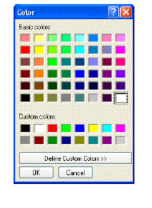
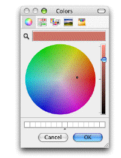

<!--REF #_command_.Select RGB Color.Syntax-->**Select RGB Color** {( *corDefeito* {; *mensagem*} )} : Integer<!-- END REF-->
<!--REF #_command_.Select RGB Color.Params-->
| Parâmetro | Tipo |  | Descrição |
| --- | --- | --- | --- |
| corDefeito | Integer | &#8594;  | Cor RGB pré-selecionada |
| mensagem | Text | &#8594;  | Título da janela de seleção |
| Resultado | Integer | &#8592; | Cor RGB |

<!-- END REF-->

#### Descrição 

<!--REF #_command_.Select RGB Color.Summary-->O comando Select RGB Color mostra a janela sistema de seleção de cor e devolve o valor RGB da cor selecionada pelo usuário.<!-- END REF--> 

A janela sistema de seleção de cor é vista desta maneira:

| **Windows**                                 | **Macintosh**                               |
| ------------------------------------------- | ------------------------------------------- |
|  |  |

O parâmetro opcional *corDefeito* permite pré-selecionar uma cor na janela. Este parâmetro permite por exemplo restaurar por defeito a última cor definida pelo usuário. Passe neste parâmetro um valor de cor formato RGB (para maior informação, consulte a descrição do comando [OBJECT SET RGB COLORS](object-set-rgb-colors.md)). Pode utilizar uma das constantes do tema *DEFINIR CORES RVA*.

Se omitido o parâmetro *corDefeito* ou se passa 0, a cor preta é selecionado ao abrir a caixa de diálogo.

O parâmetro opcional *mensagem* permite personalizar o título da janela sistema. Por defeito, se omitido este parâmetro, aparece o título “Cores” 

O efeito da validação desta caixa de diálogo muda dependendo da plataforma:
* Baixo Windows, se o usuário faz clique no botão **OK**, o comando devolve o valor de cor selecionado em formato RGB e a variável sistema *OK* toma o valor 1\. Se o usuário cancela a caixa de diálogo, o comando devolve -1 e a variável sistema *OK* toma o valor 0.
* Baixo Mac OS, só pode ser fechada esta caixa de diálogo fazendo clique na caixa de fechamento ou pressionando a tecla **Esc**. Em ambos casos, a variável sistema *OK* toma o valor 1, sem importar as ações do usuário na janela. O comando devolve o valor da cor selecionada em formato RGB. Se o usuário não seleciona uma cor, o valor devolvido é o passado na *corDefeito* (se existe) ou 0 se não é passada *corDefeito*.

**Nota:** este comando não deve ser executado no equipo servidor nem em um processo web.

#### Ver também 

[OBJECT SET RGB COLORS](object-set-rgb-colors.md)  

#### Propriedades

|  |  |
| --- | --- |
| Número do comando | 956 |
| Thread-seguro | &cross; |
| Modificar variáveis | OK |
| Proibido no servidor ||

