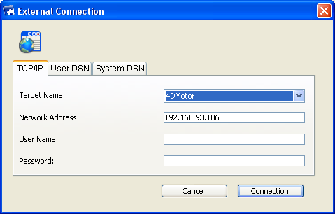

<!--REF #_command_.SQL LOGIN.Syntax-->**SQL LOGIN** {( *entradaDados* ; *nomeUsuario* ; *senha* ; * )}<!-- END REF-->
<!--REF #_command_.SQL LOGIN.Params-->
| Parâmetro | Tipo |  | Descrição |
| --- | --- | --- | --- |
| entradaDados | Text | &#8594;  | Nome da publicação do banco de dados 4D ou o endereço IP do banco remoto ou Nome da fonte de dados de entrada no ODBC Manager ou "" para exibir a caixa de diálogo de seleção |
| nomeUsuario | Text | &#8594;  | Nome do usuário registrado na fonte de dados |
| senha | Text | &#8594;  | Senha do usuário registrado na fonte de dados |
| * | Operador | &#8594;  | Aplicado ao Begin SQL/End SQL se omitido: não aplica (banco de dados local); se passado: aplica. |

<!-- END REF-->

#### Descrição 

<!--REF #_command_.SQL LOGIN.Summary-->O comando SQL LOGIN permite que se conecte a uma fonte de dados SQL especificada no parâmetro *entradaDados* .<!-- END REF--> Ele estabelece o objetivo das pesquisas SQL executadas posteriormente no processo atual: 

•através do comando [SQL EXECUTE](sql-execute.md),  
• através do código localizado dentro das etiquetas Begin SQL / End SQL (se for passado o parâmetro *\**). 

|A fonte de dados SQL pode ser:

* um banco 4D Server externo que acessa diretamente,
* uma fonte ODBC externa,
* o banco 4D local (banco interno).

Em *entradaDados*, pode passar um dos seguintes valores: um endereço IP, um nome de publicação de banco 4D, um nome de fonte de dados ODBC, uma cadeia vazia ou a constante SQL\_INTERNAL.

* **Endereço IP**  
Sintaxe: **IP:<Endereço IP>{:<Porta TCP>}**  
Neste caso, o comando abre uma conexão direta com o banco 4D Server executado na máquina com o endereço IP definido. Na máquina "objetivo", deve ser iniciado o servidor SQL. Se passa um número de porta TCP, deve ter sido especificado como porta de publicação do servidor SQL no banco "objetivo". Se não passa o número de porta TCP, se utilizará o número de porta padrão (19812). O número de porta TCP do servidor SQL pode ser modificado na página "SQL" das Propriedades do banco. Consulte os exemplos 4 e 5.  
Se ativar o TLS para o servidor SQL "objetivo" (opção disponível nas Propriedades do banco), deve adicionar a palavra chave ":ssl" ao final do endereço IP para que o servidor possa manejar o pedido corretamente (ver o exemplo 6).
* **Nome da publicação de banco 4D**  
Sintaxe: **4D:<Nome\_de\_Publicação>**  
Neste caso, o comando abre uma conexão direta com o banco 4D Server cujo nome de publicação na rede corresponde ao nome especificado. O nome da publicação de rede de um banco é definido na página "Cliente-Servidor/Configuração" das Propriedades do banco.  
Consulte o exemplo 4.  
**Nota**: o número de porta TCP do servidor SQL 4D objetivo (que publica o banco 4D) e o número de porta TCP do servidor SQL da aplicação 4D que abre a conexão devem ser idênticos.
* **nome de fonte de dados ODBC válida**  
Sintaxe: **ODBC:<Meu\_DSN> ou <Meu\_DSN>**  
Neste caso, o parâmetro *entradaDados* contém o nome da fonte de dados da maneira como foi definida no administrador do driver ODBC.  
 **Nota**: por razões de compatibilidade com versões anteriores de 4D, é possível omitir o prefixo "ODBC:". Entretanto, por razões de legibilidade do código, é recomendado utilizar este prefixo.  
 Consulte o exemplo 2\.
* Em Windows, o nome da fonte de dados é sensível à maiúsculas. Por exemplo, se a fonte de dados foi definida como "4D\_v16", passando o valor "4D\_V16" falha.  
 Em Windows e Mac, o prefixo "ODBC:" deve ser digitado usando letras maiúsculas. Se passar "odbc:", a conexão falha.
* **string vazia**  
Sintaxe: *""*  
Neste caso, o comando mostra a caixa de diálogo de conexão de maneira que a fonte de dados a conectar possa ser introduzida manualmente:  
    
  
    
Esta caixa de diálogo inclui varias páginas. A página TCP/IP inclui os seguintes elementos:  
   * Nome de objetivo: este menu é criado utilizando duas listas:  
         * a lista de bancos abertos recentemente em conexão direta. O mecanismo para atualizar esta lista é idêntico ao da aplicação 4D, exceto que a pasta que contém os arquivos .4DLink e´chamada "Favorites SQL vXX" ao invés de "Favorites vXX".  
         * a lista de aplicações 4D Server cujo servidor SQL se inicia e cuja porta TCP para as conexões SQL é a mesma que para a aplicação fonte. Esta lista é atualizada dinamicamente a cada nova chamada ao comando SQL LOGIN sem o parâmetro *entradaDados*. Se o caractere "^" se localiza antes de um nome do banco, indica que a conexão se realizou em modo seguro através SSL.  
   * Endereço de rede: esta área mostra o endereço IP e possivelmente a porta TCP do banco selecionado no menu Nome de objetivo. Também pode introduzir um endereço IP nesta área e depois clicar no botão de conexão para conectar o banco 4D Server correspondente. Também pode especificar a porta TCP introduzindo dois pontos (:) seguidos pelo número de porta depois do endereço. Por exemplo: 192.168.93.105:19855  
   * Nome de usuário e Senha: estas áreas podem ser utilizadas para introduzir os identificadores de conexão.  
   * As páginas DSN de usuário e DSN de Sistema mostram, respectivamente, a lista de usuário e fontes de dados ODBC do Sistema no driver ODBC da máquina. Estas páginas podem ser utilizadas para selecionar uma fonte de dados e introduzir identificadores para abrir uma conexão com uma fonte de dados externa ODBC.  
    
 Se a conexão for estabelecida, a variável Sistema OK assume o valor 1\. Do contrário, assume o valor 0 e um erro é gerado. Este erro pode ser interceptado através de um método de gestão de erros instalado pelo comando [ON ERR CALL](on-err-call.md).
* **Constante SQL\_INTERNAL**  
 Sintaxe: SQL\_INTERNAL.  
Nesse caso, o comando redireciona as pesquisas SQL posteriores ao banco 4D interno.

**Aviso:** Os prefixos usados no parâmetro *entradaDados* (IP, ODBC, 4D) podem ser escrito em maiúsculas. 

*nomeUsuario* contém o nome do usuário autorizado a conectar com a fonte de dados externa. Por exemplo, com Oracle®, o nome de usuário poderia ser “Scott”.  
  
*senha* contém a senha do usuário autorizado a conectar com a fonte de dados externa. Por exemplo, com Oracle®, a senha poderia ser “tigre”.

**Nota**: no caso de uma conexão direta, se você passar uma cadeia vazia nos parâmetros *nomeUsuario* e *senha*, a conexão apenas será aceita se as senhas 4D não estiverem ativas no banco objetivo. Do contrário, a conexão será recusada.  
  
O parâmetro opcional *\** pode ser utilizado para mudar o objetivo do código SQL executado dentro das etiquetas Begin SQL/End SQL. Se não passar este parâmetro, mesmo assim o código localizado dentro das etiquetas Begin SQL/End SQL será enviado ao motor SQL interno de 4D, sem considerar a configuração especificada pelo comando SQL LOGIN. Se passar este parâmetro, o código SQL executado dentro das etiquetas Begin SQL/End SQL se enviará a a fonte especificada no parâmetro *entradaDados*.  
  
Para fechar a conexão atual e liberar a memoria, simplesmente execute o comando [SQL LOGOUT](sql-logout.md). Todas as pesquisas SQL são enviadas então ao banco 4D SQL interno.  
Se chamar novamente a SQL LOGIN sem ter fechado explicitamente a conexão atual, a conexão será fechada automaticamente.  
  
**Nota:** em caso de falha de uma tentativa de conexão externa através de SQL LOGIN, o banco 4D interno é convertido automaticamente na fonte de dados atual.  
  
Estes parâmetros são opcionais; se não for passado nenhum parâmetro, o comando produz a visualização da caixa de diálogo selecionar origem de dados ODBC, que permite selecionar a fonte de dados externos:  
  
O foco desse comando é o processo; em outras palavras, se desejar executar duas conexões diferentes, deve criar dois processos e executar cada conexão em cada processo.  
  
**Aviso**: Se não for possível abrir uma conexão ODBC nos contextos descritos abaixo. Estas configurações levam ao bloqueio da aplicação:  
  
 conexão via ODBC da aplicação executante para si mesma  
 conexão via ODBC de uma aplicação 4D para Servidor 4D quando uma conexão padrão cliente/servidor já estiver aberta entre essas duas aplicações.

#### Exemplo 1 

Esta instrução provoca a visualização da caixa de diálogo Selecionar origem de dados ODBC: 

```4d
 SQL LOGIN
```

#### Exemplo 2 

Abertura de uma conexão através do protocolo ODBC com a fonte de dados externa "MyOracle". As pesquisas SQL executadas através do comando [SQL EXECUTE](sql-execute.md "SQL EXECUTE") e pesquisas incluídas dentro das etiquetas [Begin SQL](begin-sql.md "Begin SQL")/[End SQL](end-sql.md "End SQL") será redirecionada para esta conexão. Esta instrução conectará a fonte de dados ODBC chamada “MyOracle” utilizando Scott/tigre como nome/senha: 

```4d
 SQL LOGIN("ODBC:MyOracle";"Scott";"tigre";*)
```

  
#### Exemplo 3 

Abertura de uma conexão com o motor SQL interno de 4D: 

```4d
 SQL LOGIN(SQL_INTERNAL;$usuario;$senha)
```

#### Exemplo 4 

Abertura de uma conexão direta com a aplicação 4D Server executada na máquina com o endereço IP 192.168.45.34 e respondendo na porta TCP padrão. As pesquisas SQL executadas através do comando [SQL EXECUTE](sql-execute.md "SQL EXECUTE") são redirecionadas a esta conexão; as pesquisas incluidas dentro das etiquetas [Begin SQL](begin-sql.md "Begin SQL")/[End SQL](end-sql.md "End SQL") não são redirecionadas  
  
```4d
 SQL LOGIN("IP:192.168.45.34";"José";"azerty")
```

#### Exemplo 5 

Abertura de uma conexão direta com a aplicação 4D Server executada na máquina com o endereço IP 192.168.45.34 e respondendo ao porto TCP 20150\. As pesquisas SQL executadas através do comando [SQL EXECUTE](sql-execute.md "SQL EXECUTE") e as pesquisas incluidas dentro das etiquetas [Begin SQL](begin-sql.md "Begin SQL")/[End SQL](end-sql.md "End SQL") serão redirecionadas a esta conexão 

```4d
 SQL LOGIN("IP:192.168.45.34:20150";"José";"azerty";*)
```

#### Exemplo 6 

Abertura de uma conexão direta em SSL com a aplicação 4D Server executada na máquina com o endereço IP 192.168.45.34 e respondendo ao porto TCP padrão. Você deve ter ativado o SSL para o servidor SQL na aplicação 4D Server.

```4d
 SQL LOGIN("IP:192.168.45.34:ssl";"Admin";"sd156") // Note o ":ssl" ao final do endereço IP
```

#### Exemplo 7 

Abertura de uma conexão direta com a aplicação 4D Server executada na máquina que tiver a direção IPv6 2a01: e35:2e41:c960:dc39:3eb0:f29b:3747 e responde na porta TCP 20150\. As consultas SQL executadas através de comando [SQL EXECUTE](sql-execute.md) serão redirigidas a esta conexão; As consultas incluidas nas etiquetas [Begin SQL](begin-sql.md)/[End SQL](end-sql.md) não serão redirigidas.

```4d
 SQL LOGIN("IP:[2a01:e35:2e41:c960:dc39:3eb0:f29b:3747]:20150";"John";"qwerty")
```

#### Exemplo 8 

Abertura de uma conexão direta com a aplicação 4D Server que publica na rede local um banco cujo nome de publicação é "Accounts\_DB." O porto TCP utilizado pelo servidor SQL de ambos os bancos (definido na página "SQL" das Propriedadees do banco) deve ser o mesmo (19812 por padrão). As pesquisas SQL executadas através do comando [SQL EXECUTE](sql-execute.md "SQL EXECUTE") são redirecionadas a esta conexão; as pesquisas incluidas dentro das etiquetas [Begin SQL](begin-sql.md "Begin SQL")/[End SQL](end-sql.md "End SQL") não serão redirecionadas. 

```4d
 SQL LOGIN("4D:Accounts_DB";"José";"azerty")
```

#### Exemplo 9 

Este exemplo mostra as possibilidades de conexão oferecidas pelo comando SQL LOGIN:   
  
```4d
 ARRAY TEXT(aNomes;0)
 ARRAY LONGINT(aIdades;0)SQL LOGIN("ODBC:MyORACLE";"Marc";"azerty")
 If(OK=1) //A pesquisa a seguir será redirecionada ao banco de dados ORACLE externo
    SQL EXECUTE("SELECT Nome, idade FROM PERSONS";aNomes;aIdades)
  //A pesquisa a seguir será enviada ao banco de dados 4D local
    Begin SQL
       SELECT Nome, Idade
       FROM PERSONS
       INTO :aNomes, :aIdades;
    End SQL //O comando abaixo SQL LOGIN fecha a conexão atual
  //com o banco de dados ORACLE externo e abre uma nova conexão
  //com um banco de dados MySQL externo
    SQL LOGIN("ODBC:MySQL";"Josén";"qwerty";*)
    If(OK=1)
  //A pesquisa a seguir será redirecionada ao banco de dados MySQL externo
       SQL EXECUTE("SELECT Nome, Idade FROM PERSONS";aNomes;aIdades)
  //A pesquisa a seguir também será redirecionada ao banco de dados MySQL externa
       Begin SQL
          SELECT Nome, Idade
          FROM PERSONS
          INTO :aNomes, :aIdades;
       End SQL
       SQL LOGOUT
  //A pesquisa a seguir será enviada ao banco de dados 4D local
       Begin SQL
          SELECT Nome, Idade
          FROM PERSONS
          INTO :aNomes, :aIdades;
       End SQL
    End if
 End if
```

#### Variáveis e conjuntos do sistema 

Se a conexão for exitosa, a variável sistema OK assume o valor 1, do contrário, assume o valor 0.

#### Ver também 

[Begin SQL](begin-sql.md)  
[End SQL](end-sql.md)  
[SQL LOGOUT](sql-logout.md)  

#### Propriedades

|  |  |
| --- | --- |
| Número do comando | 817 |
| Thread-seguro | &cross; |
| Modificar variáveis | OK |


