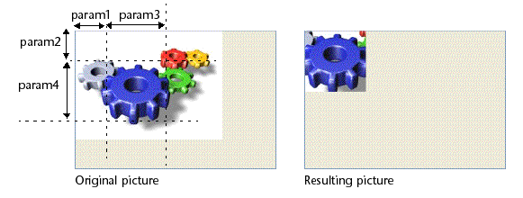

<!--REF #_command_.TRANSFORM PICTURE.Syntax-->**TRANSFORM PICTURE** ( *imagem* ; *operador* {; *param1* {; *param2* {; *param3* {; *param4*}}}} )<!-- END REF-->
<!--REF #_command_.TRANSFORM PICTURE.Params-->
| Parâmetro | Tipo |  | Descrição |
| --- | --- | --- | --- |
| imagem | Picture | &#8594;  | Fonte da imagem a ser transformada |
| &#8592; | Imagem resultante depois da transformação |
| operador | Integer | &#8594;  | Tipo de transformação a ser feita |
| param1 | Real | &#8594;  | Parâmetro de transformação |
| param2 | Real | &#8594;  | Parâmetro de transformação |
| param3 | Real | &#8594;  | Parâmetro de transformação |
| param4 | Real | &#8594;  | Parâmetro de transformação |

<!-- END REF-->

#### Descrição 

<!--REF #_command_.TRANSFORM PICTURE.Summary-->O comando TRANSFORM PICTURE permite aplicar uma transformação de tipo *operador* à imagem passada no parâmetro *imagem*.<!-- END REF-->este comando estende as funcionalidades oferecidas pelos operadores convencionais de transformação de imagens (+/, etc., ver a seção ). Estes operadores permanecem totalmente utilizáveis em 4D.  
  
A *imagem* fonte se modifica diretamente depois da execução do comando. Note que exceto por “Crop” e “Fade to grey scale,” as operações não são destrutivas e podem ser desfeitas realizando a operação contrária o via a operação “Reset”. Por exemplo, uma imagem reduzida a 1% retomará seu tamanho original sem alterações é aumentado 100 vezes. As transformações não modificam o tipo original da imagem: por exemplo, uma imagem vetorial permanecerá vetorial depois de sua transformação.

Em *operador*, passe o número da operação a ser realizada e em *param*, os parâmetros necessários para esta operação (o número de parâmetros depende da operação). Em *operador* pode utilizar uma das constantes do tema “*Transformação de imagens*”. Estes operadores e seus parâmetros se descrevem na seguinte tabela:

| **operador (valor)**     | **param1** | **param2** | **param3** | **param4** | **Valores** |     |
| ------------------------ | ---------- | ---------- | ---------- | ---------- | ----------- | --- |
| Reset (0)                | \-         | \-         | \-         | \-         | \-          | \-  |
| Scale (1)                | Largura    | Altura     | \-         | \-         | Fatores     | Sí  |
| Translate (2)            | Eixo X     | Eixo Y     | \-         | \-         | Pixels      | Sí  |
| Flip horizontally (3)    | \-         | \-         | \-         | \-         | Sim         |     |
| Flip vertically (4)      | \-         | \-         | \-         | \-         | Sim         |     |
| Crop (100)               | X Orig.    | Y Orig.    | Largura    | Altura     | Pixels      | Não |
| Fade to grey scale (101) | \-         | \-         | \-         | \-         | Não         |     |
| Transparency (102)       | RGB color  | \-         | \-         | \-         | Hexadecimal | Não |
  
  
* Reset: todas as operações matriciais efetuadas na imagem (redimensionar, voltar, etc.) se desfazem.
* Scale: a imagem se redimensiona horizontalmente e verticalmente de acordo aos valores passados em *param1* e *param2* respectivamente. Estes valores são fatores: por exemplo, para aumentar a largura 50%, passe 1.5 em *param1* e para reduzir a altura 50%, passe 0.5 em *param2*.
* Translate: a imagem se move *param1* pixels horizontalmente e *param2* pixels verticalmente. Passe um valor positivo para mover-se direita ou para baixo e um valor negativo para mover-se para a esquerda ou para cima.
* Flip horizontally e Flip vertically: o efeito espelho é aplicado à imagem original. Todo movimento efetuado anteriormente não será considerado.
* Crop: a imagem se recorta a partir do ponto de coordenadas *param1* e *param2* (expresso em pixels). A largura e a altura da nova imagem são determinados pelos parâmetros *param3* e *param4*. Esta transformação não pode ser anulada.
* Fade to grey scale: a imagem se converte a escala de cinzas (nenhum parâmetro é necessário). Esta transformação não pode ser desfeita.
* Transparency: uma máscara de transparência se aplica a imagem baseada na cor passada em *param1*. Por exemplo, se passar 0x00FFFFFF (cor branca) em *param1*, todos os pixels brancos na imagem original serão transparentes na imagem transformada. Esta operação pode ser aplicada a imagens de mapa de bits ou de vetores. Por padrão, se o parâmetro *param1* se omite, a cor branca (0x00FFFFFF) se estabelece como cor objetivo. Esta função está especialmente desenhada para manipular a transparência em imagens convertidas desde o formato obsoleto PICT, mas pode ser usada com imagens de todo tipo. Esta transformação não pode ser desfeita.

#### Exemplo 1 

Se quiser definir as partes brancas de uma imagem como transparentes. Para isso, pode utilizar o seguinte código:

```4d
 TRANSFORM PICTURE(Pict1;Transparency;0x00FFFFFF) //0x00FFFFFF is white
```

Obtém o seguinte resultado:


#### Exemplo 2 

Este é um exemplo de corte de uma imagem (a imagem se mostra no formulário com o formato “Truncado (não-centrado)”): 

```4d
 TRANSFORM PICTURE($vpEngrenagem;Crop;50;50;100;100)
```



#### Ver também 

[COMBINE PICTURES](combine-pictures.md)  

#### Propriedades

|  |  |
| --- | --- |
| Número do comando | 988 |
| Thread-seguro | &check; |


