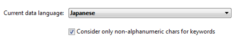

## Página de armazenamento de dados

Esta página é utilizada para configurar o armazenamento de dados no disco para a base de dados 4D.

### Parámetros generales

#### Permitir a utilização do ficheiro de dados só de leitura

Essa opção permite a configuração da operação do aplicativo ao abrir um arquivo de dados bloqueado no nível do sistema operacional. 4D inclui um mecanismo que impede automaticamente a abertura de uma base de dados quando seu arquivo de dados, ou um de seus segmentos, está bloqueado. Neste caso, quando esta opção de detecção é ativada, 4D exibe uma mensagem de aviso e não abre o banco de dados:

A menos que essa opção esteja marcada, não é possível abrir um banco de dados quando seu arquivo de dados estiver bloqueado (operação padrão para bancos de dados 4D).

#### Sobre arquivos bloqueados

Os arquivos bloqueados podem ser lidos, mas seu conteúdo não pode ser modificado. Por exemplo, os arquivos são bloqueados quando são armazenados em um suporte não regravável (tipo DVD) ou quando são copiados deste tipo de suporte. 4D pode trabalhar de forma transparente com arquivos de dados bloqueados, o que permite, mais particularmente, o uso de projetos armazenados em DVD. No entanto, esta operação corre o risco de usar inadvertidamente um arquivo de dados bloqueado no qual as modificações não serão salvas. É por isso que por padrão 4D não permite que bancos de dados com arquivo de dados bloqueado sejam abertos.

### Localização da pasta temporária

Essa área permite que você altere o local dos arquivos temporários criados enquanto o 4D está em execução. A pasta de arquivos temporários é usada pelo aplicativo, quando necessário, para salvar temporariamente os dados da memória no disco.

A localização atual desta pasta é exibida na área "Atual:". Você pode clicar nessa área para mostrar o nome do caminho como uma lista suspensa:

São oferecidos três opções de localização:

- **Sistema**: cuando se selecciona esta opción, los archivos temporales 4D se crean en una carpeta situada en la ubicación especificada por Windows y/o macOS. You can find out the current location defined by your system using the [`Temporary folder`](https://doc.4d.com/4dv19R/help/command/en/page486.html) 4D command. Os arquivos são colocados em uma subpasta cujo nome consiste no nome do banco de dados e em um identificador exclusivo.
- **Carpeta de archivos de datos** (opción por defecto): cuando se selecciona esta opción, los archivos temporales 4D se crean en una carpeta llamada "archivos temporales" situada en el mismo nivel que el archivo de datos de la base de datos.
- **Definido por el usuario**: esta opción se utiliza para definir una ubicación personalizada. Se a opção local for modificada, será necessário reiniciar a base de dados para que a nova opção seja tida em conta. 4D verifica se a pasta selecionada pode ser acessada por gravação. Se não for esse o caso, o aplicativo tenta outras opções até que uma pasta válida seja encontrada.

> This option is stored in the "extra properties" of the structure that is available when the structure definition is exported in XML (see [Exporting and importing structure definitions](https://doc.4d.com/4Dv19/4D/19/Exporting-and-importing-structure-definitions.300-5416829.en.html)).

### Comparação de textos

> Se você alterar uma dessas opções, é preciso sair e reabrir o banco de dados para tornar a alteração eficaz. Quando a base de dados for reaberta, todos os índices da base de dados são automaticamente reindexados.

- **Considere @ como comodín sólo cuando se encuentre al principio o al final de patrones de texto**: permite definir como se interpretará la arroba "@" cuando se utilice en una búsqueda o en una comparación de cadenas de caracteres, cuando se encuentre en
  Cuando esta opción no está marcada (valor por defecto), la arroba se utiliza como carácter comodín, es decir, sustituye a cualquier caracter (ver [Caracter comodín (@)](https://doc.4d.com/4Dv19/4D/19/Query-editor.300-5416813.en.html#463876)).

  Quando a opção estiver marcada, o sinal de arroba é considerado um caractere simples se estiver localizado em uma palavra. Essa configuração é especialmente útil quando se procura por endereços de e-mail, onde o sinal @ é usado internamente. Esta opção tem influência em pesquisas, ordenações, comparações de string, bem como em dados armazenados em tabelas e dados encontrados na memória, como arrays. Campos e variáveis do alfa (indexado ou não) e tipo de texto estão preocupados com a forma como o caractere @ é interpretado em pesquisas e tipos de caracteres.

  **Notas:**

  - Para pesquisas, se os critérios de pesquisa iniciam ou terminam com @, o caractere "@" será tratado como um caractere curinga. Somente se o caractere "@" for colocado no meio de uma palavra (por exemplo: bill@cgi.com) é tratado por 4D de maneira diferente.
  - Esta opción también puede influir en el comportamiento de los comandos del tema [Objetos (Formularios)](https://doc.4d.com/4Dv19/4D/19/Objects-Forms.201-5391558.en.html) que aceptan el caracter comodín ("@") en el parámetro objeto.
  - Por razões de segurança, apenas o Administrador ou Designer da base de dados podem modificar este parâmetro.

- **Lenguaje del archivo de datos actual:** permite configurar el lenguaje utilizado para el procesamiento y la comparación de cadenas de caracteres. A escolha do idioma influencia diretamente a classificação e a pesquisa de texto, bem como as letras maiúsculas e minúsculas, mas não afeta a tradução de textos nem os formatos de data, hora ou moeda, que permanecem no idioma do sistema. Por padrão, 4D usa a linguagem do sistema.

  Um projeto 4D pode, portanto, operar em uma linguagem diferente da do sistema. Quando um projeto for aberto, o mecanismo 4D detecta o idioma usado pelo arquivo de dados e o fornece ao idioma (modo interpretador ou compilado). As comparações de texto, independentemente de serem realizadas pelo mecanismo de projeto ou pelo idioma, são feitas no mesmo idioma.

  > Puede modificar esta configuración en las Preferencias de la aplicación (ver [Página general](../Preferences/general.md)). Neste caso, a configuração aplica-se a todas as novas bases de dados criadas pela 4D.

- **Considerar sólo caracteres no alfanuméricos para las palabras claves**: modifica el algoritmo utilizado por 4D para identificar los separadores de palabras claves y crear así sus índices. Por padrão, quando esta opção não é verificada, a 4D usa um algoritmo sofisticado que leva em conta as características linguísticas.

  Este algoritmo é semelhante ao usado pelo software de processamento de palavras para determinar os limites ao selecionar uma palavra que é clicada duplo. Para más información sobre este algoritmo, consulte la siguiente dirección: `http://userguide.icu-project.org/boundaryanalysis`.

  Quando esta opção está selecionada, 4D utiliza um algoritmo simplificado. Nessa configuração, qualquer caractere não alfanumérico (ou seja, que não seja uma letra ou um número) é considerado um separador de palavras-chave. Essa configuração atende a requisitos específicos associados a determinados idiomas, como o japonês.

- **Orden de clasificación apropiado para la búsqueda**: esta opción sólo aparece cuando se selecciona el idioma japonés. Modifica a interpretação de caracteres como a "Marca de som prolongado Katakana-Hiragana" ou "長音記号" ou as "Marcas de iteração japonesas" como "ゝ" ou "ゞ". Um falante típico de japonês provavelmente preferirá os resultados com a configuração  ativada.

#### Compatibilidade do MeCab (versão japonesa)

En los sistemas japoneses, 4D soporta la librería *MeCab*, con un algoritmo de indexación de palabras claves especialmente adaptado al idioma japonés.

Este algoritmo é usado por padrão nas versões japonesas da 4D. Si es necesario, puede desactivar el uso del algoritmo *MeCab* y utilizar la librería convencional *ICU*.

Para desactivar *MeCab*, sólo tiene que marcar la opción **Considerar solo caracteres no alfanuméricos para las palabras claves**:

## Página Memória

Você usa as configurações nesta aba para configurar a memória em cache para o banco de dados.

### Parâmetros da cache do banco de dados

- **Cálculo de la caché adaptable**: cuando esta opción está marcada, la gestión de la memoria caché es realizada dinámicamente por el sistema, respetando los límites que defina. Isto permite a configuração de um cache de memória de alto desempenho adaptado à maioria das configurações. O tamanho do cache de memória é então calculado dinamicamente dependendo dos parâmetros definidos. Os valores oferecidos por defeito correspondem à utilização normal de 4D.

  - **Memoria a reservar para el sistema y las otras aplicaciones**: parte de la memoria RAM a reservar para el Sistema y las otras aplicaciones. Esse valor é aumentado para otimização quando outros aplicativos são executados na mesma máquina que a 4D.
  - **Percentage of available memory used for cache**: Percentage of the remaining memory allocated to the cache by default.\
    To obtain the size allocated by default to the cache, simply perform the following calculation: (Physical memory -- Physical memory to be reserved) X Percentage of the memory used for the cache. No modo adaptável, o tamanho do cache de memória varia dinamicamente dependendo das necessidades do aplicativo e do sistema. Você pode definir limites usando as seguintes duas opções:
  - **Tamaño mínimo**: cantidad mínima de memoria que debe reservarse para la caché. Este valor não pode ser inferior a 100 MB.
  - **Tamaño máximo**: cantidad máxima de memoria que puede utilizar la caché. This value is virtually unlimited.\\
    Setting limits is particularly useful for databases that are distributed on machines for which you do not know the memory configuration a priori. Nesse caso, os limites definidos garantem um desempenho mínimo em todos os casos. O diagrama seguinte ilustra este comportamento:

  Example for calculating cache memory:
  *Physical memory to reserve = 256 MB
  Percentage of the available memory used for the cache = 50%
  Maximum size = 1 GB Minimum size = 128 MB*

  

- **Cálculo de caché adaptativa no marcado**: en este modo, usted mismo define el tamaño de la memoria caché para la base. O 4D então exibe uma área de entrada que permite a configuração do cache de memória para uso, bem como informações relacionadas à memória física (RAM disponíveis na máquina), o cache atual e o cache após reiniciar (levando suas alterações em conta).

  O tamanho do cache de memória que você inserir será reservado para o banco de dados 4D, independentemente do estado dos recursos da máquina. Esta configuração pode ser usada em certas configurações específicas, ou quando a base de dados é projetada para ser usada em sistemas diferentes em termos de memória. Geralmente, a cache adaptativa oferece um melhor desempenho.

- **Escritura caché cada... Segundos/Minutos**: especifica el periodo de tiempo entre cada guardado automático de la caché de datos, es decir, su escritura en el disco.
  4D salva os dados colocados no cache em intervalos regulares. Você pode especificar qualquer intervalo de tempo entre 1 segundo e 500 minutos. Por padrão, 4D salva seus dados a cada 20 segundos. O aplicativo também salva seus dados em disco toda vez que você alterar para outro ambiente ou sair do aplicativo. También puede llamar al comando [FLUSH CACHE](https://doc.4d.com/4dv19R/help/command/en/page297.html) para activar el vaciado en cualquier momento.

  Quando você antecipar uma entrada de dados pesada, considere definir um curto intervalo de tempo entre saves. Em caso de falha de poder, você só perderá os dados inseridos desde o salvamento anterior (se o banco de dados estiver sendo executado sem um arquivo de log).

  Se houver uma lentidão notável no banco de dados toda vez que o cache for liberado, você precisará ajustar a frequência. Essa lentidão significa que uma grande quantidade de registros está sendo salva. Um período mais curto entre as economias seria portanto mais eficaz, uma vez que cada poupança implicaria menos registos e, por conseguinte, mais rápido.

  Por padrão, 4D exibe uma pequena janela quando o cache é liberado. Si no desea este recordatorio visual, puede deseleccionar la opción **Escritura de caché** en la [página Interfaz](./interface.md).
