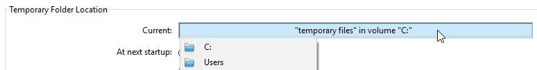

## Página de armazenamento de dados

Esta página é utilizada para configurar o armazenamento de dados no disco para a base de dados 4D.

### Parámetros generales

#### Permitir a utilização do ficheiro de dados só de leitura

This option allows configuration of the application operation when opening a locked data file at the operating system level. 4D includes a mechanism that automatically prevents the opening of a database when its data file, or one of its segments, is locked. In this case, when this detection option is activated, 4D displays a warning message and does not open the database:

Unless this option is checked, it is not possible to open a database when its data file is locked (default operation for 4D databases).

#### Sobre ficheiros bloqueados

Os ficheiros bloqueados podem ser lidos, mas o seu conteúdo não pode ser modificado. For example, files are locked when they are stored on a non-rewritable support (DVD type) or when they are copied from this type of support. 4D can work in a transparent manner with locked data files, which allows, more particularly, the use of projects stored on DVD. However, this operation runs the risk of inadvertent use of a locked data file in which modifications will not be saved. This is why by default 4D does not allow databases with a locked data file to be opened.

### Localização da pasta temporária

This area lets you change the location of temporary files created while 4D is running. The temporary files folder is used by the application, when necessary, to temporarily save the data in memory to disk.

The current location of this folder is displayed in the "Current:" area. Você pode clicar nessa área para mostrar o nome do caminho como uma lista suspensa:

São oferecidos três opções de localização:

- **Sistema**: cuando se selecciona esta opción, los archivos temporales 4D se crean en una carpeta situada en la ubicación especificada por Windows y/o macOS. You can find out the current location defined by your system using the [`Temporary folder`](https://doc.4d.com/4dv19R/help/command/en/page486.html) 4D command. The files are put into a subfolder whose name consists of the database name and a unique identifier.
- **Carpeta de archivos de datos** (opción por defecto): cuando se selecciona esta opción, los archivos temporales 4D se crean en una carpeta llamada "archivos temporales" situada en el mismo nivel que el archivo de datos de la base de datos.
- **Definido por el usuario**: esta opción se utiliza para definir una ubicación personalizada. If the location option is modified, it will be necessary to restart the database in order for the new option to be taken into account. 4D verifica se a pasta selecionada pode ser acedida por escrita. If this is not the case, the application tries other options until a valid folder is found.

> This option is stored in the "extra properties" of the structure that is available when the structure definition is exported in XML (see [Exporting and importing structure definitions](https://doc.4d.com/4Dv19/4D/19/Exporting-and-importing-structure-definitions.300-5416829.en.html)).

### Comparação de textos

> If you change one of these options, you have to quit and reopen the database to make the change effective. Quando a base de dados é reaberta, todos os índices da base de dados são automaticamente reindexados.

- **Considere @ como comodín sólo cuando se encuentre al principio o al final de patrones de texto**: permite definir como se interpretará la arroba "@" cuando se utilice en una búsqueda o en una comparación de cadenas de caracteres, cuando se encuentre en
  Cuando esta opción no está marcada (valor por defecto), la arroba se utiliza como carácter comodín, es decir, sustituye a cualquier caracter (ver [Caracter comodín (@)](https://doc.4d.com/4Dv19/4D/19/Query-editor.300-5416813.en.html#463876)).

  When the option is checked, the at sign is regarded as a simple character if it is located within a word. This setting is especially useful when searching for E-mail addresses, where the @ sign is used internally. This option has an influence on searches, sorts, string comparisons, as well as on data stored in tables and data found in memory, like arrays. Fields and variables of the alpha (indexed or not) and text type are concerned by how the @ character is interpreted in searches and sorts.

  **Notas:**

  - For searches, if the search criteria begins or ends with @, the "@" character will be treated as a wildcard. Only if the "@" character is placed in the middle of a word (for example: bill@cgi.com) does 4D treat it differently.
  - Esta opción también puede influir en el comportamiento de los comandos del tema [Objetos (Formularios)](https://doc.4d.com/4Dv19/4D/19/Objects-Forms.201-5391558.en.html) que aceptan el caracter comodín ("@") en el parámetro objeto.
  - For security reasons, only the Administrator or Designer of the database can modify this parameter.

- **Lenguaje del archivo de datos actual:** permite configurar el lenguaje utilizado para el procesamiento y la comparación de cadenas de caracteres. A escolha do idioma influencia diretamente a classificação e a pesquisa de texto, bem como as letras maiúsculas e minúsculas, mas não afeta a tradução de textos nem os formatos de data, hora ou moeda, que permanecem no idioma do sistema. Por padrão, 4D usa a linguagem do sistema.

  Um projeto 4D pode, portanto, operar em uma linguagem diferente da do sistema. When a project is opened, the 4D engine detects the language used by the data file and provides it to the language (interpreter or compiled mode). Text comparisons, regardless of whether they are carried out by the project engine or the language, are done in the same language.

  > Puede modificar esta configuración en las Preferencias de la aplicación (ver [Página general](../Preferences/general.md)). In this case, the setting applies to all the new databases created by 4D.

- **Considerar sólo caracteres no alfanuméricos para las palabras claves**: modifica el algoritmo utilizado por 4D para identificar los separadores de palabras claves y crear así sus índices. By default, when this option is not checked, 4D uses a sophisticated algorithm that takes linguistic characteristics into account.

  This algorithm is similar to the one used by word-processing software to determine the boundaries when selecting a word that is double-clicked. Para más información sobre este algoritmo, consulte la siguiente dirección: `http://userguide.icu-project.org/boundaryanalysis`.

  Quando esta opção está selecionada, 4D utiliza um algoritmo simplificado. In this configuration, any non-alphanumeric character (i.e., not a letter or a number) is considered as a keyword separator. This setting meets specific requirements associated with certain languages such as Japanese.

- **Orden de clasificación apropiado para la búsqueda**: esta opción sólo aparece cuando se selecciona el idioma japonés. Modifies the interpretation of characters such as the "Katakana-Hiragana Prolonged Sound Mark" or "長音記号" or the "Japanese Iteration Marks" such as "ゝ" or "ゞ". Typical Japanese speaker is likely to prefer the results when the setting is enabled.

#### Suporte do MeCab (versão japonesa)

En los sistemas japoneses, 4D soporta la librería _MeCab_, con un algoritmo de indexación de palabras claves especialmente adaptado al idioma japonés.

Este algoritmo é usado por defeito nas versões japonesas de 4D. Si es necesario, puede desactivar el uso del algoritmo _MeCab_ y utilizar la librería convencional _ICU_.

Para desactivar _MeCab_, sólo tiene que marcar la opción **Considerar solo caracteres no alfanuméricos para las palabras claves**:

## Página Memória

You use the settings on this tab to configure the cache memory for the database.

### Parâmetros da cache do banco de dados

- **Cálculo de la caché adaptable**: cuando esta opción está marcada, la gestión de la memoria caché es realizada dinámicamente por el sistema, respetando los límites que defina. This allows configuration of a high performance memory cache adapted to most configurations. The size of the memory cache is then calculated dynamically depending on set parameters. Os valores oferecidos por defeito correspondem à utilização normal de 4D.

  - **Memoria a reservar para el sistema y las otras aplicaciones**: parte de la memoria RAM a reservar para el Sistema y las otras aplicaciones. This value is increased for optimization when other applications are running on the same machine as 4D.
  - **Percentage of available memory used for cache**: Percentage of the remaining memory allocated to the cache by default.\
    To obtain the size allocated by default to the cache, simply perform the following calculation: (Physical memory -- Physical memory to be reserved) X Percentage of the memory used for the cache. In the adaptive mode, the size of the memory cache varies dynamically depending on the needs of the application and the system. Pode definir limites utilizando as duas opções seguintes:
  - **Tamaño mínimo**: cantidad mínima de memoria que debe reservarse para la caché. Este valor não pode ser inferior a 100 MB.
  - **Tamaño máximo**: cantidad máxima de memoria que puede utilizar la caché. This value is virtually unlimited.\\
    Setting limits is particularly useful for databases that are distributed on machines for which you do not know the memory configuration a priori. Nesse caso, os limites definidos garantem um desempenho mínimo em todos os casos. O diagrama seguinte ilustra este comportamento:

  Example for calculating cache memory:
  _Physical memory to reserve = 256 MB
  Percentage of the available memory used for the cache = 50%
  Maximum size = 1 GB Minimum size = 128 MB_

  

- **Cálculo de caché adaptativa no marcado**: en este modo, usted mismo define el tamaño de la memoria caché para la base. 4D then displays an entry area that allows setting the memory cache to use as well as information related to the physical memory (RAM available on the machine), the current cache and cache after restart (taking your changes into account).

  The size of the memory cache that you enter will be reserved for the 4D database, regardless of the state of machine resources. This setting can be used in certain specific configurations, or when the database is designed to be used on dissimilar systems in terms of memory. Geralmente, a cache adaptativa oferece um melhor desempenho.

- **Escritura caché cada... Segundos/Minutos**: especifica el periodo de tiempo entre cada guardado automático de la caché de datos, es decir, su escritura en el disco.
  4D salva os dados colocados no cache em intervalos regulares. Você pode especificar qualquer intervalo de tempo entre 1 segundo e 500 minutos. Por padrão, 4D salva seus dados a cada 20 segundos. The application also saves your data to disk each time you change to another environment or exit the application. También puede llamar al comando [FLUSH CACHE](https://doc.4d.com/4dv19R/help/command/en/page297.html) para activar el vaciado en cualquier momento.

  When you anticipate heavy data entry, consider setting a short time interval between saves. In case of a power failure, you will only lose the data entered since the previous save (if the database is running without a log file).

  If there is a noticeable slowing down of the database each time the cache is flushed, you need to adjust the frequency. Essa lentidão significa que uma grande quantidade de registros está sendo salva. A shorter period between saves would therefore be more efficient since each save would involve fewer records and hence be faster.

  Por padrão, 4D exibe uma pequena janela quando o cache é liberado. Si no desea este recordatorio visual, puede deseleccionar la opción **Escritura de caché** en la [página Interfaz](./interface.md).
