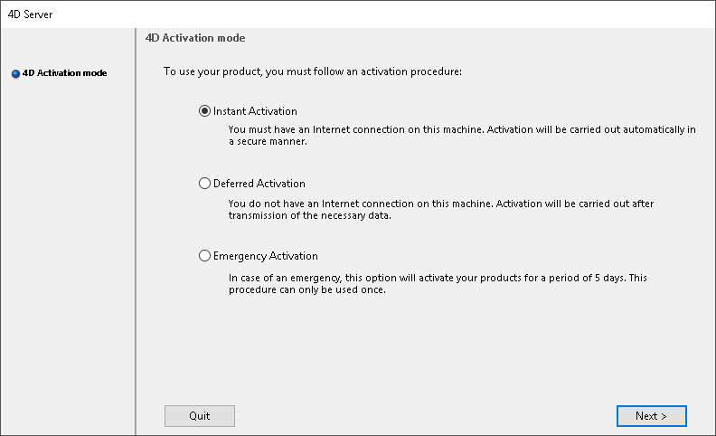
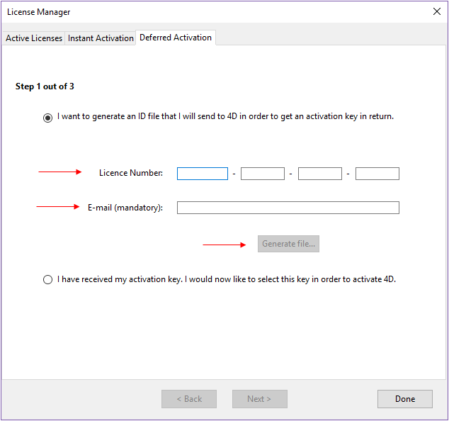
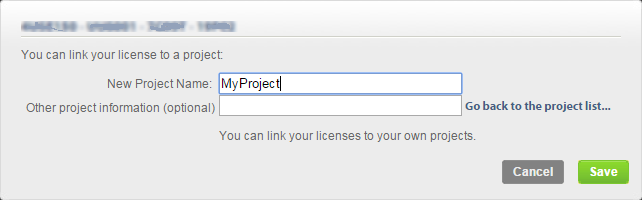
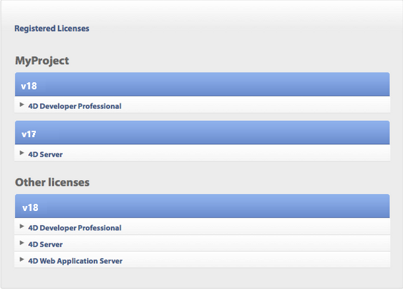

## Visão geral das licenças 4D

Para usar os produtos e recursos 4D, é necessário instalar as licenças apropriadas em seu computador. 4D oferece duas categorias de licenças:

- **Licenças de desenvolvimento**, necessárias para trabalhar com o IDE de 4D e 4D Server.
- as licenças de implementação\*\*, necessárias para implementar suas aplicações personalizadas criadas com 4D.

### Licenças de desenvolvimento

As licenças de desenvolvimento são necessárias para acessar o ambiente e os recursos do 4D Design. Por exemplo, *4D Developer Pro* é uma licença de desenvolvimento para um único usuário. Licenças de desenvolvimento registradas são instaladas automaticamente [quando você faz login](GettingStarted/Installation.md) no assistente de boas-vindas, ou você pode adicioná-las usando a caixa de diálogo [Ativação instantânea](#instant-activation).

### Licenças de implantação

As licenças de implementação podem ser incorporadas na etapa de compilação pelo desenvolvedor ou inseridas no primeiro lançamento pelo usuário, conforme descrito na tabela a seguir:

| Licença de implantação   | Descrição                                                                               | Onde entrar                                                                                        |
| ------------------------ | --------------------------------------------------------------------------------------- | -------------------------------------------------------------------------------------------------- |
| *4D OEM Desktop*         | Licença personalizada incorporada, entre em contato com 4D Sales para obter informações | [Página de licenças](../Desktop/building.md#licenses) da caixa de diálogo do Gerador de aplicações |
| *4D Unlimited Desktop*   | **Descontinuado** - Licença personalizada incorporada                                   | [Página de licenças](../Desktop/building.md#licenses) da caixa de diálogo do Gerador de aplicações |
| *4D Desktop*             | Licença por usuário, permitindo-lhes utilizar aplicativos 4D autônomos                  | Caixa de diálogo [Primeira ativação](#first-activation) na máquina do usuário                      |
| *4D Server OEM*          | Licença personalizada incorporada, entre em contato com 4D Sales para obter informações | [Página de licenças](../Desktop/building.md#licenses) da caixa de diálogo do Gerador de aplicações |
| *4D XML Keys Activation* | Usado para ativar as licenças OEM do 4D Server                                          | [Página de licenças](../Desktop/building.md#licenses) da caixa de diálogo do Gerador de aplicações |
| *4D Server*              | Licença por usuário, permitindo que eles usem 4D Server e clientes                      | Caixa de diálogo [Primeira ativação](#first-activation) na máquina do usuário                      |

### Vencimento

Algumas licenças 4D têm uma data de validade, após a qual devem ser renovadas. Quando a assinatura da licença for renovada na loja 4D, suas licenças serão atualizadas automaticamente nos seus aplicativos 4D na inicialização [quando você logar](GettingStarted/Installation.md) no assistente de boas-vindas.

Em alguns casos, a atualização da licença pode exigir que você clique no botão [**Atualizar**](#refresh) da caixa de diálogo Gerenciador de Licenças.

## Ativando licenças

Uma vez instalados no seu disco, deve activar os seus produtos 4D para poder utilizá-los. Geralmente, **a ativação é automática** quando [entrar usando a sua conta 4D](GettingStarted/Installation.md) no assistente de boas-vindas.

Contudo, em casos específicos, poderá ter de activar as suas licenças manualmente, por exemplo, se:

- sua configuração não permitir a ativação automática
- você adquiriu licenças de desenvolvimento adicionais.

Não precisa ativar nada para os usos abaixo:

- 4D usado em modo remoto (conexão ao servidor 4D)
- 4D usado em modo local com um projeto aplicação interpretado sem acesso ao ambiente Design.

### Primeira ativação

Com 4D, selecione o comando **Gestião de licenças...** do menu **Ajuda**. Com 4D Server basta lançar a aplicação 4D Server. Aparece a caixa de diálogo para escolher o modo de ativação.

4D oferece três modos de ativação. Recomendamos **Ativação Instantânea**.

### Ativação instantânea

Digite seu ID (email ou conta 4D) e sua senha. Se ainda não tiver uma conta de usuário, vai ter que criá-la no endereço a seguir:

[https://account.4d.com/us/login.shtml](https://account.4d.com/us/login.shtml)

Depois entre o número de licença do produto que quiser ativar. Esse número é fornecido por email depois da compra do produto.

### Ativação postergada

Se não puder usar [instant activation](#instant-activation) porque seu computador não tem acesso à internet, veja a ativação postergada usando os passos abaixo.

1. Na janela de License Manager, selecione a aba **Deferred Activation**.
2. Digite o número de licença e seu email e clique  **Generate file** para criar o arquivo ID  (*reg.txt*).

3. Salve o arquivo *reg.txt* para um drive USB e leve ao computador que tenha acesso à internet.
4. No aparelho com acesso à internet, faça login a  [https://activation.4d.com](https://activation.4d.com).
5. Na página web, clique no botão **Choose File...** e selecione o arquivo *reg.txt* dos passos 3 e 4; depois clique no botão **Ativar**.
6. Baixe os arquivos seriais.

7. Salve os arquivos *license4d* em uma mídia partilhda e os transfira para a máquina 4D do passo 1.
8. Agora de volta para a máquina com 4D, ainda na página **Deferred Activation**, clique **Next**; e depois clique no botão **Load...** e selecione o arquivo *license4d* da mídia social do passo 7.

Com o arquivo licença carregado, clique em **Next**.

9. Clique no botão **Add N°** e adicione outra licença. Repita esses passos até que todas as licenças do passo 6 tenham sido integradas.

Sua aplicação 4D agora está ativada.

### Ativação emergencial

Esse modo pode ser usado para ativação temporária especial de 4D (por no máximo 5 dias) sem conexão a um site 4D Web. Essa ativação só pode ser usada uma vez.

## Refresh

As licenças geralmente são atualizadas automaticamente na inicialização do aplicativo 4D.

Pode utilizar o botão **Refresh** nos seguintes contextos:

- Quando tiver adquirido uma expansão adicional e quiser ativá-la,
- Quando você precisar atualizar um número expirado (Parceiros ou evoluções).

Escolha o comando **License Manager...** a partir do menu **Help** da aplicação Servidor 4D ou 4D, depois clicar no botão **Refresh** :

Este botão conecta você à nossa base de dados de clientes e ativa automaticamente quaisquer licenças novas ou actualizadas relacionadas com a licença atual (a licença actual é apresentada em **em negrito** na lista "Active Licenses"). Será pedido sua conta de usuário e senha.

- Se adquiriu expansões adicionais para um Servidor 4D, não necessita de introduzir qualquer número de licença -- basta clicar em **Atualizar**.
- Na primeira ativação de um Servidor 4D, basta introduzir o número do servidor e todas as expansões compradas são automaticamente atribuídas.

## 4D Online Store

Na loja 4D, pode encomendar, atualizar, ampliar, e/ou gerir produtos 4D. Pode contactar a loja no seguinte endereço: [https://store.4d.com/us/](https://store.4d.com/us/) (terá de seleccionar o seu país).

Clique **Login** para entrar usando a sua conta existente ou **Nova Conta** para criar uma nova, depois siga as instruções na tela.

### Gestão de licenças

Depois de iniciar sessão, pode clicar em **Lista de licenças** no canto superior direito da página:

Aqui pode gerir as suas licenças, atribuindo-as a projectos.

Seleccione a licença apropriada da lista e clique em **Link para um projeto... >**:

Pode selecionar um projeto existente ou criar um novo:

Pode utilizar os projectos para organizar as suas licenças de acordo com as suas necessidades:

## Resolução de problemas

Se a instalação ou o processo de ativação falhar, verificar a tabela seguinte, que apresenta as causas mais comuns de mau funcionamento:

| Sintomas                                                                                         | Possíveis causas                                           | Solução(ões)                                                                                                                                       |
| ------------------------------------------------------------------------------------------------ | ---------------------------------------------------------- | --------------------------------------------------------------------------------------------------------------------------------------------------------------------- |
| Impossível descarregar o produto do sítio 4D da Internet                                         | Sítio Internet indisponível, aplicação antivírus, firewall | 1- Tente novamente mais tarde OU 2- Desative temporariamente a sua aplicação antivírus ou a sua firewall.                                             |
| Impossível instalar o produto em disco (instalação recusada). | Direitos de acesso insuficientes dos utilizadores          | Abrir uma sessão com direitos de acesso que lhe permita instalar aplicações (acesso de administrador)                                              |
| Falha da ativação on-line                                                                        | Aplicação antivírus, firewall, proxy                       | 1- Desative temporariamente a sua aplicação antivírus ou a sua firewall OU 2- Use ativação diferida (não disponível com licenças para versões "R") |

Se estas informações não o ajudarem a resolver o seu problema, por favor contate 4D ou o seu distribuidor local.

## Contactos

Para quaisquer questões sobre a instalação ou activação do seu produto, contacte 4D, Inc. ou o seu distribuidor local.

Para os EUA:

- Web: [https://us.4d.com/4d-technical-support](https://us.4d.com/4d-technical-support)
- Telefone: 1-408-557-4600

Para o Reino Unido:

- Web: [https://uk.4d.com/4d-technical-support](https://uk.4d.com/4d-technical-support)
- Telefone: 01625 536178
