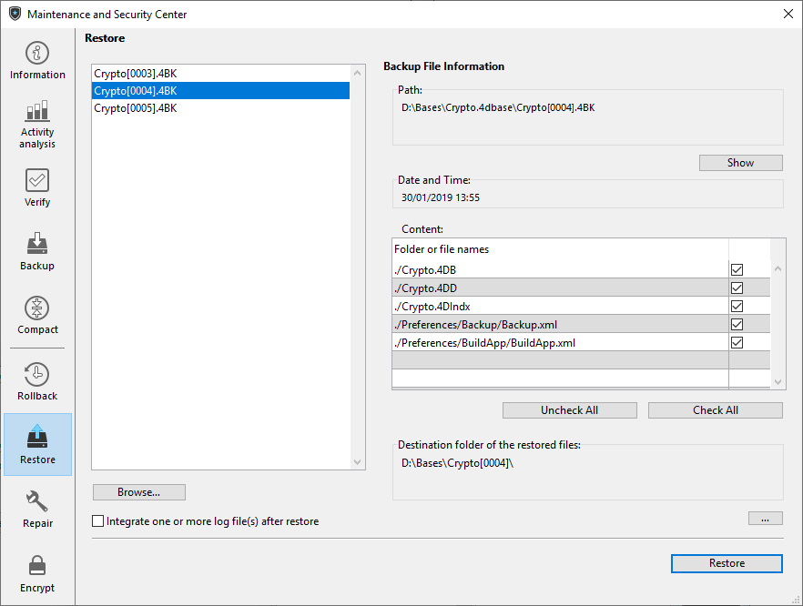

Puede restaurar manualmente un archivo de la aplicación actual utilizando la página **Restaurar**. Essa página fornece várias opções que podem ser usadas para controlar a restauração:

> Os sistemas de recuperação automática 4D restauram as aplicações e incluem o arquivo de registro de dados quando necessário.

A lista encontrada na parte esquerda da janela exibe todos os backups existentes da aplicação. También puede hacer clic en el botón **Navegar...** que se encuentra justo debajo del área para abrir cualquier otro archivo de una ubicación diferente. É então acrescentado à lista de arquivos.

Quando você seleciona um backup nessa lista, a parte direita da janela exibe as informações referentes a esse backup específico:

- **Ruta**: ruta de acceso completa del archivo de copia de seguridad seleccionado. Clicar no botão Mostrar abre o ficheiro de cópia de segurança numa janela do sistema.
- **Fecha y hora**: fecha y hora de la copia de seguridad.
- **Contenido**: contenido del archivo de copia de seguridad. Cada item da lista tem uma caixa de seleção ao lado que pode ser usada para indicar se você deseja restaurá-lo ou não. También puede utilizar los botones **Seleccionar todo** o **Deseleccionar todo** para definir la lista de los elementos que deben restaurarse.
- **Carpeta de destino de los archivos restaurados**: carpeta donde se colocarán los archivos restaurados. Por padrão, o 4D restaura os arquivos em uma pasta chamada "Archivename" (sem extensão) sendo colocada ao lado da pasta Project. Para cambiar esta ubicación, haga clic en **[...]** y designe la carpeta en la que desea colocar los archivos restaurados.

El botón **Restaurar** lanza la restauración manual del elemento o elementos seleccionados.

## Integração sucessiva de vários ficheiros de histórico

La opción **Integrar uno o varios archivos de historial tras la restauración** permite integrar sucesivamente varios archivos de registro de datos en una aplicación. Se, por exemplo, você tiver 4 arquivos de arquivo de diário (.4BL) correspondentes a 4 backups, poderá restaurar o primeiro backup e, em seguida, integrar os arquivos de diário (registro de dados) um a um. Isso significa que você pode, por exemplo, recuperar um arquivo de dados mesmo quando os últimos arquivos de backup estiverem faltando.

Quando essa opção está marcada, 4D exibe a caixa de diálogo padrão Abrir arquivo após a restauração, que pode ser usada para selecionar o arquivo de diário a ser integrado. A caixa de diálogo Abrir arquivo é exibida novamente após cada integração até ela ser cancelada.

## Restauração de um banco de dados criptografado

Lembre-se de que a chave de criptografia de dados (frase secreta) pode ter sido alterada em várias versões de arquivos de backup (.4BK), arquivos .journal (.4BL) e na aplicação atual. Devem ser sempre fornecidas chaves de encriptação correspondentes.

Ao restaurar um backup e integrar o arquivo de registro atual em um banco de dados criptografado:

- Se você restaurar um backup usando uma senha antiga, essa senha será exigida na próxima inicialização do banco de dados.
- Após uma criptografia, ao abrir o arquivo de dados criptografado, um backup é executado e um novo arquivo de diário é criado. Portanto, não é possível restaurar um arquivo .4BK criptografado com uma chave e integrar arquivos .4BL criptografados com outra chave.

A sequência seguinte ilustra os princípios de uma operação com várias chaves de backup/restauro:

| Operação                                         | Ficheiros gerados                                                                                       | Comentário                                                                                                                                                                                                                                                                                       |
| ------------------------------------------------ | ------------------------------------------------------------------------------------------------------- | ------------------------------------------------------------------------------------------------------------------------------------------------------------------------------------------------------------------------------------------------------------------------------------------------ |
| Novo ficheiro de dados                           |                                                                                                         |                                                                                                                                                                                                                                                                                                  |
| Adicionar dados (registo # 1) |                                                                                                         |                                                                                                                                                                                                                                                                                                  |
| Cópia de segurança do banco de dados             | 0000.4BL e 0001.4BK                                                     |                                                                                                                                                                                                                                                                                                  |
| Adicionar dados (registo # 2) |                                                                                                         |                                                                                                                                                                                                                                                                                                  |
| Cópia de segurança do banco de dados             | 0001.4BL e 0002.4BK                                                     |                                                                                                                                                                                                                                                                                                  |
| Adicionar dados (registo # 3) |                                                                                                         |                                                                                                                                                                                                                                                                                                  |
| Criptografar um arquivo de dados com key1        | Ficheiro 0003.4BK (encriptado com key1)                              | A criptografia salva os arquivos originais (incluindo o diário) na pasta "Replaced files (Encrypting) YYY-DD-MM HH-MM-SS". Ao abrir o arquivo de dados criptografados, um novo diário é criado e um backup é feito para ativar esse diário |
| Adicionar dados (registo #4)  |                                                                                                         |                                                                                                                                                                                                                                                                                                  |
| Cópia de segurança do banco de dados             | Ficheiros 0003.4BL e 0004.4BK (encriptados com key1) | Podemos restaurar 0003.4BK e integrar 0003.4BL                                                                                                                                                                                                                   |
| Adicionar dados (registo # 5) |                                                                                                         |                                                                                                                                                                                                                                                                                                  |
| Cópia de segurança do banco de dados             | Ficheiros 0004.4BL e 0005.4BK (encriptados com key1) | Podemos restaurar 0003.4BK e integrar 0003.4BL + 0004.4BL. Podemos restaurar 0004.4BK e integrar 0004.4BL                                                                                        |
| Adicionar dados (registo # 6) |                                                                                                         |                                                                                                                                                                                                                                                                                                  |
| Encriptação de um arquivo de dados com key2      | Ficheiro 0006.4BK (encriptado com key2)                              | A criptografia salva os arquivos originais (incluindo o diário) na pasta "Replaced files (Encrypting) YYY-DD-MM HH-MM-SS". Ao abrir o arquivo de dados criptografados, um novo diário é criado e um backup é feito para ativar esse diário |
| Adicionar dados (registo # 7) |                                                                                                         |                                                                                                                                                                                                                                                                                                  |
| Cópia de segurança do banco de dados             | Ficheiros 0006.4BL e 0007.4BK (encriptados com key2) | Podemos restaurar 0006.4BK e integrar 0006.4BL                                                                                                                                                                                                                   |
| Adicionar dados (registo # 8) |                                                                                                         |                                                                                                                                                                                                                                                                                                  |
| Cópia de segurança do banco de dados             | Ficheiros 0007.4BL e 0008.4BK (encriptados com key2) | Podemos restaurar 0006.4BK e integrar 0006.4BL + 0007.4BL. Podemos restaurar 0007.4BK e integrar 0007.4BL                                                                                        |

> Ao restaurar um backup e integrar um ou vários arquivos .4BL, os arquivos .4BK e .4BL restaurados devem ter a mesma chave de criptografia. Durante o processo de integração, se nenhuma chave de criptografia válida for encontrada no keychain 4D quando o arquivo .4BL for integrado, será gerado um erro.
>
> Se você tiver armazenado chaves de dados sucessivas no mesmo dispositivo externo, a restauração de um backup e a integração de arquivos de registro encontrarão automaticamente a chave correspondente se o dispositivo estiver conectado.
