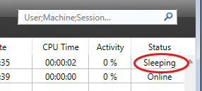

La página **Usuarios** lista los usuarios 4D conectados al servidor.

O botão "Usuários" indica, entre parênteses, o número total de usuários conectados ao servidor (este número não considera los filtros de exibição aplicados à janela). A página também contém uma área de pesquisa dinâmica e botões de controlo. Você pode modificar a ordem das colunas arrastando e soltando as áreas de cabeçalho deles.

Também pode ordenar a lista de valores da coluna clicando no respetivo cabeçalho. Clique várias vezes para especificar sucessivamente uma ordem ascendente/descendente.

## Lista de usuários

Para cada usuário conectado ao servidor, a lista fornece as seguintes informações:

- Sistema da máquina cliente (macOS ou Windows) como um ícone.
- **Usuário 4D**: nome do usuário 4D, ou alias se definido com o comando [`SET USER ALIAS`](../commands-legacy/set-user-alias.md) na máquina usuário. Se as senhas não são ativadas e nenhum alias foi definido, todos os usuários são chamados "Designer".
- **Nombre de máquina**: Nombre de la máquina remota.
- **Nombre de sesión**: nombre de la sesión abierta en la máquina remota.
- **Dirección IP**: dirección IP de la máquina remota.
- **Fecha de conexión**: fecha y hora de la conexión de la máquina remota.
- **Tiempos CPU**: tiempos procesador consumidos por este usuario desde la conexión.
- **Actividad**: ratio de tiempo que 4D Server dedica a este usuario (visualización dinámica).
- **Status**: "Online" or "Sleeping" if the remote machine has switched to sleep mode (see below).

### Gerir usuários adormecidos

4D Server lida especificamente com casos em que uma máquina executando uma aplicação remota 4D muda para modo de suspensão enquanto sua conexão com a máquina do servidor ainda está ativa. Neste caso, o aplicativo remoto 4D conectado notifica automaticamente o Servidor 4D da sua desconexão iminente. On the server, the connected user changes to a **Sleeping** status:

Este estado liberta recursos no servidor. Além disso, a aplicação remota 4D reconecta ao servidor 4D automaticamente após acordar do modo de suspensão.

O seguinte cenário é suportado: um usuário remoto parou de funcionar durante algum tempo, por exemplo, durante uma pausa no almoço, mas mantém a conexão com o servidor aberta. A máquina passa para o modo de suspensão. Quando o usuário retorna, acordaram a máquina e a aplicação remota 4D recupera automaticamente a sua conexão com o servidor, bem como o contexto da sessão.

> Uma sessão remota de sono é automaticamente desligada pelo servidor após 48 horas de inatividade. Você pode modificar esse tempo limite padrão usando o comando [`SET DATABASE PARAMETER`](../commands-legacy/set-database-parameter.md) com o seletor `Remote connection sleep timeout`.

## Área de pesquisa/filtragem

Este recurso pode ser usado para reduzir o número de linhas exibidas na lista com aquelas que correspondem ao texto inserido na área de busca. A área indica as colunas onde a pesquisa/filtragem será realizada. Na página de usuários, será o usuário 4D, nome de máquina e colunas de nome de sessão.

A lista é atualizada em tempo real à medida que o texto é introduzido na área. É possível digitar mais de um valor a ser pesquisado: separe os valores com ponto e vírgula. En este caso se utiliza el operador de tipo `OR`. Por exemplo, se você digitar "John;Mary;Peter", apenas linhas com John OR Mary OR Peter nas colunas alvo serão mantidas.

## Botões de administração

Esta página inclui três botões de controlo. Esses botões estarão ativos se pelo menos uma linha estiver selecionada. Puede seleccionar varias líneas manteniendo presionada la tecla **Mayús** para una selección adyacente o **Ctrl** (Windows) / **Comando** (macOS) llave para una selección no adyacente.

### Enviar mensagem

Este botão pode ser usado para enviar uma mensagem para os usuários 4D selecionados na janela. Se nenhum usuário estiver selecionado, o botão não está ativo. Quando você clica neste botão, aparece uma caixa de diálogo que permite inserir a mensagem. A caixa de diálogo indica o número de usuários que irão receber esta mensagem:

A mensagem será apresentada como um alerta nas máquinas remotas.

> É possível executar a mesma ação para usuários remotos com o comando [`SEND MESSAGE TO REMOTE USER`](../commands-legacy/send-message-to-remote-user.md).

### Visualizar processos

Este botão pode ser usado diretamente para mostrar os processos do(s) usuário(s) selecionado(s) na página [**Processos**](processes.md) da janela. Quando você clicar neste botão, o 4D Server alterna para a página Processos e entra nos nomes de usuário selecionados na área de pesquisa/filtragem.

### Drop user

Este botão pode ser utilizado para forçar a desconexão do(s) usuário(s) selecionado(s). When you click on this button, a warning dialog box appears so that you can confirm or cancel this operation (hold down **Alt** key while clicking on the **Drop user** button to disconnect the selected user(s) directly without displaying the confirmation dialog box).

> É possível executar a mesma ação para usuários remotos com o comando [`DROP REMOTE USER`](../commands-legacy/drop-remote-user.md).

