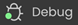
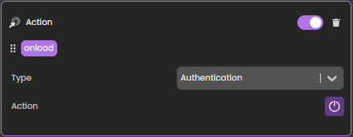

**Qodly Studio** é um construtor de interfaces para aplicações web. Ele fornece aos desenvolvedores um editor gráfico de página para projetar aplicativos que são executados em navegadores web ou smartphones. Ele suporta nativamente os [objetos ORDA](../ORDA/overview.md).

Você pode usar Qodly Studio diretamente do seu **ambiente 4D** para criar interfaces modernas e sofisticadas que podem ser facilmente integradas aos seus projetos 4D existentes e implementadas **no local**.

Qodly Studio também pode ser usado na [**plataforma Qodly Cloude**](https://qodly.com), dedicada ao desenvolvimento de aplicativos de negócios web.

Qodly Studio propõe uma interface de usuário web completa permitindo que você:

- crie páginas Qodly colocando componentes em uma tela
- mapeie componentes para Qodly Sources
- acione o código 4D configurando eventos
- e muito mais.

## Configuração

### Requisitos

#### Navegador

Qodly Studio suporta os seguintes navegadores Web:

- Chrome
- Edge
- FireFox

A resolução recomendada é 1920x1080.

#### Aplicação 4D

- Desenvolvimento: 4D v20 R2 ou superior
- Desenvolvimento: 4D Server v20 R2 ou superior
- Qodly Studio só funciona com projetos 4D (bancos de dados binários não são suportados).
- Sessões Web (*aka* realizáveis) precisam [estar habilitadas](sessions.md#enabling-web-sessions).
- O código 4D chamado pelos formulários Qodly deve ser [thread-safe](preemptiveWeb.md).

### Habilitando o acesso a Qodly Studio

Por padrão, o acesso a Qodly Studio não é concedido.

O Qodly Studio é servido pelo [servidor web WebAdmin](../Admin/webAdmin.md) e exibe dados de projetos 4D tratados pelo [servidor web](webServer.md).

Para permitir o acesso ao Qodly Studio, você deve permiti-lo explicitamente em dois níveis:

- ao nível da aplicação 4D
- a nível do projeto

Se um dos dois níveis (ou ambos) não estiver habilitado, o acesso ao Qodly Studio é negado (uma página 403 é retornada).

#### No nível 4D

Como primeiro nível de segurança, você precisa [permitir o acesso a Qodly Studio no servidor WebAdmin](../Admin/webAdmin.md#enable-access-to-qodly-studio). Essa configuração se aplica ao aplicativo 4D (4D ou servidor 4D) na máquina de host. Todos os projetos abertos com essa aplicação 4D consideram essa configuração.

Mantenha essa opção desmarcada se você quiser ter certeza de que nenhum acesso ao Qodly Studio é permitido no aplicativo. Marque esta opção para ser possível acessar a Qodly Studio. No entanto, você ainda precisa habilitá-lo em todos os níveis do projeto.

Além disso, você pode [configurar a porta HTTP/HTTPS do servidor WebAdmin usada](../Admin/webAdmin.md#accept-http-connections-on-localhost).

:::note

Após qualquer alteração nessas configurações, você deve [reiniciar o servidor WebAdmin](../Admin/webAdmin.md#start-and-stop) para que a nova configuração entre em vigor.

:::

#### A nível do projeto

Depois de ter ativado o acesso ao Estúdio Qodly no nível 4D, você precisa designar explicitamente todos os projetos que podem ser acessados. A opção **Ativar acesso a Qodly Studio** deve ser ativada na página [Recursos Web das Configurações da aplicação 4D](../settings/web.md#enable-access-to-qodly-studio).

Tenha em mente que [configurações do usuário](../settings/overview.md) podem ser definidas em vários níveis e que as prioridades se aplicam.

### Ativando autenticação

A autenticação no servidor web WebAdmin é concedida usando uma chave de acesso. Para mais detalhes, consulte [Chave de Acesso](../Admin/webAdmin.md#access-key).

### Desenvolvimento e implantação

De acordo com a gestão de projetos 4D, somente são suportados os seguintes usos:

- o desenvolvimento com Qodly Studio deve ser feito usando **4D** (monousuário).
- implantação de aplicações 4D com páginas Qodly deve ser feita usando **4D Server**.

:::warning

Você pode abrir Qodly Studio, [depurar](#using-qodly-debugger-on-4d-server) e editar páginas Qodly diretamente em uma máquina de servidor 4D quando um projeto é executado no modo interpretado. Esse recurso só é fornecido para fins de teste e depuração, por exemplo, para avaliar o fluxo do aplicativo com dados reais ou em ambiente multiusuário. NÃO deve ser considerado como uma forma regular de desenvolver aplicativos, uma vez que não fornece controle sobre acessos simultâneos.

:::

## Abertura do Qodly Studio

A página Qodly Studio está disponível quando o [servidor web WebAdmin](../Admin/webAdmin.md#start-and-stop) e a autenticação está ativada (veja acima).

Há duas maneiras de acessar Qodly Studio:

- selecionando o comando de menu **Qodly Studio...** do menu **Design** (4D single-user) ou o menu **Window** (servidor 4D).
    Se o servidor web WebAdmin já estiver rodando, dependendo de sua configuração, seu navegador padrão abre em `IPaddress:HTTPPort/studio` ou `IPaddress:HTTPSPort/studio`. Caso contrário, você será solicitado se quiser iniciar o servidor web WebAdmin primeiro.

- em um navegador, com o servidor web WebAdmin executando (lançado pelo servidor 4D ou 4D), digite o seguinte endereço:<br/>
    `IPaddress:HTTPPort/studio`

    ou :

    `IPaddress:HTTPSPort/studio`

    Por exemplo, depois de lançar um servidor web local na porta 7080, digite esse endereço no seu navegador:

    `localhost:7080/studio`

    Em seguida, você será solicitado a entrar na [chave de acesso](../Admin/webAdmin.md#access-key) para acessar Qodly Studio.

## Desenvolver com Qodly Studio

### Documentação

A documentação do Qodly Studio está disponível no [site da documentação Qodly](https://developer.qodly.com/docs/studio/overview).

Você pode confiar nesta documentação e seus recursos associados para o desenvolvimento de aplicativos web fornecidos por páginas Qodly. No entanto, dependendo da etapa de implementação, desenvolvedores 4D usarão Qodly Studio ou 4D IDE (veja [Comparação das funcionalidades](#feature-comparison)).

Exemplos de código são fornecidos em [QodlyScript](https://developer.qodly.com/docs/category/qodlyscript), mas uma vez que o QodlyScript herda do idioma 4D, você não será perdido. Para obter mais informações, consulte a página [De QodlyScript a 4D](from-qodlyscript-to-4d.md).

:::info

Não há compatibilidade direta entre aplicativos implementados com 4D e aplicativos implementados com Qodly.

:::

### Comparação de funcionalidades

|                                                                                         | Qodly Studio no 4D                                                                                                                                                                                                    | Estúdio Qodly na plataforma Qodly Cloud                                                |
| --------------------------------------------------------------------------------------- | --------------------------------------------------------------------------------------------------------------------------------------------------------------------------------------------------------------------- | -------------------------------------------------------------------------------------- |
| Visualizar e editar tabelas (classes de dados), atributos e relações | Editor de estrutura 4D(1)                                                                                                                                                                          | Qodly Studio Model Editor                                                              |
| Páginas Qodly                                                                           | Editor de páginas Qodly Studio                                                                                                                                                                                        | Editor de páginas Qodly Studio                                                         |
| Formulários para desktop                                                                | 4D IDE                                                                                                                                                                                                                | *não suportado*                                                                        |
| Linguagem de programação                                                                | Linguagem 4D com ORDA                                                                                                                                                                                                 | [QodlyScript](https://developer.qodly.com/docs/category/qodlyscript) apresentando ORDA |
| IDE de codificação                                                                      | 4D IDE code editor *or* VS Code with [4D-Analyzer extension](https://github.com/4d/4D-Analyzer-VSCode)<br/>*4D Server only*: Qodly Studio code editor (see (2)) | Editor de código Qodly Studio                                                          |
| Depurador                                                                               | 4D IDE debugger<br/>*4D Server only*: Qodly Studio debugger (see [this paragraph](#using-qodly-debugger-on-4d-server))                                                             | Depurador Qodly Studio                                                                 |
| Funções e privilégios REST/Web                                                          | editor direto roles.json editar/editor de privilégios e funções Qodly Studio                                                                                                                          | Editor Qodly Studio papel e privilégios                                                |

(1) O item **Modelo** está desativado no Qodly Studio.<br/>
(2) No servidor 4D, a abertura de código 4D com o editor de código Qodly Studio é suportada **para fins de teste e depuração** (veja [esse parágrafo](#development-and-deployment)). Note que em 4D único usuário, se você abrir algum código 4D com o editor de código Qodly Studio cor de sintaxe não está disponível e um aviso "Lsp não carregado" é exibido.

### Línguagem

Os seguintes comandos e classes são dedicados ao gerenciamento do servidor das páginas de Qodly:

- Comando [`Web Form`](../API/WebFormClass.md#web-form): retorna a página Qodly como um objeto.
- comando [`Web Event`](../API/WebFormClass.md#web-event): retorna eventos acionados nos componentes da página Qodly.
- clase [`WebForm`](../API/WebFormClass.md): funções e propriedades para gerenciar a página Qodly renderizada.
- Classe [`WebFormItem`](../API/WebFormItemClass.md): funções e propriedades para gerenciar componentes de página Qodly.

### Uso de métodos projeto

Recomendamos o uso de funções classe em vez de métodos projeto. Apenas as funções de classe podem ser chamadas a partir de componentes. No entanto, você ainda pode usar seus métodos projeto no Qodly Studio de duas maneiras:

- Você pode chamar seus métodos a partir de funções classe.
- Você pode diretamente [executar seus métodos](https://developer.qodly.com/docs/studio/coding#methods-and-classes) do Explorador Qodly.

### Uso fora de linha

Você pode desenvolver com o Qodly Studio enquanto seu computador não estiver conectado à internet. Nesse caso, entretanto, os seguintes recursos não estão disponíveis:

- [Templates](https://developer.qodly.com/docs/studio/pageLoaders/templates): a biblioteca de templates está vazia
- Dicas da UI: elas não são exibidas quando você clica .

## Implantação

### Ativação da renderização

O Qodly Studio encapsula páginas Qodly, incluindo layout, conexões de dados e lógica impulsionada por eventos, em um arquivo JSON estruturado. Este arquivo JSON é processado on-fly pelo **Renderizador Qodly** para servir uma página web totalmente funcional.

:::info

Veja [esta página](https://developer.qodly.com/docs/studio/rendering) para informações detalhadas sobre como renderizar páginas Qodly em Qodly.

:::

Para ativar a renderização das páginas Qodly, as seguintes opções devem ser definidas.

- A opção **Propriedades** > **Web** > **Funcionalidades Web** > [**Expor como servidor REST**](../settings/web.md#expose-as-rest-server) deve ser ativada.
- O [servidor Web 4D] (webServer.md) deve estar em execução.

:::note

[Botões de renderização](https://developer.qodly.com/docs/studio/rendering#how-to-render-a-webform) não estarão disponíveis se as opções de configuração não estiverem ativadas.

:::

### Escopo dos formulários Qodly

Ao renderizar formulários Qodly no Qodly Studio, o renderizador se conectará ao servidor web 4D por HTTP ou HTTPS, dependendo das configurações, seguindo o mesmo padrão de conexão HTTP/HTTPS do servidor web [4D WebAdmin](../Admin/webAdmin.md#accept-http-connections-on-localhost). Consulte também [este parágrafo](#about-license-usage-for-rendering) sobre esquemas de URL e uso de licenças.

Tenha em mente que o Qodly Studio é executado pelo servidor web 4D WebAdmin. Quando você usa o Qodly Studio como desenvolvedor, mesmo quando você pré-visualizar uma Página Qodly no estúdio, você está usando o servidor web 4D WebAdmin. Isso permite que você veja dataclassas, funções e atributos que não são expostos como recursos REST por exemplo (eles são cinzas).

No entanto, a renderização de página acontece fora do Qodly Studio e é servida pelo servidor web 4D padrão. Nesta situação, sua aplicação web não pode acessar arquivos que não estão expostos como recursos REST. Veja [Exposta vs funções não expostas](../ORDA/ordaClasses.md#exposed-vs-non-exposed-functions) e [Exposição de tabelas](../REST/configuration.md#exposing-tables) para obter mais informações sobre como expor ativos.

### Acessar páginas Qodly

Para implantação, o servidor WebAdmin não é necessário. O acesso do usuário final ao seu aplicativo web feito com Qodly Studio é baseado no protocolo REST 4D, e como tal, funciona como através de uma aplicação tradicional de 4D remota.

Suas páginas de Qodly estão disponíveis através do seguinte url:

```
IP:port/$lib/renderer/?w=QodlyPageName
```

...onde *IP:porta* representa o endereço do servidor web e *QodlyPageName* é o nome da página Qodly.

Por exemplo:

```
https://www.myWebSite.com/$lib/renderer/?w=welcome
```

### Pré-visualizar Qodly do aplicativo

Você pode pré-visualizar seu aplicativo Qodly a qualquer momento selecionando o **aplicativo de visualização Qodly. .** comando no menu **Windows** (4D Server) ou no menu **Design** (4D single-user).

Este comando inicia o renderizador Qodly em um endereço local em seu navegador padrão e exibe a **página inicial** [definida nas configurações do aplicativo](https://developer.qodly.com/docs/studio/settings#start-page) do Qodly Studio.

### Usando depurador Qodly no Servidor 4D

Ao usar páginas Qodly em um aplicativo de servidor 4D implantado (modo interpretado), você pode encontrar alguns casos onde você precisa depurar suas páginas no servidor, por exemplo, quando é necessária uma configuração específica do usuário. Neste caso, você pode anexar o [depurador Qodly Studio](https://developer.qodly.com/docs/studio/debugging) ao servidor 4D e, então, beneficie de seus recursos ao executar suas páginas de Qodly.

Note que, nesse caso, o depurador do Qodly Studio exibirá todo o código executado no servidor, de acordo com a regra de depurador anexada no servidor 4D](../Debugging/debugging-remote.md#attached-debugger).

Para anexar depurador do Qodly Studio ao seu aplicativo 4D Servidor:

1. [Abrir Qodly Studio](#opening-qodly-studio) do servidor 4D.

:::note

O projeto deve estar sendo executado no modo interpretado para que o item de menu **Qodly Studio** esteja disponível.

:::

2. Na barra de ferramentas Qodly Studio, clique no botão **Debug**.<br/>
    

Se a sessão de depuração iniciar com sucesso, um marcador verde aparece no rótulo de botão e você pode usar o depurador de Qodly Studio.

Se o depurador já estiver anexado a outra máquina ou outra página do Qodly Studio, um erro será exibido. Você tem que separá-lo antes da outra localização.

Para desanexar o depurador Qodly Studio da sua aplicação 4D Server:

1. Clique no botão **Debug** na barra de ferramentas Qodly Studio enquanto uma sessão de depuração está ativa.
    Uma caixa de diálogo de aviso solicitará que você confirme se deseja desanexar o depurador.
2. Selecione **Manter em progresso** para continuar avaliando o código até o final do método ou função atual antes de desconectar o depurador, ou **Parar** para desanexar o depurador imediatamente.

## Forçar login

Com Qodly Studio for 4D, o [modo "forçar login"](../REST/authUsers.md#force-login-mode) permite controlar o número de sessões web abertas que requerem licenças cliente 4D. Você também pode fazer [desconectar](#logout) o usuário a qualquer momento para diminuir o número de licenças retidas.

### Configuração

Certifique-se de que o [modo "forçar login"](../REST/authUsers.md#force-login-mode) está ativado para sua aplicação 4D na [Página de papéis e privilégios](https://developer.qodly.com/docs/studio/roles/rolesPrivilegesOverview), usando a opção **Forçar login**:


Você também pode definir essa opção diretamente no arquivo [**roles.json**](../ORDA/privileges.md#rolesjson-file).

Você só precisa então implementar a função [`authentify()`](../REST/authUsers.md#function-authentify) na classe datastore e chamá-lo a partir da página Qodly. Uma licença só será consumida quando o usuário for realmente registrado.

:::note Compatibidade

Quando o modo de login legado ([obsoleto a partir de 4D 20 R6](https://blog.4d.com/force-login-becomes-default-for-all-rest-auth)) estiver ativado, qualquer solicitação REST, incluindo a renderização de uma página Qodly de autenticação, cria uma sessão web no servidor e obtém uma licença 4D do cliente, qualquer que seja o resultado real da autenticação. Para mais informações, consulte [este post do blog](https://blog.4d.com/improved-4d-client-licenses-usage-with-qodly-studio-for-4d) que conte a história completa.

:::

#### Exemplo

Em uma página Qodly simples com entradas de login/senha, um botão "Enviar" chama a seguinte função `authentify()` que implementamos na classe DataStore:

```4d

exposed Function authentify($credentials : Object) : Text

var $salesPersons : cs.SalesPersonsSelection
var $sp : cs.SalesPersonsEntity

$salesPersons:=ds.SalesPersons.query("identifier = :1"; $credentials.identifier)
$sp:=$salesPersons.first()

If ($sp#Null)
	If (Verify password hash($credentials.password; $sp.password))

		Session.clearPrivileges()
		Session.setPrivileges("") //guest session

		return "Authentication successful"
	Else
		return "Wrong password"
	End if
Else
	return "Wrong user"
End if
```

Esta chamada é aceita e enquanto a autenticação não for bem sucedida, o `Session.setPrivileges()` não é chamado, portanto nenhuma licença é consumida. Uma vez que `Session.setPrivileges()` é chamada, uma licença de cliente 4D é usada e qualquer solicitação REST é então aceita.

### Encerrar sessão

Quando o modo ["force login" está ativado](#force-login), o Qodly Studio for 4D permite que você implemente um recurso de logout em seu aplicação.

Para fazer o logout do usuário, basta executar a ação padrão **Logout** na página Qodly. No Qodly Studio, você pode associar essa ação padrão a um botão por exemplo:



Ativar a ação de logout de uma sessão do usuário web tem os seguintes efeitos:

- a sessão usuário web atual perde seus privilégios, apenas as [requisições REST descritivas](../REST/authUsers.md#descriptive-rest-requests) são permitidas,
- a licença associada ao 4D é liberada,
- o `Session.storage` é mantido até que o tempo limite de inatividade da sessão web seja atingido (pelo menos uma hora). Durante esse período após um logout, se o usuário logar novamente, a mesma sessão é usada e a `Sessão. o objeto compartilhado de torage` está disponível com seu conteúdo atual.

## Sobre o uso da licença para renderização

No modo padrão quando qualquer página é renderizada, ou no modo de "forçar login" quando um tratamento de página de dados ou uma função for renderizada, você deve ter uma licença disponível, pois renderizar formulários Qodly visa ao servidor principal do banco de dados do projeto.

### Esquemas URL

A configuração do esquema URL de Qodly Studio (HTTP e HTTPS) determina quantas licenças são retidas ao renderizar os formulários Qodly. Com a configuração apropriada, você pode evitar a manutenção da licença desnecessária.

Como explicado na seção [configuração](#configuration), o servidor web WebAdmin fornece um acesso web seguro a Qodly Studio. Por outro lado, o [motor de renderização](#enabling-rendering) se comunica com o servidor web 4D do banco de dados usando solicitações REST. Dessa forma, se comporta como um Cliente 4D convencional.

Se você executar o renderizador a partir do Qodly Studio e esses dois servidores web não forem acessados através do mesmo esquema de URL (HTTP ou HTTPS), isso pode levar a uma contagem incorreta de licenças.

:::info

O uso de diferentes esquemas também pode levar a problemas [sessão](sessions.md), como a perda [privilégios](../ORDA/privileges.md) após a atualização da página.

:::

#### Exemplo

1. Você executa Qodly Studio em um esquema URL HTTPS (por exemplo, `https://127.0.0.1:7443/studio/`)

2. O servidor da Web do seu banco de dados é iniciado somente em uma porta HTTP.


3. No Qodly Studio, você clica no ícone **Preview**. Você está avisado que os dois servidores web estão iniciados em esquemas diferentes, mas apesar disso você clique no botão **Confirmar**.


Como resultado, duas licenças são mantidas.

:::note

Você pode ativar/desativar a exibição do pop de renderização usando uma configuração Qodly Studio

:::

### Atributo SameSite

O comportamento descrito anteriormente é devido ao cookie de sessão do servidor web 4D. Este cookie de sessão tem um atributo `SameSite` que determina se o cookie de sessão é enviado para o servidor web.

Se o valor do atributo `SameSite` for `Strict` (padrão), o cookie de sessão não será enviado para o servidor web, então uma nova sessão é aberta cada vez que uma página é renderizada ou atualizada.

Para mais informações sobre o atributo `SameSite`, confira [este post do blog](https://blog.4d.com/get-ready-for-the-new-SameSite-and-secure-attributes-for-cookies/).

### Recomendações

Para evitar o uso de mais licenças do que o necessário, recomendamos fazer um dos seguintes:

- Execute o renderizador em outra aba do navegador (digitando a URL renderizada da sua página Qodly: `IP:port/$lib/renderer/?w=QodlyPageName`).
- Assegure-se de que o Qodly Studio e seu banco de dados sejam acessados no mesmo esquema de URL.
- Use o valor `Lax` para o [cookie de sessão](webServerConfig.md#session-cookie-samesite) do servidor web do banco de dados do seu projeto.

