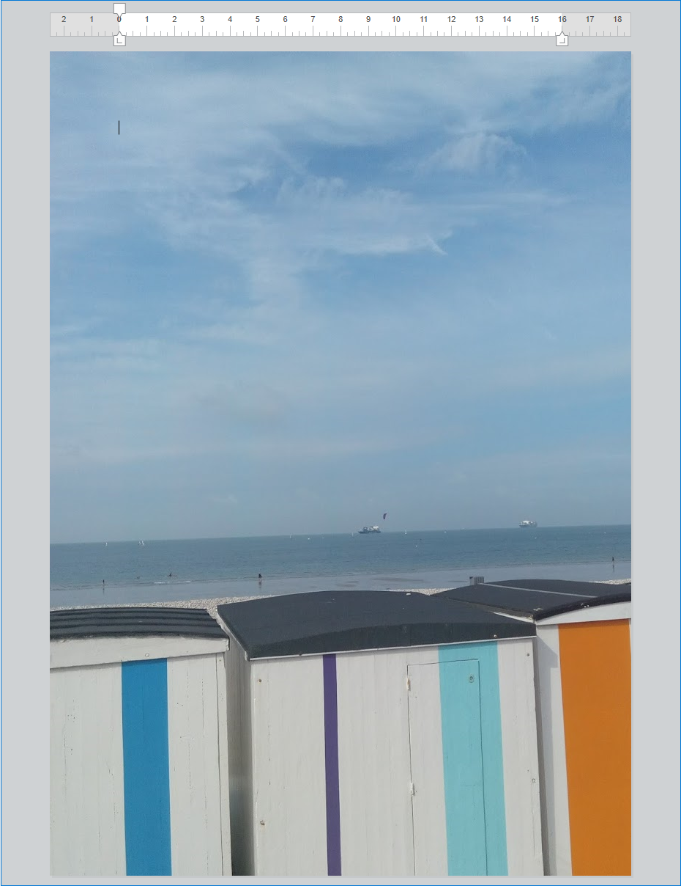

<!--REF #_command_.WP SET ATTRIBUTES.Syntax-->**WP SET ATTRIBUTES** ( *targetObj* ; *attribName* ; *attribValue* {; *attribName2* ; *attribValue2* ; ... ; *attribNameN* ; *attribValueN*} )<br/>**WP SET ATTRIBUTES** ( *targetObj* ; *attribObj* )<!-- END REF-->

<!--REF #_command_.WP SET ATTRIBUTES.Params-->

| Parâmetro   | Tipo                                            |                             | Descrição                                                                  |
| ----------- | ----------------------------------------------- | --------------------------- | -------------------------------------------------------------------------- |
| targetObj   | Object                                          | &#8594; | Intervalo ou elemento ou documento 4D Write Pro                            |
| attribName  | Text                                            | &#8594; | Nome do atributo a ser definido                                            |
| attribValue | Text, Number, Object, Collection, Picture, Date | &#8594; | Novo valor de atributo                                                     |
| attribObj   | Object                                          | &#8594; | Objeto contendo nomes de atributo e seus valores correspondentes a definir |

<!-- END REF-->

## Descrição

O comando **WP REDEFINIR ATTRIBUTES** <!--REF #_command_.WP REDEFINIR ATTRIBUTES. ummary--> permite que você reinicie o valor de um ou mais atributos no intervalo, elemento ou documento passado como parâmetro.<!-- FIM REF--> Este comando lhe dá acesso a qualquer tipo de atributo interno da 4D Write Pro: caractere, parágrafo, tabela ou imagem.

Em *targetObj*, você pode passar:

- um intervalo, ou
- um elemento (cabeçalho / rodapé / corpo / tabela / linha / parágrafo / imagem incorporada ou incorporada em linha / seção / subseção / folha de estilo), ou
- um documento 4D Write Pro

Você pode especificar atributos para *targetObj* de uma de duas maneiras:

- Use os parâmetros *attribName* e *attribValue*. Em *attribName*, passe o nome do atributo para definir para o alvo e em *attribValue*, passe o novo valor para o conjunto. Você pode passar tantos pares *attribName*/*attribValue* quanto quiser em uma única chamada.

- Use o parâmetro *attribObj* para passar um único objeto contendo nomes de atributo e seus valores correspondentes como propriedades do objeto.

Para uma lista completa de atributos a passar, bem como seu escopo e respectivos valores, por favor consulte a seção *4D Write Pro Atributes*.

## Exemplo 1

Nesta área 4D Write Pro, você selecionou uma palavra:


Se executar o seguinte código:

```4d
 $range:=WP Get selection(*;"WParea") //recupera o intervalo selecionado
 
  // define o offset sombra no texto selecionado
 WP SET ATTRIBUTES($range;wk text shadow offset;1)
  //define o parágrafo padding
 WP SET ATTRIBUTES($range;wk padding;1)
  //define uma borda de 10 pt
 WP SET ATTRIBUTES($range;wk border style;wk solid;wk border width;10)
  //define as cores do limite
 WP SET ATTRIBUTES($range;wk border color;"blue";wk border color bottom;"#00FA9A";wk border color right;"#00FA9A")
```

Você recebeu o seguinte resultado:


## Exemplo 2

Você recebeu o seguinte resultado:

```4d
 $wpRange:=WP Get selection(writeProdoc)
 WP SET ATTRIBUTES($wpRange;wk border style+wk inside;wk dotted)
 WP SET ATTRIBUTES($wpRange;wk border style+wk outside;wk solid)
 WP SET ATTRIBUTES($wpRange;wk border color+wk outside;"#00FA9A")
```

Supondo que todos os conteúdos foram selecionados, o resultado é:


## Exemplo 3

Se quiser definir uma imagem de fundo para o documento:

```4d
 var WParea : Object
 WParea:=WP New
 
 READ PICTURE FILE("C:\\Pictures\\boats.jpg";$picture)
 
 WP SET ATTRIBUTES(WParea;wk background image;$picture)
```

O resultado é:


Se quiser definir uma imagem de fundo que cubra toda a área de impressão. Todos os atributos são passados usando um único objeto:

```4d
 var WParea : Object
 WParea:=WP New
 
 READ PICTURE FILE("C:\\Pictures\\boats.jpg";$picture)
 
 $myAttributes:=New object()
 $myAttributes[wk background image]:=$picture
 $myAttributes[wk background clip]:=wk paper box
 $myAttributes[wk background origin]:=wk paper box

 WP SET ATTRIBUTES(WParea;$myAttributes)
```

O resultado é:



:::note

O valor da caixa de papel só é aplicável a documentos e seções.

:::

## Exemplo

Se quiser definir abas em intervalos variados e designar um caractere como o caractere principal na última aba:

```4d
 $tab1:=New object()
 $tab1[wk type]:=wk left
 $tab1[wk offset]:="3cm"
 $tab1[wk leading]:=""
 
 $tab2:=New object()
 $tab2[wk type]:=wk center
 $tab2[wk offset]:="8cm"
 $tab2[wk leading]:=""
 
 $tab3:=New object()
 $tab3[wk type]:=wk right
 $tab3[wk offset]:="12cm"
 $tab3[wk leading]:="."
 
 $_tabs:=New collection($tab1;$tab2;$tab3)
 WP SET ATTRIBUTES(wpArea;wk tabs;$_tabs)
```

O resultado é:


## Veja também

*4D Write Pro Attributes*\
[WP GET ATTRIBUTES](../commands/wp-get-attributes.md)\
[WP RESET ATTRIBUTES](../commands/wp-reset-attributes.md)