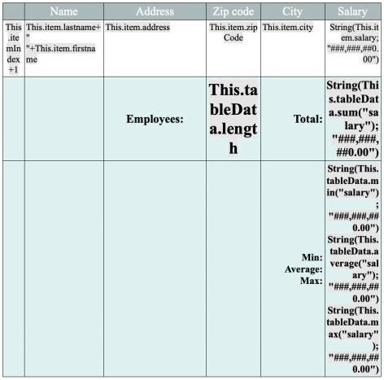
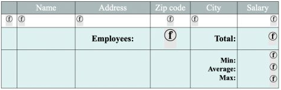
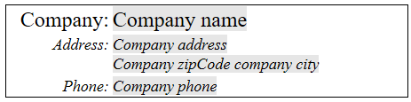

## Visão Geral

Os documentos 4D Write Pro podem conter referências a fórmulas 4D, como variáveis, campos, expressões, métodos de projeto ou comandos 4D. Informações específicas, como o número da página, também podem ser referenciadas por meio de fórmulas (consulte [Inserção de expressões de documento e página](#inserting-date-and-time-formulas) abaixo).

A inserção de fórmulas nas áreas do 4D Write Pro é feita com o comando [**WP INSERT FORMULA**](commands/wp-insert-formula.md) e pode ser lida com o comando [**WP Get formulas**](commands-legacy/wp-get-formulas.md). Eles também são devolvidos pelo comando [**WP Get text**](commands-legacy/wp-get-text.md).

As fórmulas são avaliadas:

- quando são inseridos em um objeto de formulário que exibe valores computados
- quando o objeto 4D Write Pro é carregado em um objeto de formulário que exibe valores computados
- quando o comando [**WP COMPUTE FORMULAS**](commands-legacy/wp-compute-formulas.md) for chamado
- quando são "congelados" usando o comando [**WP FREEZE FORMULAS**](commands-legacy/wp-freeze-formulas.md) (se ainda não tiverem sido computados)
- antes da impressão (se ainda não tiver sido computado)
- antes de exportar para .docx (se a fórmula não puder ser mapeada com fórmulas do MS Word)
- quando as ações padrão para congelar, imprimir, exportar ou calcular fórmulas são chamadas. Veja *Ações padrão*

As fórmulas não são avaliadas quando um documento é carregado (usando [**WP New**](commands-legacy/wp-new.md), [**WP Insert document body**](commands/wp-insert-document-body.md), ou `wpArea:=[table]field`):

- se o documento estiver apenas fora da tela,
- se o documento for exibido na tela, mas o objeto de formulário mostrar apenas referências.

As fórmulas se tornam valores estáticos se você chamar o comando [**WP FREEZE FORMULAS**](commands-legacy/wp-freeze-formulas.md) (exceto para número de página e contagem de páginas, veja abaixo).

**Nota de compatibilidade**: *O manuseio de expressões usando os comandos [**ST INSERT EXPRESSION**](../commands-legacy/st-insert-expression.md), [**ST Get expression**](../commands-legacy/st-get-expression.md), [**ST COMPUTE EXPRESSIONS**](../commands-legacy/st-compute-expressions.md) e [**ST FREEZE EXPRESSIONS**](../commands-legacy/st-freeze-expressions.md) está obsoleto; no entanto, ele ainda é suportado no 4D Write Pro para fins de compatibilidade*.

### Exemplo

Você deseja substituir a seleção em uma área do 4D Write Pro pelo conteúdo de uma variável:

```4d
 var fullName: Text
 var $sel: Object
 fullName:="John Smith"
 $sel:=WP Selection range(4DWPArea)
 Case of
    :(Form event code=On Clicked)
       WP INSERT FORMULA($sel;Formula(fullName);wk replace)
 End case
```

## Objeto de contexto de fórmula

Você pode inserir expressões especiais relacionadas aos atributos de documento em qualquer área de documento (corpo, cabeçalho, rodapé) usando o comando [WP Insert formula](commands/wp-insert-formula.md). Em uma fórmula, um objeto de contexto de fórmula é exposto automaticamente. Você pode usar as propriedades desse objeto por meio de [**This**](../commands/this.md):

| Propriedades                                                                   | Tipo   | Descrição                                                                                                                                                                                                                                                                                                                                                                                  |
| ------------------------------------------------------------------------------ | ------ | ------------------------------------------------------------------------------------------------------------------------------------------------------------------------------------------------------------------------------------------------------------------------------------------------------------------------------------------------------------------------------------------ |
| [This](../commands/this.md).title                              | Text   | Título definido no atributo wk title                                                                                                                                                                                                                                                                                                                                                       |
| [This](../commands/this.md).author                             | Text   | Autor definido no atributo wk author                                                                                                                                                                                                                                                                                                                                                       |
| [This](../commands/this.md).subject                            | Text   | Assunto definido no atributo wk subject                                                                                                                                                                                                                                                                                                                                                    |
| [This](../commands/this.md).company                            | Text   | Empresa definida no atributo wk company                                                                                                                                                                                                                                                                                                                                                    |
| [This](../commands/this.md).notes                              | Text   | Notas definidas no atributo wk notes                                                                                                                                                                                                                                                                                                                                                       |
| [This](../commands/this.md).dateCreation                       | Date   | Data de criação definida no atributo wk date creation                                                                                                                                                                                                                                                                                                                                      |
| [This](../commands/this.md).dateModified                       | Date   | Data de modificação definida no atributo wk date modified                                                                                                                                                                                                                                                                                                                                  |
| [This](../commands/this.md).pageNumber (\*) | Number | Número de página conforme definido<li>:- A partir do início do documento (padrão) ou </li><li>- A partir do início da página da seção, se for definido pelo início da página da seção.</li> Esta fórmula é sempre dinâmica; não é afetada pelo comando [**WP FREEZE FORMULAS**](commands-legacy/wp-freeze-formulas.md). |
| [This](../commands/this.md).pageCount (\*)  | Number | Contagem de páginas: contagem total de páginas.<br/> Esta fórmula é sempre dinâmica; não é afetada pelo comando [**WP FREEZE FORMULAS**](commands-legacy/wp-freeze-formulas.md).                                                                                                                                                           |
| [This](../commands/this.md).document                           | Object | Documento 4D Write Pro                                                                                                                                                                                                                                                                                                                                                                     |
| [This](../commands/this.md).data                               | Object | Contexto dos dados do documento 4D Write Pro definido por [**WP SET DATA CONTEXT**](commands-legacy/wp-set-data-context.md)                                                                                                                                                                                                                                                                |
| [This](../commands/this.md).sectionIndex                       | Number | O índice da seção no documento 4D Write Pro a partir de 1                                                                                                                                                                                                                                                                                                                                  |
| [This](../commands/this.md).pageIndex                          | Number | O número real da página no documento 4D Write Pro a partir de 1 (independentemente dos números de página da seção)                                                                                                                                                                                                                                                      |
| [This](../commands/this.md).sectionName                        | String | O nome que o usuário dá à seção                                                                                                                                                                                                                                                                                                                                                            |

:::note

Outras propriedades de contexto estão disponíveis quando você trabalha com tabelas. Consulte *Tabelas de tratamento* para obter mais informações.

:::

(\*) **Importante**: **This.pageNumber**, **This.pageIndex** e **This.pageCount** devem ser usados apenas diretamente em uma fórmula do 4D Write Pro (eles devem estar presentes na string *formula.source*). Eles retornarão valores incorretos se forem usados pela linguagem 4D em um método chamado pela fórmula. No entanto, eles podem ser passados como parâmetros para um método chamado diretamente pela fórmula:

- Isso funcionará: " *formatNumber(This.pageNumber)* "
- Isso NÃO funcionará: " *formatNumber* " com o método *formatNumber* processando *This.pageNumber*.

Por exemplo, para inserir o número da página na área do rodapé:

```4d
 $footer:=WP Get footer(4DWP;1)
 WP INSERT FORMULA($footer;Formula(This.pageNumber);wk append)
  //Usando Formula(myMethod) com myMethod processando This.pageNumber
  //não funcionaria corretamente
```

## Inserção de fórmulas de data e hora

**Date**

Quando o comando [**Current date**](../commands-legacy/current-date.md), uma variável de data ou um método que retorna uma data é inserido em uma fórmula, ele será automaticamente transformado em texto usando o formato curto de data do sistema.

**Time**

Quando o comando [**Current time**](../commands-legacy/current-time.md), uma variável de tempo ou um método que retorna um tempo é inserido em uma fórmula, ele deve ser incluído em um comando [**String**](../commands-legacy/string.md) porque o tipo de tempo não é compatível com JSON. Considere os seguintes exemplos de fórmulas:

```4d
  // Este código é a melhor prática
 $formula1:=Formula(String(Current time)) //OK 
 
  // Este código funcionará, mas geralmente não é recomendado, exceto após "Editar fórmula"
 $formula2:=Formula from string("String(Current time)") //OK
 
  // Código errado porque os valores de tempo seriam exibidos como um longint para segundos (ou milissegundos), não como um tempo
 $formula3:=Formula from string("Current time") //NOT valid
 $formula4:=Formula(Current time) //NOT valid
 
```

## Compatibilidade da estrutura virtual

As expressões de tabela e campo inseridas nos documentos do 4D Write Pro são compatíveis com a definição da estrutura virtual do banco de dados. A estrutura virtual exposta às fórmulas é definida por meio dos comandos [**SET FIELD TITLES**](../commands-legacy/set-field-titles.md)(...;\*) e [**SET TABLE TITLES**](../commands-legacy/set-table-titles.md)(...;\*).

Quando uma estrutura virtual for definida:

- referências a expressões que contenham campos mostrarão nomes virtuais quando o documento 4D Write Pro mostrar referências e não valores.
- [**WP Pegar texto**](commands-legacy/wp-get-text.md) retorna nomes de estrutura virtual se a opção `wk expresses como fonte` estiver definida no parâmetro de expressões.
- [WP Insert formula](commands/wp-insert-formula.md) ignora a estrutura virtual e sempre espera tabela/nomes de campo reais

:::note

Quando um documento for exibido no modo "exibir expressões", referências a tabelas ou campos que não pertençam à estrutura virtual são exibidas com "`? " caracteres, por exemplo `[VirtualTableName]?\` quando o campo não estiver definido na estrutura virtual.

:::

## Exibindo fórmulas

Você pode controlar como as fórmulas são exibidas em seus documentos:

- como *valores* ou como *referências*
- quando mostrados como referências, exibem o texto, o símbolo ou o nome da fonte.

### Referências ou valores

Por padrão, as fórmulas 4D são exibidas como valores. Quando você insere uma fórmula 4D, o 4D Write Pro calcula e exibe seu valor atual.  Se você quiser saber qual fórmula é usada ou qual é o nome dela, precisará exibi-la como referência.

Para exibir fórmulas como referências, você pode:

- verifique a opção **Mostrar referências** na lista de propriedades (veja *Configurando propriedades de visualização*), ou
- usar a ação padrão visibleReferences (consulte *Expressões dinâmicas*), ou
- use o comando [**WP SET VIEW PROPERTIES**](commands-legacy/wp-set-view-properties.md) com o seletor `wk visible references` como **True**.

As referências à fórmula podem ser exibidas como:

- textos de origem (padrão)
- symbols
- names

### Referências como textos de origem (padrão)

Quando as fórmulas forem exibidas como referências, por padrão, o texto de origem da fórmula aparece em seu documento, com um fundo cinza padrão (pode ser personalizado usando o seletor `wk formula highlight`).

Por exemplo, se você tiver inserido a data atual junto com um formato, a data será exibida:


Quando você exibir fórmulas como referências, a **fonte** da fórmula é exibida:


### Referências como símbolos

Quando os textos de origem da fórmula forem exibidos em um documento, o design pode ser confuso se você trabalhar com modelos sofisticados usando tabelas, por exemplo, e quando as fórmulas forem complexas:



Neste caso, você pode exibir referências de fórmula como símbolos , para que o documento seja mais compacto:



Para exibir referências de fórmulas como símbolos, você pode:

- marcar a opção **Exibir fonte de fórmula como símbolo** na lista de propriedades (consulte *Configuração das propriedades da visualização*) ou
- usar a ação padrão de FormulaAsSymbol (veja *Usando as ações 4D Write Pro*), ou
- usar o comando [**WP SET VIEW PROPERTIES**](commands-legacy/wp-set-view-properties.md) com o seletor `wk display formula as symbol` como **True**.

### Referências como nomes

Você pode atribuir nomes a fórmulas, fazendo com que 4D Write Pro modelos de documentos mais fáceis de ler e entender para os usuários finais. Quando fórmulas forem exibidas como referências (e não exibidas como símbolos) e você definiu um nome para uma fórmula, o nome da fórmula é exibido.

Por exemplo, as referências de fórmula a seguir são exibidas como texto fonte por padrão:


Se você atribuir nomes de fórmulas, eles serão exibidos em vez de textos:



Para atribuir um nome a uma fórmula, você precisa usar o comando [WP Insert formula](commands/wp-insert-formula.md) com um parâmetro objeto. Por exemplo:

```4d
  //insere o dia anterior no documento
 $o:=New object("formula";Formula(Current date-1); "name"; "Yesterday")
 $range:=WP Text range(WPArea;wk start text;wk end text)
 WP INSERT FORMULA($range;$o;wk append)
 
```


:::note

Somente as fórmulas inline podem ter um nome (fórmulas para imagens ancoradas, linhas de quebra e fórmulas de fonte de dados de tabela não podem ter nomes).

:::

### Dicas de fórmula

Qualquer que seja o modo de exibição da fórmula, você pode obter informações adicionais sobre as fórmulas por meio de **tips** que são exibidas quando você passar o mouse sobre as fórmulas.

- Quando as fórmulas não tiverem nomes, as dicas fornecem o texto de origem das fórmulas:

  

- Quando as fórmulas tiverem nomes, mas são exibidas como valores ou como símbolos, a dica fornece o nome das fórmulas:

  

Nesse contexto, você pode exibir o texto de origem da fórmula pressionando **Ctrl** (Windows) ou **Cmd** (macOS) enquanto passa o mouse sobre a fórmula.

- Quando as fórmulas tiverem nomes e forem exibidas como nomes, nenhuma dica será exibida como padrão.
  Você pode exibir o texto de origem da fórmula pressionando **Ctrl** (Windows) ou **Cmd** (macOS) ao passar o mouse sobre a fórmula:
  ➲&#x20;
  !&#x20;

#### Veja também

[Download do banco de dados HDI](http://download.4d.com/Demos/4D_v16/HDI_4DWP_Filter4DExpressions.zip)</br>
*Usando comandos do tema Styled Text*