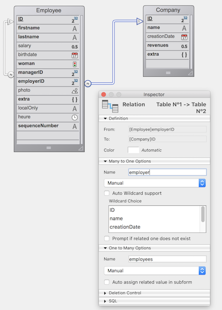

Uma [DataClass](ORDA/dsMapping.md#dataclass) oferece uma interface de objeto a uma tabela do banco de dados. Todas as classes de dados de uma aplicação 4D estão disponíveis como uma propriedade de `ds` [datastore](ORDA/dsMapping.md#datastore).

### Resumo

|                                                                                                                                                                                                          |
| -------------------------------------------------------------------------------------------------------------------------------------------------------------------------------------------------------- |
| [<!-- INCLUDE DataClassClass.attributeName.Syntax -->](#attributename)&nbsp;&nbsp;&nbsp;&nbsp;<!-- INCLUDE DataClassClass.attributeName.Summary --> |
| [<!-- INCLUDE #DataClassClass.all().Syntax -->](#all)&nbsp;&nbsp;&nbsp;&nbsp;<!-- INCLUDE #DataClassClass.all().Summary -->|
| [<!-- INCLUDE #DataClassClass.clearRemoteCache().Syntax -->](#clearremotecache)&nbsp;&nbsp;&nbsp;&nbsp;<!-- INCLUDE #DataClassClass.clearRemoteCache().Summary -->|
| [<!-- INCLUDE #DataClassClass.fromCollection().Syntax -->](#fromcollection)&nbsp;&nbsp;&nbsp;&nbsp;<!-- INCLUDE #DataClassClass.fromCollection().Summary --> |
| [<!-- INCLUDE #DataClassClass.get().Syntax -->](#get)&nbsp;&nbsp;&nbsp;&nbsp;<!-- INCLUDE #DataClassClass.get().Summary --> |
| [<!-- INCLUDE #DataClassClass.getCount().Syntax -->](#getcount)&nbsp;&nbsp;&nbsp;&nbsp;<!-- INCLUDE #DataClassClass.getCount().Summary --> |
| [<!-- INCLUDE #DataClassClass.getDataStore().Syntax -->](#getdatastore)&nbsp;&nbsp;&nbsp;&nbsp;<!-- INCLUDE #DataClassClass.getDataStore().Summary --> |
| [<!-- INCLUDE #DataClassClass.getInfo().Syntax -->](#getinfo)&nbsp;&nbsp;&nbsp;&nbsp;<!-- INCLUDE #DataClassClass.getInfo().Summary --> |
| [<!-- INCLUDE #DataClassClass.getRemoteCache().Syntax -->](#getremotecache)&nbsp;&nbsp;&nbsp;&nbsp;<!-- INCLUDE #DataClassClass.getRemoteCache().Summary --> |
| [<!-- INCLUDE #DataClassClass.new().Syntax -->](#new)&nbsp;&nbsp;&nbsp;&nbsp;<!-- INCLUDE #DataClassClass.new().Summary --> |
| [<!-- INCLUDE #DataClassClass.newSelection().Syntax -->](#newselection)&nbsp;&nbsp;&nbsp;&nbsp;<!-- INCLUDE #DataClassClass.newSelection().Summary --> |
| [<!-- INCLUDE #DataClassClass.query().Syntax -->](#query)&nbsp;&nbsp;&nbsp;&nbsp;<!-- INCLUDE #DataClassClass.query().Summary --> |
| [<!-- INCLUDE #DataClassClass.setRemoteCacheSettings().Syntax -->](#setremotecachesettings)&nbsp;&nbsp;&nbsp;&nbsp;<!-- INCLUDE #DataClassClass.setRemoteCacheSettings().Summary --> |

<!-- REF DataClassClass.attributeName.Desc -->
## .*attributeName*

<details><summary>Histórico</summary>

| Release | Mudanças                       |
| ------- | ------------------------------ |
| 19 R3   | Adicionado o atributo .exposed |
| 17      | Adicionado                     |

</details>

<!-- REF DataClassClass.attributeName.Syntax -->***.attributeName*** : object<!-- END REF -->

#### Descrição

Os atributos dos dataclasses são <!-- REF DataClassClass.attributeName.Summary -->objetos que estão disponíveis diretamente como propriedades<!-- END REF --> destas classes.

Os objetos retornados têm propriedades que você pode ler para obter informações sobre os atributos da classe de dados.
> Os objetos do atributo Dataclass podem ser modificados, mas a estrutura subjacente do banco de dados não será alterada.


#### Objeto devolvido

Os objetos atributos retornados contêm as seguintes propriedades:

| Propriedade      | Tipo       | Descrição                                                                                                                                                                                                                                                                                                                                                                                  |
| ---------------- | ---------- | ------------------------------------------------------------------------------------------------------------------------------------------------------------------------------------------------------------------------------------------------------------------------------------------------------------------------------------------------------------------------------------------ |
| autoFilled       | Parâmetros | True se o valor do atributo for automaticamente preenchido por 4D. Corresponde às seguintes propriedades de campos 4D: "Autoincrement" para os campos de tipo numérico e "Auto UUID" para os campos UUID (alfa). Não retornado se `.kind` = "relatedEntity" ou "relatedEntities".                                                                                                          |
| exposed          | Parâmetros | True se o atributo estiver exposto no REST                                                                                                                                                                                                                                                                                                                                                 |
| fieldNumber      | integer    | Número interno do campo 4D do atributo. Não retornado se `.kind` = "relatedEntity" ou "relatedEntities".                                                                                                                                                                                                                                                                                   |
| fieldType        | Integer    | Tipo de campo de banco de dados 4D do atributo. Depende do atributo `kind`. Valores possíveis: <li>se `.kind` = "storage": tipo de campo 4D correspondente, consulte [`Value type`] (https://doc.4d.com/4dv20/help/command/en/page1509.html)</li><li>se `.kind` = "relatedEntity": 38 (`is object`)</li><li>se `.kind` = "relatedEntities": 42 (`is collection`)</li><li>se `.kind` = "calculated" ou "alias" = o mesmo que acima, dependendo do valor resultante (tipo de campo, relatedEntity ou relatedEntities)</li>                                                                                                                                                                                         |
| indexed          | Parâmetros | True se houver um índice B-tree ou Cluster B-tree no atributo. Não retornado se `.kind` = "relatedEntity" ou "relatedEntities".                                                                                                                                                                                                                                                            |
| inverseName      | Text       | Nome do atributo que está do outro lado da relação. Retornado somente quando `.kind` = "relatedEntity" ou "relatedEntities".                                                                                                                                                                                                                                                               |
| keywordIndexed   | Parâmetros | True se houver um índice de palavras-chave no atributo. Não retornado se `.kind` = "relatedEntity" ou "relatedEntities".                                                                                                                                                                                                                                                                   |
| kind             | Text       | Categoria do atributo. Valores possíveis:<li>Atributo "storage": storage (ou escalar) ou seja, atributo que armazena um valor, não uma referência a outro atributo</li><li>"calculated": atributo computado, ou seja, definido através de uma função [`get`](../ORDA/ordaClasses.md#function-get-attributename)</li><li>"alias": atributo criado com base em [outro atributo](../ORDA/ordaClasses.md#alias-attributes-1)</li><li>"relatedEntity": N -> 1 atributo relacional (referência a uma entidade)</li><li>"relatedEntities": 1 -> N atributo relacional (referência a uma seleção de entidades)</li>                                                                                                                                                                                                                     |
| obrigatório      | Parâmetros | True se a entrada de um valor null for rejeitada para o atributo. Não retornado se `.kind` = "relatedEntity" ou "relatedEntities". Nota: Esta propriedade corresponde à propriedade do campo "Reject NULL value input" ao nível do banco de dados 4D. Não tem relação com a propriedade existente "Mandatory"/obrigatório que é uma opção de controle de entrada de dados para uma tabela. |
| name             | Text       | Nome do atributo como string                                                                                                                                                                                                                                                                                                                                                               |
| path             | Text       | Caminho de [um atributo de alias](../ORDA/ordaClasses.md#alias-attributes-1) com base em uma relação                                                                                                                                                                                                                                                                                       |
| readOnly         | Parâmetros | True se o atributo for apenas de leitura. Por exemplo, os atributos computados sem função [`set`](../ORDA/ordaClasses.md#function-set-attributename) são apenas de leitura.                                                                                                                                                                                                                |
| relatedDataClass | Text       | Nome dadataclass relacionada ao atributo. Retornado somente quando `.kind` = "relatedEntity" ou "relatedEntities".                                                                                                                                                                                                                                                                         |
| type             | Text       | Tipo conceitual do valor do atributo, útil para programação genérica. Depende do atributo `kind`. Valores possíveis: <li>se `.kind` = "storage": "blob", "bool", "date", "image", "number", "object" ou "string". "number" é retornado para qualquer tipo numérico, inclusive duração; "string" é retornado para os tipos de atributo uuid, alfa e texto; os atributos "blob" são [objetos blob](../Concepts/dt_blob.md#blob-type).</li><li>si `.kind` = "relatedEntity": nome da dataClass relacionada</li><li>se `.kind` = "relatedEntities": nome da dataClass relacionada + sufixo "Selection"</li><li>se `.kind` = "calculated" ou "alias": o mesmo que acima, dependendo do resultado</li>                                                                                                                                                               |
| unique           | Parâmetros | True se o valor do atributo tiver que ser único. Não retornado se `.kind` = "relatedEntity" ou "relatedEntities".                                                                                                                                                                                                                                                                          |

:::tip

Para programação genérica, use `Bool(attributeName.property)`, `Num(attributeName.property)` ou `String(attributeName.property)` (dependendo do tipo de propriedade) para obter um valor válido mesmo que a propriedade não seja retornada.

:::

#### Exemplo 1

```4d
$salary:=ds. Employee.salary //returns the salary attribute in the Employee dataclass
$compCity:=ds. Company["city"] //returns the city attribute in the Company dataclass
```

#### Exemplo 2

Considerando a seguinte estrutura do banco de dados:



```4d
var $firstnameAtt;$employerAtt;$employeesAtt : Object

 $firstnameAtt:=ds. Employee.firstname
  //{name:firstname,kind:storage,fieldType:0,type:string,fieldNumber:2,indexed:true,
  //keyWordIndexed:false,autoFilled:false,mandatory:false,unique:false}

 $employerAtt:=ds. Employee.employer
  //{name:employer,kind:relatedEntity,relatedDataClass:Company,
  //fieldType:38,type:Company,inverseName:employees}
  //38=Is object

 $employeesAtt:=ds. Company.employees
  //{name:employees,kind:relatedEntities,relatedDataClass:Employee,
  //fieldType:42,type:EmployeeSelection,inverseName:employer}
  //42=Is collection
```

#### Exemplo 3

Considerando as propriedades de tabela abaixo:


```4d
 var $sequenceNumberAtt : Object
 $sequenceNumberAtt=ds. Employee.sequenceNumber
  //{name:sequenceNumber,kind:storage,fieldType:0,type:string,fieldNumber:13,
  //indexed:true,keyWordIndexed:false,autoFilled:true,mandatory:false,unique:true}
```

<!-- END REF -->

<!-- REF DataClassClass.all().Desc -->
## .all()

<details><summary>Histórico</summary>

| Release | Mudanças                                |
| ------- | --------------------------------------- |
| 17 R5   | Compatibilidade do parâmetro *settings* |
| 17      | Adicionado                              |

</details>

<!-- REF #DataClassClass.all().Syntax -->**.all** ( { *settings* : Object } ) : 4D. EntitySelection<!-- END REF -->


<!-- REF #DataClassClass.all().Params -->
| Parâmetro  | Tipo                |    | Descrição                                                                                          |
| ---------- | ------------------- |:--:| -------------------------------------------------------------------------------------------------- |
| settings   | Object              | -> | Opção de construção: context                                                                       |
| Resultados | 4D. EntitySelection | <- | Referencias sobre todas as entidades relacionadas com a classe de dados|<!-- END REF -->

|

#### Descrição

A função `.all( )` <!-- REF #DataClassClass.all().Summary -->consulta a datastore para encontrar todas as entidades relacionadas com a dataclass e devolve-as como uma selecção de entidade<!-- END REF -->.

As entidades são devolvidas na ordem padrão, que é inicialmente a ordem na qual foram criadas. Note no entanto que, se as entidades foram apagas e outras adicionadas, a ordem padrão não reflete mais sua ordem de criação.

Se nenhuma entidade correspondente for encontrada, uma seleção de entidade vazia é retornada.

Se aplica carregamento diferido/lazy loading.

**settings**

No  parâmetro *querySettings* é possível passar um objeto que conteha opções adicionais. As propriedades abaixo são compatíveis:

| Propriedade | Tipo | Descrição                                                                                                                                                                                                                                                                                                                  |
| ----------- | ---- | -------------------------------------------------------------------------------------------------------------------------------------------------------------------------------------------------------------------------------------------------------------------------------------------------------------------------- |
| context     | Text | Etiqueta para o contexto de otimização aplicado a seleção de entidades. Este contexto será utilizado pelo código que maneja a seleção de entidades para que possa se beneficiar da otimização. Essa funcionalidade foi criada para processamento cliente/servidor de ORDA [](ORDA/entities.md#client-server-optimization). |

> Para conhecer o número total de entidades num dataclass, recomenda-se a utilização da função [`getCount()`](#getcount) que é mais optimizada do que a expressão `ds.myClass.all().length`.

#### Exemplo

```4d
 var $allEmp : cs. EmployeeSelection
 $allEmp:=ds. Employee.all()
```

<!-- REF #DataClassClass.clearRemoteCache().Desc -->
## .clearRemoteCache()

<details><summary>Histórico</summary>

| Release | Mudanças   |
| ------- | ---------- |
| 19 R5   | Adicionado |

</details>

<!-- REF #DataClassClass.clearRemoteCache().Syntax -->**.clearRemoteCache()**<!-- END REF -->


<!-- REF #DataStoreClass.clearRemoteCache().Params -->
| Parâmetro | Tipo |  | Descrição                                             |
| --------- | ---- |::| ----------------------------------------------------- |
|           |      |  | Não exige nenhum parâmetro|<!-- END REF -->

|

#### Descrição

The `.getDataStore( )` function <!-- REF #DataClassClass.clearRemoteCache().Summary -->devolve o datastore para a dataclass especificada<!-- END REF -->.

> Esta função não reinicia os valores `timeout` e `maxEntries`.

#### Exemplo

```4d
var $ds : 4D. DataStoreImplementation
var $persons : cs. PersonsSelection
var $p : cs. PersonsEntity
var $cache : Object
var $info : Collection
var $text : Text

$ds:=Open datastore(New object("hostname"; "www.myserver.com"); "myDS")

$persons:=$ds. Persons.all()
$text:="" For each ($p; $persons)
    $text:=$p.firstname+" lives in "+$p.address.city+" / " End for each

$cache:=$ds. Persons.getRemoteCache()

$ds. Persons.clearRemoteCache()
// Cache of the Persons dataclass = {timeout:30;maxEntries:30000;stamp:255;entries:[]}
```

<!-- END REF -->

<!-- REF DataClassClass.fromCollection().Desc -->
## .fromCollection()

<details><summary>Histórico</summary>

| Release | Mudanças                                |
| ------- | --------------------------------------- |
| 17 R5   | Compatibilidade do parâmetro *settings* |
| 17      | Adicionado                              |

</details>

<!-- REF #DataClassClass.fromCollection().Syntax -->**.fromCollection**( *objectCol* : Collection { ; *settings* : Object } ) : 4D. EntitySelection<!-- END REF -->


<!-- REF #DataClassClass.fromCollection().Params -->
| Parâmetro  | Tipo                |    | Descrição                                                              |
| ---------- | ------------------- |:--:| ---------------------------------------------------------------------- |
| objectCol  | Collection          | -> | Coleção de objetos a mapear com entidades                              |
| settings   | Object              | -> | Opção de construção: context                                           |
| Resultados | 4D. EntitySelection | <- | Seleção de entidades preenchidas da coleção|<!-- END REF -->

|

#### Descrição

A função `.fromCollection()` <!-- REF #DataClassClass.fromCollection().Summary -->actualiza ou cria entidades no dataclass de acordo com a colecção de objectos *objectCol*, e devolve a selecção da entidade correspondente<!-- END REF -->.

No parâmetro *objectCol*, passa uma coleção de objetos para criar novas entidades ou atualizar as existentes da classe de dados. Os nomes das propriedades devem ser os mesmos que os dos atributos da classe de dados. Se um nome de propriedade não existir na dataclass, é ignorado. Se um valor de atributo não for definido na coleção, seu valor será null.

O mapeamento entre os objetos da coleção e as entidades se realiza sobre os **nomes de atributos** e **tipos coincidentes**. Se uma propriedade de um objeto tiver o mesmo nome que um atributo de entidade mas seus tipos não corresponderem, o atributo da entidade não é preenchido.

**Criar ou atualizar modos**

Para cada objeto de *objectCol*:

* Se o objeto conter uma propriedade booleana "\__NEW" estabelecida em false (ou não conter uma propriedade booleana "\__NEW"), a entidade se atualiza ou se cria com os valores correspondentes das propriedades do objeto. Nenhuma comprovação é realizada com respeito à chave primária:
  * Se a chave primária for dada e existir, a entidade é atualizada. Nesse caso, a chave primária pode ser dada como etá ou com uma propriedade "\_\_KEY"  (preenchida com o valor da chave primária).
  * Se a chave primária for dada (como é) e não existir, a entidade é criada
  * Se a chave primária não for dada, a entidade é criada e o valor da chave primária é assignado com respeito às regras padrão de database.
* Se o objeto conter uma propriedade boolean "\_\_NEW" estabelecida como **true**, a entidade é criada com os valores correspondente dos atributos de objeto. Uma comprovação é realizada com relação à chave primária:
  * Se a chave primária for dada (como está) e existir, um erro é enviado.
  * Se a chave primária for dada (como é) e não existir, a entidade é criada
  * Se a chave primária não for dada, a entidade é criada e o valor da chave primária é assignado com respeito às regras padrão de database.
> A propriedade "\_\_KEY" que contém um valor só é tida em conta quando a propriedade "\_\_NEW" está definida como **false** (ou é omitida) e existe uma entidade correspondente. Em todos os outros casos, o valor da propriedade "\_\_KEY" é ignorado, o valor da chave primária deve ser passado "tal como está".

**Entidades relacionadas**

Os objetos de *objectCol* podem conter um ou mais objetos aninhados que apresentam uma ou mais entidades relacionadas, o que pode ser útil para criar ou atualizar links entre entidades.

Os objetos aninhados que apresentam entidades relacionadas devem conter uma propriedade "\_\_KEY" (preenchido com o valor da chave primária da entidade relacionada) ou o atributo de chave primária da própria entidade relacionada. O uso de uma propriedade \_\_KEY permite a independência do nome do atributo da chave primària.
> O conteúdo das entidades relacionadas não pode ser criado / atualizado através deste mecanismo.

**Stamp**

Se um atributo \_\_STAMP for dado, se realiza uma comprovação com o selo no armazén de dados e se pode devolver um erro ("O selo dado não coincide com o atual para o registro# XX da tabela XXXX"). Para saber mais, consulte [Entity locking](ORDA/entities.md#entity-locking).

**settings**

No  parâmetro *querySettings* é possível passar um objeto que conteha opções adicionais. As propriedades abaixo são compatíveis:

| Propriedade | Tipo | Descrição                                                                                                                                                                                                                                                                                                                  |
| ----------- | ---- | -------------------------------------------------------------------------------------------------------------------------------------------------------------------------------------------------------------------------------------------------------------------------------------------------------------------------- |
| context     | Text | Etiqueta para o contexto de otimização aplicado a seleção de entidades. Este contexto será utilizado pelo código que maneja a seleção de entidades para que possa se beneficiar da otimização. Essa funcionalidade foi criada para processamento cliente/servidor de ORDA [](ORDA/entities.md#client-server-optimization). |

#### Exemplo 1

Queremos atualizar uma entidade existente. A propriedade \_\_NEW não for dada, a chave primária do empregado é dada e existe:

```4d
 var $empsCollection : Collection
 var $emp : Object
 var $employees : cs. EmployeeSelection

 $empsCollection:=New collection
 $emp:=New object
 $emp.ID:=668 //Existing PK in Employee table
 $emp.firstName:="Arthur"
 $emp.lastName:="Martin"
 $emp.employer:=New object("ID";121) //Existing PK in the related dataClass Company
  // For this employee, we can change the Company by using another existing PK in the related dataClass Company
 $empsCollection.push($emp)
 $employees:=ds. Employee.fromCollection($empsCollection)
```

#### Exemplo 2

Queremos atualizar uma entidade existente. A propriedade \_\_NEW não é dada, a chave primária do empregado com o atributo \_\_KEY e existir:

```4d
 var $empsCollection : Collection
 var $emp : Object
 var $employees : cs. EmployeeSelection

 $empsCollection:=New collection
 $emp:=New object
 $emp.__KEY:=1720 //Existing PK in Employee table
 $emp.firstName:="John"
 $emp.lastName:="Boorman"
 $emp.employer:=New object("ID";121) //Existing PK in the related dataClass Company
  // For this employee, we can change the Company by using another existing PK in the related dataClass Company
 $empsCollection.push($emp)
 $employees:=ds. Employee.fromCollection($empsCollection)
```

#### Exemplo 3

Se quiser simplesmente criar uma nova entidade da coleção::

```4d
 var $empsCollection : Collection
 var $emp : Object
 var $employees : cs. EmployeeSelection

 $empsCollection:=New collection
 $emp:=New object
 $emp.firstName:="Victor"
 $emp.lastName:="Hugo"
 $empsCollection.push($emp)
 $employees:=ds. Employee.fromCollection($empsCollection)
```

#### Exemplo

Queremos criar uma entidade. A propriedade \_\_NEW é True, a chave primária de empregado não é dada:

```4d
 var $empsCollection : Collection
 var $emp : Object
 var $employees : cs. EmployeeSelection

 $empsCollection:=New collection
 $emp:=New object
 $emp.firstName:="Mary"
 $emp.lastName:="Smith"
 $emp.employer:=New object("__KEY";121) //Existing PK in the related dataClass Company
 $emp.__NEW:=True
 $empsCollection.push($emp)
 $employees:=ds. Employee.fromCollection($empsCollection)


```

#### Exemplo 2

Queremos criar uma entidade. Se a propriedade \_\_NEW é omitida, a chave primária do empregado é dada e não existir:

```4d
 var $empsCollection : Collection
 var $emp : Object
 var $employees : cs. EmployeeSelection

 $empsCollection:=New collection
 $emp:=New object
 $emp.ID:=10000 //Unexisting primary key
 $emp.firstName:="Françoise"
 $emp.lastName:="Sagan"
 $empsCollection.push($emp)
 $employees:=ds. Employee.fromCollection($empsCollection)
```

#### Exemplo 6

Neste exemplo, a primeira entidade se criará e salvará mas a segunda falhará já que ambas utilizam a mesma chave primaria:

```4d
 var $empsCollection : Collection
 var $emp; $emp2 : Object
 var $employees : cs. EmployeeSelection

 $empsCollection:=New collection
 $emp:=New object
 $emp.ID:=10001 // Unexisting primary key
 $emp.firstName:="Simone"
 $emp.lastName:="Martin"
 $emp.__NEW:=True
 $empsCollection.push($emp)

 $emp2:=New object
 $emp2.ID:=10001 // Same primary key, already existing
 $emp2.firstName:="Marc"
 $emp2.lastName:="Smith"
 $emp2.__NEW:=True
 $empsCollection.push($emp2)
 $employees:=ds. Employee.fromCollection($empsCollection)
  //first entity is created
  //duplicated key error for the second entity
```

#### Veja também

[**.toCollection()**](EntitySelectionClass.md#tocollection)

<!-- END REF -->

<!-- REF DataClassClass.get().Desc -->
## .get()

<details><summary>Histórico</summary>

| Release | Mudanças   |
| ------- | ---------- |
| 17      | Adicionado |

</details>

<!-- REF #DataClassClass.get().Syntax -->**.get**( *primaryKey* : Integer { ; *settings* : Object } ) : 4D. Entity<br/>**.get**( *primaryKey* : Text { ; *settings* : Object } ) : 4D.<!-- END REF -->


<!-- REF #DataClassClass.get().Params -->
| Parâmetro  | Tipo            |    | Descrição                                                                       |
| ---------- | --------------- |:--:| ------------------------------------------------------------------------------- |
| primaryKey | Integer OR Text | -> | Valor da chave primária da entidade a recuperar                                 |
| settings   | Object          | -> | Opção de construção: context                                                    |
| Resultados | 4D. Entity      | <- | Entidade que coincide com a chave primária designada|<!-- END REF -->

|

#### Descrição

A função `.get()` <!-- REF #DataClassClass.get().Summary -->consulta a folha de dados para recuperar a entidade que corresponde ao parâmetro *primaryKey*<!-- END REF -->.

Em *primaryKey*, passe o valor da chave primária da entidade a recuperar. Em *primaryKey*, passe o valor da chave primária da entidade a recuperar Em *primaryKey*, passe o valor da chave primária da entidade a recuperar O tipo valor deve coresponder com o tipo de chave primária estabelecido na datastore (Inteiro ou texto). Também pode se assegurar que o valor de chave primária seja sempre retornado como Texto ao usar a função [`.getKey()`](EntityClass.md#getkey) com o parâmetro`dk key as string`.

Se nenhuma entidade for encontrada com  *primaryKey*, uma entidade**Null** é retornada.

É aplicado o lazy loading/carregamento diferido, ou seja os dados relacionados são carregados do disco só quando pedidos.

**settings**

No  parâmetro *querySettings* é possível passar um objeto que conteha opções adicionais. As propriedades abaixo são compatíveis:

| Propriedade | Tipo | Descrição                                                                                                                                                                                                                                                                                                               |
| ----------- | ---- | ----------------------------------------------------------------------------------------------------------------------------------------------------------------------------------------------------------------------------------------------------------------------------------------------------------------------- |
| context     | Text | Etiqueta para o contexto de otimização automático aplicados à entidade. Esse contexto será usado pelo código subsequente que carrega a entidade para que se possa beneficiar da otimização. Essa funcionalidade foi criada para processamento cliente/servidor de ORDA [](ORDA/entities.md#client-server-optimization). |

:::info

When you call the `.get()` function **without** *settings* parameter, a request for attribute values is directly sent to the server (the [ORDA cache](../ORDA/entities.md#orda-cache) is not used). On the other hand, when you call the `.get()` function **with** a `context` passed in the *settings* parameter, attribute values are retrieved from the ORDA cache corresponding to the context. It may be advisable in this case to call [`reload()`](EntityClass.md#reload) to make sure the most recent data is retrieved from the server.

:::


#### Exemplo 1

```4d
 var $entity : cs. EmployeeEntity  
 var $entity2 : cs. InvoiceEntity
 $entity:=ds. Employee.get(167) // return the entity whose primary key value is 167
 $entity2:=ds. Invoice.get("DGGX20030") // return the entity whose primary key value is "DGGX20030"
```

#### Exemplo 2

Este exemplo ilustra o uso da propriedade *context* :

```4d
 var $e1; $e2; $e3; $e4 : cs. EmployeeEntity
 var $settings; $settings2 : Object

 $settings:=New object("context";"detail")
 $settings2:=New object("context";"summary")

 $e1:=ds. Employee.get(1;$settings)
 completeAllData($e1) // In completeAllData method, an optimization is triggered and associated to context "detail"

 $e2:=ds. Employee.get(2;$settings)
 completeAllData($e2) // In completeAllData method, the optimization associated to context "detail" is applied

 $e3:=ds. Employee.get(3;$settings2)
 completeSummary($e3) //In completeSummary method, an optimization is triggered and associated to context "summary"

 $e4:=ds. Employee.get(4;$settings2)
 completeSummary($e4) //In completeSummary method, the optimization associated to context "summary" is applied
```

<!-- END REF -->

<!-- REF DataClassClass.getCount.Desc -->
## .getCount()

<details><summary>Histórico</summary>

| Release | Mudanças   |
| ------- | ---------- |
| 19 R5   | Adicionado |

</details>

<!-- REF #DataClassClass.getCount().Syntax -->**.getCount()** : Integer <!-- END REF -->


<!-- REF #DataClassClass.getCount().Params -->
| Parâmetro | Tipo    |    | Descrição                                                   |
| --------- | ------- | -- | ----------------------------------------------------------- |
| resultado | Integer | <- | Número de entidades na dataclass|<!-- END REF -->

|

#### Descrição

A função `.new( )` <!-- REF #DataClassClass.getCount().Summary --> cria em memória e devolve uma nova entidade em branco relacionada com a Dataclass<!-- END REF -->.

Se esta função for utilizada dentro de uma transacção, as entidades criadas durante a transação serão levadas em consideração.

#### Exemplo

```4d
var $ds : 4D. DataStoreImplementation
var $number : Integer

$ds:=Open datastore(New object("hostname"; "www.myserver.com"); "myDS")

$number:=$ds. Persons.getCount()
```

<!-- END REF -->

<!-- REF DataClassClass.getDataStore().Desc -->
## .getDataStore()

<details><summary>Histórico</summary>

| Release | Mudanças   |
| ------- | ---------- |
| 17 R5   | Adicionado |

</details>

<!-- REF #DataClassClass.getDataStore().Syntax -->**.getInfo()** : Objeto<!-- END REF -->


<!-- REF #DataClassClass.getDataStore().Params -->
| Parâmetro  | Tipo          |    | Descrição                                          |
| ---------- | ------------- |:--:| -------------------------------------------------- |
| Resultados | cs. DataStore | <- | Informação da dataclass|<!-- END REF -->

|

#### Descrição

A função `.newSelection( )` <!-- REF #DataClassClass.getDataStore().Summary -->cria uma nova selecção de entidade, em branco e não partilhável, relacionada com o dataclass, em memória<!-- END REF -->.

A datastore pode ser:

* a datastore principal, retornada pelo comando `ds`.
* uma datastore remota, aberta com o comando `Open datastore`.

#### Exemplo

O método de projeto ***SearchDuplicate*** procura por valores duplicados em qualquer dataclass.

```4d
 Pode usar parêntesis na pesquisa para dar prioridade ao cálculo Por exemplo, pode organizar uma pesquisa da seguinte maneira: Por exemplo, pode organizar uma pesquisa da seguinte maneira:
```

```4d
  // Pesquisa SearchDuplicate
  // SearchDuplicate(entity_to_search;dataclass_name)

 #DECLARE ($pet : Object ; $dataClassName : Text)
 var $dataStore; $duplicates : Object  

 $dataStore:=$pet.getDataClass().getDataStore()
 $duplicates:=$dataStore[$dataClassName].query("name=:1";$pet.name)
```

<!-- END REF -->

<!-- REF DataClassClass.getInfo().Desc -->
## .getInfo()

<details><summary>Histórico</summary>

| Release | Mudanças                             |
| ------- | ------------------------------------ |
| 19 R3   | A propriedade exposed foi adicionada |
| 17 R5   | Adicionado                           |

</details>

<!-- REF #DataClassClass.getInfo().Syntax -->**.getInfo()** : Objeto <!-- END REF -->


<!-- REF #DataClassClass.getInfo().Params -->
| Parâmetro  | Tipo   |    | Descrição                                         |
| ---------- | ------ | -- | ------------------------------------------------- |
| Resultados | Object | <- | Datastore da dataclass|<!-- END REF -->

|

#### Descrição

A função `.getInfo( )` <!-- REF #DataClassClass.getInfo().Summary -->devolve um objecto que fornece informação sobre o dataclass<!-- END REF -->. Esta função é útil para configurar o código genérico.

**Objeto devolvido**

| Propriedade | Tipo       | Descrição                                 |
| ----------- | ---------- | ----------------------------------------- |
| exposed     | Parâmetros | True se a dataclass for exposta em REST   |
| name        | Text       | Nome da dataclass                         |
| primaryKey  | Text       | Nome da chave primária da classe de dados |
| tableNumber | Integer    | Número daa tabela 4D interna              |

#### Exemplo 1

```4d
 #DECLARE ($entity : Object)  
 var $status : Object

 computeEmployeeNumber($entity) //faz uma ação na entidade

 $status:=$entity.save()
 if($status.success)
    ALERT("Record updated in table "+$entity.getDataClass().getInfo().name)
 End if
```

#### Exemplo 2

```4d
 var $settings : Object
 var $es : cs. ClientsSelection

 $settings:=New object
 $settings.parameters:=New object("receivedIds";getIds())
 $settings.attributes:=New object("pk";ds. Clients.getInfo().primaryKey)
 $es:=ds. Clients.query(":pk in :receivedIds";$settings)
```

#### Exemplo 3

```4d
 var $pk : Text
 var $dataClassAttribute : Object

 $pk:=ds. Employee.getInfo().primaryKey
 $dataClassAttribute:=ds. Employee[$pk] // If needed the attribute matching the primary key is accessible
```


<!-- END REF -->

<!-- REF DataClassClass.getRemoteCache().Desc -->
## .getRemoteCache()

<details><summary>Histórico</summary>

| Release | Mudanças   |
| ------- | ---------- |
| 19 R5   | Adicionado |

</details>

<!-- REF #DataClassClass.getRemoteCache().Syntax -->**.getRemoteCache**() : Object <!-- END REF -->


<!-- REF #DataClassClass.getRemoteCache().Params -->
| Parâmetro | Tipo   |    | Descrição                                                                                  |
| --------- | ------ | -- | ------------------------------------------------------------------------------------------ |
| resultado | Object | <- | Objecto que descreve o conteúdo da cache ORDA para o dataclass.|<!-- END REF -->


|


> **Modo avançado:** Esta função destina-se a programadores que necessitem personalizar as características padrão ORDA para configurações específicas. Na maioria dos casos, não necessitará de o utilizar.


#### Descrição

A função `.getRemoteCache()` <!-- REF #DataClassClass.getRemoteCache().Summary -->devolve um objecto que contém o conteúdo da cache ORDA para uma dataclass.<!-- END REF -->.

Chamar esta função a partir de uma aplicação 4D monousuário retorna `Null`.

O objeto retornado tem as propriedades abaixo:

| Propriedade | Tipo       | Descrição                                                                          |
| ----------- | ---------- | ---------------------------------------------------------------------------------- |
| maxEntries  | Integer    | Número máximo de entradas recolhidas.                                              |
| stamp       | Integer    | Carimbo da cache.                                                                  |
| timeout     | Integer    | Tempo restante antes que as novas entradas na cache sejam marcadas como expiradas. |
| |           | Collection | Contém um objecto de entrada para cada entidade na cache.                          |

Cada objecto de entrada na colecção `entradas` tem as seguintes propriedades:

| Propriedade | Tipo       | Descrição                             |
| ----------- | ---------- | ------------------------------------- |
| data        | Object     | Objeto que contém os dados da entrada |
| expired     | Parâmetros | True se a entrada tiver expirado      |
| |           | Text       | Chave primária da entidade.           |

O objecto `data` em cada entrada contém as seguintes propriedades:

| Propriedade            | Tipo         | Descrição                                                                                                                         |
| ---------------------- | ------------ | --------------------------------------------------------------------------------------------------------------------------------- |
| __KEY                  | Text         | Chave primária da entidade                                                                                                        |
| __STAMP                | Integer      | Stamp da entidade na base de dados                                                                                                |
| __TIMESTAMP            | Text         | Stamp da entidade na base de dados (formato é YYYY-MM-DDTHH:MM:SS:ms:Z)                                                           |
| dataClassAttributeName | Diferente de | Se houver dados na cache para um atributo dataclass, estes são devolvidos numa propriedade com o mesmo tipo que na base de dados. |

Os dados relativos a entidades relacionadas são armazenados na cache do objecto de dados.

#### Exemplo

No exemplo seguinte, `$ds. Persons.all()` carrega a primeira entidade com todos os seus atributos. Depois, a optimização do pedido é desencadeada, pelo que apenas `firstname` e `address.city` são carregados.

Note-se que `address.city` é carregado na cache do `Pessoas` dataclass.

Apenas a primeira entidade do `endereço` dataclass é armazenada na cache. É carregado durante a primeira iteração do loop.

```4d
var $ds : 4D. DataStoreImplementation
var $persons : cs. PersonsSelection
var $p : cs. PersonsEntity
var $cachePersons; $cacheAddress : Object
var $text : Text

$ds:=Open datastore(New object("hostname"; "www.myserver.com"); "myDS")

$persons:=$ds. Persons.all()

$text:="" For each ($p; $persons)
    $text:=$p.firstname+" lives in "+$p.address.city+" / " End for each

$cachePersons:=$ds. Persons.getRemoteCache()
$cacheAddress:=$ds. Adress.getRemoteCache()
```

#### Veja também

[.setRemoteCacheSettings()](#setremotecachesettings)<br/>[.clearRemoteCache()](#clearremotecache)

<!-- REF DataClassClass.new().Desc -->
## .new()

<details><summary>Histórico</summary>

| Release | Mudanças   |
| ------- | ---------- |
| 17      | Adicionado |

</details>

<!-- REF #DataClassClass.new().Syntax -->**.new()** : 4D. Entity <!-- END REF -->


<!-- REF #DataClassClass.new().Params -->
| Parâmetro  | Tipo       |    | Descrição                                                                   |
| ---------- | ---------- | -- | --------------------------------------------------------------------------- |
| Resultados | 4D. Entity | <- | Nova entidade que coincide com a classe de dados|<!-- END REF -->

|

#### Descrição

A função `.new()` <!-- REF #DataClassClass.new().Summary -->cria em memória e devolve uma nova entidade em branco relacionada com a Dataclass<!-- END REF -->.

O objeto entidade se cria em memória e não se guarda no banco de dados até que se chama a função [`.save( )`](EntityClass.md#save). Se a entidade for apagada antes de ser salva, não se pode recuperar.

**4D Server**: eám cliente-servidor, se a chave primaria da tabela correspondente se autoincrementa, se calculará quando a entidade se guarde no servidor.

Todos os atributos da entidade são inicializados com o valor **null** .

> Os atributos podem ser inicializados com valores por padrão se a opção **Map NULL values to blank values** for seleccionada ao nível da estrutura da base de dados 4D.

#### Exemplo

Este exemplo cria uma nova entidade na classe de dados "Log" e registra a informação no atributo "info":

```4d
 var $entity : cs. LogEntity
 $entity:=ds. Log.new() //create a reference
 $entity.info:="New entry" //store some information
 $entity.save() //save the entity
```

<!-- END REF -->

<!-- REF DataClassClass.newSelection().Desc -->
## .newSelection()

<details><summary>Histórico</summary>

| Release | Mudanças   |
| ------- | ---------- |
| 17      | Adicionado |

</details>

<!-- REF #DataClassClass.newSelection().Syntax -->**.newSelection**( { *keepOrder* : Integer } ) : 4D. EntitySelection <!-- END REF -->


<!-- REF #DataClassClass.newSelection().Params -->
| Parâmetro  | Tipo                |    | Descrição                                                                                                                                            |
| ---------- | ------------------- | -- | ---------------------------------------------------------------------------------------------------------------------------------------------------- |
| keepOrder  | Integer             | -> | `dk keep ordered`: cria uma seleção de entidades ordenada,<br/>`dk non ordered`: cria uma seleção de entidade não ordenada (padrão se omitido) |
| Resultados | 4D. EntitySelection | <- | Nova seleção de entidades em branco relacionadas com a classe de dados|<!-- END REF -->

|

#### Descrição

A função `.newSelection()` <!-- REF #DataClassClass.newSelection().Summary -->cria uma nova selecção de entidade, em branco e não partilhável, relacionada com o dataclass, em memória<!-- END REF -->.

> Para mais informação sobre as seleçõees de entidades não compartilháveis, consulte [esta seção](ORDA/entities.md#shareable-or-non-shareable-entity-selections).

Se quiser uma seleção de entidades ordenada, passe o seletor `dk keep ordered` no parâmetro *keepOrder*. Como padrão se omitir este parâmetro ou se passar o seletor `dk non ordered`, o método cria uma seleção de entidades não ordenada. As seleções de entidades desordenadas são mais rápidas mas não se pode confiar nas posições das entidades. Para mas informação, consulte [Seleções de entidades ordenadas e desordenadas](ORDA/dsMapping.md#ordered-or-unordered-entity-selection).

Quando for criada, a seleção de entidades não contém nenhuma entidade (`mySelection.length` devolve 0). Este método lhe permite criar seleções de entidades gradualmente fazendo chamadas posteriores à função [`add()`](EntitySelectionClass.md#add).

#### Exemplo

```4d
 var $USelection; $OSelection : cs. EmployeeSelection
 $USelection:=ds. Employee.newSelection() //create an unordered empty entity selection
 $OSelection:=ds. Employee.newSelection(dk keep ordered) //create an ordered empty entity selection
```

<!-- END REF -->

<!-- REF DataClassClass.query().Desc -->
## .query()

<details><summary>Histórico</summary>

| Release | Mudanças                               |
| ------- | -------------------------------------- |
| 17 R6   | Soporte dos Parâmetros Formula         |
| 17 R5   | Suporte dos marcadores para os valores |
| 17      | Adicionado                             |

</details>

<!-- REF #DataClassClass.query().Syntax -->**.query**( *queryString* : Text { ; *...value* : any } { ; *querySettings* : Object } ) : 4D. EntitySelection <br/>**.query**( *formula* : Object { ; *querySettings* : Object } ) : 4D. EntitySelection <!-- END REF -->


<!-- REF #DataClassClass.query().Params -->
| Parâmetro     | Tipo                |    | Descrição                                                                                                                                                      |
| ------------- | ------------------- | -- | -------------------------------------------------------------------------------------------------------------------------------------------------------------- |
| queryString   | Text                | -> | Criterios de pesquisa como string                                                                                                                              |
| formula       | Object              | -> | Criterios de pesquisa como objeto fórmula                                                                                                                      |
| value         | any                 | -> | Valores a usar para placeholders indexados                                                                                                                     |
| querySettings | Object              | -> | Opções de pesquisa: parâmetros, atributos, args, allowFormulas, contexto, queryPath,queryPlan                                                                  |
| Resultados    | 4D. EntitySelection | <- | Nova seleção de entidade feita de entidades de dataclass realizano o critério de pesquia especificado em *queryString* or *formula*|<!-- END REF -->

|

#### Descrição

A função `.query()` <!-- REF #DataClassClass.query().Summary -->pesquisa por  entidades que satisfaçam os critérios de pesquisa especificados em *queryString* ou *fórmula* e (opcionalmente) *valor*(s)<!-- END REF -->, para todas as entidades no dataclass, e devolve um novo objecto do tipo `EntitySelection` contendo todas as entidades que são encontradas. Se aplica carregamento diferido/lazy loading.

Se não houver entidades correspondentes encontradas, uma `EntitySelection` vazia é retornada.

#### parâmetro queryString

O parâmetro *queryString* usa a sintaxe abaixo:

```4d
attributePath|formula comparator value   
 {logicalOperator attributePath|formula comparator value}   
 {order by attributePath {desc | asc}}
```

onde:

* **attributePath**: caminho de atributo no qual se pretende executar a consulta. Os atributos se expressam como pares propriedade/ valor, onde propriedade é o nome do marcador de posição inserido para uma rota de atributo em *queryString* ou *formula* (":placeholder") e valor pode ser uma string ou uma coleção de strings. No caso de um caminho de atributo cujo tipo é `Collection`, `[]` é utilizada a notação para tratar todas as ocorrências (por exemplo, `children[].age`).
> *Não pode usar diretamente atributos cujo nome contenha caracteres especiais como ".", "\[ ]", or "=", ">", "#"..., porque serão avaliados incorretamente na string da query. Se precisar de uma query com esses atributos, deve considerar o uso de placeholders que permitem uma gama estendida de caracteres em rotas de atributo (ver* **Using placeholders** *below).*

* **formula**: uma fórmula válida passada como `Text` ou `Object`. A fórmula será avaliada para cada entidade processada e deve retornar um valor booleano. Dentro da fórmula, a entidade está disponível através do objeto `This`.

  * **Text**: A string de fórmula deve ser precidida da declaração `eval( )`,para que o parser da pesquisa avalie a expressão corretamente. Por exemplo: *"eval(length(This.lastname) >=30)"*
  * **Object**: o objeto [formula](FunctionClass.md) é passado como um **placeholder** (ver abaixo). A fórmula deve ter sido criada usando  [`Formula`](FunctionClass.md#formula) ou o comando[`Formula from string`](FunctionClass.md#formula-from-string) command.
> * Lembre que fórmulas 4D são compatíveis apenas com os símbolos `&` and `|` para operadores lógicos.
> * Se a fórmula não for o único critério de pesquisa, o otimizador de motor debusca poderia processar outros critérios previamente (por exemplo atributos indexados) e assim, a fórmula poderia ser avaliada apenas para um subconjunto de entidades.

 Fórmulas nas consultas podem receber parâmetros através de $1. Este ponto é detalhado no parágrafo **Parâmetro fórmula** mais abaixo.
> * Também pode passar diretamente um objeto parâmetro `formula` ao invés do parâmetro `queryString` (recomendado quando as fórmulas sejam mais complexas). Ver o parágrafo **Parâmetro fórmula** mais abaixo.
> * Por razões de segurança, as chamadas a fórmulas dentro dos métodos `query()` podem ser desativadas. Veja a descrição do parâmetro `querySettings`.

* **comparator**: symbol que compara *attributePath* e *valor*. Os simbolos abaixo são compatíveis:

 | Comparação                               | Símbolos    | Comentário                                                                                                                                                                     |
 | ---------------------------------------- | ----------- | ------------------------------------------------------------------------------------------------------------------------------------------------------------------------------ |
 | Igual a                                  | =, ==       | Retorna os dados coincidentes, admite o coringa (@), não diferencia entre maiúsculas e minúsculas nem diacríticas.                                                             |
 |                                          | ===, IS     | Retorna os dados coincidentes, considera @ como caractere padrão, não diferencia entre maiúsculas e minúsculas nem diacríticas                                                 |
 | Diferente de                             | #, !=       | Suporta o coringa (@). Equivalente a "Not condition applied on a statement" ([veja abaixo](#not-equal-to-in-collections)).                                                     |
 |                                          | !==, IS NOT | Considera  @ como um caractere normal                                                                                                                                          |
 | Não se aplica à condição de uma sentença | NOT         | Parentesis são obrigatórios quando usar NOT antes de uma instrução que contenha vários operadores. Equivalente a "Not equal to" ([veja abaixo](#not-equal-to-in-collections)). |
 | Menor que                                | <           |                                                                                                                                                                                |
 | Maior que                                | >           |                                                                                                                                                                                |
 | Menor que ou igual a                     | <=          |                                                                                                                                                                                |
 | Maior ou igual a                         | >=          |                                                                                                                                                                                |
 | Incluído em                              | IN          | Retorna dados iguais a ao menos um dos valores de uma coleção ou de um conjunto de valores, admite o coringa (@)                                                               |
 | Contém palavra chave                     | %           | As palavras chaves podem ser usadas em atributos de string ou imagem                                                                                                           |

* **value**: o valor a comparar ao valor atual da propriedade de cada entidade na seleção de entidade ou elemento na coleção. Pode ser um **marcador** (ver **Uso de marcadores** mais adiante) ou qualquer expressão que coincida com a propriedad de tipo de dados. Note that, in case of type mismatch with scalar types (text, date, number...), 4D will try to convert the **value** type to the attribute data type whenever possible, for an easier handling of values coming from the Internet. For example, if the string "v20" is entered as **value** to compare with an integer attribute, it will be converted to 20. Quando usar um valor constante, as regras abaixo devem ser respeitadas:
  * A constante de tipo **texto** pode ser passada com ou sem aspas simples (ver **Uso de aspas** mais abaixo). Para pesquisar uma stirng dentro de uma string (uma pesquisa "contém") use o símbolo coringa (@) em valor para isolar a string a ser pesquisada como mostrado neste exemplo: "@Smith@". As palavras chaves abaixo são proibidas para constantes de texto: true, false.
  * Valores constantes de tipo **booleano** : **true** ou **false** (diferencia maiuscula de minúscula).
  * Valores constantes de tipo **numérico**: os decimais se separam com um '.' (ponto).
  * **data** tipo constants: formato "YYYYY-MM-DD".
  * **null** constante: usando a palavra chave "null" encontra as propriedades **null** e **undefined**.
  * no caso de uma pesquisa com um comparador IN, o valor deve uma coleção, ou valores que coincidam com o tipo da rota do atributo entre \[ ] separados por vírgulas (para as strings, os caracteres " devem escapar-se com "\").
* **logicalOperator**: utilizado para unir condições múltiplas na pesquisa (opcional). Pode usaar um dos operadores lógicos abaixo (ou o nome ou o símbolo podem ser usados):

 | Conjunção | Símbolos                |
 | --------- | ----------------------- |
 | AND       | &, &&, and              |
 | OU        | &#124;,&#124;&#124;, or |

* **order by attributePath**: pode incluir uma declaração order by *attributePath* na pesquisa para que os dados resultantes sejam ordenados de acordo com esta declaração. Pode utilizar várias instruções de ordenação, separadas por vírgulas (por exemplo, ordenação por *attributePath1* desc, *attributePath2* asc). Como padrão, a ordem é ascendente. Passe 'desc'' para definir uma ordem descendente e 'asc' para definir uma ordem ascendente. >Se você usar essa instrução, a seleção de entidade retornada será ordenada (para obter mais informações, consulte [Ordered vs Unordered entity selections](ORDA/dsMapping.md#ordered-or-unordered-entity-selection)).

#### Usar aspas

Ao usar aspas dentro das consultas, você deve usar aspas simples ' ' dentro da consulta e aspas duplas " " para envolver toda a consulta, caso contrário, será retornado um erro. Por exemplo:

```4d
"employee.name = 'smith' AND employee.firstname = 'john'"
```
> Aspas siples (') não são permitidas nos valores pesquisados, já que quebrariam a string de pesquisa. Por exemplo, "comp.name = 'John's pizza' " gerará um erro. Se precisar pesquisar valores com aspas simples, pode considerar o uso de placeholders (ver abaixo).

#### Usando parêntesis

Você pode usar parênteses na consulta para dar prioridade ao cálculo. Por exemplo, pode organizar uma pesquisa da seguinte maneira:

```4d
"(employee.age >= 30 OR employee.age <= 65) AND (employee.salary <= 10000 OR employee.status = 'Manager')"
```

#### Uso de placeholders

4D permite que você use espaços reservados para *attributePath*, *formula* e *value* argumentos dentro do parâmetro *queryString* . Um placeholder é um parâmetro que você insere em cadeias de consulta e que é substituído por outro valor quando a cadeia de consulta é avaliada. O valor dos placeholders é avaliado uma vez no início da consulta; ele não é avaliado para cada elemento.

Dois tipos de placeholders podem ser usados: **placeholders indexados** e **placeholders nomeados**:

|           | Marcadores de posição indexados                                                                                                                                                                              | Placeholders nomeados                                                                                                                                               |
| --------- | ------------------------------------------------------------------------------------------------------------------------------------------------------------------------------------------------------------ | ------------------------------------------------------------------------------------------------------------------------------------------------------------------- |
| Definição | Os parâmetros são inseridos como :paramIndex (por exemplo :1, :2...) em queryString e seus valores correspondentes são fornecidos pela sequência de parâmetros value. Pode usara até 128 parâmetros de valor | Os parâmetros são inseridos como: paramName (por exemplo :myparam) e seus valores se proporcionam nos atributos ou objetos de parâmetros no parámetro querySettings |
| Exemplo   | `$r:=class.query(":1=:2";"city";"Chicago")`                                                                                                                                                                  | $o.attributes:=New object("att";"city")<br/> $o.parameters:=New object("name";"Chicago")<br/> $r:=class.query(":att=:name";$o)                          |

É possível misturar todos os tipos de argumentos em *queryString*. Uma *queryString* pode conter, para *attributePath*, *formula* e *value* parâmetros:

* valores diretos (sem placeholders),
* placeholders indexados ou com nome.

A utilização de placeholders em consultas **é recomendada** pelas seguintes razões:

1. Evita a inserção de código malicioso: se user diretamente variáveis preenchidas com uma string de pesquisa, um usuário poderia modificar as condições de pesquisa entrando argumentos adicionais. Por exemplo, imagine uma string de pesquisa como:

 ```4d
  $vquery:="status = 'public' & name = "+myname //o usuário introduz seu nome
  $result:=$col.query($vquery)
 ```

 Essa consulta parece segura, pois os dados não públicos são filtrados. Entretanto, se o usuário introduzr na área *myname* algo como *"smith OR status='private'*, a string de pesquisa se modificaría na etapa da interpretação e poderia devolver dados privados.

 Ao usar placeholders, não é possível substituir as condições de segurança:

 ```4d
  $result:=$col.query("status='public' & name=:1";myname)
 ```

 Neste caso, se o usuário introduz *smith OR status='private'* na área *myname*, não se interpretará na string de pesquisa, só será passada como um valor. A busca por uma pessoa chamada "smith OR status='private'" simplesmente falhará.

2. Evita ter que se preocupar por questões de formato ou caracteres, especialmente quando se manejam os parâmetros *attributePath* o *value* que podem conter não alfanuméricos como ".", "['...

3. Permite o uso de variáveis ou expressões nos argumentos de pesquisa. Exemplos:

 ```4d
 $result:=$col.query("address.city = :1 & name =:2";$city;$myVar+"@")
 $result2:=$col.query("company.name = :1";"John's Pizzas")
 ```

#### Pesquisa de valores null

Quando pesquisar por valores null não pode usar a sintaxe do marcador de posição porque o motor de consulta considera o valor null como um valor de comparação inesperado. Por exemplo, se executar esta pesquisa:

```4d
$vSingles:=ds. Person.query("spouse = :1";Null) // will NOT work
```

Não obterá o resultado esperado porque o valor nulo será avaliado por 4D como um erro resultante da avaliação do parâmetro (por exemplo, um atributo vindo de outra consulta). Para este tipo de pesquisa, deve usar a sintaxe de pesquisa direta:

```4d
 $vSingles:=ds. Person.query("spouse = null") //correct syntax
```

#### Não igual a em colecções

Ao pesquisar nos atributos de objectos de classe de dados que contêm colecções, o comparador "não igual a *valor*" (`#` ou `!=`) encontrará elementos em que TODAS as propriedades são diferentes de *valor* (e não aqueles em que PELO MENOS uma propriedade é diferente de *valor*, que é como funcionam outros comparadores). Basicamente, é equivalente a procurar "Not(find collection elements where property equals *value*"). Por exemplo, com as seguintes entidades:

```
Entity 1:
ds.Class.name: "A"
ds.Class.info:
    { "coll" : [ {
                "val":1,
                "val":1
            } ] }

Entity 2:
ds.Class.name: "B"
ds.Class.info:
    { "coll" : [ {
                "val":1,
                "val":0
            } ] }

Entity 3:
ds.Class.name: "C"
ds.Class.info:
    { "coll" : [ {
                "val":0,
                "val":0
            } ] }
```

Considere os seguintes resultados:

```4d
ds.Class.query("info.coll[].val = :1";0) 
// retorna B e C
// encontra "entities with 0 in at least one val property"

ds.Class.query("info.coll[].val != :1";0)
// retorna apenas A
// encontra "entities where all val properties are different from 0"
// que é equivalente a 
ds.Class.query(not("info.coll[].val = :1";0))
```

Se você quiser implementar uma consulta que encontre entidades em que "pelo menos uma propriedade seja diferente do valor **", você precisará usar uma notação especial usando uma letra no `[]`:

```4d
ds.Class.query("info.coll[a].val := :1";0)  
// devolve A e B
// encontra "entidades em que pelo menos uma propriedade val é diferente de 0"
```

Pode utilizar qualquer letra do alfabeto como notação `[a]` .


#### Linkar os argumentos de pesquisa com os atributos de coleção

:::info

Esse recurso só está disponível em consultas sobre classes de dados e seleções de entidades [](EntitySelectionClass.md#query). Ele não pode ser usado em consultas em coleções [](CollectionClass.md#query).

:::

Ao pesquisar nos atributos de objetos de classe de dados que contêm coleções usando vários argumentos de consulta unidos pelo operador AND, você pode querer garantir que somente as entidades que contêm elementos que correspondem a todos os argumentos sejam retornadas, e não as entidades em que os argumentos podem ser encontrados em elementos diferentes. Para tal, é necessário ligar argumentos de consulta a elementos de coleção, de modo a que apenas sejam encontrados elementos individuais que contenham argumentos ligados.

Por exemplo, com as duas entidades abaixo:

```
Entity 1:
ds. People.name: "martin"
ds. People.places:
    { "locations" : [ {
                "kind":"home",
                "city":"paris"
            } ] } Entity 2:
ds. People.name: "smith"
ds. People.places:
    { "locations" : [ {
                "kind":"home",
                "city":"lyon"
            } , {
                "kind":"office",
                "city":"paris"
            } ] }
```

Você deseja encontrar pessoas com um tipo de local de "residência" na cidade "paris". Se escrever:

```4d
ds. People.query("places.locations[].kind= :1 and places.locations[].city= :2";"home";"paris")
```

... a consulta retornará "martin" **e** "smith" porque "smith" tem um elemento "locations" cujo "kind" é "home" e um elemento "locations" cuja "city" é "paris", embora sejam elementos diferentes.

Se pretender obter apenas entidades em que os argumentos correspondentes estão no mesmo elemento de coleção, é necessário **ligar argumentos**. Para linkar argumentos de pesquisa:

* Adicionar uma letra entre os \[] na primeira rota a linkar e repita a mesma letra em todos os argumentos linkados. Por exemplo: `locations[a].city and locations[a].kind`. Pode usar qualquer letra do alfabeto latino (não diferencia maiúsculas e minúsculas).
* Para adicionar critérios linkados na mesma pesquisa, use outra letra. Pode criar até 26 combinações de critérios em uma única pesquisa.

Com as entidades acima, se escreve:

```4d
ds. People.query("places.locations[a].kind= :1 and places.locations[a].city= :2";"home";"paris")
```

... a consulta só devolverá "martin" porque tem um elemento "locations" cujo "kind" é "home" e cuja "city" é "paris". A consulta não devolverá "smith" porque os valores "home" e "paris" não estão no mesmo elemento de coleção.


#### Consultas em relações Muitos para Muitos

O ORDA oferece uma sintaxe especial para facilitar as consultas em relações muitos-para-muitos. Neste contexto, pode ser necessário procurar valores diferentes com um operador `AND` mas no mesmo atributo. Por exemplo, veja a seguinte estrutura:


Imagine que você queira pesquisar todos os filmes em que *ambos* o ator A e o ator B tenham um papel. Se você escrever uma consulta simples usando um operador `AND` , ela não funcionará:

```4d
// invalid code
$es:=ds. Movie.query("roles.actor.lastName = :1 AND roles.actor.lastName = :2";"Hanks";"Ryan")  
// $es is empty
```

Basicamente, o problema está relacionado à lógica interna da consulta: você não pode pesquisar um atributo cujo valor seja "A" e "B".

Para possibilitar a realização dessas consultas, o ORDA permite uma sintaxe especial: basta adicionar um  *indice de classe* entre **{}** em todos os atributos de relação adicionais usados na string:

```4d
"relationAttribute.attribute = :1 AND relationAttribute{x}.attribute = :2 [AND relationAttribute{y}.attribute...]"
```

**{x}** informa ao ORDA para criar outra referência para o atributo de relação. Em seguida, ele executará internamente todas as operações de bitmap necessárias. Observe que **x** pode ser qualquer número **exceto 0**: {1}, ou {2}, ou {1540}... O ORDA só precisa de uma referência exclusiva na consulta para cada índice de classe.

No nosso exemplo, seria:

```4d
// valid code
$es:=ds. Movie.query("roles.actor.lastName = :1 AND roles.actor{2}.lastName = :2";"Hanks";"Ryan")  
// $es contains movies (You've Got Mail, Sleepless in Seattle, Joe Versus the Volcano)
```


#### Parâmetro formula

Como alternativa à inserção de fórmulas dentro do parâmetro *queryString* (ver acima), pode passar diretamente um objeto fórmula como critério de pesquisa booleano. A utilizaçã de um objeto fórmula para as pesquisas é **recomendada** já que se beneficia da tokenização, e o código é mais fácil de pesquisar/ler.

A fórmula deve ter sido criada usando  [`Formula`](FunctionClass.md#formula) ou o comando[`Formula from string`](FunctionClass.md#formula-from-string) command. Nesse modo:

* *fórmula* se avalia para cada entidade e deve devolver true ou false. Durante a execução da pesquisa, se o resultado da fórmula não for booleano, é considerado como False.
* dentro da *fórmula*, a entidade está disponível através do objeto `This`.
* Se o objeto `Formula` for **null**, o errro 1626 ("Expecting a text or formula") é gerado, então pode interceptar a chamada com o método instalado `ON ERR CALL`.
> Por razões de segurança, as chamadas a fórmulas dentro dos métodos `query()` podem ser desativadas. Veja a descrição do parâmetro *querySettings*.

#### Passar parâmetros a fórmulas

Todo parâmetro *formula* chamado pela função `query()` pode receber parâmetros:

* Parâmeters devem ser passados através da propriedade  **args**  (objeto) do parâmetro *querySettings*.
* A fórmula recebe este objeto **args** como um parâmetro **$1**.

Este pequeno código mostra os principios de como são passados os parâmetros aos métodos:

```4d
 $settings:=New object("args";New object("exclude";"-")) //args object to pass parameters
 $es:=ds. Students.query("eval(checkName($1.exclude))";$settings) //args is received in $1
```

No exemplo 3 são oferecidos mais exemplos.

**4D Server**: em cliente/servidor, as fórmulas são executadas no servidor. Neste contexto, só se envia às fórmulas o objeto `querySettings.args`.

#### Parâmetro querySettings

No parâmetro *querySettings* é possível passar um objeto que conteha opções adicionais. As propriedades abaixo são compatíveis:

| Propriedade   | Tipo       | Descrição                                                                                                                                                                                                                                                                                                                                                                                                                                                                                                                                                                                                                                                                     |
| ------------- | ---------- | ----------------------------------------------------------------------------------------------------------------------------------------------------------------------------------------------------------------------------------------------------------------------------------------------------------------------------------------------------------------------------------------------------------------------------------------------------------------------------------------------------------------------------------------------------------------------------------------------------------------------------------------------------------------------------- |
| parameters    | Object     | **Marcadores nomeados para os valores** utilizados em *queryString* ou *fórmula*. Os valores se expressam como pares propriedade / valor, onde propriedade é o nome do marcador de posição inserido para um valor em *queryString* ou *formula* (":placeholder") e valor é o valor a comparar. Pode combinar marcadores de posição indexados (valores passados diretamente em parâmetros de valor) e valores de marcadores de posição com nome na mesma pesquisa.                                                                                                                                                                                                             |
| attributes    | Object     | **attributePath**: path of attribute on which you want to execute the query. Os atributos se expressam como pares propriedade/ valor, onde propriedade é o nome do marcador de posição inserido para uma rota de atributo em *queryString* ou *formula* (":placeholder") e valor pode ser uma string ou uma coleção de strings. Cada valor e uma rota que pode designar um escalar ou um atributo relacionado da dataclass ou uma propriedade num campo de objeto da dataclass<table><tr><th>Tipo</th><th>Descrição</th></tr><tr><td>String</td><td>attributePath expressado com a notação de pontos, por exemplo: "name" ou "user.address.zipCode"</td></tr><tr><td>Coleção de strings</td><td>Cada string da coleção representa um nível de attributePath, por exemplo: \["name"] ou \["user","address","zipCode"]. Usar uma coleção permite pesquisar atributos com nomes que não se ajustem à notação de pontos, por exemplo \["4Dv17.1","en/fr"]</td></tr></table>Pode combinar marcadores de posição indexados (valores passados diretamente nos parâmetros *value*) e os valores de marcadores de posição com nome na mesma pesquisa. |
| args          | Object     | Parámetro(s) a passar para as fórmulas, se houver. O objeto **args** será recebido em $1 dentro das fórmulas e, portanto, seus valores estarão disponíveis através de *$1.property* (ver exemplo 3).                                                                                                                                                                                                                                                                                                                                                                                                                                                                          |
| allowFormulas | Parâmetros | True para permitir as chamadas de fórmulas na pesquisa (padrão). Passe falso para desautorizar a execução de fórmulas. Se for estabelecido como false y `query()` receber uma fórmula, se envia um erro (1278 - Fórmula não permitida neste método membro).                                                                                                                                                                                                                                                                                                                                                                                                                   |
| context       | Text       | Etiqueta para o contexto de otimização automático aplicados à seleção de entidade. Este contexto será utilizado pelo código que maneja a seleção de entidades para que possa se beneficiar da otimização. Esta funcionalidade está projetada para o processamento cliente/servidor; para saber mais, consulte [**Otimização cliente/servidor**](../ORDA/remoteDatastores.md#context).                                                                                                                                                                                                                                                                                         |
| queryPlan     | Parâmetros | Na entity selection resultante, devolve ou não a descrição detalhada da pesquisa logo antes de ser executada, ou seja, a pesquisa planificada. A propriedade devolvida é um objeto que inclui cada pesquisa e subpesquisa prevista (no caso de uma pesquisa complexa). Esta opção é útil durante a fase de desenvolvimento de uma aplicação. Geralmente é usada em conjunto com queryPath. Como padrão é omitido: false. **Nota**: esta propriedade só são compatíveis com as funções`entitySelection.query( )` e `dataClass.query( )`.                                                                                                                                       |
| queryPath     | Parâmetros | Na entity selection resultante, devolve ou não a descrição detalhada da pesquisa tal qual for realizada. A propriedade retornada é um objeto que contém a rota atual usada para a pesquisa (geralmente idêntica àquela do queryPlan, mas deve diferenciar se o motor consegue otimizar a pesquisa), assim como o tempo de processamento e o número de registros encontrado. Esta opção é útil durante a fase de desenvolvimento de uma aplicação. Como padrão é omitido: false. **Nota**: esta propriedade só são compatíveis com as funções`entitySelection.query( )` e `dataClass.query( )`.                                                                                |

#### Sobre queryPlan e queryPath

A informação registrada em `queryPlan`/`queryPath` inclui o tipo de pesquisa (indexada e sequencial) e cada subconsulta necessária junto com os operadores de conjunção. As rotas de acesso das petições também contém o número de entidades encontradas e o tempo necessário para executar cada critério de pesquisa. As rotas de acesso das petições também contém o número de entidades encontradas e o tempo necessário para executar cada critério de pesquisa. Geralmente a descrição do plano de pesquisa e sua rota são idênticas, mas podem diferir porque 4D pode implementar otimizações dinâmicas quando uma pesquisa for executada para melhorar desempenho. Por exemplo, o motor 4D pode converter dinamicamente uma consulta indexada em uma consulta sequencial se estimar que seja mais rápido. Esse caso particular pode acontecer quando o número de entidades sendo pesquisada é baixo.

Por exemplo, se executar esta pesquisa:

```4d
 $sel:=ds. Employee.query("salary < :1 and employer.name = :2 or employer.revenues > :3";\  
 50000;"Lima West Kilo";10000000;New object("queryPath";True;"queryPlan";True))
```

queryPlan:

```4d
{Or:[{And:[{item:[index : Employee.salary ] < 50000},  
 {item:Join on Table : Company  :  Employee.employerID = Company.ID,  
 subquery:[{item:[index : Company.name ] = Lima West Kilo}]}]},  
 {item:Join on Table : Company  :  Employee.employerID = Company.ID,  
 subquery:[{item:[index : Company.revenues ] > 10000000}]}]}
```

queryPath:

```4d
{steps:[{description:OR,time:63,recordsfounds:1388132,  
 steps:[{description:AND,time:32,recordsfounds:131,  
 steps:[{description:[index : Employee.salary ] < 50000,time:16,recordsfounds:728260},{description:Join on Table : Company  :  Employee.employerID = Company.ID,time:0,recordsfounds:131,  
 steps:[{steps:[{description:[index : Company.name ] = Lima West Kilo,time:0,recordsfounds:1}]}]}]},{description:Join on Table : Company  :  Employee.employerID = Company.ID,time:31,recordsfounds:1388132,  
 steps:[{steps:[{description:[index : Company.revenues ] > 10000000,time:0,recordsfounds:933}]}]}]}]}
```

#### Exemplo 1

Esta seção oferece vários exemplos de pesquisas.

Consultas em uma string:

```4d
$entitySelection:=ds. Customer.query("firstName = 'S@'")
```

Pesquisa com uma instrução NOT:

```4d
$entitySelection:=ds. Employee.query("not(firstName=Kim)")
```

Pesquisas com datas:

```4d
$entitySelection:=ds. Employee.query("birthDate > :1";"1970-01-01")
$entitySelection:=ds. Employee.query("birthDate <= :1";Current date-10950)
```

Pesquisa com marcadores de posição indexados para os valores:

```4d
$entitySelection:=ds. Customer.query("(firstName = :1 or firstName = :2) and (lastName = :3 or lastName = :4)";"D@";"R@";"S@";"K@")
```

Pesquisa com marcadores de posição indexados para valores em uma dataclass relacionada:

```4d
$entitySelection:=ds. Employee.query("lastName = :1 and manager.lastName = :2";"M@";"S@")
```

Pesquisa com marcador de posição indexado que inclui uma instrução de ordem descendente:

```4d
$entitySelection:=ds. Student.query("nationality = :1 order by campus.name desc, lastname";"French")
```

Pesquisa com marcadores de posição com nome para os valores:

```4d
var $querySettings : Object
var $managedCustomers : cs. CustomerSelection
$querySettings:=New object
$querySettings.parameters:=New object("userId";1234;"extraInfo";New object("name";"Smith"))
$managedCustomers:=ds. Customer.query("salesperson.userId = :userId and name = :extraInfo.name";$querySettings)
```

Pesquisa que usa marcadores de posição nomeados e indexados para valores:

```4d
var $querySettings : Object
var $managedCustomers : cs. CustomerSelection
$querySettings.parameters:=New object("userId";1234)
$managedCustomers:=ds. Customer.query("salesperson.userId = :userId and name=:1";"Smith";$querySettings)
```

Pesquisa com objetos queryPlan e queryPath:

```4d
$entitySelection:=ds. Employee.query("(firstName = :1 or firstName = :2) and (lastName = :3 or lastName = :4)";"D@";"R@";"S@";"K@";New object("queryPlan";True;"queryPath";True))

  //you can then get these properties in the resulting entity selection
var $queryPlan; $queryPath : Object
$queryPlan:=$entitySelection.queryPlan
$queryPath:=$entitySelection.queryPath
```

Pesquisa com uma rota de atributo de tipo Collection:

```4d
$entitySelection:=ds. Employee.query("extraInfo.hobbies[].name = :1";"horsebackriding")
```

Pesquisa com uma rota de atributos de tipo Collection e atributos vinculados:

```4d
$entitySelection:=ds. Employee.query("extraInfo.hobbies[a].name = :1 and extraInfo.hobbies[a].level=:2";"horsebackriding";2)
```

Pesquisa com uma rota de atributos de tipo Collection e múltiplos atributos vinculados:

```4d
$entitySelection:=ds. Employee.query("extraInfo.hobbies[a].name = :1 and
 extraInfo.hobbies[a].level = :2 and extraInfo.hobbies[b].name = :3 and
 extraInfo.hobbies[b].level = :4";"horsebackriding";2;"Tennis";5)
```

Pesquisa com uma rota de atributo de tipo Objeto:

```4d
$entitySelection:=ds. Employee.query("extra.eyeColor = :1";"blue")
```

Pesquisa com uma instrução IN:

```4d
$entitySelection:=ds. Employee.query("firstName in :1";New collection("Kim";"Dixie"))
```

Pesquisa com instrução NOT (IN):

```4d
$entitySelection:=ds. Employee.query("not (firstName in :1)";New collection("John";"Jane"))
```

Pesquisa com marcadores de posição indexados para os atributos:

```4d
var $es : cs. EmployeeSelection
$es:=ds. Employee.query(":1 = 1234 and :2 = 'Smith'";"salesperson.userId";"name")
  //salesperson is a related entity
```

Pesquisa com marcadores de posição indexados para os atributos e marcadores de posição com nome para os valores:

```4d
var $es : cs. EmployeeSelection
var $querySettings : Object
$querySettings:=New object
$querySettings.parameters:=New object("customerName";"Smith")
$es:=ds. Customer.query(":1 = 1234 and :2 = :customerName";"salesperson.userId";"name";$querySettings)
  //salesperson is a related entity
```

Pesquisa com marcadores de posição indexados para os atributos e os valores:

```4d
var $es : cs. EmployeeSelection
$es:=ds. Clients.query(":1 = 1234 and :2 = :3";"salesperson.userId";"name";"Smith")
  //salesperson is a related entity
```

#### Exemplo 2

Esta seção ilustra pesquisas com marcadores de posição com nomes para os atributos.

Dada uma dataclass Employee com 2 entidades:

Entidade 1:

```4d
name: "Marie"
number: 46
softwares:{
"Word 10.2": "Installed",
"Excel 11.3": "To be upgraded",
"Powerpoint 12.4": "Not installed"
}
```

Entidade 2:

```4d
name: "Sophie"
number: 47
softwares:{
"Word 10.2": "Not installed",
"Excel 11.3": "To be upgraded",
"Powerpoint 12.4": "Not installed"
}
```

Pesquisa com marcadores de posição com nome para os atributos:

```4d
 var $querySettings : Object
 var $es : cs. EmployeeSelection
 $querySettings:=New object
 $querySettings.attributes:=New object("attName";"name";"attWord";New collection("softwares";"Word 10.2"))
 $es:=ds. Employee.query(":attName = 'Marie' and :attWord = 'Installed'";$querySettings)
  //$es.length=1 (Employee Marie)
```

Pesquisa com marcadores de posição com nome para os atributos e os valores:


```4d
 var $querySettings : Object
 var $es : cs. EmployeeSelection
 var $name : Text
 $querySettings:=New object
  //Named placeholders for values
  //The user is asked for a name
 $name:=Request("Please enter the name to search:")
 If(OK=1)
    $querySettings.parameters:=New object("givenName";$name)
  //Named placeholders for attribute paths
    $querySettings.attributes:=New object("attName";"name")
    $es:=ds. Employee.query(":attName= :givenName";$querySettings)
 End if
```

#### Exemplo 3

Estes exemplos ilustram as distintas formas de utilizar fórmulas com ou sem parâmetros em suas pesquisas.

A fórmula se da como texto com `eval()` no parâmetro *queryString*:

```4d
 var $es : cs. StudentsSelection
 $es:=ds. Students.query("eval(length(This.lastname) >=30) and nationality='French'")
```

A fórmula se dá como um objeto `Formula` através de um marcador de posição:

```4d
 var $es : cs. StudentsSelection
 var $formula : Object
 $formula:=Formula(Length(This.lastname)>=30)
 $es:=ds. Students.query(":1 and nationality='French'";$formula)
```

Apenas um objeto `Formula` é dado como critério:

```4d
 var $es : cs. StudentsSelection
 var $formula : Object
 $formula:=Formula(Length(This.lastname)>=30)
 $es:=ds. Students.query($formula)
```

Podem ser aplicadas várias fórmulas:

```4d
 var $formula1; $1; $formula2 ;$0 : Object
 $formula1:=$1
 $formula2:=Formula(Length(This.firstname)>=30)
 $0:=ds. Students.query(":1 and :2 and nationality='French'";$formula1;$formula2)
```

Uma fórmula texto em *queryString* recebe um parâmetro:

```4d
 var $es : cs. StudentsSelection
 var $settings : Object
 $settings:=New object()
 $settings.args:=New object("filter";"-")
 $es:=ds. Students.query("eval(checkName($1.filter)) and nationality=:1";"French";$settings)
```

```4d
  //checkName method
 #DECLARE($exclude : Text) -> $result : Boolean
 $result:=(Position($exclude;This.lastname)=0)
```

Utilizando o mesmo método ***checkName***, um objeto `Formula` como marcador de posição recebe um parâmetro:

```4d
 var $es : cs. StudentsSelection
 var $settings; $formula : Object
 $formula:=Formula(checkName($1.filter))
 $settings:=New object()
 $settings.args:=New object("filter";"-")
 $es:=ds. Students.query(":1 and nationality=:2";$formula;"French";$settings)
 $settings.args.filter:="*" // change the parameters without updating the $formula object
 $es:=ds. Students.query(":1 and nationality=:2";$formula;"French";$settings)
```

Queremos desautorizar as fórmulas, por exemplo, quando el usuário introduz sua consulta:

```4d
 var $es : cs. StudentsSelection
 var $settings : Object
 var $queryString : Text
 $queryString:=Request("Enter your query:")
 if(OK=1)
    $settings:=New object("allowFormulas";False)
    $es:=ds. Students.query($queryString;$settings) //An error is raised if $queryString contains a formula
 End if
```

#### Veja também

[`.query()`](EntitySelectionClass.md#query) para seleções de entidades
<!-- END REF -->

<!-- REF DataClassClass.setRemoteCacheSettings().Desc -->
## .setRemoteCacheSettings()

<details><summary>Histórico</summary>

| Release | Mudanças   |
| ------- | ---------- |
| 19 R5   | Adicionado |

</details>

<!-- REF #DataClassClass.setRemoteCacheSettings().Syntax -->**.setRemoteCacheSettings**(*settings* : Object) <!-- END REF -->


<!-- REF #DataClassClass.setRemoteCacheSettings().Params -->
| Parâmetro | Tipo   |    | Descrição                                                                                                       |
| --------- | ------ | -- | --------------------------------------------------------------------------------------------------------------- |
| settings  | Object | -> | Objecto que define o tempo limite e o tamanho máximo da cache ORDA para a dataclass.|<!-- END REF -->

|

> **Modo avançado:** Esta função destina-se a programadores que necessitem personalizar as características padrão ORDA para configurações específicas. Na maioria dos casos, não necessitará de o utilizar.

#### Descrição

A função `.setRemoteCacheSettings()` <!-- REF #DataClassClass.setRemoteCacheSettings().Summary -->define o tempo limite e o tamanho máximo da cache ORDA para um dataclass.<!-- END REF -->.

No parâmetro *settings*, passe um objeto contendo as propriedades abaixo:

| Propriedade | Tipo    | Descrição                    |
| ----------- | ------- | ---------------------------- |
| timeout     | Integer | Tempo de espera em segundos. |
| maxEntries  | Integer | Número máximo de entidades.  |

`timeout` define o timeout da cache ORDA para o dataclass (por defeito é de 30 segundos). Uma vez decorrido o tempo limite, as entidades da classe de dados na cache são consideradas como expiradas. Isto significa que:

* os dados ainda estão lá
* na próxima vez que os dados forem necessários, serão solicitados ao servidor
* 4D remove automaticamente os dados expirados quando o número máximo de entidades é atingido

A definição de uma propriedade `timeout` define um novo tempo limite para as entidades já presentes na cache. É útil quando se trabalha com dados que não mudam com muita frequência, e, portanto, quando não são necessários novos pedidos ao servidor.

`maxEntries` define o número máximo de entidades na cache ORDA. O padrão é de 30 000.

O número mínimo de entradas é 300, pelo que o valor de `maxEntries` deve ser igual ou superior a 300. Caso contrário, é ignorado e o número máximo de entradas é fixado em 300.

Se nenhuma propriedade válida for passada como `timeout` e `maxEntries`, a cache permanece inalterada, com os seus valores por defeito ou previamente definidos.

Quando uma entidade é guardada, é actualizada na cache e expira quando o tempo limite é atingido.

#### Exemplo

```4d
var $ds : 4D. DataStoreImplementation

$ds:=Open datastore(New object("hostname"; "www.myserver.com"); "myDS")

$ds. Buildings.setRemoteCacheSettings(New object("timeout"; 60; "maxEntries"; 350))
```

#### Veja também

[.clearRemoteCache()](#clearremotecache)<br/>[.getRemoteCache()](#clearremotecache)
