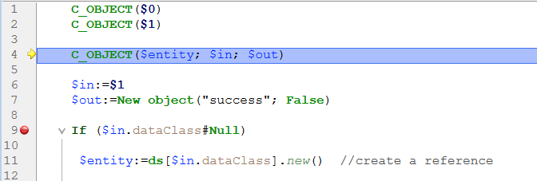

## Visão Geral

Os pontos de interrupção e a captura de comandos são técnicas de depuração muito eficientes. Ambas têm o mesmo efeito: fazem uma pausa na execução do código (e apresentam a janela do depurador, se ainda não tiver sido apresentada) num passo pretendido.

Os pontos de interrupção são definidos em qualquer linha de código onde se pretenda que a execução seja interrompida. É possível associar uma condição ao ponto de interrupção.

A captura de um comando permite começar a rastrear a execução de qualquer processo assim que um comando for chamado por esse processo.

## Breakpoints

Para criar um ponto de interrupção, clique na margem esquerda do painel Código-fonte no depurador ou no Editor de código.

No exemplo a seguir, um ponto de interrupção (o marcador vermelho) foi definido, no depurador, na linha `If ($in.dataClass#Null)`:

No exemplo acima, clicar no botão [**No Trace**](./debugger.md#no-trace) retoma a execução normal até a linha marcada com o ponto de interrupção. Essa linha não é executada - o usuário é levado de volta ao modo de rastreio. Definir um ponto de interrupção para além do contador do programa e clicar no botão **No Trace** permite saltar partes do método que está sendo rastreado.

Para remover um ponto de interrupção, clique no marcador correspondente.

### Propriedades do ponto de interrupção

Pode editar o comportamento de um ponto de interrupção utilizando a janela Propriedades do ponto de paragem:

Esta janela está disponível no Editor de código ou no [Painel de código-fonte](debugger.md#source-code-pane). Pode:

- clique com o botão direito do mouse numa linha e selecione **Edit Breakpoint** no menu contextual, ou
- `Alt+clique em` (Windows) ou `Option+clique em` (macOS) na margem esquerda.

Se já existir um ponto de paragem, a janela é apresentada para esse ponto de paragem. Caso contrário, é criado um ponto de paragem e a janela é apresentada para o novo ponto de paragem criado.

Segue-se uma descrição das propriedades:

* **Localização**: indica o nome do método e o número de linha associado ao ponto de paragem.
* **Interromper quando a expressão seguinte é true**: pode criar **pontos de interrupção condicionais** introduzindo uma fórmula 4D que devolva `True` ou `False`. Por exemplo, insira `Records in selection(\[aTable])=0` para garantir que a quebra ocorre apenas se não houver nenhum registo selecionado para a tabela \[aTable]. As condições dos pontos de paragem estão disponíveis na coluna **Condição** da [lista de interrupções](#break-list).
* **Número de vezes a saltar antes de interromper**: pode anexar um ponto de interrupção a uma linha localizada numa estrutura de ciclo (While, Repeat, ou For) ou localizada numa sub-rotina ou função chamada a partir de um ciclo.
* **O ponto de interrupção está desativado**: se não necessitar atualmente de um ponto de interrupção, mas poderá precisar dele mais tarde, pode desativá-lo temporariamente. Um ponto de interrupção desativado aparece como um traço (-) em vez de um marcador (-)|.

### Pontos de interrupção na depuração remota

A lista de pontos de paragem é armazenada localmente. No modo de depuração remota, se o depurador anexado for um 4D remoto, a lista de pontos de interrupção remota substitui temporariamente a lista de pontos de interrupção do servidor durante a sessão de depuração.

A lista de pontos de paragem do servidor é automaticamente restaurada se voltar a ser o depurador ligado.

### Lista de pausas

A lista de interrupções é uma página do explorador do tempo de execução que lhe permite gerir os pontos de interrupção criados na janela do depurador ou no editor de código. Para mais informações sobre o Explorador de tempo de execução, consulte a sua página dedicada em [o manual de referência do projeto](https://doc.4d.com/4Dv19/4D/19/Runtime-Explorer.200-5416614.en.html).

Para abrir a página da lista de pontos de interrupção:

1. No **menu Executar**, clique em **Executar Explorer...**

2. Clique no separador **Break** para visualizar a lista de pausas:

Usando esta janela, pode:

* Definir condições para os pontos de paragem na coluna **Condições**
* Ative ou desative os pontos de interrupção clicando nos marcadores na margem. Os pontos de interrupção desactivados apresentam marcadores transparentes
* Elimine os pontos de interrupção premindo a tecla `Delete` ou `Backspace`, ou clique no botão **Delete** abaixo da lista.
* Abrir os métodos onde se encontram os pontos de interrupção fazendo duplo clique em qualquer linha da lista

Não é possível adicionar novos pontos de paragem a partir desta janela. Os pontos de paragem só podem ser criados a partir da janela do depurador ou do editor de código.

## Comandos de captura

O separador **Catch** do Runtime Explorer permite-lhe adicionar quebras adicionais ao seu código, capturando chamadas para comandos 4D. Ao contrário de um ponto de interrupção, que está localizado em um método particular do projeto (e, portanto, desencadeia uma exceção de rastreamento apenas quando é alcançado), o escopo de captura de um comando inclui todos os processos que executam o código 4D e chamam esse comando.

A captura de um comando é uma forma conveniente de rastrear grandes porções de código sem definir pontos de interrupção em locais arbitrários. Por exemplo, se um registo que não deveria ser eliminado for eliminado depois de ter executado um ou vários processos, pode tentar reduzir o campo da sua investigação capturando comandos como `DELETE RECORD` e `DELETE SELECTION`. Cada vez que estes comandos forem chamados, é possível verificar se o registo em questão foi eliminado e, assim, isolar a parte defeituosa do código.

Pode combinar pontos de interrupção e captura de comandos.

Para abrir a página Comandos apanhados:

1. Escolha **Run** > **Runtime explorer...** para abrir o Runtime Explorer.

2. Clique em **Catch** para exibir a lista de pontos de interrupção nos comandos:

Esta página lista os comandos que devem ser capturados durante a execução. É composto por duas colunas:

* A coluna da esquerda mostra o estado de ativação/desativação do ponto de interrupção no comando, seguido pelo nome do comando
* A coluna da direita mostra a condição associada ao ponto de interrupção do comando, se houver

Para adicionar um ponto de interrupção personalizado:

1. Clique no botão **Add New Catch** (com a forma de um +) situado por baixo da lista. É adicionada uma nova entrada à lista com o comando `ALERT` por padrão
2. Clique na etiqueta **ALERT**, digite o nome do comando em que deseja definir um ponto de interrupção e pressione **Enter**.

Para ativar ou desativar um ponto de interrupção de ordem, clique no ponto (-) na frente da etiqueta do comando. A bala é transparente quando o controle é desativado.

> Desativar um ponto de interrupção no comando tem praticamente o mesmo efeito que excluí-lo. Durante a execução, o depurador quase não passa tempo na entrada. A vantagem de desativar uma entrada é que não tem de a recriar quando voltar a precisar dela.

Para remover um ponto de interrupção no comando:

1. Seleccione um comando na lista.
2. Prima **Backspace** ou **Delete** no seu teclado ou clique no botão **Delete** abaixo da lista (**Delete All** remove todos os comandos da lista).

### Definir uma condição para um ponto de interrupção no comando

1. Clique na entrada na coluna da direita
2. Introduza uma fórmula 4D (expressão, chamada comando ou método de projeto) que devolve um valor booleano.

> Para remover uma condição, elimine a sua fórmula.

A adição de condições permite-lhe parar a execução quando o comando é invocado apenas se a condição for cumprida. Por exemplo, se associar a condição `Records in selection(\[Emp]>10)` ao ponto de interrupção do comando `DELETE SELECTION`, o código não será interrompido durante a execução do comando `DELETE SELECTION` se a seleção atual da tabela \[Emp] contiver apenas 9 registos (ou menos).

A adição de condições a pontos de interrupção em comandos torna a execução mais lenta, pois a condição precisa ser avaliada toda vez que uma exceção é encontrada. Por outro lado, adicionar condições acelera o processo de depuração, porque 4D automaticamente ignora ocorrências que não correspondem às condições.

