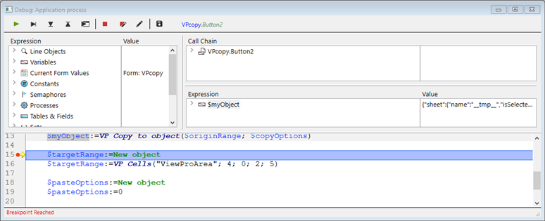
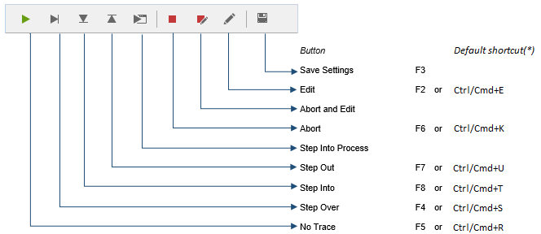
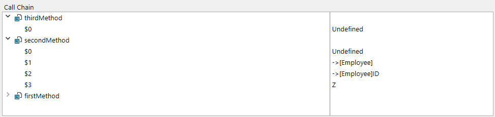
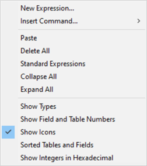
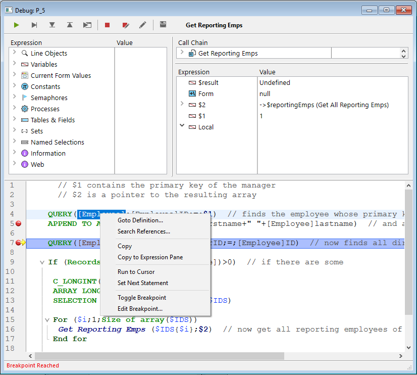

O depurador é útil quando é necessário detetar erros ou monitorizar a execução de métodos. Permite-lhe percorrer o seu código lentamente e examinar a informação. Este processo é designado por "rastreio".



## Chamando o depurador

Há várias formas de exibir o depurador:

* Clicar no botão **Trace** na [janela de erros de sintaxe](basics.md#syntax-error-window)
* Utilizando o comando [`TRACE`](https://doc.4d.com/4dv19/help/command/en/page157.html)
* Clicar no botão **Debug** na janela de execução do método ou selecionar o botão **Run and debug...** no editor de código
* Utilizando **Alt+Shift+Clique com o botão direito do rato em** (Windows) ou **Ctrl+Option+Cmd+Clique em** (macOS) enquanto um método está a ser executado e, em seguida, seleccione o processo a rastrear no menu instantâneo:


* Clicando no botão **Trace** quando um processo é selecionado na página Processo do Explorador de execução.
* Adicionar um ponto de interrupção na janela do Editor de código ou nas páginas Break e Catch do Explorador de execução.

Quando chamada, a janela do depurador fornece o nome do método ou da função de classe que rastreia atualmente e a ação que causa o aparecimento inicial da janela do depurador. Por exemplo, na janela do depurador acima:

* *Clients_BuildLogo* é o método que é rastreado
* A janela do depurador apareceu porque detectou uma chamada para o comando `C_PICTURE` e este comando era um dos comandos a serem identificados

A exibição de uma nova janela do depurador utiliza a mesma configuração que a última janela exibida na mesma sessão. Se executar vários processos usuário, pode rastreá-los de forma independente e ter uma janela do depurador aberta para cada processo.

A janela do depurador é normalmente apresentada na máquina onde o código é executado. Com uma aplicação monousuário, é sempre apresentado na máquina que executa a aplicação. Com uma aplicação cliente/servidor, é apresentado:

* no 4D remoto para o código que está a ser executado localmente
* na máquina do servidor para o código em execução no servidor (por exemplo, um método com a opção **executar no servidor**).

> Se o servidor estiver a funcionar sem interface, não pode ser apresentada qualquer janela do depurador no servidor, pelo ser necessário utilizar o depurador remoto. Consulte [Depuração a partir de máquinas remotas](./debugging-remote.md).

## Botões da barra de ferramentas

A barra de ferramentas do depurador inclui vários botões, associados a atalhos predefinidos:



> Os atalhos padrão podem ser personalizados na página Atalhos da caixa de diálogo Preferências.

#### Retomar execução

Interrompe o modo de rastreamento e retoma o curso normal da execução do método.

> **Shift** + **F5** ou **Shift** + clicar no botão **No Trace** retoma a execução. Também desativa todas as chamadas TRACE subsequentes para o processo atual.

#### Executar passo a passo

Executa a linha de método atual, indicada pelo contador de programa (a seta amarela). O depurador passa para a linha seguinte.

O botão Executar não entra em sub-rotinas e funções, mantém-se ao nível do método que rastreia atualmente. Se pretender rastrear também as chamadas de sub-rotinas e funções, utilize o botão **Passo a Passo detalhado**.

Na depuração remota, se o método for executado no servidor, o método principal é chamado após a execução da última linha do método secundário. Se o método principal for executado no lado remoto, o botão **Executar passo a passo** tem o mesmo efeito que o botão **Retomar execução**.

#### Passo a passo detalhado

Quando uma linha que chama outro método (sub-rotina ou função) é executada, clique neste botão para exibir o outro método e percorrê-lo.

O novo método se torna o método atual (superior) na janela de [cadeia de chamadas](#call-chain-pane) da janela do depurador.

Ao executar uma linha que não chama outro método, este botão tem o mesmo efeito que o botão **Executar passo a passo**.

#### Abortar

Interrompe a execução do método e regressa ao estado anterior ao início da execução do método:

* Ao rastrear um método formulário ou um método objeto em execução em resposta a um evento: pára e retorna ao formulário.
* Ao rastrear um método em execução no ambiente do aplicativo: pára e retorna ao ambiente.

#### Abortar e editar

Pausa na execução do método. O método que está a ser executado quando se clica no botão **Abortar e Editar** abre-se no Editor de código.
> **Sugestão**: utilize este botão quando souber quais as alterações necessárias no seu código e quando estas alterações forem necessárias para prosseguir o teste dos seus métodos. Quando terminar as alterações, volte a executar o método.

#### Editar

Pausa na execução do método. O método executado no momento em que se clica no botão Editar abre-se no Editor de código.

Se utilizar este botão para modificar um método, as modificações só entram em vigor na próxima vez que este for executado.

> **Dica:** Utilize este botão quando sabe quais as alterações necessárias no seu código e quando estas não interferem com o resto do código a ser executado ou rastreado.

#### Botão Salvar parâmetros

Salva a configuração atual da janela do depurador e a torna a configuração padrão. Isto inclui:

* o tamanho e a posição da janela
* a posição das linhas de divisão e o conteúdo da área que avalia as expressões

Estes parâmetros são armazenados no projeto.

Esta ação não está disponível no modo de depuração remota (consulte [Depuração a partir de máquinas remotas](./debugging-remote)).

## Janela de expressão

A **janela de expressão** é apresentado no canto superior esquerdo da janela do depurador, por baixo da barra de ferramentas de controlo da execução. Aqui um exemplo simples:


> Este painel não está disponível no modo de depuração remota.

A **janela de expressão** exibe informações gerais úteis sobre o sistema, o ambiente 4D e o ambiente de execução.

A coluna **Expression** apresenta os nomes dos objetos e das expressões. A coluna **Value** apresenta os valores correspondentes actuais. Clicar em qualquer valor no lado direito do painel permite-lhe modificar o valor do objeto, se tal for permitido para esse objeto.

Em qualquer momento, pode arrastar e largar temas, sublistas de temas (se existirem) e itens de temas para a [Janela de expressão](#custom-watch-pane).

### Lista de expressões

#### Objetos linha

Este tema permite-lhe acompanhar os valores dos objetos ou expressões:

* usado na linha de código a ser executada (aquela marcada com o contador de programa - a seta amarela no [painel de código-fonte](#source-code-pane)),
* utilizado na linha de código anterior

Como a linha de código anterior é a que acabou de ser executada antes, este tema mostra os objetos ou expressões da linha atual antes e depois da execução da linha.  Digamos que executa o seguinte método:

```4d
TRACE
$a:=1
$b:=a+1
$c:=a+b
```

1. Uma janela Depurador é aberta com o contador do programa definido para a linha com `a:=1`. Nesta altura, é apresentado o tema **Objetos Linha**:

    | $a | Indefinido |
    | -- | ---------- |
    |    |            |

    A variável `$a` ainda não está inicializada, mas é exibida porque é usada na linha a ser executada.

2. Clique no botão **Step Over**. O contador de programa está agora definido para a linha `b:=a+1`. Nesta altura, o tema mostra:

    | $a | 1          |
    | -- | ---------- |
    | $b | Indefinido |

    O valor da variável `$a` é agora 1. A variável `$b` ainda não está inicializada, mas é exibida porque é usada na linha a ser executada.

3. Clique novamente no botão **Step Over**. O contador do programa está agora definido na linha com c:=a+b. Neste ponto, é exibido o tema Objetos de linha:

    | $c | Indefinido |
    | -- | ---------- |
    | $a | 1          |
    | $b | 2          |

    O valor da variável `$b` é agora 2. A variável `$c` ainda não está inicializada, mas é exibida porque é usada na linha a ser executada.

#### Variáveis.

Este tema é composto pelos seguintes subtemas:

| Subtema       | Descrição                                                         | Os valores podem ser modificados? |
| ------------- | ----------------------------------------------------------------- | --------------------------------- |
| Interprocesso | Lista de variáveis interprocessos que são utilizadas agora        | Sim                               |
| Processo      | Lista de variáveis processo utilizadas pelo processo atual        | Sim                               |
| Local         | Lista de variáveis locais utilizadas pelo método rastreado        | Sim                               |
| Parâmetros    | Lista dos parâmetros recebidos pelo método                        | Sim                               |
| Self          | Ponteiro para o objeto atual, quando se rastreia um método objeto | Não                               |

Os arrays, como outras variáveis, aparecem nos subtemas Interprocesso, Processo e Local, dependendo do seu escopo. O depurador apresenta os primeiros 100 elementos. Na coluna **Valor**, pode modificar os valores dos elementos array, mas não o tamanho dos arrays.

Para apresentar os tipos de variáveis e os seus nomes internos, clique com o botão direito do rato e selecione a opção **Mostrar tipos** no menu de contexto:


Aqui está o resultado:


#### Valores actuais do formulário

Este tema contém o nome de cada objeto dinâmico incluído no formulário atual, bem como o valor da sua variável associada:


Alguns objetos, como os arrays list box, podem ser apresentados como dois objetos distintos, a variável do próprio objeto e a sua fonte de dados.

#### Constantes

Como a página Constantes da janela Explorer, esse tema exibe as constantes predefinidas oferecidas pelo 4D. As expressões deste tema não podem ser modificadas.

#### Semáforos

Este tema lista os semáforos locais definidos atualmente. Para cada semáforo, a coluna Valor fornece o nome do processo que define o semáforo. As expressões deste tema não podem ser modificadas. The expressions from this theme cannot be modified.

#### Processos

Este tema enumera os processos iniciados desde o início da sessão de trabalho. A coluna do valor apresenta o tempo utilizado e o estado atual de cada processo (ou seja, Executando, pausado, etc.). As expressões deste tema não podem ser modificadas.

#### Tabela

Este tema lista as tabelas e campos na base de dados 4D. Para cada item da tabela, a coluna Valor apresenta o tamanho da seleção atual para o processo atual, bem como o número de **registos bloqueados**.

Para cada item Campo, a coluna Valor apresenta o valor do campo para o registo atual (exceto imagem e BLOB). Pode modificar os valores dos campos, mas não as informações das tabelas.

#### Conjuntos

Este tema lista os conjuntos definidos no processo atual (aquele que está sendo rastreado) e os conjuntos interprocessos. Para cada conjunto, a coluna Valor apresenta o número de registos e o nome da tabela. As expressões deste tema não podem ser modificadas.

#### Seleções temporárias

Este tema lista as seleções temporárias definidas no processo atual (aquele que está sendo rastreado no momento); ele também lista as seleções temporárias entre processos. Para cada seleção temporária, a coluna Valor apresenta o número de registos e o nome da tabela. As expressões deste tema não podem ser modificadas.

#### Informação

Este tema contém informações gerais sobre o funcionamento da base de dados, tais como a tabela predefinida atual (se existir), espaço de memória físico, virtual, livre e utilizado, destino da consulta, etc.

#### Web

Este tema apresenta informações sobre o servidor Web principal da aplicação (apenas disponível se o servidor Web estiver ativo):

* Ficheiro Web a enviar: nome do ficheiro Web que está à espera de ser enviado (se existir)
* Utilização da cache Web: número de páginas presentes na cache Web, bem como a sua percentagem de utilização
* Tempo decorrido do servidor Web: duração da utilização do servidor Web no formato horas:minutos:segundos
* Contagem de visitas à Web: número total de pedidos HTTP recebidos desde o lançamento do servidor Web, bem como o número instantâneo de pedidos por segundo
* Número de processos Web ativos: número de processos Web ativos, todos os processos Web em conjunto

As expressões contidas neste tema não podem ser modificadas.

### Menu contextual

O menu contextual da janela de expressão oferece opções adicionais.


* **Recolher tudo**: Recolhe todos os níveis da lista hierárquica.
* **Expandir tudo**: Expandir todos os níveis da lista hierárquica.
* **Mostrar tipos**: Apresenta o tipo de cada item (quando apropriado).
* **Mostrar os números dos campos e das tabelas**: Apresenta o número de cada tabela ou campo. Útil se trabalhar com números de tabelas ou de campos, ou com apontadores utilizando comandos como `Table` ou `Field`.
* **Mostrar ícones**: Cada objeto é precedido por um ícone que indica seu tipo. Pode desativar esta opção para acelerar a visualização, ou simplesmente porque prefere utilizar apenas a opção **Mostrar os tipos**.
* **Tabelas e campos ordenados**: Ordena as tabelas e os campos por ordem alfabética nas respectivas listas.
* **Mostrar números inteiros em hexadecimal**: Os números são normalmente apresentados em notação decimal. Esta opção apresenta-os em notação hexadecimal. Nota: para introduzir um valor numérico em hexadecimal, digite 0x (zero + "x"), seguido dos dígitos hexadecimais.
* **Ativar a monitorização da atividade**: ativa a monitorização da atividade (verificação avançada da atividade interna da aplicação) e apresenta as informações obtidas nos temas adicionais: **Agendador**, **Web** e **Rede**.

## Painel da cadeia de chamadas

Um método pode chamar outros métodos ou funções de classe, que podem chamar outros métodos ou funções. O painel Cadeia de chamadas permite-lhe acompanhar essa hierarquia.



Cada item do nível principal é o nome de um método ou função classe. O item superior é o que é atualmente rastreado, o item seguinte do nível principal é o nome do chamador (o método ou função que chamou o que é atualmente rastreado), o item seguinte é o chamador do chamador, e assim por diante.

Na imagem acima:

* `thirdMethod` não recebeu nenhum parâmetro
* `$0` está atualmente indefinido, porque o método não atribuiu nenhum valor a `$0` (porque ainda não executou esta atribuição ou por o método ser uma sub-rotina e não uma função)
* `secondMethod` recebeu três parâmetros de `firstMethod`:
  * $1 é um ponteiro para a tabela `[Employee]`
  * $2 é um ponteiro para o campo `ID` na tabela  `[Employee]`
  * $3 é um parâmetro alfanumérico cujo valor é "Z"

Você pode clicar duas vezes no nome de qualquer método para exibir seu conteúdo no [painel código fonte](#source-code-pane).

Clicar no ícone junto ao nome de um método ou função expande, ou recolhe os parâmetros e o resultado (se existir). Os valores aparecem no lado direito do painel. Clicar em qualquer valor do lado direito permite-lhe alterar o valor de qualquer parâmetro ou resultado de função.

Para visualizar o tipo de parâmetro, seleccione a opção **Mostrar tipos** no menu contextual:


After you deploy the list of parameters, you can drag and drop parameters and function results to the [Custom Watch Pane](#custom-watch-pane).

Também pode utilizar o comando [Get call chain](https://doc.4d.com/4dv19/help/command/en/page1662.html) para obter a cadeia de chamadas por programação.

## Custom Watch Pane

O Painel de controle personalizado é útil para avaliar expressões. It is similar to the [Watch Pane](#watch-pane), except here you decide which expressions are displayed. Qualquer tipo de expressão pode ser avaliado:

* campo
* variável
* pointer
* cálculo
* Comando 4D
* method
* e qualquer outra coisa que devolva um valor


É possível avaliar qualquer expressão que possa ser apresentada sob a forma de texto. Isto não abrange os campos ou variáveis imagem e BLOB. Para visualizar o conteúdo do BLOB, pode utilizar comandos BLOB, tais como [BLOB para texto](https://doc.4d.com/4dv19/help/command/en/page555.html).

### Manuseamento de expressões

Existem várias formas de adicionar expressões à lista:

* Drag and drop an object or expression from the Watch Pane or the Call Chain Pane
* Select an expression in the [Source Code pane](#source-code-pane) and press **ctrl+D**  (Windows) or **cmd+D** (macOS)
* Double-click somewhere in the empty space of the Custom Watch Pane (adds an expression with a placeholder name that you can edit)

Pode introduzir qualquer fórmula que devolva um resultado.

To edit an expression, click on it to select it, then click again or press **Enter** on your keyboard.

To delete an expression, click on it to select it, then press **Backspace** or **Delete** on your keyboard.
> **Aviso:** Tenha cuidado quando avalia uma expressão 4D que modifica o valor de uma das variáveis de sistema (por exemplo, a variável OK) porque a execução do resto do método pode ser alterada.

### Menu contextual

The Custom Watch Pane’s context menu gives you access the 4D formula editor and other options:



**New Expression**: This inserts a new expression and displays the 4D Formula Editor.


For more information on the Formula Editor, see the <a href="https://doc.4d.com/4Dv19/4D/19/4D-Design-Reference.100-5416591.en.html" target="_blank">4D Design Reference manual.</a>

* **Insert Command**: Shortcut for inserting a 4D command as a new expression.
* **Delete All**: Removes all expressions from the Custom Watch Pane.
* **Standard Expressions**: Copies the Watch Pane's list of expressions.

> This option is not available in remote debugging mode (see [Debugging from Remote Machines](https://doc.4d.com/4Dv19/4D/19/Debugging-from-Remote-Machines.300-5422483.en.html)).

* **Collapse All/Expand All**: Collapses or Expands all the hierarchical lists.
* **Show Types**: Displays the type of each item in the list (when appropriate).
* **Show Field and Table Numbers**: Displays the number of each table or field of the **Fields**. Useful if you work with tables, field numbers or pointers using the commands such as `Table` or `Field`.
* **Show Icons**: Displays an icon denoting the type of each item.
* **Tabelas e campos ordenados**: Apresenta a tabela e os campos por ordem alfabética.
* **Show Integers in Hexadecimal**: Displays numbers using hexadecimal notation. Para introduzir um valor numérico em hexadecimal, digite 0x (zero + "x"), seguido dos dígitos hexadecimais.

## Panel de código fuente

The Source Code Pane shows the source code of the method or function currently being traced.

Esta área também permite adicionar ou remover
**pontos de ruptura</a>.</p> 


### Tips

Passe o ponteiro do rato sobre qualquer expressão para visualizar uma dica de ferramenta que indica:

* o tipo declarado da expressão
* o valor atual da expressão


Isto também funciona com as selecções:


### Adição de expressões ao painel de controle personalizado

You can copy any selected expression from the Source Code Pane to the [Custom Watch Pane](#custom-watch-pane).

1. No painel de código fonte, selecione a expressão a avaliar
2. Faça uma das seguintes opções: 
       * Drag and drop the selected text to the Expression area of the Custom Watch Pane
    * Press **Ctrl+D** (Windows) or **Cmd+D** (macOS)
    * Clique com o botão direito do rato no texto selecionado **>** **Copiar para o painel de expressões**


### Contador do programa

The yellow arrow in the left margin of the Source Code pane is called the program counter. Marca a linha seguinte a ser executada.

Por padrão, a linha do contador de programas (também designada por linha de execução) é realçada no depurador. Pode personalizar a cor de realce na página [Métodos das Preferências](Preferences/methods.md).


#### Movendo o contador do programa

Para efeitos de depuração, é possível deslocar o contador de programa para o método no topo da cadeia de chamadas (o método atualmente em execução). Para o fazer, clique e arraste a seta amarela para outra linha.

Isto apenas diz ao depurador para prosseguir o rastreio ou a execução a partir de um ponto diferente. Não executa linhas nem anula a sua execução. Todos os parâmetros, campos, variáveis, etc. atuais não são afetados.

Por exemplo:


```4d
  // ...
 If(This condition)
    DO_SOMETHING
 Else
    DO_SOMETHING_ELSE
 End if
  // ...
```


Say the program counter is set to the line `If (This condition)`. When you click the **Step over** button, the program counter moves directly to the `DO_SOMETHING_ELSE` line. To examine the results of the `DO_SOMETHING` line, you can move the program counter to that line and execute it.


### Menu contextual

The contextual menu of the Source Code Pane provides access to several functions that are useful when executing methods in Trace mode:



* **Ir para definição**: vai para onde o objeto selecionado está definido. Este comando está disponível para: 
    * *Métodos projeto:* apresenta o conteúdo do método numa nova janela do editor de código
  * *Campos:* exibe as propriedades do campo no inspetor da janela de estrutura
  * *Tabelas:* apresenta as propriedades da tabela no inspetor da janela de estrutura
  * *Formulários:* apresenta o formulário no editor de formulários
  * *Variáveis* (local, processo, inter-processo ou parâmetro $n): apresenta a linha no método atual ou entre os métodos do compilador onde a variável é declarada
* **Pesquisar Referências** (também disponível no Editor de Código): procura todos os objetos do projeto (métodos e formulários) nos quais o elemento atual do método é referenciado. O elemento atual é o elemento selecionado ou o elemento onde se encontra o cursor. Pode ser o nome de um campo, variável, comando, cadeia de caracteres, etc. Os resultados da pesquisa são apresentados numa nova janela de resultados padrão.
* **Copiar**: cópia padrão da expressão selecionada no contêiner de dados.
* **Copiar para a janela de expressão**: copia a expressão selecionada para a janela de avaliação.
* **Execute to cursor**:Executa as instruções entre o contador de programas e a linha selecionada do método (onde está o cursor).
* **Set Next Statement**:Moves program counter to the selected line without executing this line or any intermediate ones. The designated line is only run if the user clicks on one of the execution buttons.
* **Toggle Breakpoint** (also available in Code Editor): Alternately inserts or removes the breakpoint corresponding to the selected line. This modifies the breakpoint permanently: for instance, if you remove a breakpoint in the debugger, it no longer appears in the original method.
* **Edit Breakpoint** (also available in Code Editor): Displays the Breakpoint Properties dialog box. Quaisquer alterações efetuadas modificam permanentemente o ponto de interrupção.


### Localizar seguinte/anterior

Os atalhos específicos permitem-lhe encontrar cadeias de caracteres idênticas à que foi selecionada:

* Para procurar as cadeias de caracteres idênticas seguintes, prima **Ctrl+E** (Windows) ou **Cmd+E** (macOS)
* Para procurar as cadeias de caracteres idênticas anteriores, prima **Ctrl+Shift+E** (Windows) ou **Cmd+Shift+E** (macOS)

A pesquisa só é efetuada se selecionar pelo menos um carácter no painel Código fonte.


## Atalhos

Esta secção lista todos os atalhos disponíveis na janela do depurador.


> A barra de ferramentas também tem [atalhos](#tool-bar-buttons).


#### Janela de avaliação e subjanela de avaliação

* Um **clique duas vezes** em um elemento na janela de expressão para copiá-lo para a janela de avaliação
* Um **clique duplo** na subjanela de avaliação cria uma nova expressão


#### Panel de código fuente

* Clique na margem esquerda para definir ou remover pontos de quebra.
* **Alt+Shift+Clique** (Windows) ou **Option+Shift+Clique** (macOS) define um ponto de interrupção temporário.
* **Alt-Click** (Windows) ou **Option-Click** apresenta a janela Editar quebra para um ponto de quebra novo ou existente.
* Uma expressão ou objeto selecionado pode ser copiado para a janela de avaliação personalizada através de um simples arrastar e largar.
* As combinações de teclas **Ctrl+D** (Windows) ou **Cmd+D** (macOS) copiam o texto selecionado na janela de avaliação personalizado.
* As combinações de teclas ** Ctrl+E** (Windows) ou **Cmd+E** (macOS) localizam as cadeias de caracteres seguintes idênticas à que foi selecionada.
* As combinações de teclas **Ctrl+Shift+E** (Windows) ou **Cmd+Shift+E** (macOS) localizam as cadeias de caracteres anteriores idênticas à selecionada.


#### Todas as janelas

* **Ctrl** + **+/-** (Windows) ou **Comando** + **+/-** (macOS) aumenta ou diminui o tamanho do tipo de letra para uma melhor legibilidade. O tamanho de letra modificado também é aplicado ao Editor de código sendo guardado nas Preferências.
* **Ctrl + \*** (Windows) ou **Comando + \*** (macOS) força a atualização da janela de expressão.
* Quando nenhum objeto estiver selecionado nas janelas, pressionar **Enter** o fará avançar uma linha.
* Quando um valor de item é selecionado, utilize as teclas de setas para navegar na lista.
* Ao editar um item, utilize as teclas de seta para mover o cursor. Utilize Ctrl-A/X/C/V (Windows) ou Comandó-A/X/C/V (macOS) como atalhos para os comandos de menu Selecionar tudo/Cortar/Copiar/Colar do menu Editar.
