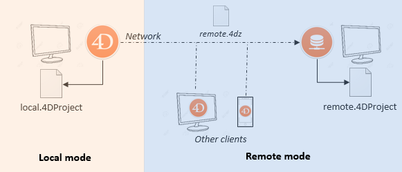

As aplicações 4D desktop podem ser utilizadas numa configuração Cliente/Servidor, quer como aplicações cliente/servidor fundidas, quer como projectos remotos.

- **Os aplicativos cliente/servidor fusionados** são gerados pelo [gerenciador Build Application](building.md#clientserver-page). São utilizados para implementações de aplicações.

- Os **projectos remotos** são arquivos [.4DProject](Project/architecture.md) abertos pelo 4D Server e acessados com 4D em modo remoto. O servidor envia uma versão .4dz do projeto ([comprimido formato](building.md#build-compiled-structure)) para a 4D remota, portanto arquivos de estrutura são somente leitura. Esta configuração é normalmente utilizada para testar aplicações.

> Conectar a um projeto remoto da **mesma máquina que o 4D Server** permite modificar os arquivos do projeto. Esse [recurso específico](#using-4d-and-4d-server-on-the-same-machine) permite desenvolver um aplicativo cliente/servidor no mesmo contexto que o contexto de implementação.

## Abrir uma aplicação cliente/servidor fundida

Um aplicativo cliente/servidor mesclado é personalizado e seu início é simplificado:

- Para iniciar a parte do servidor, o usuário simplesmente clica duas vezes no aplicativo do servidor. The database does not need to be selected.
- Para iniciar a parte do cliente, o usuário simplesmente clica duas vezes no aplicativo cliente, que se conecta diretamente ao aplicativo do servidor.

Esses princípios estão detalhados na página [Criar aplicativo](building.md#what-is-a-clientserver-application).

## Abrir um projecto remoto

A primeira vez que se liga a um projecto 4D Server através de um 4D remoto, normalmente utilizará o diálogo de ligação padrão. Depois disso, você poderá se conectar diretamente usando o menu **Open Recent Projects** ou um arquivo de atalho do 4DLink.

Para conectar remotamente a um projeto 4D Server:

1. Faça uma das seguintes opções:
   - Selecione **Connect to 4D Server** na caixa de diálogo Welcome Wizard (Assistente de boas-vindas)
   - Selecione **Abrir/Projeto remoto...** no menu **Arquivo** ou no botão da barra de ferramentas **Abrir**.

Aparece o diálogo de ligação do 4D Server. Essa caixa de diálogo tem três guias: **Recente**, **Disponível** e **Personalizado**.

Se o 4D Server estiver conectado à mesma rede que o 4D remoto, selecione **Available (Disponível**). O 4D Server inclui um sistema de transmissão TCP/IP integrado que, por padrão, publica o nome dos projetos do 4D Server disponíveis na rede. A lista é classificada por ordem de aparecimento e atualizada dinamicamente.

Para se conectar a um servidor da lista, clique duas vezes em seu nome ou selecione-o e clique no botão **OK**.

> Um acento circunflexo (^) é colocado antes do nome dos projetos publicados com a opção de criptografia ativada.

Se o projeto publicado não for exibido na lista **Disponível**, selecione **Personalizado**. A página Personalizado permite que você se conecte a um servidor publicado na rede usando seu endereço de rede e atribuindo a ele um nome personalizado.

- **Project name (Nome do projeto**): Define o nome local do projeto 4D Server. Este nome será usado na página **Recente** quando referente ao projeto.
- **Endereço de rede**: O endereço IP da máquina onde o 4D Server foi iniciado.
  - Se dois servidores forem executados simultaneamente no mesmo computador, o endereço IP deverá ser seguido de dois pontos e do número da porta, por exemplo: `192.168.92.104:19814`.
  - Por padrão, a porta de publicação de um 4D Server é 19813. Este número pode ser modificado nas definições do Projecto.

> A opção **Ativar modo de desenvolvimento** abre a conexão remota em um modo especial de leitura/gravação e requer o acesso à pasta do projeto a partir do 4D remoto (opção de compatibilidade).

Quando essa página atribuir um servidor, clicar no botão **OK** permitirá que você se conecte ao servidor.

Depois que a conexão com o servidor for estabelecida, o projeto remoto será listado na guia **Recent (Recente** ).

### Atualizando arquivos do projeto no servidor

O 4D Server cria e envia automaticamente para as máquinas remotas uma [ versão .4dz](building.md#build-compiled-structure) do arquivo de projeto *.4DProject* (não compactado) no modo interpretado.

- Uma versão .4dz atualizada do projeto é automaticamente produzida quando necessário, *i. .* quando o projeto for modificado e recarregado pelo Servidor 4D. O projeto foi recarregado:
  - automaticamente quando a janela de aplicação do Servidor 4D chegar à frente do sistema operacional ou quando o aplicativo 4D na mesma máquina salvar uma modificação (veja abaixo).
  - quando o comando `RELOAD PROJET` for executado. Chamar este comando é necessário, por exemplo, quando você puxou uma nova versão do projeto a partir da plataforma de controle de origem.

### Atualizando arquivos do projeto em máquinas remotas

Quando uma versão atualizada .4dz do projeto for produzida no 4D Server, as máquinas 4D remotas conectadas devem se desconectar e se reconectar ao 4D Server para se beneficiar da versão atualizada.

## Utilização de 4D e 4D Server na mesma máquina

Quando 4D se conecta a um 4D Server na mesma máquina, o aplicativo se comporta como 4D no modo de usuário único e o ambiente de design permite editar arquivos de projeto. Esse recurso permite que você desenvolva um aplicativo cliente/servidor no mesmo contexto que o contexto de implementação.

> Quando o 4D se conectar a um 4D Server na mesma máquina, o **modo de desenvolvimento** será ativado automaticamente, independentemente do status [da opção de abertura](#opening-a-remote-project).

Cada vez que o 4D executa uma ação **Salvar tudo** no ambiente de design (explicitamente no menu **Arquivo** ou implicitamente ao mudar para o modo de aplicação, por exemplo), o 4D Server recarrega sincronizadamente os arquivos de projeto. O 4D espera o servidor 4D terminar de recarregar os arquivos do projeto antes de continuar.

No entanto, você precisa prestar atenção às seguintes diferenças de comportamento em comparação com a [arquitetura de projeto padrão](Project/architecture.md):

- a pasta userPreferences.\{username\} usada pelo 4D não é a mesma pasta usada pelo 4D Server na pasta do projeto. Em vez disso, é uma pasta dedicada, denominada "userPreferences", armazenada na pasta do sistema do projeto (ou seja, o mesmo local em que se abre um projeto .4dz).
- a pasta usada pelo 4D para dados derivados não é a pasta chamada "DerivedData" na pasta do projeto. Em vez disso, é uma pasta dedicada chamada "DerivedDataRemote" localizada na pasta do sistema do projeto.
- O arquivo catalog.4DCatalog não é editado pela 4D, mas sim pelo 4D Server. As informações do catálogo são sincronizadas através de pedidos cliente/servidor
- o arquivo directory.json não é editado por 4D, mas pelo servidor 4D. As informações do diretório são sincronizadas através de pedidos cliente/servidor
- 4D utiliza os seus próprios componentes internos e plug-ins em vez dos do 4D Server.

> Não é recomendado instalar plug-ins ou componentes no nível da aplicação 4D, ou 4D Server.
