4D fornece um editor de formulários completo que permite modificar seu formulário até conseguir o efeito que deseja. Com o editor de formulários, é possível criar e eliminar objetos, manipulá-los diretamente e definir as propriedades de objetos e formulários.

## Interface

O editor de formulários apresenta cada formulário JSON na sua própria janela, que tem uma barra de ferramentas e de uma barra de objetos. É possível ter vários formulários abertos ao mesmo tempo.

### Opções de visualização

Você pode mostrar ou ocultar vários elementos da interface na página atual do formulário:

- **Formulário herdado**: objetos formulário herdados (se houver um [formulário herdado](forms.md#inherited-forms)).
- **Página 0**: objetos da [página 0](forms.md#form-pages). Esta opção permite que você distinga entre os objetos na página atual do formulário e aqueles na página 0.
- **Papel**: bordas da página de impressão, mostradas como linhas cinzas. Este elemento só pode ser exibido por padrão em formulários do tipo ["para impressão"](properties_FormProperties.md#form-type).
- **Réguas**: réguas da janela do editor de formulários.
- **Marcadores**: linhas de controle de saída e marcadores associados que mostram os limites das diferentes áreas do formulário. Esse elemento só pode aparecer por padrão nos [formulários lista](properties_FormProperties.md#form-type).
- **Rótulos dos marcadores**: rótulos dos marcadores, disponíveis apenas quando as linhas de controle de saída forem exibidas. Esse elemento só pode aparecer por padrão nos [formulários lista](properties_FormProperties.md#form-type).
- **Limites**: limites do formulário. Quando essa opção é selecionada, o formulário é exibido no editor de formulários como aparece no modo Aplicação. Desta forma, você pode ajustar seu formulário sem precisar trocar para o modo de Aplicação para ver o resultado.

> Os parâmetros [**Size Based on**](properties_FormSize.md#size-based-on), [**Hor margin**](properties_FormSize.md#hor-margin) and [**Vert margin**](properties_FormSize.md#vert-margin) de propriedades do formulário afetam os limites do formulário. Ao usar essas configurações, os limites são baseados nos objetos do formulário. Quando você modifica o tamanho de um objeto localizado próximo à borda do formulário, ele é modificado para refletir essa alteração.

#### Visualização por defeito

Quando um formulário é aberto no editor, os elementos da interface são exibidos ou ocultos por padrão, dependendo de:

- as opções de **exibição padrão do novo formulário** definidas nas Preferências - as opções não marcadas não podem ser exibidas por padrão.
- o [tipo de formulário](properties_FormProperties.md#form-type) atual:
  - Marcadores e rótulos de marcadores são sempre exibidos por padrão em formulários lista
  - O papel é apresentado por defeito nos formulários "para impressão".

#### Exibir/ocultar elementos

Você pode exibir ou ocultar elementos a qualquer momento na janela atual do editor de formulários selecionando **Apresentar** no menu **Formulário** ou no menu de contexto do editor de formulários:


### Regras

As réguas na lateral e na parte inferior o ajudam a posicionar os objetos no formulário. Podem ser [apresentados ou ocultos](#display-options).

Selecione **Definição de régua...** no menu **Formulário** para alterar as unidades de medida de modo que o formulário exiba polegadas, centímetros ou píxeis.

### Barra de ferramentas

A barra de ferramentas do editor de formulário oferece um conjunto de ferramentas para manipular e modificar o formulário. Cada janela tem a sua própria barra de ferramentas.


A barra de ferramentas contém os seguintes elementos:

| Ícone                                            | Nome                                                      | Descrição                                                                                                                                                                                                                                                                                                                                                                       |
| ------------------------------------------------ | --------------------------------------------------------- | ------------------------------------------------------------------------------------------------------------------------------------------------------------------------------------------------------------------------------------------------------------------------------------------------------------------------------------------------------------------------------- |
|          | Executar o formulário                                     | Utilizado para testar a execução do formulário. Ao clicar nesse botão, 4D abre uma nova janela e exibe o formulário em seu contexto (lista de registros para um formulário de lista e página de registro atual para um formulário detalhado). O formulário é executado no processo principal.                                                                                   |
|        | [Ferramenta de selecção](#selecting-objects)              | Permite selecionar, mover e redimensionar os objetos do formulário.<p>**Nota**: quando um objeto do tipo Texto ou Group Box é selecionado, pressionando a tecla **Enter** permite que você mude para o modo de edição.</p>                                                                                                                                                                                                                                                                                    |
|           | [Ordem de entrada](#selecting-objects)                    | Alterna para o modo "Ordem de entrada", onde é possível visualizar e alterar a ordem de entrada atual do formulário. Observe que os escudos permitem a visualização da ordem de entrada atual, enquanto você ainda trabalha no formulário.                                                                                                                                      |
|           | [Deslocamento](#moving-objects)                           | Alterne para o modo "Mover", onde for possível alcançar qualquer parte do formulário rapidamente usando arrastar e soltar na janela. O cursor assume a forma de uma mão. Este modo de navegação é particularmente útil ao ampliar o formulário.                                                                                                                                 |
|             | [Zoom](#zoom)                                             | Permite modificar a percentagem de visualização do formulário (100% por padrão). Você pode alternar para o modo "Zoom" clicando na lupa ou clicando diretamente na barra desejada. Esta função é descrita em pormenor na secção anterior.                                                                                                                                       |
|        | [Alinhamento](#aligning-objects)                          | Este botão está ligado a um menu que permite alinhar os objetos no formulário. Ele é ativado (ou não) dependendo dos objetos selecionados.<br/>Desativado se a posição de um objeto selecionado estiver bloqueada por uma propriedade CSS                                                                                                                                 |
|     | [Distribuição](#distributing-objects)                     | Este botão está ligado a um menu que permite agrupar e desagrupar seleções de objetos no formulário. Ele é ativado (ou não) dependendo dos objetos selecionados.<br/>Desativado se a posição de um objeto selecionado estiver bloqueada por uma propriedade CSS                                                                                                           |
|            | [Nível](#layering-objects)                                | Este botão está ligado a um menu que permite alterar o nível dos objetos no formulário. É ativada (ou não) em função dos objetos selecionados.                                                                                                                                                                                                                                  |
|            | [Grupo/Ungrupo](#grouping-objects)                        | Este botão está ligado a um menu que permite agrupar e desagrupar seleções de objetos no formulário. É ativada (ou não) em função dos objetos selecionados.                                                                                                                                                                                                                     |
|    | [Visualização e gestão de páginas](forms.html#form-pages) | Esta área permite passar de uma página de formulário para outra e adicionar páginas. Para navegar entre páginas de formulários, clique nos botões de seta, ou clique na área central e escolha a página a exibir a partir do menu que aparece. Se clicar no botão da seta para a direita enquanto é exibida a última página do formulário, 4D permite-lhe adicionar uma página. |
|   | [Pré-visualização CSS](#css-preview)                      | Este botão é utilizado para seleccionar o Modo CSS a utilizar.                                                                                                                                                                                                                                                                                                                  |
|            | [Gestão da vistas](#views)                                | Este botão apresenta ou oculta a paleta de vistas. Esta função é detalhada em Utilização de vistas de objeto.                                                                                                                                                                                                                                                                   |
|         | [Mostrando escudos](#shields)                             | Cada clique nesse botão provoca a exibição sucessiva de cada tipo de escudo de formulário. O botão também está vinculado a um menu que permite selecionar diretamente o tipo de escudo a ser exibido.                                                                                                                                                                           |
|          | [Librería de objetos preconfigurada](objectLibrary.html)  | Esse botão exibe a biblioteca de objetos pré-configurados que fornece vários objetos com determinadas propriedades predefinidas.                                                                                                                                                                                                                                                |
|  | [Criação de list box](#list-box-builder)                  | Este botão cria list boxes entity selection.                                                                                                                                                                                                                                                                                                                                    |
|     | [Inserir campos](#insert-fields)                          | Esse botão insere todos os campos (exceto os campos do tipo objeto e bolha) da tabela do formulário no formulário, juntamente com seus rótulos e de acordo com os padrões de interface.                                                                                                                                                                                         |


### Barra de objetos

A barra de objeto contém todos os objetos ativos e inativos que podem ser usados em formas 4D. Alguns objectos estão agrupados por temas. Cada tema inclui várias alternativas que pode escolher entre elas. Quando a barra de objectos tem o foco, é possível seleccionar os botões usando as teclas do teclado. A tabela a seguir descreve os grupos de objetos disponíveis e a respectiva tecla de atalho associada.

| Botão                                      | Agrupar                                                                                                                                                                                                                                                             | Chave |
| ------------------------------------------ | ------------------------------------------------------------------------------------------------------------------------------------------------------------------------------------------------------------------------------------------------------------------- |:-----:|
|       | [Text](FormObjects/text.md) / [Group Box](FormObjects/groupBox.md)                                                                                                                                                                                                  |   T   |
|      | [Entrada](FormObjects/input_overview.md)                                                                                                                                                                                                                            |   F   |
|    | [Lista hierárquica](FormObjects/list_overview.md) / [List Box](FormObjects/listbox_overview.md)                                                                                                                                                                     |   L   |
| 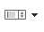     | [Combo Box](FormObjects/comboBox_overview.md) / [Lista suspensa](FormObjects/dropdownList_Overview.md) / [Menu pop-up de imagens](FormObjects/picturePopupMenu_overview.md)                                                                                         |   P   |
|     | [Botão](FormObjects/button_overview.md) / [Botão Imagem](FormObjects/pictureButton_overview.md) / [Grade de botões](FormObjects/buttonGrid_overview.md)                                                                                                             |   B   |
| 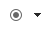     | [Botão rádio](FormObjects/radio_overview.md)                                                                                                                                                                                                                        |   R   |
|   | [Caixa de selecção](FormObjects/checkbox_overview.md)                                                                                                                                                                                                               |   C   |
|  | [Indicador de Progresso](FormObjects/progressIndicator.md) / [Régua](FormObjects/ruler.md) / [Passo](FormObjects/stepper.md) / [Spinner](FormObjects/spinner.md)                                                                                                    |   I   |
|  | [Retângulo](FormObjects/shapes_overview.md#rectangle) / [Linha](FormObjects/shapes_overview.md#line) / [Oval](FormObjects/shapes_overview.md#oval)                                                                                                                  |   S   |
| 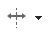  | [Divisor](FormObjects/splitters.md) / [Control de pestanas](FormObjects/tabControl.md)                                                                                                                                                                              |   D   |
| 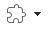    | [Área de plug-in ](FormObjects/pluginArea_overview.md) / [Subformulário](FormObjects/subform_overview.md) / [Área Web](FormObjects/webArea_overview.md) / [4D Write Pro](FormObjects/writeProArea_overview.md) / [4D View Pro](FormObjects/viewProArea_overview.md) |   X   |

Para desenhar um tipo de objeto, selecione o botão correspondente e, em seguida, trace o objeto no formulário. Após criar um objeto, você pode modificar seu tipo utilizando a Lista de Propriedades. Mantenha pressionada a tecla **Shift** ao desenhar para restringir o objeto a uma forma regular. As linhas são restritas à horizontal, 45° ou vertical, os retângulos são restritos a quadrados e as formas ovais são restritas a círculos.

A variante atual do tema é o objeto que será inserido no formulário. Ao clicar no lado direito de um botão, você acessa o menu de variantes:


Você pode clicar duas vezes no botão para ele permanecer selecionado mesmo após ter traçado um objeto no formulário (seleção contínua). Essa função facilita a criação de vários objetos sucessivos do mesmo tipo. Para cancelar uma seleção contínua, clique noutro objeto ou ferramenta.

### Lista de propriedades

Tanto os formulários quanto os objetos de formulário têm propriedades que controlam o acesso ao formulário, a aparência do formulário e o comportamento do formulário quando ele é usado. As propriedades do formulário incluem, por exemplo, o nome do formulário, sua barra de menus e seu tamanho. As propriedades do objeto incluem, por exemplo, o nome de um objeto, suas dimensões, sua cor de fundo e sua fonte.

Você pode exibir e modificar o formulário e as propriedades do objeto usando a Lista de Propriedades. Ele exibe as propriedades do formulário ou dos objetos, dependendo do que você selecionar na janela do editor.

Para exibir/ocultar a Lista de propriedades, selecione **Lista de propriedades** no menu **Formulário** ou no menu de contexto do editor de formulários. Você também pode exibi-lo clicando duas vezes em uma área vazia do formulário.

#### Atalhos

Pode utilizar os seguintes atalhos na Lista de Propriedades:

- **Tecla de seta**s ↑ ↓: utilizada para ir de uma célula para outra.
- **Teclas de seta** ← →: utilizadas para expandir/recolher temas ou entrar no modo de edição.
- **PgUp** e **PgDn**: usado para rolar o conteúdo da Lista de Propriedades.
- **Página Inicial** e **Final**: usado para rolar a Lista de Propriedades para que a primeira ou última célula seja exibida.
- **Ctrl+clique** (Windows) ou **Comando+clique** (macOS) em um evento: usado para selecionar/desmarcar todos os eventos da lista, conforme o estado inicial do evento em que você clicou.
- **Ctrl+clique** (Windows) ou **Comando+clique** (macOS) em um rótulo de tema: usado para recolher/expandir todos os temas da lista.
- **Ctrl+clique** (Windows) ou **Comando+clique** (macOS) em um valor de propriedade exibido em **negrito**: redefine a propriedade para seu padrão.


## Manipulação de objetos formulário

### Adicionar objectos

É possível adicionar objetos a formulários de várias maneiras:

- Desenhando o objeto diretamente no formato após selecionar seu tipo na barra de objeto (veja [Usando a barra de objeto](#using-the-object-bar))
- Arrastando e soltando o objeto da barra de objetos
- Por arrastar e soltar ou copiar operações em um objeto selecionado da biblioteca [pré-configurada de objetos](objectLibrary.md),
- Ao arrastar e largar um objeto de outro formulário,
- Arrastando e soltando um objeto do Explorer (campos) ou de outros editores no ambiente Desenho (listas, imagens etc.)

Depois que o objeto for colocado no formulário, você poderá modificar suas características usando o editor de formulários.

É possível trabalhar com dois tipos de objetos nos formulários:

- **Objetos estáticos** (linhas, quadros, imagens de fundo, etc.): esses objetos são geralmente usados para definir a aparência do formulário e de seus rótulos, bem como para a interface gráfica. Estão disponíveis na barra de objetos do editor de formulários. Você também pode definir seus atributos gráficos (tamanho, cor, fonte, etc.) e suas propriedades de redimensionamento usando a Lista de Propriedades. Os objetos estáticos não têm variáveis associadas como os objetos ativos. No entanto, é possível inserir objetos dinâmicos em objetos estáticos.

- **Objetos ativos**: esses objetos executam tarefas ou funções na interface e podem assumir várias formas: campos, botões, listas roláveis, etc. Cada objeto ativo é associado com um campo ou uma variável.

### Selecção de objectos

Antes de executar qualquer operação em um objeto (como alterar a largura ou a fonte de uma linha), é necessário selecionar o objeto que deseja modificar.

Para selecionar um objeto usando a barra de ferramentas:

1. Clique na ferramenta Seta na barra de ferramentas.<p></p>

<p>Quando você move o ponteiro para a área do formulário, ele se torna um ponteiro padrão em forma de seta</p>.

2. Clique no objecto que deseja selecionar. As pegas de redimensionamento identificam o objeto selecionado.<p>../assets/en/FormEditor/selectResize.png</p>

Para selecionar um objecto utilizando a Lista de Propriedades:

1. Escolher o nome do objecto na lista pendente da Lista de Objectos localizada no topo da Lista de Propriedades. Usando estes dois métodos, pode seleccionar um objecto que esteja escondido por outros objectos ou localizado fora da área visível da janela actual. Para desmarcar um objeto, clicar fora dos limites do objeto ou <**Shift+clique** o objeto.
> Também é possível selecionar objetos clicando duas vezes neles na janela de resultados da operação "Localizar no design".

### Selecção de múltiplos objectos

Pode querer realizar a mesma operação em mais de um objecto de forma - por exemplo, para mover os objectos, alinhá-los, ou alterar a sua aparência. 4D permite-lhe selecionar vários objectos ao mesmo tempo. Há várias maneiras de seleccionar vários objectos:

- Escolher **Seleccionar Todos** a partir do menu Editar para seleccionar todos os objectos.
- Clique com o botão direito no objeto e escolha o comando **Selecione objetos semelhantes** no menu de contexto.
- Mantenha pressionada a tecla **Shift** e clique nos objetos que deseja selecionar.
- Comece em uma localização fora do grupo de objetos que você deseja selecionar e arraste um retângulo de seleção em torno dos objetos. Quando você soltar o botão do mouse, se qualquer parte de um objeto estiver dentro ou tocar os limites do retângulo de seleção, esse objeto é selecionado.
- Segure a tecla **Alt** (Windows) ou a tecla **Opção** (macOS) e desenhe um retângulo de seleção. Os objetos que estiverem completamente no retângulo serão selecionados.

A figura abaixo mostra um marque sendo desenhado para selecionar dois objetos:


Para desmarcar um objecto, clicar fora dos limites do objecto ou **Shift+click** o objecto. Os outros objetos permanecem selecionados. Para desmarcar todos os objetos selecionados, clique fora dos limites de todos os objetos.

### Duplicação de objectos

Pode duplicar qualquer objecto na forma, incluindo objectos activos. Cópias de objetos ativos retêm todas as propriedades do original, incluindo nome, tipo, padrão ação, formato de exibição e método objeto.

Você pode duplicar um objeto diretamente usando a ferramenta Duplicada na paleta de ferramentas ou usar a caixa de diálogo Duplicado muitas vezes para duplicar um objeto mais de uma vez. Além disso, usando esta caixa de diálogo, você pode definir a distância entre duas cópias.

Para duplicar um ou mais objectos:

1. Seleccione os objectos que pretende agrupar.
2. Escolher **Duplicar** a partir do menu **Editar**. 4D cria uma cópia de cada objecto selecionado e coloca a cópia em frente e ligeiramente para o lado do original.
3. Deslocar a cópia para a localização pretendida. Se você selecionar o item de menu Duplicar novamente, o 4D criará outra cópia de cada objeto e a moverá exatamente na mesma distância e direção da primeira cópia. Se precisar distribuir cópias do objeto ao longo de uma linha, use o procedimento a seguir. Duplique o objeto original, mova a cópia para outro local no formulário e, em seguida, duplique a cópia. A segunda cópia é automaticamente colocada na mesma relação com a primeira cópia que a primeira cópia estava em relação ao objeto original. As cópias subsequentes também são colocadas na mesma relação com seus originais. A figura abaixo mostra como funciona esse posicionamento relativo das cópias:


#### Duplicar muitos

A caixa de diálogo "Duplicar muitos" aparece quando se seleciona um ou mais objetos e se escolhe o comando **Duplicar Muitos...** a partir do menu **Objeto**.


- Na área superior, introduza o número de colunas e linhas (linhas) de objectos que pretende obter. Por exemplo, se quiser três colunas e duas linhas de objectos, introduza 3 na área de Coluna(s) e 2 na área de Linha(s). Na área superior, introduza o número de colunas e linhas (linhas) de objectos que pretende obter.

- Para linhas e colunas, defina o offset que deseja deixar entre cada cópia. O valor deve ser expresso em pontos. Será aplicado a cada cópia, ou cópia, em relação ao objeto original. ou exemplo, se você quiser deixar um deslocamento vertical de 20 pontos entre cada objeto e a altura do objeto fonte é de 50 pontos insira 70 na área “Offset” da coluna.

- Se desejar criar uma matriz de variáveis, seleccione a opção **Number Variables** e seleccione a direcção em que as variáveis devem ser numeradas, seja por linha(s) ou por coluna(s). Esta opção só está activa quando o objecto seleccionado é uma variável. Para obter mais informações sobre essa opção, consulte **Duplicação em uma matriz** no *Manual de Desenho*.

### Mover objetos

É possível mover qualquer gráfico ou objeto ativo no formulário, inclusive campos e objetos criados com um modelo. Ao mover um objeto, existem as seguintes opções:

- Mova o objeto arrastando-o,
- Mova o objeto um píxel de cada vez utilizando as teclas de seta,
- Mova o objeto em etapas usando as teclas de seta (etapas de 20 píxeis por padrão),

Ao começar a arrastar o objeto selecionado, seus manipuladores desaparecem. 4D exibe marcadores que mostram a localização dos limites do objeto nas réguas para você poder posicionar o objeto exatamente onde deseja. Tenha cuidado para não arrastar uma alça. Arrastar uma alça redimensiona o objeto. Você pode pressionar a tecla **Shift** para executar o movimento com uma restrição.

Quando o [Grelha Magnética](#using-the-magnetic-grid) está ativado, os objetos são movidos em etapas, indicando locais perceptíveis.

Para mover um objeto um píxel de cada vez:

- Selecione o objeto ou objetos e use as setas do teclado para mover o objeto. Cada vez que você pressiona uma tecla de seta, o objeto se move um píxel na direção da seta.

Para mover um objeto em passos:

- Selecione o objeto ou objetos que deseja mover e mantenha pressionada a tecla **Shift** e use as teclas de seta para mover o objeto por etapas. Por padrão, os passos são de 20 pixéis de cada vez. Pode alterar este valor na página Formulários das Preferências.

### Agrupamento de objectos

4D permite agrupar objetos para você poder selecionar, mover e modificar o grupo como um único objeto. Os objetos agrupados mantêm a sua posição em relação aos outros. Normalmente, você agruparia um campo e seu rótulo, um botão invisível e seu ícone, e assim por diante.

Quando você redimensiona um grupo, todos os objetos do grupo são redimensionados proporcionalmente (exceto as áreas de texto, que são redimensionadas em etapas de acordo com o tamanho da fonte).

Você pode desagrupar um grupo de objetos a qualquer momento e tratá-los novamente como objetos independentes.

Um objecto activo que tenha sido agrupado deve ser desarticulado antes de se poder aceder às suas propriedades ou método. No entanto, é possível selecionar um objeto pertencente a um grupo sem desagrupar o conjunto: para isso, **Ctrl+clique** (Windows) ou **Command+clique** (macOS) no objeto (o grupo deve ser selecionado antes).

O agrupamento só afeta os objetos no editor de formulários. Quando o formulário é executado, todos os objetos agrupados agem como se não estivessem agrupados.
> Não é possível agrupar objetos pertencentes a diferentes visualizações e somente os objetos pertencentes à visualização atual podem ser agrupados (consulte [Views](#views)).

Para agrupar objectos:

1. Selecione o objecto agrupado que pretende desagrupar.
2. Selecione **Grupo** no menu Objeto. OU Clique no botão do Grupo na barra de ferramentas no editor de formulário:<p></p>
4D marca a borda dos objetos recém-agrupados com alças. Nenhum manipulador marca o limite de nenhum dos objetos individuais no grupo. Agora, quando você modifica o objeto agrupado, altere todos os objetos que compõem o grupo.

Para desagrupar objetos:

1. Seleccione o objecto ou objectos que pretende duplicar.
2. Escolher **Desagrupar** a partir do menu **Objetos**.<p>OU</p><p>Clique no botão **Desagrupamento** (variante do botão **Grupo**) na barra de ferramentas do editor do formulário.</p><p>Se **Desagrupamento** for escurecido, isso significa que o objeto selecionado já está separado em sua forma mais simples.</p>4D marca os limites dos objetos individuais com alças.

### Alinhamento de objetos

Pode-se alinhar objectos uns com os outros ou utilizar uma grelha invisível no formulário.

- Quando você alinha um objeto com outro, você pode alinhá-lo ao topo, no topo, no lado ou no centro horizontal, ou vertical do outro objeto. Você pode alinhar diretamente uma seleção de objetos usando as ferramentas de alinhamento ou aplicar configurações de alinhamento mais avançadas usando o Assistente de Alinhamento. A última opção permite, por exemplo, definir o objeto que será usado como referência da posição e pré-visualizar o alinhamento na forma antes de aplicá-lo.
- Quando você usa a grade invisível, cada objeto pode ser alinhado manualmente com os outros com base em posições "perceptíveis" representadas por linhas pontilhadas que aparecem quando o objeto que está sendo movido se aproxima de outros objetos.

#### Usando as ferramentas de alinhamento instantâneo

As ferramentas de alinhamento na barra de ferramentas e no submenu Alinhar do menu Objeto permitem alinhar rapidamente os objetos selecionados.


Quando 4D se alinha em objetos, ele deixa um objeto selecionado no lugar e alinha os objetos restantes a este. Este objecto é a "âncora." Utiliza o objecto que se encontra mais afastado na direção do alinhamento como âncora e alinha os outros objetos com esse objecto. Por exemplo, se quiser realizar um alinhamento correcto num conjunto de objectos, o objecto mais à direita será utilizado como âncora. A figura abaixo mostra objetos sem alinhamento, "alinhados à esquerda", "alinhados horizontalmente por centros" e "alinhados à direita":


#### Usando o assistente de alinhamento

O Assistente de Alinhamento permite que você execute qualquer tipo de alinhamento e/ou distribuição de objetos.

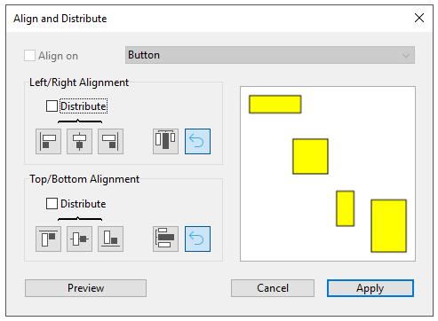

Para exibir esta caixa de diálogo, selecione os objetos que você deseja alinhar e escolha o comando **Alinhamento** a partir do menu **Alinhar** no menu **Objeto** ou no menu de contexto do editor.

- Nas áreas "Alinhamento Esquerda/Direita" e/ou "Alinhamento Superior/Inferior", clique no ícone que corresponde ao alinhamento que você deseja executar.<p>A área de exemplo apresenta os resultados da sua seleção.</p>

- Para executar um alinhamento que use o esquema de âncora padrão, clique em **Prévia** ou **Aplicar**. Nesse caso, 4D usa o objeto que está mais distante na direção do alinhamento como âncora e alinha os outros objetos a esse objeto. Por exemplo, se quiser realizar um alinhamento correcto num conjunto de objectos, o objecto mais à direita será utilizado como âncora. OU:<p>Para alinhar objetos a um objeto específico, selecione a opção **Alinhar em** e selecione o objeto ao qual deseja que os outros objetos sejam alinhados na lista de objetos. Neste caso, a posição do objeto de referência não será alterada.</p>

Pode pré-visualizar os resultados do alinhamento clicando no botão **Pré-visualização**. Os objetos são então alinhados no editor de formulários, mas como a caixa de diálogo não desaparece, ainda é possível cancelar ou aplicar o alinhamento.
> Esta caixa de diálogo permite-lhe alinhar e distribuir objetos numa única operação. Para mais informações sobre como distribuir objetos, consultar [Distribuir objetos](#distributing-objects).

#### Utilização da Rede Magnética

O editor de formulários fornece uma grelha magnética virtual que pode ajudá-lo a colocar e alinhar objetos num formulário. O alinhamento magnético dos objetos baseia-se na sua posição em relação uns aos outros. A grelha magnética só pode ser utilizada quando pelo menos dois objetos estão presentes no formulário.

Isso funciona da seguinte maneira: quando se move um objeto no formulário, 4D indica possíveis localizações para este objeto baseado em alinhamentos notáveis com outros objetos do formulário. É estabelecido um alinhamento perceptível cada vez que isso acontece:

- Horizontalmente, os bordos ou centros de dois objetos coincidem,
- Verticalmente, as arestas de dois objectos coincidem.

Quando isso acontece, 4D coloca o objeto no local e mostra uma linha vermelha indicando o alinhamento perceptível considerado:


No que diz respeito à distribuição dos objetos, 4D propõe uma distância baseada em normas de interface. Tal como no caso do alinhamento magnético, as linhas vermelhas indicam as diferenças visíveis quando estas são atingidas.


Esta operação aplica-se a todos os tipos de objetos dos formulários. A grelha magnética pode ser ativada ou desactivada em qualquer altura utilizando o comando **Ativar a grade magnética** no menu **Formulário** ou no menu contextual do editor. Também é possível definir a ativação desta funcionalidade por padrão na **Preferências** > **Formulários** página (opção **Ativar auto alinhamento por padrão**). Você pode ativar ou desativar manualmente a grade magnética quando um objeto for selecionado pressionando a tecla **Ctrl** (Windows) ou **Control** (macOS).
> O magnetismo também leva à observação de etapas ao redimensionar objetos manualmente.

### Distribuição de objetos

Você pode distribuir os objetos de modo que eles fiquem dispostos com um espaço igual entre eles. Para fazer isso, você pode distribuir objetos usando as ferramentas Distribuir na paleta Ferramentas ou o Assistente de alinhamento. Este último permite-lhe alinhar e distribuir objetos numa única operação.
> Quando a [Grade magnética](#using-the-magnetic-grid) está ativada, um guia visual também é fornecido para distribuição quando um objeto é movido manualmente.

Para distribuir objetos com igual espaçamento:

1. Selecione três ou mais objetos e clique na ferramenta Distribuir pretendida.

2. Na barra de ferramentas, clique na ferramenta de distribuição que corresponde à distribuição que você deseja aplicar.<p></p> OU<p>Selecione um comando de distribuição no submenu **Alinear** do menu **Objeto** ou no menu contextual do editor.</p>4D distribui os objetos em conformidade. Os objetos são distribuídos usando a distância para seus centros, e a maior distância entre dois objetos consecutivos é usada como referência.

Para distribuir objetos utilizando a caixa de diálogo Alinhar e distribuir:

1. Seleccione os objectos que pretende distribuir.

2. Escolha o comando **Alinhamento** do submenu **Alinhar** no menu **Objeto** ou no menu de contexto do editor. Aparece a seguinte caixa de diálogo:

3. Nas áreas Alinhamento Esquerdo/Direita e/ou Alinhamento Superior/Inferior, clique no ícone de distribuição padrão:  <p>(Ícone de distribuição horizontal standard)</p>A área de exemplo apresenta os resultados da sua seleção.

4. Para realizar uma distribuição que use o esquema padrão, clique em **Pré-visualizar** ou *Aplicar*.<p>Neste caso 4D irá executar uma distribuição padrão, de modo que os objetos sejam definidos com a mesma quantidade de espaço entre eles.</p>OU:<p>Para executar uma distribuição específica, selecione a opção **Distribuir** (por exemplo, se você quiser distribuir os objetos com base na distância até o lado direito). Esta opção funciona como um interruptor. Se a caixa de seleção Distribui for selecionada, os ícones localizados abaixo dele executam uma função diferente:</p>

- Horizontalmente, os ícones correspondem às seguintes distribuições: igualmente com relação aos lados esquerdo, centros (hor.) e lados direito dos objetos selecionados.
- Verticalmente, os ícones correspondem às seguintes distribuições: igualmente com respeito às arestas superiores, centros (vert.) e as bordas inferiores dos objetos selecionados.

 Você pode visualizar o resultado real de suas configurações clicando no botão **Prévia**: a operação é executada no editor de formulários, mas a caixa de diálogo permanece em primeiro plano. Você pode então **Cancelar** ou **Aplicar** as modificações.
> Esta caixa de diálogo permite-lhe combinar o alinhamento e a distribuição de objetos. Para mais informações sobre alinhamento, consulte [Alinhamento de objetos](#aligning-objects).

### Gerenciar os planos dos objetos

Às vezes, será necessário reorganizar objetos que estejam obstruindo a visualização de outros objetos no formulário. Por exemplo, você pode ter um gráfico que deseja que apareça atrás dos campos em um formulário. 4D oferece quatro itens de menu, **Mover para trás**, **Mover para frente**, **Subir um nível** e **Descer um nível**, que permitem organizar os planos de objetos no formulário. Estas camadas também determinam a ordem padrão de entrada (ver modificação de ordem de entrada de dados). A figura abaixo mostra objetos à frente e atrás de outros objetos:


Para mover um objeto para outro nível, selecione-o e escolha:

- Um dos comandos **Mover para trás**, **Mover para frente**, **Subir um nível** e **Descer um nível** do menu Objeto,
- Um dos comandos no submenu **Nível>** no menu de contexto do editor,
- Um dos comandos associados com o botão de gerenciamento de nível da barra de ferramentas.


> Quando vários objetos são sobrepostos, o atalho **Ctrl+Shift+clique** / **Comando+Shift+clique**pode ser usado para selecionar cada objeto sucessivamente, descendo uma camada a cada clique.

Ao ordenar diferentes níveis, 4D sempre vai de segundo plano para o primeiro plano. Como resultado, o nível anterior move a seleção de objetos um nível para o plano de fundo. O próximo nível move a seleção um nível em direção ao primeiro plano do formulário.

### Ordem de introdução de dados

A ordem de entrada de dados é a ordem em que os campos, subformulários e outros objetos ativos são selecionados quando você pressiona a tecla **Tab** ou **Returno de carruagem** em um formulário de entrada. É possível percorrer o formulário na direção oposta (ordem inversa de entrada de dados) pressionando as teclas de retorno **Shift+Tab** ou **Shift+Carriagem**.

> Você pode alterar a ordem de entrada em tempo de execução usando os comandos `FORM SET ENTRY ORDER` e `FORM GET ENTRY ORDER`.

Cada objeto que suporta a propriedade focalizável é incluído na ordem de entrada de dados por padrão.

Definir a ordem de entrada para um formulário JSON é feito com a propriedade [`entryOrder`](properties_JSONref.md).

Se você não especificar um pedido de entrada personalizado, por padrão 4D usa a camada dos objetos para determinar a ordem de entrada na direção "fundo em primeiro plano". A ordem padrão de entrada corresponde assim à ordem em que os objetos foram criados no formulário.

Em alguns formulários, é necessária uma ordem de entrada de dados personalizada. Abaixo, por exemplo, campos adicionais relacionados ao endereço foram adicionados após a criação do formulário. A ordem padrão resultante de entrada se torna ilógica e força o usuário a inserir a informação de forma estranha:


Em casos como esse, uma ordem de entrada de dados personalizada permite que você insira as informações em uma ordem mais lógica:


#### Visualização e alteração da ordem de introdução de dados

Você pode visualizar a ordem de entrada atual usando os escudos "Ordem de entrada" ou usando o modo "Ordem de entrada". No entanto, você só pode modificar a ordem de entrada usando o modo “Ordem de entrada”.

Este parágrafo descreve a visualização e a modificação da ordem de entrada usando o modo "Ordem de entrada". Para obter mais informações sobre a visualização da ordem de entrada usando escudos, consulte [Usando escudos](#using-shields).

Para ver ou alterar a ordem de entrada:

1. Escolha **Ordem de Entrada** a partir do menu **Formulário** ou clique no botão da Ordem de Entrada na barra de ferramentas da janela:<p></p>

    O ponteiro se transforma em um ponteiro de ordem de entrada e 4D desenha uma linha na forma mostrando a ordem em que ele seleciona objetos durante a entrada de dados. A visualização e alteração da ordem de introdução de dados são as únicas acções que pode realizar até clicar em qualquer ferramenta na paleta Ferramentas.

2. Para alterar a ordem de entrada de dados, posicionar o ponteiro sobre um objeto na forma e, mantendo pressionado o botão do rato, arrastar o ponteiro para o objeto que se pretende a seguir na ordem de entrada de dados.<p></p>4D irá ajustar a ordem de entrada em conformidade.

3. Repita a etapa 2 tantas vezes quantas forem necessárias para definir a ordem de introdução de dados que desejar.

4. Quando estiver satisfeito com a ordem de entrada de dados, clique em qualquer ferramenta não selecionada na barra de ferramentas ou escolha **Ordem de entrada** a partir do menu **Formulário**. 4D regressa ao funcionamento normal do editor de formulários.

> Somente a ordem de entrada da página atual do formulário é exibida. Se o formulário contiver objetos inseríveis na página 0 ou provenientes de um formulário herdado, a ordem de entrada padrão será a seguinte: Objetos da página 0 do formulário herdado > Objetos da página 1 do formulário herdado > Objetos da página 0 do formulário aberto > Objetos da página atual do formulário aberto.

#### Utilização de um grupo de introdução de dados

Enquanto estiver alterando a ordem de entrada de dados, é possível selecionar um grupo de objetos em um formulário para que a ordem de entrada de dados padrão se aplique aos objetos do grupo. Isso permite que você defina facilmente a ordem de entrada de dados em formulários nos quais os campos são separados em grupos ou colunas.

Para criar um grupo de entrada de dados:

1. Escolha **Ordem de entrada** a partir do menu *Formulário* ou clique no botão na barra de ferramentas.
2. Desenhe uma seleção ao redor dos objetos que você deseja agrupar para entrada de dados.

Quando você solta o botão do mouse, os objetos contidos ou tocados pelo retângulo seguem a ordem padrão de entrada de dados. A ordem de entrada de dados para os restantes objetos ajustam-se conforme necessário.

#### Excluir um objeto da ordem de entrada

Por defeito, todos os objetos que suportam a propriedade focusable são incluídos na ordem de entrada. Para excluir um objeto da ordem de entrada:

1. Selecionar o modo ordem de entrada e, em seguida

2. **Maiúsculas-clic** no objeto

3. **clique com o botão direito** no objeto e selecione **Remover da ordem de entrada** opção do menu de contexto

## Pré-visualização CSS

O editor de formulário permite que você visualize seus formulários com ou sem valores CSS aplicados.

Quando as [folhas de estilo](createStylesheet.md) forem definidas, os formulários (inclusive os formulários herdados e os subformulários) são abertos no modo CSS Preview do seu sistema operacional por padrão.

### Selecção do modo de pré-visualização do CSS

A barra de ferramentas do editor de formulários fornece um botão CSS para a visualização de objectos com estilo:


Seleccione um dos seguintes modos de pré-visualização a partir do menu:

| Ícone barra de ferramentas              | Modo de pré-visualização CSS | Descrição                                                                                                                         |
| --------------------------------------- | ---------------------------- | --------------------------------------------------------------------------------------------------------------------------------- |
|   | Nenhum                       | Nenhum valor de CSS é aplicado no formulário e nenhum valor ou ícone de CSS é exibido na Lista de propriedades.                   |
| 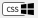 | Windows                      | Os valores CSS para a plataforma Windows são aplicados no formulário. Valores CSS e ícones apresentados na Lista de Propriedades. |
|  | macOS                        | Os valores CSS para a plataforma macOS são aplicados no formulário. Valores CSS e ícones apresentados na Lista de Propriedades.   |
> Se um tamanho de fonte muito grande para um objeto for definido em uma folha de estilo ou JSON, o objeto será automaticamente renderizado para acomodar a fonte, mas o tamanho do objeto não será alterado.

O modo de visualização CSS reflete a ordem de prioridade aplicada às folhas de estilo vs atributos JSON, conforme definido na seção [JSON vs Folha de Estilo](stylesheets.html#json-vs-style-sheet).

Uma vez que o modo de pré-visualização CSS é selecionado, os objetos são exibidos automaticamente com os estilos definidos em uma folha de estilo (se houver).
> Ao copiar ou duplicar objetos, apenas as referências do CSS (se houver) e os valores JSON são copiados.

### Suporte CSS na lista de propriedades

No modo Visualização de CSS, se o valor de um atributo tiver sido definido em uma folha de estilo, o nome do atributo aparecerá com um ícone CSS exibido ao lado dele na Lista de propriedades. Por exemplo, os valores dos atributos definidos nesta folha de estilos:

```4d
.myButton {
font-family: comic sans;
font-size: 14;
stroke: #800080;
}
```

são apresentados com um ícone CSS na Lista de Propriedades:


Um valor de atributo definido em uma folha de estilo pode ser substituído na descrição do formulário JSON (exceto se a declaração `!important`, veja abaixo). Nesse caso, a Lista de propriedades exibe o valor do formulário JSON em **negrito**. Você pode redefinir o valor para sua definição de folha de estilo com os atalhos **Ctrl + clique**(Windows) ou **Command + clique** (macOs).
> Se um atributo tiver sido definido com a declaração `!important` para um grupo, um objeto em um grupo ou qualquer objeto em uma seleção de vários objetos, esse valor de atributo será bloqueado e não poderá ser alterado na Lista de propriedades.

#### Lista de propriedades Ícones CSS

| Ícone                                         | Descrição                                                                                                                                                          |
| --------------------------------------------- | ------------------------------------------------------------------------------------------------------------------------------------------------------------------ |
|       | Indica que um valor de atributo foi definido em uma folha de estilo                                                                                                |
|  | Indica que um valor de atributo foi definido em uma folha de estilo com a declaração `!important`                                                                  |
|  | Exibido quando um valor de atributo definido em uma folha de estilo para pelo menos um item em um grupo ou uma seleção de vários objetos difere dos outros objetos |

## Criação de list box

Puede crear rápidamente nuevos list box de tipo selección de entidades con el **Generador de list box**. O novo list box pode ser usada imediatamente ou pode ser editada por meio do Editor de formulários.

O construtor de List box permite criar e preencher list boxes de tipo seleção de entidades em algumas operações simples.

### Usando o gerador de list box

1. Na barra de ferramentas do Editor de formulários, clique no ícone do construtor de List box:

 

 O gerador do list box é exibido:

 

2. Selecione uma tabela na lista suspensa **Table**:

 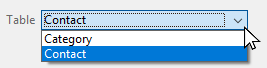

3. Selecione os campos para a caixa de listagem na área **Fields**:

 

 Por padrão, todos os campos são selecionados. Você pode selecionar ou desmarcar campos individualmente ou usar **Ctrl+clique** (Windows) ou **Cmd+clique** (macOS) para selecionar ou desmarcar todos de uma vez.

 Você pode alterar a ordem dos campos arrastando-os e soltando-os.

4. A expressão para preencher as linhas do list box da seleção da entidade é preenchida:

 

 Esta expressão pode ser alterada se necessário.

5. Clicar no botão **Copiar** copiará a expressão para carregar todos os registros na memória:

 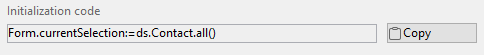

6. Clique no botão **Construir widget** para criar o list box.

 

O list box final:


## Inserir campos

O botão **Inserir campos** insere todos os campos (exceto os campos do tipo objeto e bolha) da tabela do formulário no formulário, com seus rótulos e conforme os padrões de interface. Esse assistente é um atalho para projetar formulários básicos de entrada ou formulários lista.

O botão **Inserir campos** só está disponível em formulários de tabela.

O desenho do formulário resultante depende do formulário:

- **Formulário detalhado**: clicar no botão **Inserir campos** gera um formulário com um design de página:


- **Formulário de lista**: clicar no botão **Inserir campos** gera um design de formulário de lista com campos organizados em uma única linha e marcadores de área:


## Escudos

O Editor de Formulário 4D usa escudos para facilitar a visualização das propriedades do objeto. Pode encontrá-los na barra de ferramentas do formulário:


Essa função funciona da seguinte forma: cada escudo é associado a uma propriedade (por exemplo, **Vistas**, que significa que o objeto "está na visualização atual"). Quando você ativar um escudo, 4D exibe um ícone pequeno (escudo) no canto superior esquerdo de cada objeto do formulário onde a propriedade é aplicada.


### Usando escudos

Para ativar um escudo, clique no ícone *Escudo* na barra de ferramentas até que o escudo desejado seja selecionado. Você também pode clicar no lado direito do botão e selecionar o tipo de escudo para exibir diretamente no menu associado:

Se você não quer exibir escudos, selecione **Sem Escudos** no menu de seleção.
> Você pode definir quais escudos devem ser exibidos por padrão na Página de Formulários das Preferências do aplicativo.

### Descrição do badge

Segue-se uma descrição de cada tipo de escudo:

| Ícone                                           | Nome                                | É exibido ...                                                                                                                        |
| ----------------------------------------------- | ----------------------------------- | ------------------------------------------------------------------------------------------------------------------------------------ |
|    | Método objecto                      | Para objectos com um método objeto associado                                                                                         |
|  | Acção padrão                        | Para objectos com uma acção padrão associada                                                                                         |
|        | Redimensionamento                   | Para objectos com pelo menos uma propriedade de redimensionamento, indica a combinação de propriedades actuais                       |
|      | Ordem de entrada                    | Para objectos enterráveis, indica o número da ordem de entrada                                                                       |
|      | Vista actual                        | Para todos os objectos na vista actual                                                                                               |
|       | [Folha de estilo](stylesheets.html) | Para objectos com um ou mais valores de atributo anulados por uma folha de estilo.                                                   |
|          | Filtro                              | Para objectos enterráveis com um filtro de entrada associado                                                                         |
|         | Dica de Ajuda                       | Para objetos com uma mensagem de ajuda associada                                                                                     |
|       | Localizado                          | Para objetos cuja etiqueta possui uma referência (etiqueta começando com “:”). A referência pode ser do tipo recurso (STR#) ou XLIFF |
|       | Sem Escudos                         | Nenhum escudo aparece                                                                                                                |

## Vistas

O editor de formulários 4D permite que você crie formulários complexos distribuindo objetos de forma entre visualizações separadas, que podem ser ocultas ou mostradas conforme necessário.

Por exemplo, você pode distribuir objetos conforme o tipo (campos, variáveis, objetos estáticos, etc.). Qualquer tipo de objeto de formulário, inclusive subformulários e áreas de plug-in, pode ser incluído nas visualizações.

Não há limite para o número de vistas por formulário. Pode criar tantas vistas diferentes quantas as necessárias. Além disso, cada vista pode ser apresentada, ocultada e/ou bloqueada.

A gestão das vistas é efetuada através da paleta de vistas.


### Aceder à paleta de vistas

Existem três formas de aceder à paleta de vistas:

- **Barra de Ferramentas**: clique no ícone das Visualizações na barra de ferramentas do Editor de formulário. (Este ícone aparece cinza quando pelo menos um objeto pertence a uma visualização diferente da visualização padrão.)

 |                   Vista por defeito apenas                   |                 Com vistas adicionais                  |
 |:------------------------------------------------------------:|:------------------------------------------------------:|
 |  |  |

- **Menu de contexto** (formulário ou objeto): clique com o botão direito do mouse em qualquer lugar do Form Editor ou de um objeto e selecione **Visualização atual**

 

A visualização atual é indicada com uma marca de seleção (*por exemplo*, "Work Address" na imagem acima)

- **Menu Formulário**: clique no menu **Formulário** e selecione **Visualizar Lista**


### Antes de começar

Aqui estão algumas coisas importantes que você deve saber antes de começar a trabalhar com vistas:

- **Contexto de uso**: as visualizações são uma ferramenta puramente gráfica que só pode ser usada no Editor de Formulário; você não pode acessar as visualizações programaticamente ou no ambiente de Aplicações.

- **Visualizações e páginas**: os objetos da mesma visualização podem pertencer a páginas de formulário diferentes; somente os objetos da página atual (e da página 0, se ela estiver visível) podem ser exibidos, independentemente da configuração da visualização.

- **Visualizações e níveis**: as visualizações são independentes dos níveis do objeto; não há hierarquia de exibição entre visualizações diferentes.

- **Visualizações e grupos**: somente objetos pertencentes à visualização atual podem ser agrupados.

- Visualizações **atuais e padrão**: a visualização padrão é a primeira vista de um formulário e não pode ser excluída; a visualização atual é a visualização que está sendo editada e o nome é exibido em negrito.

### Gestão da vistas

#### Criar vistas


Qualquer objecto criado num formulário é colocado na primeira vista ("Vista 1") do formulário. A primeira vista é **sempre** a vista por defeito, indicada por (Default) após o nome. O nome da visualização pode ser alterado (consulte [Renomear vistas](#renaming-views)), porém ela continua a ser a visualização padrão.


Existem duas formas de adicionar vistas adicionais:

- Clique no botão **Adicionar uma nova exibição** na parte inferior da paleta Exibir:

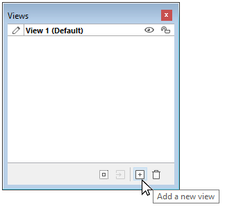

- Clique com o botão direito do mouse em uma visualização existente e selecione **Inserir visualização**:


Não há limite para o número de vistas.

#### Renomear vistas

Por padrão, as visualizações são nomeadas como "Vista" + o número da visualização, mas você pode alterar esses nomes para melhorar a legibilidade e atender melhor às suas necessidades.

Para mudar o nome de uma vista, pode utilizar:

- Clique duas vezes diretamente no nome da visualização (a visualização selecionada, nesse caso). O nome torna-se então editável:

 

- Clique com o botão direito do rato no nome da vista. O nome torna-se então editável:

 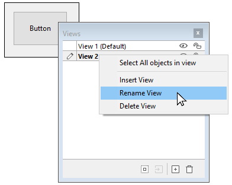

#### Reordenação de visualizações

Você pode alterar a ordem de exibição das exibições arrastando-as/soltando-as na paleta Exibir.

Note-se que a vista padrão não é alterada:

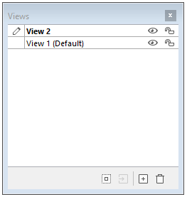

#### Eliminar vistas

Para mudar o nome de uma vista, pode utilizar:

- Clique em **Excluir a visualização** selecionada na parte inferior da paleta de visualização:

 

- Clique com o botão direito do rato no nome da vista, e seleccione **Apagar Vista**:

 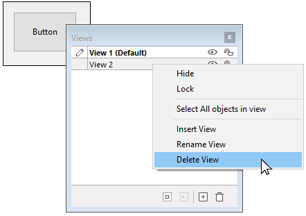
> Se uma vista for apagada, quaisquer objectos nela contidos são automaticamente movidos para a vista por defeito.

### Usando vistas

Uma vez criadas as vistas, pode utilizar a paleta Vista para:

- Adicionar objecto às vistas,
- Mover objectos de uma vista para outra,
- Selecionar todos os objetos da mesma vista com um único clique,
- Mostrar ou ocultar objectos para cada vista,
- Bloquear os objectos de uma vista.

#### Adicionar objectos a vistas

Um objeto só pode pertencer a uma única vista.

Para criar um objeto em outra visualização, basta selecionar a visualização na paleta Visualizar (antes de criar o objeto) clicando em seu nome (um ícone Editar é exibido para a [Visualização atual](#before-you-begin) e o nome aparece em negrito):


#### Mover objectos entre vistas

Também é possível mover um ou mais objetos de uma visualização para outra. No formulário, selecionar o(s) objeto(s) cuja vista se pretende alterar. A lista de visualizações indica, por meio de um símbolo, a visualização à qual a seleção pertence:


> A seleção pode conter vários objetos pertencentes a diferentes visualizações.

Basta selecionar a visualização de destino, clicar com o botão direito do mouse e selecionar **Mover para**:


OU

Selecione a exibição de destino da seleção e clique no botão **Mover para** na parte inferior da paleta Exibir:


A seleção é então colocada na nova vista:


Você também pode mover um objeto para outra visualização por meio do menu de contexto do objeto. Clique com o botão direito do mouse no objeto, selecione **Mover para visualização** e selecione uma visualização na lista de visualizações disponíveis:


> A [vista atual](#before-you-begin) é mostrado em negrito.

#### Seleccionar todos os objectos de uma vista

Você pode selecionar todos os objetos que pertencem à mesma exibição na página atual do formulário. Essa função é útil para aplicar alterações globais a um conjunto de objetos.

Para fazer isso, clique com o botão direito do mouse no modo de exibição em que você deseja selecionar todos os objetos, clique em **Selecionar todos**:


Também pode utilizar o botão na parte inferior da paleta de vistas:


#### Mostrar ou esconder objectos de uma vista

Você pode mostrar ou ocultar objetos pertencentes a uma visualização a qualquer momento na página atual do formulário. Essa função pode ser usada, por exemplo, para focar em determinados objetos ao modificar o formulário.

Por padrão, todas as exibições são mostradas, conforme indicado pelo ícone *Show/Hide*:


Para ocultar uma vista, clique no ícone *Mostrar/Ocultar*. Em seguida, é escurecida e os objetos da vista correspondente deixam de ser mostrados no formulário:


> A [vista atual](#before-you-begin) não pode ser ocultada.

Para mostrar uma vista oculta, basta selecioná-la ou clicar no ícone *Mostrar/Ocultar* para essa vista.

#### Bloqueio de objetos de uma vista

É possível bloquear os objectos de uma vista. Isto impede que sejam selecionados, alterados ou eliminados do formulário. Uma vez bloqueado, um objeto não pode ser selecionado por um clique, um retângulo, ou o comando **Selecione objetos similares** do menu de contexto. Esta função é útil para evitar erros de tratamento.

Por padrão, todas as visualizações são desbloqueadas, como indicado pelo ícone *Bloquear/Desbloquear* ao lado de cada visualização:


Para bloquear os objetos de uma visualização, clique no ícone *Bloquear/Desbloquear*. O cadeado está fechado, o que significa que a vista está agora bloqueada:


> A [vista atual](#before-you-begin) não pode ser bloqueada.

Para desbloquear uma exibição bloqueada, basta selecioná-la ou clique no ícone *Bloquear/Desbloquear* para essa exibição.

## Zoom

Pode fazer zoom no formulário atual. Alterne para o modo "Zoom" clicando no ícone da lupa ou clicando diretamente na barra de porcentagem desejada (50%, 100%, 200%, 400% e 800%):


- Quando se clica na lupa, o cursor transforma-se numa lupa. Pode então clicar no formulário para aumentar a visualização ou manter premida a tecla Shift e clicar para reduzir a percentagem de visualização.
- Quando você clica em uma barra de porcentagem, a exibição é imediatamente modificada.

No modo Zoom, todas as funções do editor de formulários permanecem disponíveis(*).

(*) Por motivos técnicos, não é possível selecionar elementos da caixa de listagem (cabeçalhos, colunas, rodapés) quando o editor de formulários está no modo Zoom.
