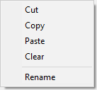

Pode utilizar bibliotecas de objectos nos seus formulários. Uma biblioteca de objetos oferece uma coleção de objetos pré-configurados que podem ser usados em seus formulários por um simples copiar e colar ou arrastar e soltar.

4D propõe dois tipos de bibliotecas de objetos:

- uma biblioteca de objetos padrão, pré-configurada, disponível em todos os seus projetos.
- as bibliotecas de objetos personalizados, que você pode usar para armazenar seus objetos formulários favoritos ou formulários projetos completos.

## Criar e utilizar bibliotecas de objetos personalizadas

A biblioteca de objetos padrão está disponível no editor de formulários: clique no último botão da barra de ferramentas:  

A biblioteca é apresentada numa janela separada:

A janela tem as seguintes características principais:

- Área de visualização com dicas: a área central exibe uma visualização de cada objeto. Você pode passar o mouse sobre um objeto para obter informações sobre ele em uma dica.
- Pode filtrar o conteúdo da janela utilizando o menu **Categorias**: 
- Para utilizar um objeto da biblioteca no seu formulário, pode:
    - clicar com o botão direito do rato num objeto e selecionar **Copiar** no menu contextual
    - ou arraste e solte o objeto da biblioteca. O objeto é então adicionado ao formulário.

Esta biblioteca é só de leitura. Se quiser editar objetos padrão ou criar sua própria biblioteca de objetos pré-configurados ou formulários projetos, você precisará criar uma biblioteca de objetos personalizada (veja abaixo).

Todos os objetos propostos na biblioteca de objetos padrão estão descritos em [nesta seção em doc.4d.com](https://doc.4d.com/4Dv17R6/4D/17-R6/Library-objects.200-4354586.en.html).

## Utilização da biblioteca de objetos padrão

Pode criar e usar bibliotecas de objetos personalizados em 4D. Uma biblioteca de objetos personalizados é um projeto 4D onde você pode armazenar seus objetos favoritos (botões, textos, imagens etc.) Em seguida, você pode reutilizar esses objetos em diferentes formulários e projetos.

Os objetos são armazenados com todas as suas propriedades, incluindo seus métodos objeto. As bibliotecas são montadas e usadas por operações simples de arrastar e soltar ou copiar e colar.

Usando bibliotecas, você pode criar planos de fundo de objetos de formulários agrupados por famílias gráficas, por funcionalidades, etc.

### Criar uma biblioteca de objetos

Para criar uma biblioteca de objetos, selecione **Novo>Biblioteca de objetos...** no menu **Arquivo** ou na barra de ferramentas 4D. É exibida uma caixa de diálogo padrão para salvar o arquivo, que permite escolher o nome e o local da biblioteca de objetos.

Após validar a caixa de diálogo, o 4D cria uma biblioteca de objetos em seu disco e exibe sua janela (vazia por padrão).

É possível criar tantas bibliotecas quantas as desejadas por projeto. Uma biblioteca criada e construída no macOS pode ser usada no Windows e vice-versa.

### Abrir uma biblioteca de objetos

Uma determinada biblioteca de objetos só pode ser aberta por um m banco de dados por vez. Entretanto, várias livrarias diferentes podem ser abertas no mesmo banco de dados.

Para abrir uma biblioteca de objetos personalizados, selecione o comando **Abrir>Biblioteca de objetos...** no menu **Arquivo** ou a barra de ferramentas 4D. Aparece uma caixa de diálogo padrão de ficheiro aberto, que lhe permite seleccionar a biblioteca de objectos a abrir. Pode seleccionar os seguintes tipos de ficheiros:
- **.4dproject**
- **.4dz**

Na realidade, as bibliotecas de objectos personalizados são projectos 4D clássicos. Apenas as seguintes partes de um projecto são expostas quando este é aberto como biblioteca:

- formulários projecto
- páginas formulário 1

### Construir uma biblioteca de objectos

Os objectos são colocados numa biblioteca de objectos usando o método de arrastar e largar ou uma operação de cortar-copiar-colar. Eles podem vir de um formulário ou de outra biblioteca de objetos (incluindo a [biblioteca padrão](#using-the-standard-object-library)). Nenhum vínculo é mantido com o objeto original: se o original for modificado, o objeto copiado não será afetado.

> Para poder arrastar e soltar objetos de formulários para bibliotecas de objetos, você deve se certificar de que a opção **Iniciar arrastar e soltar** nas Preferências 4D esteja selecionada.

As operações básicas estão disponíveis no menu de contexto ou no menu de opções da janela:

- **Cortar** ou **Copiar** para o papelão
- **Colar** um objecto do papelão
- **Apagar** - apaga o objecto da biblioteca
- **Renomear** - aparece uma caixa de diálogo que lhe permite renomear o item. Note-se que os nomes dos objectos devem ser únicos numa biblioteca.

Pode colocar objectos individuais (incluindo subformulários) ou conjuntos de objectos numa biblioteca de objectos. Cada objecto ou conjunto é agrupado num único item:

Uma biblioteca de objectos pode conter até 32.000 elementos.

Os objectos são copiados com todas as suas propriedades, tanto gráficas como funcionais, incluindo os seus métodos. Estas propriedades são mantidas na íntegra quando o elemento é copiado para um formulário ou outra biblioteca.

#### Objetos dependentes
A utilização de copiar-colar ou arrastar-e-soltar com determinados objetos de biblioteca também faz com que os seus objetos dependentes sejam copiados. Por exemplo, copiar um botão fará com que o método objeto que pode estar anexado também seja copiado. Estes objetos dependentes não podem ser copiados ou arrastados e largados diretamente.

Segue-se uma lista de objetos dependentes que serão colados na biblioteca enquanto o objeto principal que os utiliza (quando aplicável):

- Listas
- Formatos/Filtros
- Imagens
- Dicas de ajuda (ligadas a um campo)
- Métodos objecto

